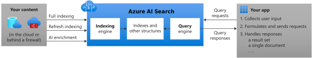

# What's Azure AI Search?

Azure AI Search ([formerly known as "Azure Cognitive Search"](whats-new.md#new-service-name)) provides secure information retrieval at scale over user-owned content in traditional and conversational search applications.

Information retrieval is foundational to any app that surfaces text and vectors. Common scenarios include catalog or document search, data exploration, and increasingly chat-style copilot apps over proprietary grounding data. When you create a search service, you work with the following capabilities:

+ A search engine for [full text](search-lucene-query-architecture.md) and [vector search](vector-search-overview.md) over a search index 
+ Rich indexing with [integrated data chunking and vectorization (preview)](vector-search-integrated-vectorization.md), [lexical analysis](search-analyzers.md) for text, and [optional AI enrichment](cognitive-search-concept-intro.md) for content extraction and transformation
+ Rich query syntax for [vector queries](vector-search-how-to-query.md), text search, [hybrid search](hybrid-search-overview.md), fuzzy search, autocomplete, geo-search and others
+ Azure scale, security, and reach
+ Azure integration at the data layer, machine learning layer, Azure AI services and Azure OpenAI

> [!div class="nextstepaction"]
> [Create a search service](search-create-service-portal.md)

Architecturally, a search service sits between the external data stores that contain your un-indexed data, and your client app that sends query requests to a search index and handles the response.

In your client app, the search experience is defined using APIs from Azure AI Search, and can include relevance tuning, semantic ranking, autocomplete, synonym matching, fuzzy matching, pattern matching, filter, and sort.

Across the Azure platform, Azure AI Search can integrate with other Azure services in the form of *indexers* that automate data ingestion/retrieval from Azure data sources, and *skillsets* that incorporate consumable AI from Azure AI services, such as image and natural language processing, or custom AI that you create in Azure Machine Learning or wrap inside Azure Functions.

## Inside a search service

On the search service itself, the two primary workloads are *indexing* and *querying*. 

+ [**Indexing**](search-what-is-an-index.md) is an intake process that loads content into your search service and makes it searchable. Internally, inbound text is processed into tokens and stored in inverted indexes, and inbound vectors are stored in vector indexes. The document format that Azure AI Search can index is JSON. You can upload JSON documents that you've assembled, or use an indexer to retrieve and serialize your data into JSON. 

  [AI enrichment](cognitive-search-concept-intro.md) through [cognitive skills](cognitive-search-working-with-skillsets.md) is an extension of indexing. If you have images or large unstructured text in source document, you can attach skills that perform OCR, describe images, infer structure, translate text and more. You can also attach skills that perform [data chunking and vectorization](vector-search-integrated-vectorization.md).

+ [**Querying**](search-query-overview.md) can happen once an index is populated with searchable content, when your client app sends query requests to a search service and handles responses. All query execution is over a search index that you control.

  [Semantic ranking](semantic-search-overview.md) is an extension of query execution. It adds language understanding to search results processing, promoting the most semantically relevant results to the top.

## Why use Azure AI Search?

Azure AI Search is well suited for the following application scenarios:

+ Search over your vector and text content. You own or control what's searchable.

+ Consolidate heterogeneous content into a user-defined and populated search index composed of vectors and text. 

+ [Integrate data chunking and vectorization](vector-search-integrated-vectorization.md) for generative AI and RAG apps.

+ [Apply granular access control](https://techcommunity.microsoft.com/t5/azure-ai-services-blog/access-control-in-generative-ai-applications-with-azure/ba-p/3956408) at the document level.

+ Offload indexing and query workloads onto a dedicated search service.

+ Easily implement search-related features: relevance tuning, faceted navigation, filters (including geo-spatial search), synonym mapping, and autocomplete.

+ Transform large undifferentiated text or image files, or application files stored in Azure Blob Storage or Azure Cosmos DB, into searchable chunks. This is achieved during indexing through [cognitive skills](cognitive-search-concept-intro.md) that add external processing from Azure AI.

+ Add linguistic or custom text analysis. If you have non-English content, Azure AI Search supports both Lucene analyzers and Microsoft's natural language processors. You can also configure analyzers to achieve specialized processing of raw content, such as filtering out diacritics, or recognizing and preserving patterns in strings.

For more information about specific functionality, see [Features of Azure AI Search](search-features-list.md)

## How to get started

Functionality is exposed through the Azure portal, simple [REST APIs](/rest/api/searchservice/), or Azure SDKs like the [Azure SDK for .NET](search-howto-dotnet-sdk.md). The Azure portal supports service administration and content management, with tools for prototyping and querying your indexes and skillsets. 

An end-to-end exploration of core search features can be accomplished in four steps:

1. [**Decide on a tier**](search-sku-tier.md) and region. One free search service is allowed per subscription. All quickstarts can be completed on the free tier. For more capacity and capabilities, you'll need a [billable tier](https://azure.microsoft.com/pricing/details/search/).

1. [**Create a search service**](search-create-service-portal.md) in the Azure portal.

1. [**Start with Import data wizard**](search-get-started-portal.md). Choose a built-in sample or a supported data source to create, load, and query an index in minutes.

1. [**Finish with Search Explorer**](search-explorer.md), using a portal client to query the search index you just created.

Alternatively, you can create, load, and query a search index in atomic steps:

1. [**Create a search index**](search-what-is-an-index.md) using the portal, [REST API](/rest/api/searchservice/create-index), [.NET SDK](search-howto-dotnet-sdk.md), or another SDK. The index schema defines the structure of searchable content.

1. [**Upload content**](search-what-is-data-import.md) using the ["push" model](tutorial-optimize-indexing-push-api.md) to push JSON documents from any source, or use the ["pull" model (indexers)](search-indexer-overview.md) if your source data is of a [supported type](search-indexer-overview.md#supported-data-sources).

1. [**Query an index**](search-query-overview.md) using [Search explorer](search-explorer.md) in the portal, [REST API](search-get-started-rest.md), [.NET SDK](/dotnet/api/azure.search.documents.searchclient.search), or another SDK.

> [!TIP]
> For help with complex or custom solutions, [**contact a partner**](resource-partners-knowledge-mining.md) with deep expertise in Azure AI Search technology.

## Compare search options

Customers often ask how Azure AI Search compares with other search-related solutions. The following table summarizes key differences.

| Compared to | Key differences |
|-------------|-----------------|
| Microsoft Search | [Microsoft Search](/microsoftsearch/overview-microsoft-search) is for Microsoft 365 authenticated users who need to query over content in SharePoint. Azure AI Search pulls in content across Azure and any JSON dataset. |
|Bing | [Bing APIs](/bing/search-apis/bing-web-search/bing-api-comparison) query the indexes on Bing.com for matching terms. Azure AI Search searches over indexes populated with your content. You control data ingestion and the schema. |
|Database search | SQL Server has [full text search](/sql/relational-databases/search/full-text-search) and Azure Cosmos DB and similar technologies have queryable indexes. Azure AI Search becomes an attractive alternative when you need features like lexical analyzers and relevance tuning, or content from heterogeneous sources. Resource utilization is another inflection point. Indexing and queries are computationally intensive. Offloading search from the DBMS preserves system resources for transaction processing. |
|Dedicated search solution | Assuming you've decided on dedicated search with full spectrum functionality, a final categorical comparison is between search technologies. Among cloud providers, Azure AI Search is strongest for vector, keyword, and hybrid workloads over content on Azure, for apps that rely primarily on search for both information retrieval and content navigation. |

Key strengths include:

+ Relevance tuning through semantic ranking and scoring profiles.
+ Data integration (crawlers) at the indexing layer.
+ Azure AI integration for transformations that make content text and vector searchable.
+ Microsoft Entra security for trusted connections, and Azure Private Link for private connections in no-internet scenarios.
+ [Full search experience](search-features-list.md): Linguistic and custom text analysis in 56 languages. Faceting, autocomplete queries and suggested results, and synonyms.
+ Azure scale, reliability, and global reach.

<!-- ## Watch this video

In this 15-minute video, review the main capabilities of Azure AI Search.

>[!VIDEO https://www.youtube.com/embed/kOJU0YZodVk?version=3] -->
