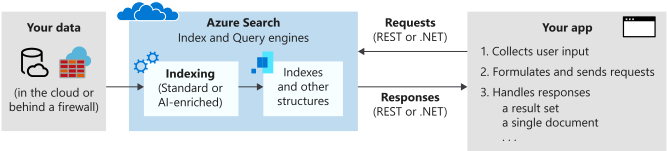

# What's Azure Cognitive Search?

Azure Cognitive Search ([formerly known as "Azure Search"](whats-new.md#new-service-name)) is a cloud search service that gives developers infrastructure, APIs, and tools for building a rich search experience over private, heterogeneous content in web, mobile, and enterprise applications.

Search is foundational to any app that surfaces text to users, where common scenarios include catalog or document search, online retail apps, or data exploration over proprietary content. When you create a search service, you'll work with the following capabilities:

+ A search engine for full text and [vector search](vector-search-overview.md) over a search index containing user-owned content
+ Rich indexing, with [lexical analysis](search-analyzers.md) and [optional AI enrichment](cognitive-search-concept-intro.md) for content extraction and transformation
+ Rich query syntax for [vector queries](vector-search-how-to-query.md), text search, fuzzy search, autocomplete, geo-search and more
+ Programmability through REST APIs and client libraries in Azure SDKs
+ Azure integration at the data layer, machine learning layer, and AI (Azure AI services)

> [!div class="nextstepaction"]
> [Create a search service](search-create-service-portal.md)

Architecturally, a search service sits between the external data stores that contain your un-indexed data, and your client app that sends query requests to a search index and handles the response.

In your client app, the search experience is defined using APIs from Azure Cognitive Search, and can include relevance tuning, semantic ranking, autocomplete, synonym matching, fuzzy matching, pattern matching, filter, and sort.

Across the Azure platform, Cognitive Search can integrate with other Azure services in the form of *indexers* that automate data ingestion/retrieval from Azure data sources, and *skillsets* that incorporate consumable AI from Azure AI services, such as image and natural language processing, or custom AI that you create in Azure Machine Learning or wrap inside Azure Functions.

## Inside a search service

On the search service itself, the two primary workloads are *indexing* and *querying*. 

+ [**Indexing**](search-what-is-an-index.md) is an intake process that loads content into your search service and makes it searchable. Internally, inbound text is processed into tokens and store in inverted indexes, and inbound vectors are stored in vector indexes. The document format that Cognitive Search can index is JSON. You can upload JSON documents that you've assembled, or use an indexer to retrieve and serialize your data into JSON. 

  [AI enrichment](cognitive-search-concept-intro.md) through [cognitive skills](cognitive-search-working-with-skillsets.md) is an extension of indexing. If you have images or large unstructured text, you can attach image and language analysis in an indexing pipeline. AI enrichment can extract text embedded in application files, translate text, and also infer text and structure from non-text files by analyzing the content. 

+ [**Querying**](search-query-overview.md) can happen once an index is populated with searchable text, when your client app sends query requests to a search service and handles responses. All query execution is over a search index that you control.

  [Semantic search](semantic-search-overview.md) is an extension of query execution. It adds language understanding to search results processing, promoting the most semantically relevant results to the top.

## Why use Cognitive Search?

Azure Cognitive Search is well suited for the following application scenarios:

+ Search over your content, isolated from the internet.

+ Consolidate heterogeneous content into a user-defined search index. 

+ Offload indexing and query workloads onto a dedicated search service.

+ Easily implement search-related features: relevance tuning, faceted navigation, filters (including geo-spatial search), synonym mapping, and autocomplete.

+ Transform large undifferentiated text or image files, or application files stored in Azure Blob Storage or Azure Cosmos DB, into searchable chunks. This is achieved during indexing through [cognitive skills](cognitive-search-concept-intro.md) that add external processing from Azure AI.

+ Add linguistic or custom text analysis. If you have non-English content, Azure Cognitive Search supports both Lucene analyzers and Microsoft's natural language processors. You can also configure analyzers to achieve specialized processing of raw content, such as filtering out diacritics, or recognizing and preserving patterns in strings.

For more information about specific functionality, see [Features of Azure Cognitive Search](search-features-list.md)

## How to get started

Functionality is exposed through the Azure portal, simple [REST APIs](/rest/api/searchservice/), or Azure SDKs like the [Azure SDK for .NET](search-howto-dotnet-sdk.md). The Azure portal supports service administration and content management, with tools for prototyping and querying your indexes and skillsets. 

An end-to-end exploration of core search features can be accomplished in four steps:

1. [**Decide on a tier**](search-sku-tier.md) and region. One free search service is allowed per subscription. All quickstarts can be completed on the free tier. For more capacity and capabilities, you'll need a [billable tier](https://azure.microsoft.com/pricing/details/search/).

1. [**Create a search service**](search-create-service-portal.md) in the Azure portal.

1. [**Start with Import data wizard**](search-get-started-portal.md). Choose a built-in sample or a supported data source to create, load, and query an index in minutes.

1. [**Finish with Search Explorer**](search-explorer.md), using a portal client to query the search index you just created.

Alternatively, you can create, load, and query a search index in atomic steps:

1. [**Create a search index**](search-what-is-an-index.md) using the portal, [REST API](/rest/api/searchservice/create-index), [.NET SDK](search-howto-dotnet-sdk.md), or another SDK. The index schema defines the structure of searchable content.

1. [**Upload content**](search-what-is-data-import.md) using the ["push" model](tutorial-optimize-indexing-push-api.md) to push JSON documents from any source, or use the ["pull" model (indexers)](search-indexer-overview.md) if your source data is of a [supported type](search-indexer-overview.md#supported-data-sources).

1. [**Query an index**](search-query-overview.md) using [Search explorer](search-explorer.md) in the portal, [REST API](search-get-started-rest.md), [.NET SDK](/dotnet/api/azure.search.documents.searchclient.search), or another SDK.

> [!TIP]
> For help with complex or custom solutions, [**contact a partner**](resource-partners-knowledge-mining.md) with deep expertise in Cognitive Search technology.

## Compare search options

Customers often ask how Azure Cognitive Search compares with other search-related solutions. The following table summarizes key differences.

| Compared to | Key differences |
|-------------|-----------------|
| Microsoft Search | [Microsoft Search](/microsoftsearch/overview-microsoft-search) is for Microsoft 365 authenticated users who need to query over content in SharePoint. It's offered as a ready-to-use search experience, enabled and configured by administrators, with the ability to accept external content through connectors from Microsoft and other sources. If this describes your scenario, then Microsoft Search with Microsoft 365 is an attractive option to explore.  In contrast, Azure Cognitive Search executes queries over an index that you define, populated with data and documents you own, often from diverse sources. Azure Cognitive Search has crawler capabilities for some Azure data sources through [indexers](search-indexer-overview.md), but you can push any JSON document that conforms to your index schema into a single, consolidated searchable resource. You can also customize the indexing pipeline to include machine learning and lexical analyzers. Because Cognitive Search is built to be a plug-in component in larger solutions, you can integrate search into almost any app, on any platform.|
|Bing | [Bing family of search APIs](/bing/search-apis/bing-web-search/bing-api-comparison) search the indexes on Bing.com for matching terms you submit. Indexes are built from HTML, XML, and other web content on public sites. Built on the same foundation, [Bing Custom Search](/bing/search-apis/bing-custom-search/overview) offers the same crawler technology for web content types, scoped to individual web sites.  In Cognitive Search, you define and populate the search index with your content. You control data ingestion. One way is to use [indexers](search-indexer-overview.md) to crawl Azure data sources. You can also push any index-conforming JSON document to your search service. |
|Database search | Many database platforms include a built-in search experience. SQL Server has [full text search](/sql/relational-databases/search/full-text-search). Azure Cosmos DB and similar technologies have queryable indexes. When evaluating products that combine search and storage, it can be challenging to determine which way to go. Many solutions use both: DBMS for storage, and Azure Cognitive Search for specialized search features.  Compared to DBMS search, Azure Cognitive Search stores content from heterogeneous sources and offers specialized text processing features such as linguistic-aware text processing (stemming, lemmatization, word forms) in [56 languages](/rest/api/searchservice/language-support). It also supports autocorrection of misspelled words, [synonyms](/rest/api/searchservice/create-synonym-map), [suggestions](/rest/api/searchservice/suggestions), [scoring controls](/rest/api/searchservice/add-scoring-profiles-to-a-search-index), [facets](search-faceted-navigation.md),  and [custom tokenization](/rest/api/searchservice/custom-analyzers-in-azure-search). The [full text search engine](search-lucene-query-architecture.md) in Azure Cognitive Search is built on Apache Lucene, an industry standard in information retrieval. However, while Azure Cognitive Search persists data in the form of an inverted index, it isn't a replacement for true data storage and we don't recommend using it in that capacity. For more information, see this [forum post](https://stackoverflow.com/questions/40101159/can-azure-search-be-used-as-a-primary-database-for-some-data).   Resource utilization is another inflection point in this category. Indexing and some query operations are often computationally intensive. Offloading search from the DBMS to a dedicated solution in the cloud preserves system resources for transaction processing. Furthermore, by externalizing search, you can easily adjust scale to match query volume.|
|Dedicated search solution | Assuming you've decided on dedicated search with full spectrum functionality, a final categorical comparison is between on premises solutions or a cloud service. Many search technologies offer controls over indexing and query pipelines, access to richer query and filtering syntax, control over rank and relevance, and features for self-directed and intelligent search.   A cloud service is the right choice if you want a turn-key solution with minimal overhead and maintenance, and adjustable scale.   Within the cloud paradigm, several providers offer comparable baseline features, with full-text search, geospatial search, and the ability to handle a certain level of ambiguity in search inputs. Typically, it's a [specialized feature](search-features-list.md), or the ease and overall simplicity of APIs, tools, and management that determines the best fit. |

Among cloud providers, Azure Cognitive Search is strongest for full text search workloads over content stores and databases on Azure, for apps that rely primarily on search for both information retrieval and content navigation. 

Key strengths include:

+ Data integration (crawlers) at the indexing layer.
+ AI and machine learning integration with Azure AI services, useful if you need to make unsearchable content full text-searchable.
+ Security integration with Microsoft Entra ID for trusted connections, and with Azure Private Link integration to support private connections to a search index in no-internet scenarios.
+ Linguistic and custom text analysis in 56 languages.
+ [Full search experience](search-features-list.md): rich query language, relevance tuning and semantic ranking, faceting, autocomplete queries and suggested results, and synonyms.
+ Azure scale, reliability, and world-class availability.

Among our customers, those able to apply the widest range of features in Azure Cognitive Search include online catalogs, line-of-business programs, and document discovery applications.

<!-- ## Watch this video

In this 15-minute video, review the main capabilities of Azure Cognitive Search.

>[!VIDEO https://www.youtube.com/embed/kOJU0YZodVk?version=3] -->
