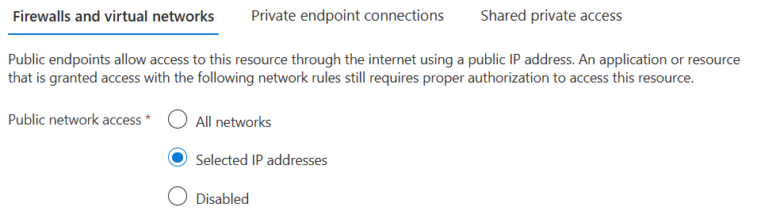
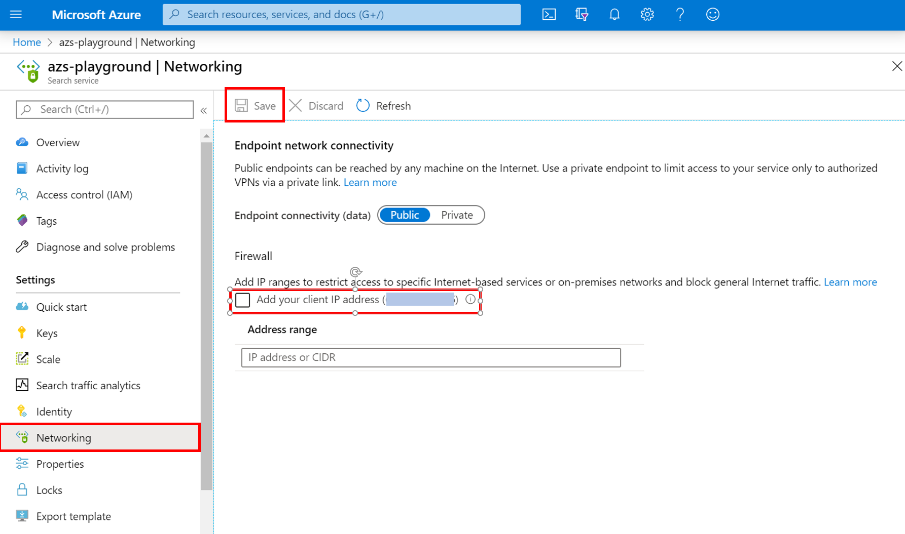

# Configure IP firewall for Azure Cognitive Search

Azure Cognitive Search supports IP rules for inbound firewall support. This model provides an additional layer of security for your search service similar to the IP rules you'll find in an Azure virtual network security group. With these IP rules, you can configure your search service to be accessible only from an approved set of machines and/or cloud services. Access to data stored in your search service from these approved sets of machines and services will still require the caller to present a valid authorization token.

> [!Important]
> IP rules on your Azure Cognitive Search service can be configured using the Azure portal or the [Management REST API version 2020-03-13](https://docs.microsoft.com/rest/api/searchmanagement/).

##  Configure an IP firewall using the Azure portal

To set the IP access control policy in the Azure portal, go to your Azure Cognitive Search service page and select **Networking** on the navigation menu. Endpoint networking connectivity must be **Public**. If your connectivity is set to **Private**, you can only access your search service via a Private Endpoint.

The Azure portal provides the ability to specify IP addresses and IP address ranges in the CIDR format. An example of CIDR notation is 8.8.8.0/24, which represents the IPs that range from 8.8.8.0 to 8.8.8.255.

> [!NOTE]
> After you enable the IP access control policy for your Azure Cognitive Search service, all requests to the data plane from machines outside the allowed list of IP address ranges are rejected. When IP rules are configured, some features of the Azure portal are disabled. You'll be able to view and manage service level information, but portal access to index data and the various components in the service, such as the index, indexer, and skillset definitions, is restricted for security reasons.

### Requests from your current IP

To simplify development, the Azure portal helps you identify and add the IP of your client machine to the allowed list. Apps running on your machine can then access your Azure Cognitive Search service.

The portal automatically detects your client IP address. It might be the client IP address of your machine or network gateway. Make sure to remove this IP address before you take your workload to production.

To add your current IP to the list of IPs, check **Add your client IP address**. Then select **Save**.

## Troubleshoot issues with an IP access control policy

You can troubleshoot issues with an IP access control policy by using the following options:

### Azure portal

Enabling an IP access control policy for your Azure Cognitive Search service blocks all requests from machines outside the allowed list of IP address ranges, including the Azure portal.  You'll be able to view and manage service level information, but portal access to index data and the various components in the service, such as the index, indexer, and skillset definitions, is restricted for security reasons. 

### SDKs

When you access Azure Cognitive Search service using the SDK from machines that are not in the allowed list, a generic **403 Forbidden** response is returned with no additional details. Verify the allowed IP list for your account, and make sure that the correct configuration updated for your search service.

## Next steps

For more information on accessing your search service via Private Link, see the following article:

* [Create a Private Endpoint for a secure connection to Azure Cognitive Search](service-create-private-endpoint.md)
