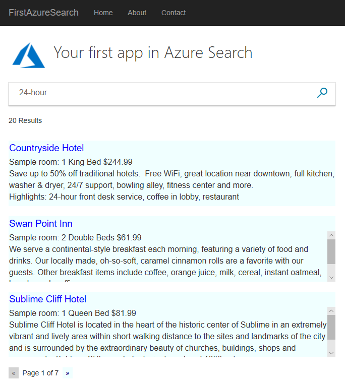
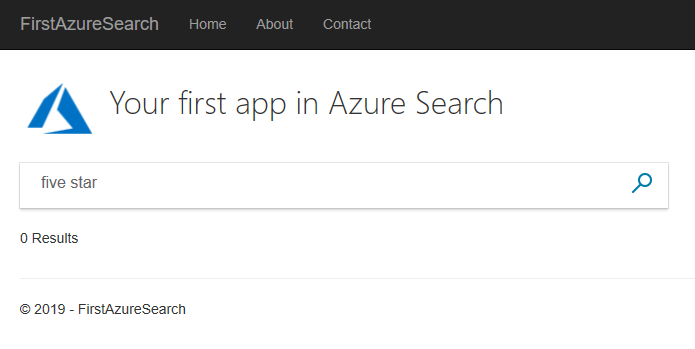

# C# Tutorial: Create your first app in Azure Search

Learn how to create a simple web interface to query and present search results from an Azure Search index. In this tutorial, you’ll start with an existing, hosted index so that you can focus on building a search page. The index contains fictitious hotel data. Once you have a basic page, you can enhance it in subsequent lessons to include paging, facets, and a type-ahead experience.

In this tutorial, you learn how to:
> [!div class="checklist"]
> * Create the right project and setup the development environment for building Azure Search apps
> * Setup an Azure Search to access a publicly available data source
> * Use asynchronous search calls to emphasize efficiency
> * Use the Model-View-Controller (MVC) client-server architecture to render a client and communicate with the server
> * Implement a basic paging system to handle large collections of search results
> * Use temporary storage to persist data from one call to the next

You will also learn just how simple an Azure Search call is. The key statements in the code you will develop are the following:

```cs
SearchParameters parameters;
DocumentSearchResult<Hotel> results;

results = await _indexClient.Documents.SearchAsync<Hotel>(model.searchText, parameters);
```

This one call initiates a search of Azure data and returns the results. Simple as that. Notice that we are going to use the asynchronous versions of the search APIs right from the start. Both the synchronous and asynchronous versions of the API call work very similarly, there are some differences in declaring the methods and calling the APIs but no additional lines of code are needed. For best practices in avoiding blocking threads on a server, best to get used to using the asynchronous versions.



You should be both impressed and relieved at the power and brevity of Azure Search API calls. Azure Search is a thoroughly designed system that does not require screeds of code to be written, nor does it involve extensive commitments to a trial and error approach to programming.


## Prerequisites

To complete this tutorial, you need to:

[Install Visual Studio](https://visualstudio.microsoft.com/) to use as the IDE.

## Install and run the project from GitHub

1. Locate the sample app at the following location TBD.
1. Select **Clone or download** and make your private local copy of the project.
1. Using Visual Studio open the solution and select **Start without debugging** (or press F5).
1. Type in some words (for example "wifi", "view", "bar", "parking") and page through the results!

 

Note how no paging options are displayed if there is less than one page worth of results.

 

The last page of results may contain less than a full page.

 

Hopefully this will all run smoothly, and you have an Azure app running. It is a simple search, but as almost all of the essential components for more sophisticated searches are included in this one app, it is a good idea to go through it and recreate it step by step.


## Build the project from scratch

To create this project from scratch, and hence help reinforce the components of Azure Search in your mind, go through the following steps.

## Create the project and set up the environment

1. In Visual Studio 2017, or later, select **New** then **Project** then **ASP.NET Core Web Application**. Give the project a name such as "FirstAzureSearch".


2. After you have clicked **OK** for this project type, you will be given a second set of options that apply to this project. Select **Web Application (Model-View-Controller)**.


3. Next, in the **Tools** menu, select **NuGet Package Manager** and then **Manage NuGet Packages for Solution...**. There are two packages we need to install. Select the **Browse** tab then type "Azure Search" into the search box. Install **Microsoft.Azure.Search** when it appears in the list. You will have to click through a few additional dialogs.


4. Now type "MVC" into the **Browse** search box and install **Microsoft.AspNet.Mvc** when it is located.


## Initialize the Azure Search service

For this sample we are using publicly available hotel data. This data is just an arbitrary collection of 60 or so fictional hotel names and descriptions, created solely for the purpose of providing demo data. In order to access this data, you need to specify a name and key for it. 

1. Open up the appsettings.json file in your project and add the following name and key. The API key shown here is not an example of a key, it is exactly the key you need to access the hotel data. Your appsettings.json file should now look like this.

```cs
{
  "Logging": {
    "LogLevel": {
      "Default": "Warning"
    }
  },
  "AllowedHosts": "*",
  "SearchServiceName": "azs-playground",
  "SearchServiceQueryApiKey": "EA4510A6219E14888741FCFC19BFBB82"
}
```

2. We are not quite done with this file yet, select the properties for this file and change the **Copy to Output Directory** setting to **Copy if newer**.


## Create MVC models to communicate data

Models (C# classes) are used to communicate data between the client (the view), the server (the controller) and also the Azure cloud using the MVC (model, view, controller) architecture. Typically, these models will simply reflect the structure of the data that is being accessed. Also, we need a model to handle the view/controller communications.

1. Open up the **Models** folder of your project, using Solution Explorer, and you will see one default model in there: **ErrorViewModel.cs**.

2. Right-click the **Models** folder and select **Add** then **new Item**. Then in the dialog that appears, select **ASP.NET Core** then the first option **Class**. Rename the .cs file to Hotel.cs. Replace all the contents of Hotel.cs with the following code. Note in particular the **Address** and **Room** members of the class, these are classes themselves and we will need models for these too.

```cs
using System;
using Microsoft.Azure.Search;
using Microsoft.Azure.Search.Models;
using Microsoft.Spatial;
using Newtonsoft.Json;

namespace FirstAzureSearch.Models
{
    public partial class Hotel
    {
        [System.ComponentModel.DataAnnotations.Key]
        [IsFilterable]
        public string HotelId { get; set; }

        [IsSearchable, IsSortable]
        public string HotelName { get; set; }

        [IsSearchable]
        [Analyzer(AnalyzerName.AsString.EnLucene)]
        public string Description { get; set; }

        [IsSearchable]
        [Analyzer(AnalyzerName.AsString.FrLucene)]
        [JsonProperty("Description_fr")]
        public string DescriptionFr { get; set; }

        [IsSearchable, IsFilterable, IsSortable, IsFacetable]
        public string Category { get; set; }

        [IsSearchable, IsFilterable, IsFacetable]
        public string[] Tags { get; set; }

        [IsFilterable, IsSortable, IsFacetable]
        public bool? ParkingIncluded { get; set; }

        [IsFilterable, IsSortable, IsFacetable]
        public DateTimeOffset? LastRenovationDate { get; set; }

        [IsFilterable, IsSortable, IsFacetable]
        public double? Rating { get; set; }

        public Address Address { get; set; }

        [IsFilterable, IsSortable]
        public GeographyPoint Location { get; set; }

        public Room[] Rooms { get; set; }
    }
}
```

3. Follow the same process of creating a model for the **Address** class, except of course name the .cs file Address.cs. Replace the contents with the following.

```cs
using Microsoft.Azure.Search;

namespace FirstAzureSearch.Models
{
    public partial class Address
    {
        [IsSearchable]
        public string StreetAddress { get; set; }

        [IsSearchable, IsFilterable, IsSortable, IsFacetable]
        public string City { get; set; }

        [IsSearchable, IsFilterable, IsSortable, IsFacetable]
        public string StateProvince { get; set; }

        [IsSearchable, IsFilterable, IsSortable, IsFacetable]
        public string PostalCode { get; set; }

        [IsSearchable, IsFilterable, IsSortable, IsFacetable]
        public string Country { get; set; }
    }
}
```

4. And again, follow the same process to create the **Room** class, naming the file Room.cs. Again, replace the contents with the following.

```cs
using Microsoft.Azure.Search;
using Microsoft.Azure.Search.Models;
using Newtonsoft.Json;

namespace FirstAzureSearch.Models
{
    public partial class Room
    {
        [IsSearchable]
        [Analyzer(AnalyzerName.AsString.EnMicrosoft)]

        public string Description { get; set; }

        [IsSearchable]
        [Analyzer(AnalyzerName.AsString.FrMicrosoft)]
        [JsonProperty("Description_fr")]
        public string DescriptionFr { get; set; }

        [IsSearchable, IsFilterable, IsFacetable]
        public string Type { get; set; }

        [IsFilterable, IsFacetable]
        public double? BaseRate { get; set; }

        [IsSearchable, IsFilterable, IsFacetable]
        public string BedOptions { get; set; }

        [IsFilterable, IsFacetable]

        public int SleepsCount { get; set; }

        [IsFilterable, IsFacetable]
        public bool? SmokingAllowed { get; set; }

        [IsSearchable, IsFilterable, IsFacetable]
        public string[] Tags { get; set; }
    }
}
```

5. The set of **Hotel**, **Address** and **Room** classes are what is known in Azure as "complex types", a new and important feature of Azure Search. Complex types can be many levels deep of classes and sub-classes, and enable far more complex data systems to be searched than using "simple types" (simply, a class containing only primitive members). We do need one more model, go through the process of creating a new model class again, though this time call the class SearchData.cs and replace the default code with the following.

```cs
using System.Collections;

namespace FirstAzureSearch.Models
{
    public static class GlobalVariables
    {
        public static int ResultsPerPage
        {
            get
            {
                return 3;
            }
        }
    }

    public class SearchData
    {
        public SearchData()
        {
            hotels = new ArrayList();
        }

        [System.ComponentModel.DataAnnotations.Key]

        // The text to search for in the hotels data.
        public string searchText { get; set; }

        // The total number of results found for the search text.
        public int resultCount { get; set; }

        // The list of hotels to display in the current page.
        public ArrayList hotels;

        // The current page being displayed.
        public int currentPage { get; set; }

        // The total number of pages of results.
        public int pageCount { get; set; }

        public void AddHotel(string name, string desc, double rate, string bedOption, string[] tags)
        {
            // Populate a new Hotel class, but only with the data that has been provided.
            Hotel hotel = new Hotel();
            hotel.HotelName = name;
            hotel.Description = desc;
            hotel.Tags = new string[tags.Length];
            for (int i = 0; i < tags.Length; i++)
            {
                hotel.Tags[i] = new string(tags[i]);
            }

            // Create just a single room for the hotel, containing the sample rate and room description.
            Room room = new Room();
            room.BaseRate = rate;
            room.BedOptions = bedOption;

            hotel.Rooms = new Room[1];
            hotel.Rooms[0] = room;

            hotels.Add(hotel);
        }

        public Hotel GetHotel(int index)
        {
            Hotel h = (Hotel)hotels[index];
            return h;
        }

        public string GetFullHotelDescription(int index)
        {
            Hotel h = (Hotel)hotels[index];

            // Combine the tag data into a comma-delimited string
            string tagData = string.Join(", ", h.Tags);
            string description = h.Description;

            if (tagData.Length > 0)
            {
                description += "\nHighlights: " + tagData;
            }

            // Get the sample room data and combine into one string.
            var fullDescription = "Sample room: ";
            fullDescription += h.Rooms[0].BedOptions;
            fullDescription += " $" + h.Rooms[0].BaseRate;
            fullDescription += "\n" + description;
            return fullDescription;
        }
    }
}
```

This time we have a bit more to look at than simply members. Note first the static class entitled **GlobalVariables**. As the name implies this is how global variables are declared when using MVC architecture. We only have one global variable here, **ResultsPerPage**, determining quite simply how many results to display on the client in one page. In other components of this project, this variable is accessed as **GlobalVariables.ResultsPerPage**.

The **SearchData** class itself critically contains a method to add a hotel to an **ArrayList** of hotels. This list is of course those that have been returned from an Azure Search. 

Another critical bit of data in this class is **searchText**, this is the text entered by the user. The other members provide control data such as the number of results in total and the current page that is being displayed on the client. We will revisit these when looking at the client code (the **Index** view).

## Create MVC views for the client

The project you created will by default create a number of client views. The exact views depend on the version of Core .NET you are using (we use 2.1 in this sample). They are all in the **Views** folder of the project. There is no need to modify _any_ of these except the **Index** view (in the **Views/Home** folder).

Delete the content of Index.cshtml in its entirety and rebuild the file in the following steps.

1. We use two small images in the view. You can use your own or copy across the images from the GitHub project: azure-logo.png and search.png. These two images should be placed in the **wwwroot/images** folder.

2. The first line of Index.cshtml should reference the model we will be using to communicate data between the client (the view) and the server (the controller), which is the **searchData** model we just created. Add this line to the Index.cshtml file.

```cs
@model FirstAzureSearch.Models.SearchData
```

3. It is standard practice to enter a title for the View, so the next lines should be:

```cs
@{
    ViewData["Title"] = "Home Page";
}
```

4. Following this let's enter some HTML styling. No need to go into this in detail, this is just standard html.

```cs
<head>
    <style>
        textarea.box1 {
            width: 648px;
            height: 30px;
            border: none;
            background-color: azure;
            font-size: 14pt;
            color: blue;
        }

        textarea.box2 {
            width: 648px;
            height: 100px;
            border: none;
            background-color: azure;
            font-size: 12pt;
        }

        .sampleTitle {
            font: 32px/normal 'Segoe UI Light',Arial,Helvetica,Sans-Serif;
            margin: 20px 0;
            font-size: 32px;
            text-align: left;
        }

        .sampleText {
            font: 16px/bold 'Segoe UI Light',Arial,Helvetica,Sans-Serif;
            margin: 20px 0;
            font-size: 14px;
            text-align: left;
            height: 30px;
        }

        .searchBoxForm {
            width: 648px;
            box-shadow: 0 0 0 1px rgba(0,0,0,.1), 0 2px 4px 0 rgba(0,0,0,.16);
            background-color: #fff;
            display: inline-block;
            border-collapse: collapse;
            border-spacing: 0;
            list-style: none;
            color: #666;
        }

        .searchBox {
            width: 568px;
            font-size: 16px;
            margin: 5px 0 1px 20px;
            padding: 0 10px 0 0;
            border: 0;
            max-height: 30px;
            outline: none;
            box-sizing: content-box;
            height: 35px;
            vertical-align: top;
        }

        .searchBoxSubmit {
            background-color: #fff;
            border-color: #fff;
            background-image: url(/images/search.png);
            background-repeat: no-repeat;
            height: 20px;
            width: 20px;
            text-indent: -99em;
            border-width: 0;
            border-style: solid;
            margin: 10px;
            outline: 0;
        }

        .pageButton {
            border: none;
            color: darkblue;
            font-weight: normal;
            width: 50px;
        }

        .pageButtonDisabled {
            border: none;
            color: lightgray;
            font-weight: bold;
            width: 50px;
        }
    </style>
</head>
```

5. Now to the meat of the view. A key thing to remember is that the view has to handle two situations. Firstly, it must handle the display when the app is first launched, and the user has not yet entered any search text. Secondly, it must handle the display of a single page of results in addition to the search text boxes for repeated use by the user. To handle these two situations, we need to check whether the model provided to the view is null or not. A null model indicates we are in the first of the two situations (the initial running of the app). Add the following to the Index.cshtml file and read through the comments.

```cs
   <h1 class="sampleTitle">
    
     Your first Azure Search app
    </h1>

@using (Html.BeginForm("Index", "Home", FormMethod.Post))
{
    // Display the search text box, with the search icon to the right of it.
    <div class="searchBoxForm">
        @Html.TextBoxFor(m => m.searchText, new { @class = "searchBox" }) <input class="searchBoxSubmit" type="submit" value="">
    </div>

    @if (Model != null)
    {
        // Show the result count.
        <p class="sampleText">
            @Html.DisplayFor(m => m.resultCount) Results
        </p>

        // Show the hotel data. All pages will have ResultsPerPage entries, except for the last page.
        @for (var i = 0; i < Model.hotels.Count; i++)
        {
            // Display the hotel name.
            @Html.TextAreaFor(m => Model.GetHotel(i).HotelName, new { @class = "box1" })
            <br />

            // Display the hotel sample room and description.
            @Html.TextArea("desc", Model.GetFullHotelDescription(i), new { @class = "box2" })
            <br /> <br />
        }
    }
}
```

6. Finally we complete the view with paging buttons. We keep this simple for this example, just "next" and "previous" paging buttons. Following tutorials address both more complete numbered paging and infinite paging.

```cs
    @if (Model != null && Model.pageCount > 1)
    {
        // If there is more than one page of results, show the paging buttons.
        <table>
            <tr>
                <td>
                    @using (Html.BeginForm("Prev", "Home", FormMethod.Post))
                    {
                        // Previous (<<) page button.
                        @if (Model.currentPage > 0)
                        {
                            <input id="prev" type="submit" value="&#171;" class="pageButton">
                        }
                        else
                        {
                            // Show an inactive button, so the buttons remain in the same place on the view.
                            <input id="prev" type="submit" value="&#171;" disabled class="pageButtonDisabled">
                        }

                    }
                </td>

                <!-- Aid navigation by showing the current page and how many pages of results there are. -->
                <td>&nbsp;&nbsp;Page @(Model.currentPage + 1) of @Model.pageCount&nbsp;&nbsp;</td>

                <td>
                    @using (Html.BeginForm("Next", "Home", FormMethod.Post))
                    {
                        // Next (>>) page button.
                        @if (Model.currentPage < Model.pageCount - 1)
                        {
                            <input id="next" type="submit" value="&#187;" class="pageButton">
                        }
                        else
                        {
                            <input id="next" type="submit" value="&#187;" disabled class="pageButtonDisabled">
                        }
                    }
                </td>
            </tr>
        </table>
    }
```

That completes our view. We are making good progress, the models and views are completed, only the controller left to tie everything together.

## Create the MVC controller

We need to add to the contents of the one controller (**Home Controller**) which is created by default. 

1. Open the HomeController.cs file and replace the **using** statements with the following. 

```cs
using System;
using System.Diagnostics;
using System.Threading.Tasks;
using Microsoft.AspNetCore.Mvc;
using FirstAzureSearch.Models;
using Microsoft.Extensions.Configuration;
using Microsoft.Azure.Search;
using Microsoft.Azure.Search.Models;
```

### Add Index methods

We need two **Index** methods, one taking no parameters (the app-first-opened case) and one taking a model as a parameter (user has entered search text). The first of these methods is created by default. 

1. Add the following method after the default **Index()** method.

```cs
        [HttpPost]
        public async Task<ActionResult> Index(SearchData model)
        {
            try
            {
                // Ensure the search string is valid.
                if (model.searchText == null)
                {
                    model.searchText = "";
                }

                // Make the Azure Search call for the first page.
                await RunQueryAsync(model, 0);

                // Ensure temporary data is stored for the next call.
                TempData["page"] = 0;
                TempData["searchfor"] = model.searchText;
            }

            catch
            {
                return View("Error", new ErrorViewModel { RequestId = "1" });
            }
            return View(model);
        }
```

A few important things to take note of here. The **TempData** calls store a value (an **object**) in temporary storage, though this storage really does just last one call. If we store something in temporary data it will be available for the next **Index** call but will most definitely be gone the next! Because of this short lifespan we store the search text and page number back in temporary storage each and every call to **Index**.

Also note the **async** declaration of the method and the **await** call to **RunQueryAsync**. This takes care of making our calls asynchronous and so avoid blocking threads on the server.

Finally note the **catch** block uses the error model that was created for us by default.

### Add Paging methods

As mentioned before a subsequent tutorial has a good look at paging. For this first tutorial we are going to make things simple for ourselves by adding **Next** and **Prev** controller methods. 

1. Add the following two methods after your **Index(SearchData model)** method.

```cs
        public async Task<ActionResult> Next(SearchData model)
        {
            try
            {
                // Increment the current page.
                int page = 1 + (int)TempData["page"];

                // Recover the search text.
                model.searchText = TempData["searchfor"].ToString();

                // Make the Azure Search call.
                await RunQueryAsync(model, page);

                // Ensure temporary data is stored for the next call.
                TempData["page"] = page;
                TempData["searchfor"] = model.searchText;
            }

            catch
            {
                return View("Error", new ErrorViewModel { RequestId = "2" });
            }
            return View("Index", model);
        }

        public async Task<ActionResult> Prev(SearchData model)
        {
            try
            {
                // Decrement the current page.
                int page = (int)TempData["page"] - 1;

                // Recover the search text.
                model.searchText = TempData["searchfor"].ToString();

                // Make the Azure Search call.
                await RunQueryAsync(model, page);

                // Ensure temporary data is stored for the next call.
                TempData["page"] = page;
                TempData["searchfor"] = model.searchText;
            }

            catch
            {
                return View("Error", new ErrorViewModel { RequestId = "3" });
            }
            return View("Index", model);
        }
```

### Note the Error handling and other default views and methods

Depending on which version of .NET Core you are using, a slightly different set of default views are created by default. For .NET Core 2.1 the default views are Index, About, Contact, Privacy and Error. For .NET Core 2.2, for example, the default views are just Index, Privacy and Error. In either case, you can view these default pages when running the app and just examine how simply they are handled in the controller here.

We will be testing the Error view later on in this tutorial.

### Add the RunQueryAsync method

The Azure Search itself is encapsulated in our **RunQueryAsync** method. 

1. First add some static variables to set up the Azure service and a call to initiate them.

```cs
        private static SearchServiceClient _serviceClient;
        private static ISearchIndexClient _indexClient;
        private static IConfigurationBuilder _builder;
        private static IConfigurationRoot _configuration;

        private static SearchServiceClient CreateSearchServiceClient(IConfigurationRoot configuration)
        {
            string searchServiceName = configuration["SearchServiceName"];
            string queryApiKey = configuration["SearchServiceQueryApiKey"];

            SearchServiceClient serviceClient = new SearchServiceClient(searchServiceName, new SearchCredentials(queryApiKey));
            return serviceClient;
        }
```

2. Now add the **RunQueryAsync** method itself.

```cs
        private async Task<ActionResult> RunQueryAsync(SearchData model, int page)
        {
            // Use static variables to set up the configuration and Azure service and index clients, for efficiency.
            _builder = new ConfigurationBuilder().AddJsonFile("appsettings.json");
            _configuration = _builder.Build();

            _serviceClient = CreateSearchServiceClient(_configuration);
            _indexClient = _serviceClient.Indexes.GetClient("hotels");

            SearchParameters parameters;
            DocumentSearchResult<Hotel> results;

            parameters =
               new SearchParameters()
               {
                   // Enter Hotel property names into this list so only these values will be returned.
                   // If Select is empty, all values will be returned, which can be inefficient.
                   Select = new[] { "HotelName", "Description", "Tags", "Rooms" }
               };

            // For efficiency, the search call should ideally be asynchronous, so we use the
            // SearchAsync call rather than the Search call.
            results = await _indexClient.Documents.SearchAsync<Hotel>(model.searchText, parameters);

            if (results.Results == null)
            {
                model.resultCount = 0;
            }
            else
            {
                // Record the total number of results.
                model.resultCount = (int)results.Results.Count;

                // Calculate the range of current page results.
                int start = page * GlobalVariables.ResultsPerPage;
                int end = Math.Min(model.resultCount, (page + 1) * GlobalVariables.ResultsPerPage);

                for (int i = start; i < end; i++)
                {
                    // Check for hotels with no room data provided.
                    if (results.Results[i].Document.Rooms.Length > 0)
                    {
                        // Add a hotel with sample room data (an example of a "complex type").
                        model.AddHotel(results.Results[i].Document.HotelName,
                             results.Results[i].Document.Description,
                             (double)results.Results[i].Document.Rooms[0].BaseRate,
                             results.Results[i].Document.Rooms[0].BedOptions,
                             results.Results[i].Document.Tags);
                    }
                    else
                    {
                        // Add a hotel with no sample room data.
                        model.AddHotel(results.Results[i].Document.HotelName,
                            results.Results[i].Document.Description,
                            0d,
                            "No room data provided",
                            results.Results[i].Document.Tags);
                    }
                }

                // Calculate the page count.
                model.pageCount = (model.resultCount + GlobalVariables.ResultsPerPage - 1) / GlobalVariables.ResultsPerPage;
                model.currentPage = page;
            }
            return View("Index", model);
        }
```

In this method we first ensure our Azure configuration is initiated, then set some search parameters. Note that the list of parameters are exactly the member names of the **hotel** class. It is possible to leave this empty, then all data is returned. However, this is inefficient if we are only interested in a subset of the data. By specifying the fields we are interested in, only this data will be returned.

The asynchronous call to search (**results = await _indexClient.Documents.SearchAsync<Hotel>(model.searchText, parameters);**) is what this tutorial and app are all about. The **DocumentSearchResult** class is an interesting one and a really good idea is to stop at this point using a debugger and examine the contents of **results**. You should find that it is intuitive and makes a lot of sense, providing you with just the data you asked for and not much else.

Now for the moment of truth.

### Test the app

Now, will all this good effort be worthwhile and your app runs!

1. Select **Debug/Start Without Debugging** or press the F5 key. If you have coded things correctly you will get the initial Index view.

 

2. Enter text such as "beach" (or any text that comes to mind) and click the search icon. You should get some results.

 

3. Test the next and previous page buttons. Check that when they are not relevant, they are grayed out.

4. Try entering "five star". Note how you get no results. A more sophisticated search would treat "five star" as a synonym for "luxury" and return those results. The use of synonyms is available in Azure Search.
 
 

5. Try entering "hot" as search text. Note that it does _not_ return entries with the word "hotel" in them. Our simple search is only locating whole words.

6. Try other words: "pool", "sunshine", "view" and whatever. You will see Azure Search working at its simplest but still convincing level.

## Edge conditions and errors

It is important to verify that our error handling features work as they should, even when things are working perfectly. 

1. In the **Prev** method, just after the **try {** call, enter the line **Throw new Exception()**. This will force an error when we select the previous (<<) button.

2. Run the app, enter "bar" as search text, select the next page, then select the previous page. You should get the error page appearing in your view.

 

> Note
> It is considered a security risk to return internal error numbers in error pages. If your app is intended for general use, do some investigation into secure and best practices of what to return when an error occurs.

3. Remove **Throw new Exception()** when you are satisfied the error handling works as it should.


## Takeaways

First and foremost, congratulations on getting your first Azure Search app up and running. Great job.

You should consider the following takeaways from this project:

* Azure Search involves just a few API calls to set up and carry out and it is easy to interpret the results.
* Temporary storage really does persist for only one call and needs to be reset to survive additional calls.
* Asynchronous calls add just a small amount of complexity to the controller but is the best practice if you intend developing industrial quality apps. Best to start on the right footing.
* This app performed an elementary search, defined by what is set up in **searchParameters**. This one class can be populated with many members that add sophistication to a search. All that is needed is to add these parameters to the code you have just written, so not much additional work is needed.
* The Model-View-Controller architecture takes a bit of getting used to, if you are new to it, but it does cleanly define what runs on the client, what on the server, and how to cleanly communicate (with good scalability) data between the two.


## Next steps

In order to provide the best user experience using Azure Search, we need to add more features, notably better paging (page numbers or perhaps infinite paging, depending on the application) and autocomplete/suggestions. We should also consider more sophisticated search parameters (conditional searches, for example - all hotels with a room price less than $N, and geo-spatial searches on hotels within a specified radius of a given point).

These next steps are addressed are in a series of tutorials. Let's start with paging.

> [!div class="nextstepaction"]
> [C# Tutorial: Page the results of an Azure Search](tutorial-csharp-paging.md)


