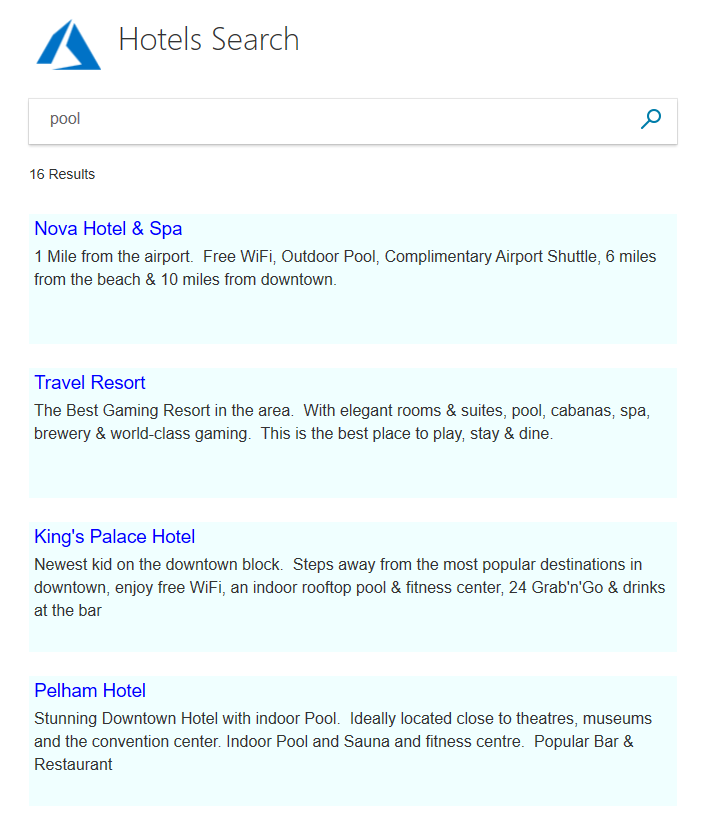
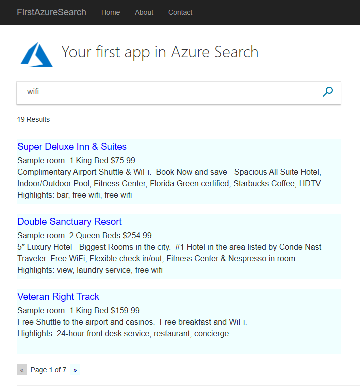
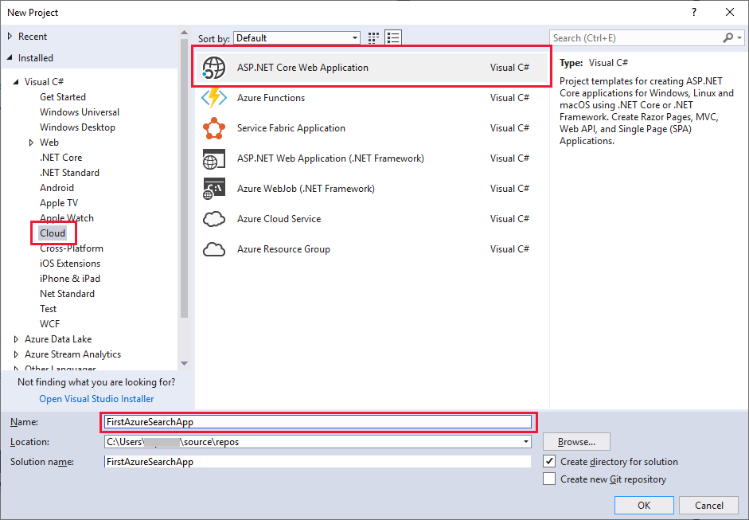
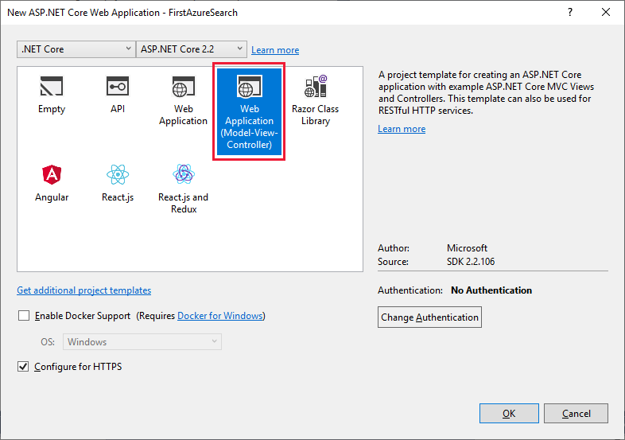
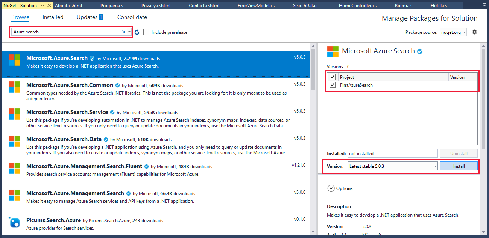
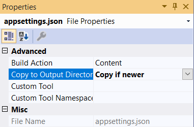
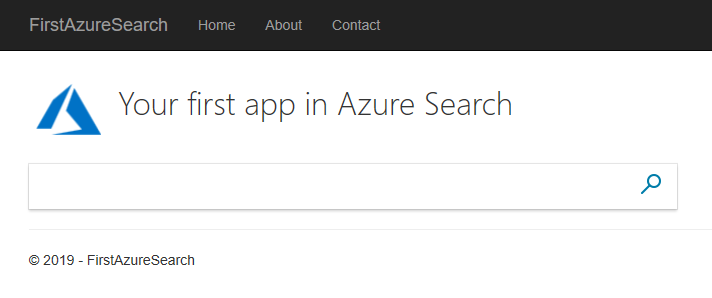
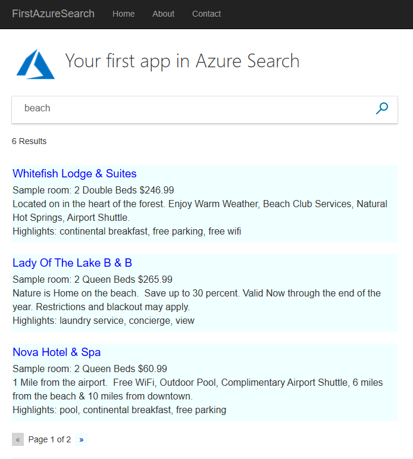
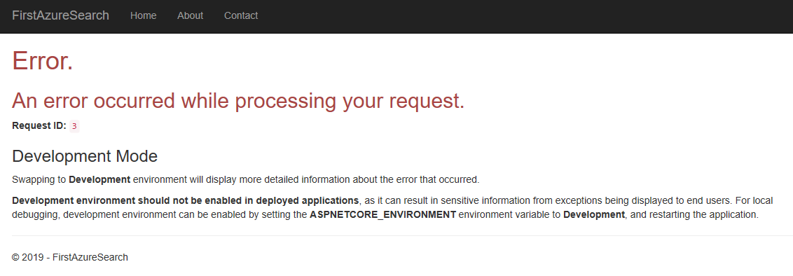

# Tutorial: Create your first search app using the .NET SDK

Learn how to create a web interface to query and present search results from an index using Azure Cognitive Search. This tutorial starts with an existing, hosted index so that you can focus on building a search page. The index contains fictitious hotel data. Once you have a basic page, you can enhance it in subsequent lessons to include paging, facets, and a type-ahead experience.

In this tutorial, you learn how to:
> [!div class="checklist"]
> * Setup a development environment
> * Model data structures
> * Create a web page
> * Define methods
> * Test the app

You will also learn how straightforward a search call is. The key statements in the code you will develop are encapsulated in the following few lines.

```cs
var parameters = new SearchParameters
{
    // Enter Hotel property names into this list, so only these values will be returned.
    Select = new[] { "HotelName", "Description" }
};

DocumentSearchResult<Hotel> results  = await _indexClient.Documents.SearchAsync<Hotel>("search text", parameters);
```

This one call initiates a search of Azure data and returns the results.




## Prerequisites

To complete this tutorial, you need to:

[Install Visual Studio](https://visualstudio.microsoft.com/) to use as the IDE.

### Install and run the project from GitHub

1. Locate the sample on GitHub: [Create first app](https://github.com/Azure-Samples/azure-search-dotnet-samples).
1. Select **Clone or download** and make your private local copy of the project.
1. Using Visual Studio, navigate to, and open the solution for the basic search page, and select **Start without debugging** (or press F5).
1. Type in some words (for example "wifi", "view", "bar", "parking"), and examine the results!

    

Hopefully this project will run smoothly, and you have Azure app running. Many of the essential components for more sophisticated searches are included in this one app, so it is a good idea to go through it, and recreate it step by step.

To create this project from scratch, and hence help reinforce the components of Azure Cognitive Search in your mind, go through the following steps.

## Set up a development environment

1. In Visual Studio 2017, or later, select **New/Project** then **ASP.NET Core Web Application**. Give the project a name such as "FirstAzureSearchApp".

    

2. After you have clicked **OK** for this project type, you will be given a second set of options that apply to this project. Select **Web Application (Model-View-Controller)**.

    

3. Next, in the **Tools** menu, select **NuGet Package Manager** and then **Manage NuGet Packages for Solution...**. There is one package we need to install. Select the **Browse** tab then type "Azure Cognitive Search" into the search box. Install **Microsoft.Azure.Search** when it appears in the list (version 9.0.1, or later). You will have to click through a few additional dialogs to complete the installation.

    

### Initialize Azure Cognitive Search

For this sample, we are using publicly available hotel data. This data is an arbitrary collection of 50 fictional hotel names and descriptions, created solely for the purpose of providing demo data. In order to access this data, you need to specify a name and key for it.

1. Open up the appsettings.json file in your new project, and replace the default lines with the following name and key. The API key shown here is not an example of a key, it is _exactly_ the key you need to access the hotel data. Your appsettings.json file should now look like this.

    ```cs
    {
        "SearchServiceName": "azs-playground",
        "SearchServiceQueryApiKey": "EA4510A6219E14888741FCFC19BFBB82"
    }
    ```

2. We are not done with this file yet, select the properties for this file, and change the **Copy to Output Directory** setting to **Copy if newer**.

    

## Model data structures

Models (C# classes) are used to communicate data between the client (the view), the server (the controller), and also the Azure cloud using the MVC (model, view, controller) architecture. Typically, these models will reflect the structure of the data that is being accessed. Also, we need a model to handle the view/controller communications.

1. Open up the **Models** folder of your project, using Solution Explorer, and you will see one default model in there: **ErrorViewModel.cs**.

2. Right-click the **Models** folder and select **Add** then **New Item**. Then, in the dialog that appears, select **ASP.NET Core** then the first option **Class**. Rename the .cs file to Hotel.cs, and click **Add**. Replace all the contents of Hotel.cs with the following code. Notice the **Address** and **Room** members of the class, these fields are classes themselves so we will need models for them too.

    ```cs
    using System;
    using Microsoft.Azure.Search;
    using Microsoft.Azure.Search.Models;
    using Microsoft.Spatial;
    using Newtonsoft.Json;

    namespace FirstAzureSearchApp.Models
    {
        public partial class Hotel
        {
            [System.ComponentModel.DataAnnotations.Key]
            [IsFilterable]
            public string HotelId { get; set; }

            [IsSearchable, IsSortable]
            public string HotelName { get; set; }

            [IsSearchable]
            [Analyzer(AnalyzerName.AsString.EnLucene)]
            public string Description { get; set; }

            [IsSearchable]
            [Analyzer(AnalyzerName.AsString.FrLucene)]
            [JsonProperty("Description_fr")]
            public string DescriptionFr { get; set; }

            [IsSearchable, IsFilterable, IsSortable, IsFacetable]
            public string Category { get; set; }

            [IsSearchable, IsFilterable, IsFacetable]
            public string[] Tags { get; set; }

            [IsFilterable, IsSortable, IsFacetable]
            public bool? ParkingIncluded { get; set; }

            [IsFilterable, IsSortable, IsFacetable]
            public DateTimeOffset? LastRenovationDate { get; set; }

            [IsFilterable, IsSortable, IsFacetable]
            public double? Rating { get; set; }

            public Address Address { get; set; }

            [IsFilterable, IsSortable]
            public GeographyPoint Location { get; set; }

            public Room[] Rooms { get; set; }
        }
    }
    ```

3. Follow the same process of creating a model for the **Address** class, except name the file Address.cs. Replace the contents with the following.

    ```cs
    using Microsoft.Azure.Search;

    namespace FirstAzureSearchApp.Models
    {
        public partial class Address
        {
            [IsSearchable]
            public string StreetAddress { get; set; }

            [IsSearchable, IsFilterable, IsSortable, IsFacetable]
            public string City { get; set; }

            [IsSearchable, IsFilterable, IsSortable, IsFacetable]
            public string StateProvince { get; set; }

            [IsSearchable, IsFilterable, IsSortable, IsFacetable]
            public string PostalCode { get; set; }

            [IsSearchable, IsFilterable, IsSortable, IsFacetable]
            public string Country { get; set; }
        }
    }
    ```

4. And again, follow the same process to create the **Room** class, naming the file Room.cs. Again, replace the contents with the following.

    ```cs
    using Microsoft.Azure.Search;
    using Microsoft.Azure.Search.Models;
    using Newtonsoft.Json;

    namespace FirstAzureSearchApp.Models
    {
        public partial class Room
        {
            [IsSearchable]
            [Analyzer(AnalyzerName.AsString.EnMicrosoft)]

            public string Description { get; set; }

            [IsSearchable]
            [Analyzer(AnalyzerName.AsString.FrMicrosoft)]
            [JsonProperty("Description_fr")]
            public string DescriptionFr { get; set; }

            [IsSearchable, IsFilterable, IsFacetable]
            public string Type { get; set; }

            [IsFilterable, IsFacetable]
            public double? BaseRate { get; set; }

            [IsSearchable, IsFilterable, IsFacetable]
            public string BedOptions { get; set; }

            [IsFilterable, IsFacetable]

            public int SleepsCount { get; set; }

            [IsFilterable, IsFacetable]
            public bool? SmokingAllowed { get; set; }

            [IsSearchable, IsFilterable, IsFacetable]
            public string[] Tags { get; set; }
        }
    }
    ```

5. The set of **Hotel**, **Address**, and **Room** classes are what is known in Azure as [_complex types_](search-howto-complex-data-types.md), an important feature of Azure Cognitive Search. Complex types can be many levels deep of classes and subclasses, and enable far more complex data structures to be represented than using _simple types_ (a class containing only primitive members). We do need one more model, so go through the process of creating a new model class again, though this time call the class SearchData.cs and replace the default code with the following.

    ```cs
    using Microsoft.Azure.Search.Models;

    namespace FirstAzureSearchApp.Models
    {
        public class SearchData
        {
            // The text to search for.
            public string searchText { get; set; }

            // The list of results.
            public DocumentSearchResult<Hotel> resultList;
        }
    }
    ```

    This class contains the user's input (**searchText**), and the search's output (**resultList**). The type of the output is critical, **DocumentSearchResult&lt;Hotel&gt;**, as this type exactly matches the results from the search, and we need to pass this reference through to the view.


## Create a web page

The project you created will by default create a number of client views. The exact views depend on the version of Core .NET you are using (we use 2.1 in this sample). They are all in the **Views** folder of the project. You will only need to modify the Index.cshtml file (in the **Views/Home** folder).

Delete the content of Index.cshtml in its entirety, and rebuild the file in the following steps.

1. We use two small images in the view. You can use your own, or copy across the images from the GitHub project: azure-logo.png and search.png. These two images should be placed in the **wwwroot/images** folder.

2. The first line of Index.cshtml should reference the model we will be using to communicate data between the client (the view) and the server (the controller), which is the **SearchData** model we created. Add this line to the Index.cshtml file.

    ```cs
    @model FirstAzureSearchApp.Models.SearchData
    ```

3. It is standard practice to enter a title for the view, so the next lines should be:

    ```cs
    @{
        ViewData["Title"] = "Home Page";
    }
    ```

4. Following the title, enter a reference to an HTML stylesheet, which we will create shortly.

    ```cs
    <head>
        <link rel="stylesheet" href="~/css/hotels.css" />
    </head>
    ```

5. Now to the meat of the view. A key thing to remember is that the view has to handle two situations. Firstly, it must handle the display when the app is first launched, and the user has not yet entered any search text. Secondly, it must handle the display of results, in addition to the search text box, for repeated use by the user. To handle these two situations, we need to check whether the model provided to the view is null or not. A null model indicates we are in the first of the two situations (the initial running of the app). Add the following to the Index.cshtml file and read through the comments.

    ```cs
    <body>
    <h1 class="sampleTitle">
        
        Hotels Search
    </h1>

    @using (Html.BeginForm("Index", "Home", FormMethod.Post))
    {
        // Display the search text box, with the search icon to the right of it.
        <div class="searchBoxForm">
            @Html.TextBoxFor(m => m.searchText, new { @class = "searchBox" }) <input class="searchBoxSubmit" type="submit" value="">
        </div>

        @if (Model != null)
        {
            // Show the result count.
            <p class="sampleText">
                @Html.DisplayFor(m => m.resultList.Results.Count) Results
            </p>

            @for (var i = 0; i < Model.resultList.Results.Count; i++)
            {
                // Display the hotel name and description.
                @Html.TextAreaFor(m => Model.resultList.Results[i].Document.HotelName, new { @class = "box1" })
                @Html.TextArea($"desc{i}", Model.resultList.Results[i].Document.Description, new { @class = "box2" })
            }
        }
    }
    </body>
    ```

6. Finally, we add the stylesheet. In Visual Studio, in the **File** menu select **New/File** then **Style Sheet** (with **General** highlighted). Replace the default code with the following. We will not be going into this file in any more detail, the styles are standard HTML.

    ```html
    textarea.box1 {
        width: 648px;
        height: 30px;
        border: none;
        background-color: azure;
        font-size: 14pt;
        color: blue;
        padding-left: 5px;
    }

    textarea.box2 {
        width: 648px;
        height: 100px;
        border: none;
        background-color: azure;
        font-size: 12pt;
        padding-left: 5px;
        margin-bottom: 24px;
    }

    .sampleTitle {
        font: 32px/normal 'Segoe UI Light',Arial,Helvetica,Sans-Serif;
        margin: 20px 0;
        font-size: 32px;
        text-align: left;
    }

    .sampleText {
        font: 16px/bold 'Segoe UI Light',Arial,Helvetica,Sans-Serif;
        margin: 20px 0;
        font-size: 14px;
        text-align: left;
        height: 30px;
    }

    .searchBoxForm {
        width: 648px;
        box-shadow: 0 0 0 1px rgba(0,0,0,.1), 0 2px 4px 0 rgba(0,0,0,.16);
        background-color: #fff;
        display: inline-block;
        border-collapse: collapse;
        border-spacing: 0;
        list-style: none;
        color: #666;
    }

    .searchBox {
        width: 568px;
        font-size: 16px;
        margin: 5px 0 1px 20px;
        padding: 0 10px 0 0;
        border: 0;
        max-height: 30px;
        outline: none;
        box-sizing: content-box;
        height: 35px;
        vertical-align: top;
    }

    .searchBoxSubmit {
        background-color: #fff;
        border-color: #fff;
        background-image: url(/images/search.png);
        background-repeat: no-repeat;
        height: 20px;
        width: 20px;
        text-indent: -99em;
        border-width: 0;
        border-style: solid;
        margin: 10px;
        outline: 0;
    }
    ```

7. Save the stylesheet file as hotels.css, into the wwwroot/css folder, alongside the default site.css file.

That completes our view. We are making good progress. The models and views are completed, only the controller is left to tie everything together.

## Define methods

We need to modify to the contents of the one controller (**Home Controller**), which is created by default.

1. Open the HomeController.cs file and replace the **using** statements with the following.

    ```cs
    using System;
    using System.Diagnostics;
    using System.Threading.Tasks;
    using Microsoft.AspNetCore.Mvc;
    using FirstAzureSearchApp.Models;
    using Microsoft.Extensions.Configuration;
    using Microsoft.Azure.Search;
    using Microsoft.Azure.Search.Models;
    ```

### Add Index methods

We need two **Index** methods, one taking no parameters (for the case when the app is first opened), and one taking a model as a parameter (for when the user has entered search text). The first of these methods is created by default. 

1. Add the following method, after the default **Index()** method.

    ```cs
        [HttpPost]
        public async Task<ActionResult> Index(SearchData model)
        {
            try
            {
                // Ensure the search string is valid.
                if (model.searchText == null)
                {
                    model.searchText = "";
                }

                // Make the Azure Cognitive Search call.
                await RunQueryAsync(model);
            }

            catch
            {
                return View("Error", new ErrorViewModel { RequestId = "1" });
            }
            return View(model);
        }
    ```

    Notice the **async** declaration of the method, and the **await** call to **RunQueryAsync**. These keywords take care of making our calls asynchronous, and so avoid blocking threads on the server.

    The **catch** block uses the error model that was created for us by default.

### Note the error handling and other default views and methods

Depending on which version of .NET Core you are using, a slightly different set of default views are created by default. For .NET Core 2.1 the default views are Index, About, Contact, Privacy, and Error. For .NET Core 2.2, for example, the default views are Index, Privacy, and Error. In either case, you can view these default pages when running the app, and examine how they are handled in the controller.

We will be testing the Error view later on in this tutorial.

In the GitHub sample, we have deleted the unused views, and their associated actions.

### Add the RunQueryAsync method

The Azure Cognitive Search call is encapsulated in our **RunQueryAsync** method.

1. First add some static variables to set up the Azure service, and a call to initiate them.

    ```cs
        private static SearchServiceClient _serviceClient;
        private static ISearchIndexClient _indexClient;
        private static IConfigurationBuilder _builder;
        private static IConfigurationRoot _configuration;

        private void InitSearch()
        {
            // Create a configuration using the appsettings file.
            _builder = new ConfigurationBuilder().AddJsonFile("appsettings.json");
            _configuration = _builder.Build();

            // Pull the values from the appsettings.json file.
            string searchServiceName = _configuration["SearchServiceName"];
            string queryApiKey = _configuration["SearchServiceQueryApiKey"];

            // Create a service and index client.
            _serviceClient = new SearchServiceClient(searchServiceName, new SearchCredentials(queryApiKey));
            _indexClient = _serviceClient.Indexes.GetClient("hotels");
        }
    ```

2. Now, add the **RunQueryAsync** method itself.

    ```cs
        private async Task<ActionResult> RunQueryAsync(SearchData model)
        {
            InitSearch();

            var parameters = new SearchParameters
            {
                // Enter Hotel property names into this list so only these values will be returned.
                // If Select is empty, all values will be returned, which can be inefficient.
                Select = new[] { "HotelName", "Description" }
            };

            // For efficiency, the search call should be asynchronous, so use SearchAsync rather than Search.
            model.resultList = await _indexClient.Documents.SearchAsync<Hotel>(model.searchText, parameters);

            // Display the results.
            return View("Index", model);
        }
    ```

    In this method, we first ensure our Azure configuration is initiated, then set some search parameters. The names of the fields in the **Select** parameter match exactly the property names in the **hotel** class. It is possible to leave out the **Select** parameter, in which case all properties are returned. However, setting no **Select** parameters is inefficient if we are only interested in a subset of the data. By specifying the properties we are interested in, only these properties are returned.

    The asynchronous call to search (**model.resultList = await _indexClient.Documents.SearchAsync&lt;Hotel&gt;(model.searchText, parameters);**) is what this tutorial and app are all about. The **DocumentSearchResult** class is an interesting one, and a good idea (when the app is running) is to set a breakpoint here, and use a debugger to examine the contents of **model.resultList**. You should find that it is intuitive, providing you with the data you asked for, and not much else.

Now for the moment of truth.

### Test the app

Now, let's check the app runs correctly.

1. Select **Debug/Start Without Debugging** or press the F5 key. If you have coded things correctly, you will get the initial Index view.

     

2. Enter text such as "beach" (or any text that comes to mind), and click the search icon. You should get some results.

     

3. Try entering "five star". Note how you get no results. A more sophisticated search would treat "five star" as a synonym for "luxury" and return those results. The use of synonyms is available in Azure Cognitive Search, though we will not be covering it in the first tutorials.
 
4. Try entering "hot" as search text. It does _not_ return entries with the word "hotel" in them. Our search is only locating whole words, though a few results are returned.

5. Try other words: "pool", "sunshine", "view", and whatever. You will see Azure Cognitive Search working at its simplest, but still convincing level.

## Test edge conditions and errors

It is important to verify that our error handling features work as they should, even when things are working perfectly. 

1. In the **Index** method, after the **try {** call, enter the line **Throw new Exception()**. This exception will force an error when we search on text.

2. Run the app, enter "bar" as search text, and click the search icon. The exception should result in the error view.

     

    > [!Important]
    > It is considered a security risk to return internal error numbers in error pages. If your app is intended for general use, do some investigation into secure and best practices of what to return when an error occurs.

3. Remove **Throw new Exception()** when you are satisfied the error handling works as it should.

## Takeaways

Consider the following takeaways from this project:

* An Azure Cognitive Search call is concise, and it is easy to interpret the results.
* Asynchronous calls add a small amount of complexity to the controller, but are the best practice if you intend to develop  quality apps.
* This app performed a straightforward text search, defined by what is set up in **searchParameters**. However, this one class can be populated with many members that add sophistication to a search. Not much additional work is needed to make this app considerably more powerful.

## Next steps

In order to provide the best user experience using Azure Cognitive Search, we need to add more features, notably paging (either using page numbers, or infinite scrolling), and autocomplete/suggestions. We should also consider more sophisticated search parameters (for example, geographical searches on hotels within a specified radius of a given point, and search results ordering).

These next steps are addressed in a series of tutorials. Let's start with paging.

> [!div class="nextstepaction"]
> [C# Tutorial: Search results pagination - Azure Cognitive Search](tutorial-csharp-paging.md)


