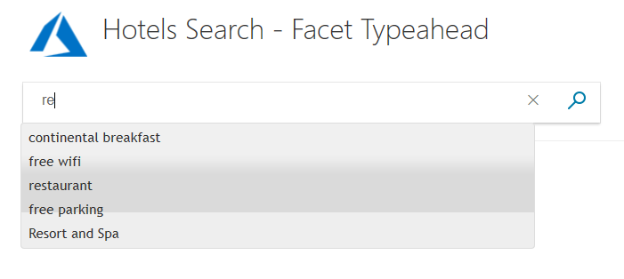
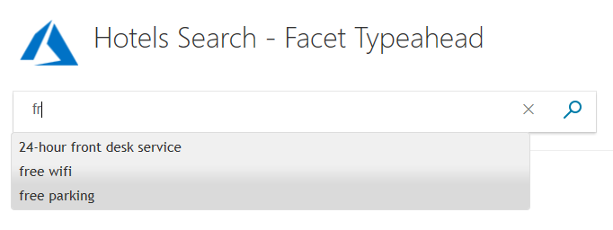

# C# tutorial: Use facets for navigation and network efficiency - Azure Search

Facets have two distinct uses in Azure Search. Facets can be used to aid navigation, by providing the user with a set of check boxes to use to focus their search. Also, they can be used to improve network efficiency, when used in autocompletion. Facet searches are efficient because they are carried out only once for each page load, rather than once for each keystroke. 

Facets are attributes of the data (such as the category of a hotel in our sample data), and stay relevant for the lifespan of a search.

This tutorial builds two projects, one for facet navigation and the other for facet autocompletion. Both projects build onto the paging project created in the [C# Tutorial: Search results pagination - Azure Search](tutorial-csharp-paging.md) tutorial.

In this tutorial, you learn how to:
> [!div class="checklist"]
> * Set model properties as _IsFacetable_
> * Add facet navigation to your app
> * Add facet autocompletion to your app
> * Decide when to use facet autocompletion

## Prerequisites

To complete this tutorial, you need to:

Have the [C# Tutorial: Search results pagination - Azure Search](tutorial-csharp-paging.md) project up and running. This can either be your own version, or install it from GitHub: [Create first app](https://github.com/Azure-Samples/azure-search-dotnet-samples).

## Set model fields as IsFacetable

In order for a model property to be located in a facet search (either navigation or autocompletion), it must be tagged with **IsFacetable**.

1. Examine the **Hotel** class. **Category** and **Tags**, for example, are tagged as **IsFacetable**, but **HotelName** and **Description** are not. 

    ```cs
    public partial class Hotel
    {
        [System.ComponentModel.DataAnnotations.Key]
        [IsFilterable]
        public string HotelId { get; set; }

        [IsSearchable, IsSortable]
        public string HotelName { get; set; }

        [IsSearchable]
        [Analyzer(AnalyzerName.AsString.EnLucene)]
        public string Description { get; set; }

        [IsSearchable]
        [Analyzer(AnalyzerName.AsString.FrLucene)]
        [JsonProperty("Description_fr")]
        public string DescriptionFr { get; set; }

        [IsSearchable, IsFilterable, IsSortable, IsFacetable]
        public string Category { get; set; }

        [IsSearchable, IsFilterable, IsFacetable]
        public string[] Tags { get; set; }

        [IsFilterable, IsSortable, IsFacetable]
        public bool? ParkingIncluded { get; set; }

        [IsFilterable, IsSortable, IsFacetable]
        public DateTimeOffset? LastRenovationDate { get; set; }

        [IsFilterable, IsSortable, IsFacetable]
        public double? Rating { get; set; }

        public Address Address { get; set; }

        [IsFilterable, IsSortable]
        public GeographyPoint Location { get; set; }

        public Room[] Rooms { get; set; }

    }
    ```

2. We will not be changing any tags in this tutorial. A facet search will throw an error if a field requested in the search is not tagged appropriately.


## Add facet navigation to your app

For this example, we are going to enable the user to select one or more categories of hotel, in a list shown to the left of the results. We need the controller to know the list of categories when the app is first run, and to pass this list to the view to be displayed when the first screen is rendered. As each page is rendered, we need to make sure we have maintained both the list of facets, and the current user selections, to be passed along to subsequent pages. Again, we use temporary storage as the mechanism for preserving data.


### Modify the SearchData model

1. Open the SearchData.cs file, and add this additional **using** statement. We need to enable the **List&lt;string&gt;** construct.

    ```cs
    using System.Collections.Generic;
    ```

2. In the same file, add the following lines to the **SearchData** class. Do not delete any of the existing class properties, but add the following constructor methods and arrays of properties.

    ```cs
        public SearchData()
        {
        }

        // Constructor to initialize the list of facets sent from the controller.
        public SearchData(List<string> facets)
        {
            facetText = new string[facets.Count];

            for (int i = 0; i < facets.Count; i++)
            {
                facetText[i] = facets[i];
            }
        }

        // Array to hold the text for each facet.
        public string[] facetText { get; set; }

        // Array to hold the check box setting.
        public bool[] facetOn { get; set; }
    ```


### Search for facets on the first Index call

The home controller needs a significant change. The first call to **Index()** no longer returns a view with no other processing. We want to provide the view with a full list of facets, and the first call is the right one for that purpose.

1. Open the home controller file, and add two **using** statements.

    ```cs
    using System.Collections.Generic;
    using System.Linq;
    ```

2. Now replace the few lines of the current **Index()** method with a method that carries out a facet search for hotel categories. As the search should be carried out asynchronously, we must declare the **Index** method as **async**.

    ```cs
        public async Task<ActionResult> Index()
        {
            InitSearch();

            // Set up the facets call in the search parameters.
            SearchParameters sp = new SearchParameters()
            {
                // Search for up to 20 categories.
                // Field names specified here must be marked as "IsFacetable" in the model, or the search call will throw an exception.
                Facets = new List<string> { "Category,count:20" },
            };

            DocumentSearchResult<Hotel> searchResult = await _indexClient.Documents.SearchAsync<Hotel>("*", sp);

            // Convert the results to a list that can be displayed in the client.
            List<string> categories = searchResult.Facets["Category"].Select(x => x.Value.ToString()).ToList();

            // Initiate a model with a list of facets for the first view.
            SearchData model = new SearchData(categories);

            // Save the facet text for the next view.
            SaveFacets(model);

            // Render the view including the facets.
            return View(model);
        }
    ```

    A few points to note here. We convert the results of the search call to a list of strings, then these facet strings are added to a **SearchData** model for communication to the view. Also we save those strings to temporary storage before finally rendering the view. This saving is done so that this list is available to the next call to a controller action.

3. Let's add the two private methods to save and restore facets to the model, and to temporary storage.

    ```cs
        // Save the facet text to temporary storage, optionally saving the state of the check boxes.
        private void SaveFacets(SearchData model, bool saveChecks = false)
        {
            for (int i = 0; i < model.facetText.Length; i++)
            {
                TempData["facet" + i.ToString()] = model.facetText[i];
                if (saveChecks)
                {
                    TempData["faceton" + i.ToString()] = model.facetOn[i];
                }
            }
            TempData["facetcount"] = model.facetText.Length;
        }

        // Recover the facet text to a model, optionally recoving the state of the check boxes.
        private void RecoverFacets(SearchData model, bool recoverChecks = false)
        {
            // Create arrays of the appropriate length.
            model.facetText = new string[(int)TempData["facetcount"]];
            if (recoverChecks)
            {
                model.facetOn = new bool[(int)TempData["facetcount"]];
            }

            for (int i = 0; i < (int)TempData["facetcount"]; i++)
            {
                model.facetText[i] = TempData["facet" + i.ToString()].ToString();
                if (recoverChecks)
                {
                    model.facetOn[i] = (bool)TempData["faceton" + i.ToString()];
                }
            }
        }
    ```

### Save and restore facet text on all calls

1. The two other actions of the home controller, **Index(SearchData model)** and **Page(SearchData model)**, both need to recover the facets before the search call, and save them again after the search call. Change the **Index(SearchData model)** to make these two calls.

    ```cs
        public async Task<ActionResult> Index(SearchData model)
        {
            try
            {
                // Ensure the search string is valid.
                if (model.searchText == null)
                {
                    model.searchText = "";
                }

                // Recover the facet text.
                RecoverFacets(model);

                // Make the search call for the first page.
                await RunQueryAsync(model, 0, 0);

                // Ensure temporary data is stored for the next call.
                TempData["page"] = 0;
                TempData["leftMostPage"] = 0;
                TempData["searchfor"] = model.searchText;

                // Facets
                SaveFacets(model, true);
            }

            catch
            {
                return View("Error", new ErrorViewModel { RequestId = "1" });
            }
            return View(model);
        }
    ```

2. Now do the same for the **Page(SearchData model)** method. We have only listed the relevant code below. Add the **RecoverFacets** and **SaveFacets** calls around the **RunQueryAsync** call.

    ```cs
                // Recover facet text and check marks.
                RecoverFacets(model, true);

                await RunQueryAsync(model, page, leftMostPage);

                // Save facets and check marks.
                SaveFacets(model, true);
    ```

### Set up a search filter

When a user selects certain facets, for example, say they click on the **Budget** and **Resort and Spa** categories, then only hotels that are specified as one of these two categories should be returned in the results. To optimize a search in this way, we need to set up a _filter_.

1. In the **RunQueryAsync** method, add the code to loop through the given model's facet settings, to create a filter string. And add the filter to the **SearchParameters**, as shown in the following code.

    ```cs
            // Create a filter for selected facets.
            string selectedFacets = "";

            for (int f = 0; f < model.facetText.Length; f++)
            {
                if (model.facetOn[f])
                {
                    if (selectedFacets.Length > 0)
                    {
                        // If there is more than one selected facet, logically OR them together.
                        selectedFacets += " or ";
                    }
                    selectedFacets += "(Category eq \'" + model.facetText[f] + "\')";
                }
            }

            var parameters = new SearchParameters
            {
                // Facets: add the filter.
                Filter = selectedFacets,

                // Enter Hotel property names into this list so only these values will be returned.
                // If Select is empty, all values will be returned, which can be inefficient.
                Select = new[] { "HotelName", "Description", "Category" },
                SearchMode = SearchMode.All,

                // Skip past results that have already been returned.
                Skip = page * GlobalVariables.ResultsPerPage,

                // Take only the next page worth of results.
                Top = GlobalVariables.ResultsPerPage,

                // Include the total number of results.
                IncludeTotalResultCount = true,
            };
    ```

    We have added the **Category** property to the list of **Select** items to return. Adding this property is not a requirement, but in this way we can verify that we are filtering correctly.

### Define a few additional HTML styles

The view is going to require some significant changes. 

1. Start by opening the hotels.css file (in the wwwroot/css folder), and add the following classes.

    ```html
    .facetlist {
        list-style: none;
    }

    .facetchecks {
        width: 200px;
        background-color: lightgoldenrodyellow;
        display: normal;
        color: #666;
        margin: 10px;
    }
    ```

### Add a list of facet checkboxes to the view

For the view, we organize the output into a table, to neatly align the facets on the left, and the results on the right. Open the index.cshtml file.

1. Replace the entire contents of the HTML &lt;body&gt; tags, with the following code.

    ```cs
    <body>

    @using (Html.BeginForm("Index", "Home", FormMethod.Post))
    {
        <table>
            <tr>
                <td></td>
                <td>
                    <h1 class="sampleTitle">
                        
                        Hotels Search - Facet Navigation
                    </h1>
                </td>
            </tr>

            <tr>
                <td></td>
                <td>
                    <!-- Display the search text box, with the search icon to the right of it.-->
                    <div class="searchBoxForm">
                        @Html.TextBoxFor(m => m.searchText, new { @class = "searchBox" }) <input value="" class="searchBoxSubmit" type="submit">
                    </div>
                </td>
            </tr>

            <tr>
                <td valign="top">
                    <div id="facetplace" class="facetchecks">
                        <h5>Filter by Category:</h5>
                        <ul class="facetlist">
                            @for (var i = 0; i < Model.facetText.Length; i++)
                            {
                                <li> @Html.CheckBoxFor(m => m.facetOn[i], new { @id = "check" + i.ToString() }) @Model.facetText[i] </li>
                            }
                        </ul>
                    </div>
                </td>
                <td valign="top">
                    <div id="resultsplace">
                        @if (Model != null && Model.resultList != null)
                        {
                            // Show the result count.
                            <p class="sampleText">
                                @Html.DisplayFor(m => m.resultList.Count) Results
                            </p>

                            @for (var i = 0; i < Model.resultList.Results.Count; i++)
                            {
                                // Display the hotel name and description.
                                @Html.TextAreaFor(m => Model.resultList.Results[i].Document.HotelName, new { @class = "box1" })
                                @Html.TextArea("desc", Model.resultList.Results[i].Document.Description + "\nCategory:  " +  Model.resultList.Results[i].Document.Category, new { @class = "box2" })
                            }
                        }
                    </div>
                </td>
            </tr>

            <tr>
                <td></td>
                <td valign="top">
                    @if (Model != null && Model.pageCount > 1)
                    {
                        // If there is more than one page of results, show the paging buttons.
                        <table>
                            <tr>
                                <td class="tdPage">
                                    @if (Model.currentPage > 0)
                                    {
                                        <p class="pageButton">
                                            @Html.ActionLink("|<", "Page", "Home", new { paging = "0" }, null)
                                        </p>
                                    }
                                    else
                                    {
                                        <p class="pageButtonDisabled">|&lt;</p>
                                    }
                                </td>

                                <td class="tdPage">
                                    @if (Model.currentPage > 0)
                                    {
                                        <p class="pageButton">
                                            @Html.ActionLink("<", "Page", "Home", new { paging = "prev" }, null)
                                        </p>
                                    }
                                    else
                                    {
                                        <p class="pageButtonDisabled">&lt;</p>
                                    }
                                </td>

                                @for (var pn = Model.leftMostPage; pn < Model.leftMostPage + Model.pageRange; pn++)
                                {
                                    <td class="tdPage">
                                        @if (Model.currentPage == pn)
                                        {
                                            // Convert displayed page numbers to 1-based and not 0-based.
                                            <p class="pageSelected">@(pn + 1)</p>
                                        }
                                        else
                                        {
                                            <p class="pageButton">
                                                @Html.ActionLink((pn + 1).ToString(), "Page", "Home", new { paging = @pn }, null)
                                            </p>
                                        }
                                    </td>
                                }

                                <td class="tdPage">
                                    @if (Model.currentPage < Model.pageCount - 1)
                                    {
                                        <p class="pageButton">
                                            @Html.ActionLink(">", "Page", "Home", new { paging = "next" }, null)
                                        </p>
                                    }
                                    else
                                    {
                                        <p class="pageButtonDisabled">&gt;</p>
                                    }
                                </td>

                                <td class="tdPage">
                                    @if (Model.currentPage < Model.pageCount - 1)
                                    {
                                        <p class="pageButton">
                                            @Html.ActionLink(">|", "Page", "Home", new { paging = Model.pageCount - 1 }, null)
                                        </p>
                                    }
                                    else
                                    {
                                        <p class="pageButtonDisabled">&gt;|</p>
                                    }
                                </td>
                            </tr>
                        </table>
                    }
                </td>
            </tr>
        </table>
    }
    </body>
    ```

    Notice the use of the **CheckBoxFor** call to populate the **facetOn** array with the user selections. Also, we have added the category of hotel to the end of the hotel description. This text is simply to confirm that our search is working correctly. Not much else has changed from earlier tutorials, except that we have organized the output into a table.

### Run and test the app

1. Run the app, and verify that the list of facets appears neatly to the left.

2. Try selecting one, two, three, or more check boxes, and verify the results.

    

3. There is a slight complication with facet navigation. What should happen if a user changes the facet selection (selecting or de-selecting the check boxes), but then clicks one of the paging options, and not the search bar? In effect, changing the selection should initiate a new search, as the current pages will no longer be correct. Alternatively, the user changes could be ignored, and the next page of results given, based on the original facet selections. We have chosen the latter solution in this example, but perhaps consider how you might implement the former solution. Perhaps trigger a new search if the latest selection of chosen facets does not exactly match the selection in temporary storage?

That completes our example of facet navigation. But perhaps you could also consider how this app might be extended. The facet list could be expanded to include other facet-able fields (say **Tags**), so that a user could select a range of options such as a pool, wifi, bar, free parking, and so on. 

The advantage of facet navigation to the user is that they do not have to keep entering the same text, their facet choices are preserved for the lifespan of the current session with the app. They can select categories, and potentially other attributes, with a single click, then search on other specific text.

Now let's examine a different use of facets.

## Add facet autocompletion to your app

Facet autocompletion works by making an initial search when the app is first run. This search collects a list of facets to use as suggestions when the user is typing.



We will use the numbered paging app you might have completed in the second tutorial as a basis for this sample.

To implement facet autocompletion, we do not need to change any of the models (the data classes). We do need to add some script to the view, and an action to the controller.

### Add an autocomplete script to the view

In order to initiate a facet search, we need to send a query. The following JavaScript added to the index.cshtml file provides the query logic and presentation we need.

1. Locate the **@Html.TextBoxFor(m => m.searchText, ...)** statement and add a unique ID, similar to the following.

    ```cs
    <div class="searchBoxForm">
        @Html.TextBoxFor(m => m.searchText, new { @class = "searchBox", @id = "azuresearchfacets" }) <input value="" class="searchBoxSubmit" type="submit">
    </div>
    ```

2. Now, add the following JavaScript (after the closing **&lt;/div&gt;** shown above works fine).

    ```JavaScript
     <script>
            $(function () {
                $.getJSON("/Home/Facets", function (data) {

                    $("#azuresearchfacets").autocomplete({
                        source: data,
                        minLength: 2,
                        position: {
                            my: "left top",
                            at: "left-23 bottom+10"
                        }
                    });
                });
            });
        </script>
    ```

    Notice that the script calls the **Facets** action in the home controller, without any other parameters, when a minimum length of two typed characters is reached.

### Add references to jquery scripts to the view

The autocomplete function called in the script above is not something we have to write ourselves as it is available in the jquery library. 

1. To access the jquery library, replace the &lt;head&gt; section of the view file with the following code.

    ```cs
    <head>
        <meta charset="utf-8">
        <title>Facets demo</title>
        <link href="https://code.jquery.com/ui/1.10.4/themes/ui-lightness/jquery-ui.css"
              rel="stylesheet">
        <script src="https://code.jquery.com/jquery-1.10.2.js"></script>
        <script src="https://code.jquery.com/ui/1.10.4/jquery-ui.js"></script>

        <link rel="stylesheet" href="~/css/hotels.css" />
    </head>
    ```

2. We also need to remove, or comment out, a line referencing jquery in the _Layout.cshtml file (in the **Views/Shared** folder). Locate the following lines, and comment out the first script line as shown. By removing this line, we avoid ambiguous references to jquery.

    ```html
     <environment include="Development">
            <!-- <script src="~/lib/jquery/dist/jquery.js"></script> -->
            <script src="~/lib/bootstrap/dist/js/bootstrap.js"></script>
            <script src="~/js/site.js" asp-append-version="true"></script>
    </environment>
    ```

Now we can use the predefined autocomplete jquery functions.

### Add a facet action to the controller

1. Open the home controller, and add the following two **using** statements to the head of the file.

    ```cs
    using System.Collections.Generic;
    using System.Linq;
    ```

2. The JavaScript in the view triggers the **Facets** action in the controller, so let's add that action to the home controller (say, below the **Page** action).

    ```cs
        public async Task<ActionResult> Facets()
        {
            InitSearch();

            // Set up the facets call in the search parameters.
            SearchParameters sp = new SearchParameters()
            {
                // Search all Tags, but limit the total number to 100, and add up to 20 categories.
                // Field names specified here must be marked as "IsFacetable" in the model, or the search call will throw an exception.
                Facets = new List<string> { "Tags,count:100", "Category,count:20" },
            };

            DocumentSearchResult<Hotel> searchResult = await _indexClient.Documents.SearchAsync<Hotel>("*", sp);

            // Convert the results to two lists that can be displayed in the client.
            List<string> facets = searchResult.Facets["Tags"].Select(x => x.Value.ToString()).ToList();
            List<string> categories = searchResult.Facets["Category"].Select(x => x.Value.ToString()).ToList();

            // Combine and return the lists.
            facets.AddRange(categories);
            return new JsonResult(facets);
        }
    ```

    Notice that we are requesting up to 100 facets from the **Tags** fields, and up to 20 from the **Category** fields. The **count** entries are optional, if no count is set the default is 10.

    We need two lists, that are then combined into one, because we asked for two fields to be searched (**Tags** and **Category**). If we had asked for three fields to be searched, we would have to combine three lists into one, and so on.

    > [!NOTE]
    > It is possible to set one or more of the following parameters for each field in a facet search: **count**, **sort**, **interval**, and **values**. For more information, see [How to implement faceted navigation in Azure Search](https://docs.microsoft.com/azure/search/search-faceted-navigation).

### Compile and run your project

Now test the program.

1. Try typing "fr" into the search box, which should show several results.

    

2. Now add an "o" to make "fro" and notice the range of options is reduced to one.

3. Type other combinations of two letters and see what appears. Notice that when you type the server is *not* being called. The facets are cached locally when the app is started, and now a call is only made to the server when the user requests a search.

## Decide when to use a facet autocompletion search

The clear difference between facet searches, and other searches such as suggestions and autocompletion, is that the facet search is _designed_ to be only carried out once when a page is loaded. The other autocompletion searches are _designed_ to be called after each character is typed. Using facets this way potentially saves many calls to the server. 

However, when should facet autocompletion be used?

Facet autocompletion is best used when:
* The primary reason is that the performance of other searches that call the server each keystroke is an issue.
* The facets returned provide the user with a list of options of reasonable length when they type in a few characters.
* The facets returned provide a quick way to access most, or ideally all, of the data available.
* The maximum counts allow most facets to be included. In our code, we set a maximum of 100 facets for **Tags** and 20 facets for **Category**. The maximums set must work well with the size of the data set. If too many potential facets are being cut, then perhaps the search is not as helpful as it should be.

> [!NOTE]
> Although facet searches are designed to be called once per page load, they can of course be called much more often, it depends on your JavaScript. Equally true is that autocompletion/suggestion searches can be carried out less often than once per keystroke. Again this is determined by your JavaScript, not Azure Search. However, facet search is designed to be called only once per page as facets are constructed by Azure Search from the searched documents with this in mind. It is good practice to consider facet autocompletion searches as a slightly less flexible but more network-efficient form of user-assistance.

## Takeaways

Consider the following takeaways from this project:

* It is imperative to mark each field as **IsFacetable**, if they are to be included in facet navigation, or autocompletion.
* Facet navigation provides a user with an easy, and intuitive, way of narrowing a search.
* Facet navigation is best divided into sections (categories of hotel, features of a hotel, price ranges, etc.), each section with an appropriate heading.
* Facet autocompletion is an efficient way of getting a helpful user experience without the repeated server calls of other autocompletion searches.
* Facet autocompletion is an _alternative_ to autocomplete/suggestions, not an addition.

## Next steps

You have completed this series of C# tutorials - you should have gained valuable knowledge of the Azure Search APIs.

For further reference and tutorials, consider browsing [Microsoft Learn](https://docs.microsoft.com/learn/browse/?products=azure), or the other tutorials in the [Azure Search Documentation](https://docs.microsoft.com/azure/search/).
