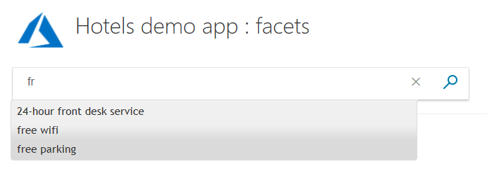

# C# Tutorial: Use facets for navigation and network efficiency - Azure Search

Learn how to improve network efficiency by implementing a facet search. Facet searches are efficient because they are carried out only once for each page load, rather than once for each keystroke. Facets are attributes of the data (such as a pool, wifi, free parking, view, and so on, in our hotels data), and stay relevant for the lifespan of a page. This tutorial builds onto the paging project created in the [C# Tutorial: Search results pagination - Azure Search](tutorial-csharp-paging.md) tutorial.

In this tutorial, you learn how to:
> [!div class="checklist"]
> * Add code for a search of facets
> * Decide when to use a facet search

## Prerequisites

To complete this tutorial, you need to:

Have the [C# Tutorial: Search results pagination - Azure Search](tutorial-csharp-paging.md) project up and running. This can either be your own version, or install it from TBD-Paging-Numbers

## Add code for a search of facets

We will use the numbered paging app you might have completed in the second tutorial as a basis for this sample.

To implement facets, we do not need to change any of the models (the data classes). We do need to add some script to the view, and an action to the controller.

### Examine the model fields marked as IsFacetable

In order for a field to be located in a facet search, it must be tagged with **IsFacetable**.

1. Examine the **Hotel** class. **Category** and **Tags**, for example, are tagged as **IsFacetable**, but **HotelName** and **Description** are not. A facet search will throw an error if a field requested in the search is not tagged appropriately.

```cs
public partial class Hotel
    {
        [System.ComponentModel.DataAnnotations.Key]
        [IsFilterable]
        public string HotelId { get; set; }

        [IsSearchable, IsSortable]
        public string HotelName { get; set; }

        [IsSearchable]
        [Analyzer(AnalyzerName.AsString.EnLucene)]
        public string Description { get; set; }

        [IsSearchable]
        [Analyzer(AnalyzerName.AsString.FrLucene)]
        [JsonProperty("Description_fr")]
        public string DescriptionFr { get; set; }

        [IsSearchable, IsFilterable, IsSortable, IsFacetable]
        public string Category { get; set; }

        [IsSearchable, IsFilterable, IsFacetable]
        public string[] Tags { get; set; }

        [IsFilterable, IsSortable, IsFacetable]
        public bool? ParkingIncluded { get; set; }

        [IsFilterable, IsSortable, IsFacetable]
        public DateTimeOffset? LastRenovationDate { get; set; }

        [IsFilterable, IsSortable, IsFacetable]
        public double? Rating { get; set; }

        public Address Address { get; set; }

        [IsFilterable, IsSortable]
        public GeographyPoint Location { get; set; }

        public Room[] Rooms { get; set; }

        // Added for geospatial searches.
        public double distanceInKilometers { get; set; }
    }
```

### Add an autocomplete script to the view

In order to initiate a facet search, we need to send a query. The following JavaScript added to the index.cshtml file provides the query logic and presentation we need.

1. Locate the **@Html.TextBoxFor(m => m.searchText, ...)** statement and add a unique **id**, similar to the following.

```cs
    <div class="searchBoxForm">
        @Html.TextBoxFor(m => m.searchText, new { @class = "searchBox", @id = "azuresearchfacets" }) <input value="" class="searchBoxSubmit" type="submit">
    </div>
```

2. Now add the following JavaScript (after the closing **&lt;/div&gt;** shown above works fine).

```cs
     <script>
            $(function () {
                $.getJSON("/Home/Facets", function (data) {

                    $("#azuresearchfacets").autocomplete({
                        source: data,
                        minLength: 2,
                        position: {
                            my: "left top",
                            at: "left-23 bottom+10"
                        }
                    });
                });
            });
        </script>
```

Notice that the script calls the **Facets** action in the home controller, without any other parameters, when a minimum length of two typed characters is reached.

### Add references to jquery scripts to the view

The autocomplete function called in the script above is not something we have to write ourselves as it is available in the jquery library. 

1. To access the jquery library, add the following lines to the top of the &lt;head&gt; section of the view file, so the beginning of this section looks similar to the following code.

```cs
<head>
    <meta charset="utf-8">
    <title>Facets demo</title>
    <link href="https://code.jquery.com/ui/1.10.4/themes/ui-lightness/jquery-ui.css"
          rel="stylesheet">
    <script src="https://code.jquery.com/jquery-1.10.2.js"></script>
    <script src="https://code.jquery.com/ui/1.10.4/jquery-ui.js"></script>
```

2. We also need to remove, or comment out, a line referencing jquery in the _Layout.cshtml file (in the **Views/Shared** folder). Locate the following lines, and comment out the first script line as shown. By removing this line we avoid ambiguous references to jquery.

```cs
 <environment include="Development">
        <!-- <script src="~/lib/jquery/dist/jquery.js"></script> -->
        <script src="~/lib/bootstrap/dist/js/bootstrap.js"></script>
        <script src="~/js/site.js" asp-append-version="true"></script>
    </environment>
```

Now we can use the predefined autocomplete jquery functions.

### Add a facet action to the controller

1. The JavaScript in the view triggers the **Facets** action in the controller, so let's add that action to the home controller (say, below the **Page** action).

```cs
        public async Task<ActionResult> Facets()
        {
            // Use static variables to set up the configuration and Azure service and index clients, for efficiency.
            _builder = new ConfigurationBuilder().AddJsonFile("appsettings.json");
            _configuration = _builder.Build();

            _serviceClient = CreateSearchServiceClient(_configuration);
            _indexClient = _serviceClient.Indexes.GetClient("hotels");

            // Set up the facets call in the search parameters.
            SearchParameters sp = new SearchParameters()
            {
                // Search all Tags, but limit the total number to 100, and add up to 20 categories.
                // Field names specified here must be marked as "IsFacetable" in the model, or the search call will throw an exception.
                Facets = new List<string> { "Tags,count:100", "Category,count:20" },
            };

            DocumentSearchResult<Hotel> searchResult = await _indexClient.Documents.SearchAsync<Hotel>("*", sp);

            // Convert the results to two lists that can be displayed in the client.
            List<string> facets = searchResult.Facets["Tags"].Select(x => x.Value.ToString()).ToList();
            List<string> categories = searchResult.Facets["Category"].Select(x => x.Value.ToString()).ToList();

            // Combine and return the lists.
            facets.AddRange(categories);
            return new JsonResult(facets);
        }
```

Notice that we are requesting up to 100 facets from the **Tags** fields and up to 20 from the **Category** fields. The **count** entries are optional, if no count is set the default is 10.

> [!NOTE]
> It is possible to set one or more of the following parameters for each field in a facet search: **count**, **sort**, **interval**, and **values**. Refer to [How to implement faceted navigation in Azure Search](https://docs.microsoft.com/en-us/azure/search/search-faceted-navigation) for more details.

2. If you get syntax errors with the **List&lt;string&gt;** declarations, or **Select** calls, make sure to add the following **using** statements to the top of the file.

```cs
using System.Collections.Generic;
using System.Linq;
```

Note how we need two lists, that are then combined into one, because we asked for two fields to be searched (**Tags** and **Category**). If we had asked for three fields to be searched, we would have to combine three lists into one, and so on.

### Compile and run your project

Now test the program.

1. Try typing "fr" into the search box, which should show several results.

 

2. Now add an "o" to make "fro" and notice the range of options is reduced to one.

3. Type other combinations of two letters and see what appears. Notice that when you type the server is *not* being called. The facets are cached locally when the app is started, and now a call is only made to the server when the user requests a search.

## Decide when to use a facet search

The clear difference between facet searches and other searches such as suggestions and autocompletion, is that the facet search is _designed_ to be only carried out once when a page is loaded, and the other searches are _designed_ to be called as characters are typed, which potentially saves many calls to the server. However, when should this search be used?

Facet searches are best used when:
* The performance of other searches that call the server each keystroke is an issue.
* The facets returned provide the user with a list of options of reasonable length when they type in a few characters.
* The facets returned provide a quick way to access most, or ideally all, of the data available.
* The maximum counts allow most facets to be included. In our code, we set a maximum of 100 facets for **Tags** and 20 facets for **Category**. The maximums set must work well with the size of the data set. If too many potential facets are being cut, then perhaps the search is not as helpful as it should be.

> [!NOTE]
> Although facet searches are designed to be called once per page load, they can of course be called much more often, it depends on your JavaScript. Equally true is that autocompletion/suggestion searches can be carried out less often than once per keystroke. Again this is determined by your JavaScript, not Azure Search. However, facet search is designed to be called only once per page as facets are constructed by Azure Search from the searched documents with this in mind. It is good practice to consider facet searches as a slightly less flexible but more network-efficient form of user-assistance.


## Takeaways

Consider the following takeaways from this project:

* Facets are an efficient way of getting a helpful user experience without the repeated server calls.
* Facets work well if a manageable (to the user) number of results are displayed when they are typing.
* Facets do not work as well if too many need to be displayed (or end up being hidden or cut).
* It is imperative to mark each field as **IsFacetable** if they are to be included in a facet search.
* Facets are an alternative to autocomplete/suggestions, not an addition.

## Next steps

So far we have limited ourselves to text-based searches. In the next tutorial we look at providing additional numerical data in the form of latitude, longitude, and radius. And we look at ordering results (up to this point, results are ordered simply in the order that they are located in the database).

> [!div class="nextstepaction"]
> [C# Tutorial: Add geospatial filters - Azure Search](tutorial-csharp-geospatial-searches.md)