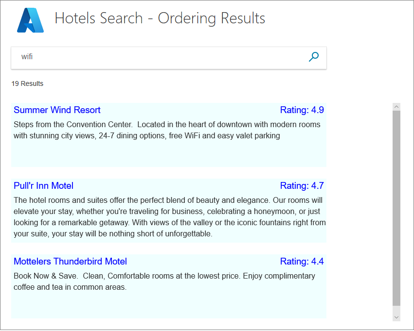
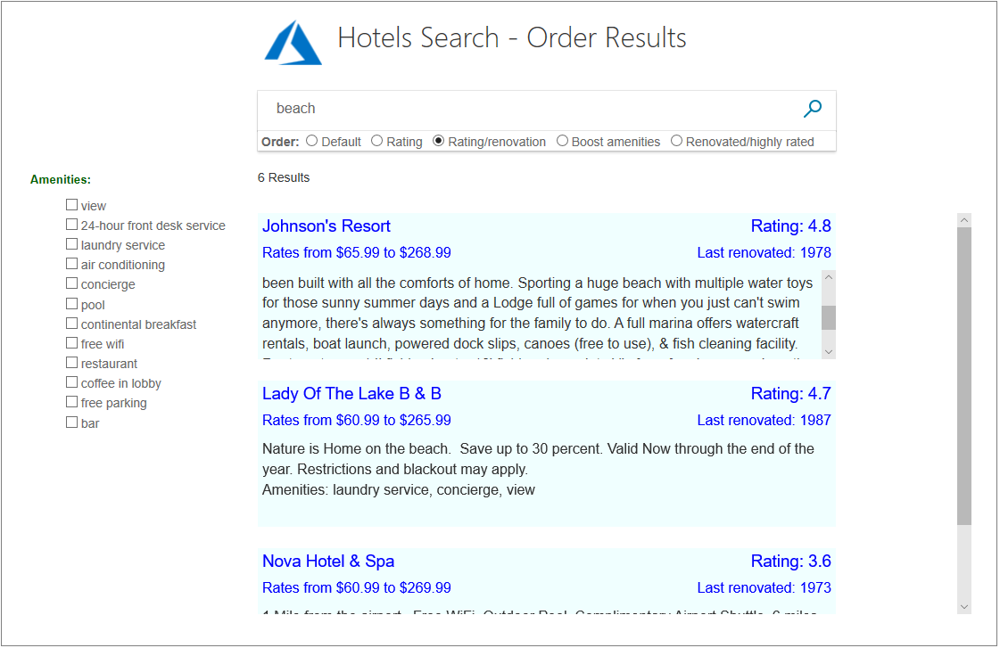
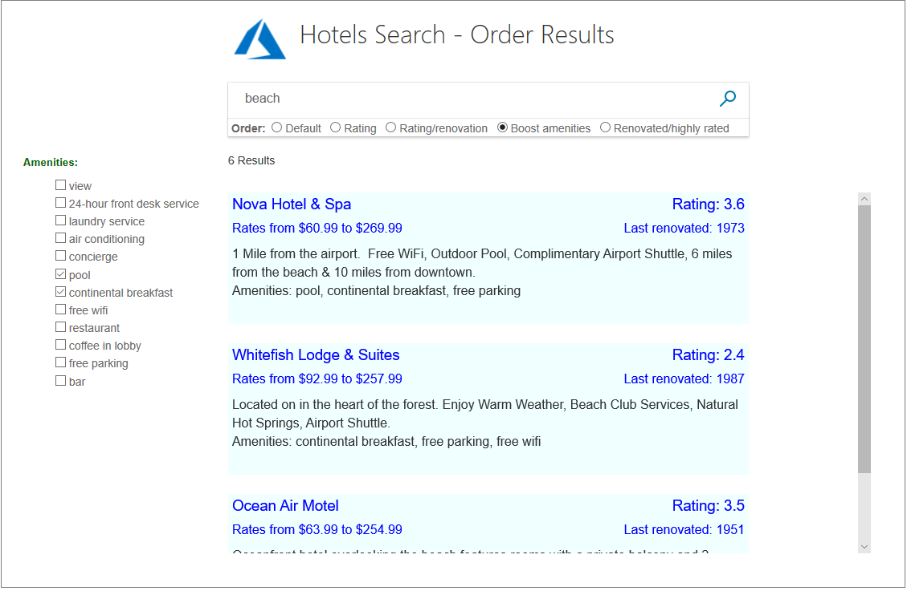

# C# tutorial: Order the results - Azure Search

Up until this point in our series of tutorials, results are returned and displayed in a default order. This can be the order in which the data is located, or possibly a default _scoring profile_ has been defined, which will be used when no ordering parameters are specified. In this tutorial, we will go into how to order results based on a primary property, and then for results that have the same primary property, how to order that selection on a secondary property. As an alternative to ordering based on numerical values, the final example shows how to order based on a custom scoring profile. We will also go a bit deeper into the display of _complex types_.

In order to compare returned results easily, this project builds onto the infinite scrolling project created in the [C# Tutorial: Search results pagination - Azure Search](tutorial-csharp-paging.md) tutorial.

In this tutorial, you learn how to:
> [!div class="checklist"]
> * Order results based on one property
> * Order results based on multiple properties
> * Filter results based on a distance from a geographical point
> * Order results based on a scoring profile

## Prerequisites

To complete this tutorial, you need to:

Have the infinite scrolling version of the [C# Tutorial: Search results pagination - Azure Search](tutorial-csharp-paging.md) project up and running. This project can either be your own version, or install it from GitHub: [Create first app](https://github.com/Azure-Samples/azure-search-dotnet-samples).

## Order results based on one property

When we order results based on one property, say hotel rating, we not only want the ordered results, we also want confirmation that the order is correct. In other words, if we order on rating, we should display the rating in the view.

In this tutorial, we will also add a bit more to the display of results, the cheapest room rate, and the most expensive room rate, for each hotel. As we delve into ordering, we will also be adding values to make sure what we are ordering on is also displayed in the view.

There is no need to modify any of the models to enable ordering. The view and the controller need updated. Start by opening the home controller.

### Add the OrderBy property to the search parameters

1. All that it takes to order results based on a single numerical property, is to set the **OrderBy** parameter to the name of the property. In the **Index(SearchData model)** method, add the following line to the search parameters.

    ```cs
        OrderBy = new[] { "Rating desc" },
    ```

    >[!Note]
    > The default order is ascending, though you can add **asc** to the property to make this clear. Descending order is specified by adding **desc**.

2. Now run the app, and enter any common search term. The results may or may not be in the correct order, as neither you as the developer, not the user, has any easy way of verifying the results!

3. Let's make it clear the results are ordered on rating. First, replace the **box1** and **box2** classes in the hotels.css file with the following classes (these classes are all the new ones we need for this tutorial).

    ```html
    textarea.box1A {
        width: 324px;
        height: 32px;
        border: none;
        background-color: azure;
        font-size: 14pt;
        color: blue;
        padding-left: 5px;
        text-align: left;
    }

    textarea.box1B {
        width: 324px;
        height: 32px;
        border: none;
        background-color: azure;
        font-size: 14pt;
        color: blue;
        text-align: right;
        padding-right: 5px;
    }

    textarea.box2A {
        width: 324px;
        height: 32px;
        border: none;
        background-color: azure;
        font-size: 12pt;
        color: blue;
        padding-left: 5px;
        text-align: left;
    }

    textarea.box2B {
        width: 324px;
        height: 32px;
        border: none;
        background-color: azure;
        font-size: 12pt;
        color: blue;
        text-align: right;
        padding-right: 5px;
    }

    textarea.box3 {
        width: 648px;
        height: 100px;
        border: none;
        background-color: azure;
        font-size: 12pt;
        padding-left: 5px;
        margin-bottom: 24px;
    }
    ```

    >[!Tip]
    >Browsers usually cache css files, and this can lead to an old css file being used, and your edits ignored. A good way round this is to add a query string with a version parameter to the link. For example:
    >
    >```html
    >   <link rel="stylesheet" href="~/css/hotels.css?v1.1" />
    >```
    >
    >Update the version number if you think an old css file is being used by your browser.

4. Add the **Rating** property to the **Select** parameter, in the **Index(SearchData model)** method.

    ```cs
    Select = new[] { "HotelName", "Description", "Rating"},
    ```

5. Open the view (index.cshtml) and replace the rendering loop (**&lt;!-- Show the hotel data. --&gt;**) with the following code.

    ```cs
                <!-- Show the hotel data. -->
                @for (var i = 0; i < Model.resultList.Results.Count; i++)
                {
                    var ratingText = $"Rating: {Model.resultList.Results[i].Document.Rating}";

                    // Display the hotel details.
                    @Html.TextArea($"name{i}", Model.resultList.Results[i].Document.HotelName, new { @class = "box1A" })
                    @Html.TextArea($"rating{i}", ratingText, new { @class = "box1B" })
                    @Html.TextArea($"desc{i}", Model.resultList.Results[i].Document.Description, new { @class = "box3" })
                }
    ```

6. The rating needs to be available both in the first displayed page, and in the subsequent pages that are called via the infinite scroll. For the latter of these two situations, we need to update both the **Next** action in the controller, and the **scrolled** function in the view. Starting with the controller, change the **Next** method to the following code. This code creates and communicates the rating text.

    ```cs
        public async Task<ActionResult> Next(SearchData model)
        {
            // Set the next page setting, and call the Index(model) action.
            model.paging = "next";
            await Index(model);

            // Create an empty list.
            var nextHotels = new List<string>();

            // Add a hotel details to the list.
            for (int n = 0; n < model.resultList.Results.Count; n++)
            {
                var ratingText = $"Rating: {model.resultList.Results[n].Document.Rating}";

                // Add three strings to the list.
                nextHotels.Add(model.resultList.Results[n].Document.HotelName);
                nextHotels.Add(ratingText);
                nextHotels.Add(model.resultList.Results[n].Document.Description);
            }

            // Rather than return a view, return the list of data.
            return new JsonResult(nextHotels);
        }
    ```

7. Now update the **scrolled** function in the view, to display the rating text.

    ```javascript
            <script>
                function scrolled() {
                    if (myDiv.offsetHeight + myDiv.scrollTop >= myDiv.scrollHeight) {
                        $.getJSON("/Home/Next", function (data) {
                            var div = document.getElementById('myDiv');

                            // Append the returned data to the current list of hotels.
                            for (var i = 0; i < data.length; i += 3) {
                                div.innerHTML += '\n<textarea class="box1A">' + data[i] + '</textarea>';
                                div.innerHTML += '\n<textarea class="box1B">' + data[i + 1] + '</textarea>';
                                div.innerHTML += '\n<textarea class="box3">' + data[i + 2] + '</textarea>';
                            }
                        });
                    }
                }
            </script>

    ```

8. Now run the app again. Search on any common term, such as "wifi", and verify that the results are ordered by descending order of hotel rating.

    

    You will notice that several hotels have an identical rating, and so their appearance in the display is again the order in which the data is found, which is arbitrary.

    Before we look into adding a second level of ordering, let's add some code to display the range of room rates. We are adding this code to both show extracting data from a _complex type_, and also so we can discuss ordering results based on price (cheapest first perhaps).

### Add the range of room rates to the view

1. Add properties containing the cheapest and most expensive room rate to the Hotel.cs model.

    ```cs
        // Room rate range
        public double cheapest { get; set; }
        public double expensive { get; set; }
    ```

2. Calculate the room rates at the end of the **Index(SearchData model)** action, in the home controller. Add the calculations after the storing of temporary data.

    ```cs
                // Ensure TempData is stored for the next call.
                TempData["page"] = page;
                TempData["searchfor"] = model.searchText;

                // Calculate the room rate ranges.
                for (int n = 0; n < model.resultList.Results.Count; n++)
                {
                    // Calculate room rates.
                    var cheapest = 0d;
                    var expensive = 0d;

                    for (var r = 0; r < model.resultList.Results[n].Document.Rooms.Length; r++)
                    {
                        var rate = model.resultList.Results[n].Document.Rooms[r].BaseRate;
                        if (rate < cheapest || cheapest == 0)
                        {
                            cheapest = (double)rate;
                        }
                        if (rate > expensive)
                        {
                            expensive = (double)rate;
                        }
                    }
                    model.resultList.Results[n].Document.cheapest = cheapest;
                    model.resultList.Results[n].Document.expensive = expensive;
                }
    ```

3. Add the **Rooms** property to the **Select** parameter in the **Index(SearchData model)** action method of the controller.

    ```cs
     Select = new[] { "HotelName", "Description", "Rating", "Rooms" },
    ```

4. Change the rendering loop in the view to display the rate range for the first page of results.

    ```cs
                <!-- Show the hotel data. -->
                @for (var i = 0; i < Model.resultList.Results.Count; i++)
                {
                    var rateText = $"Rates from ${Model.resultList.Results[i].Document.cheapest} to ${Model.resultList.Results[i].Document.expensive}";
                    var ratingText = $"Rating: {Model.resultList.Results[i].Document.Rating}";

                    // Display the hotel details.
                    @Html.TextArea($"name{i}", Model.resultList.Results[i].Document.HotelName, new { @class = "box1A" })
                    @Html.TextArea($"rating{i}", ratingText, new { @class = "box1B" })
                    @Html.TextArea($"rates{i}" , rateText, new { @class = "box2A" })
                    @Html.TextArea($"desc{i}", Model.resultList.Results[i].Document.Description, new { @class = "box3" })
                }
    ```

5. Change the **Next** method in the home controller to communicate the rate range, for subsequent pages of results.

    ```cs
        public async Task<ActionResult> Next(SearchData model)
        {
            // Set the next page setting, and call the Index(model) action.
            model.paging = "next";
            await Index(model);

            // Create an empty list.
            var nextHotels = new List<string>();

            // Add a hotel details to the list.
            for (int n = 0; n < model.resultList.Results.Count; n++)
            {
                var ratingText = $"Rating: {model.resultList.Results[n].Document.Rating}";
                var rateText = $"Rates from ${model.resultList.Results[n].Document.cheapest} to ${model.resultList.Results[n].Document.expensive}";

                // Add strings to the list.
                nextHotels.Add(model.resultList.Results[n].Document.HotelName);
                nextHotels.Add(ratingText);
                nextHotels.Add(rateText);
                nextHotels.Add(model.resultList.Results[n].Document.Description);
            }

            // Rather than return a view, return the list of data.
            return new JsonResult(nextHotels);
        }
    ```

6. Update the **scrolled** function in the view, to handle the room rates text.

    ```javascript
            <script>
                function scrolled() {
                    if (myDiv.offsetHeight + myDiv.scrollTop >= myDiv.scrollHeight) {
                        $.getJSON("/Home/Next", function (data) {
                            var div = document.getElementById('myDiv');

                            // Append the returned data to the current list of hotels.
                            for (var i = 0; i < data.length; i += 4) {
                                div.innerHTML += '\n<textarea class="box1A">' + data[i] + '</textarea>';
                                div.innerHTML += '\n<textarea class="box1B">' + data[i + 1] + '</textarea>';
                                div.innerHTML += '\n<textarea class="box2A">' + data[i + 2] + '</textarea>';
                                div.innerHTML += '\n<textarea class="box3">' + data[i + 4] + '</textarea>';
                            }
                        });
                    }
                }
            </script>
    ```

7. Run the app, and verify the room rate ranges are displayed.

    

The **OrderBy** property of the search parameters will not accept an entry such as **Rooms.BaseRate** to provide the cheapest room rate, even if the rooms were already sorted on rate (which they are not). In order to display hotels in the sample data set, ordered on room rate, you would have to sort the results in your home controller, and send these results to the view in the desired order.

## Order results based on multiple values

The question now is how to differentiate between hotels with the same rating. One good way would be to order on the basis of the last time the hotel was renovated. In other words, the more recently the hotel was renovated, the higher the hotel appears in the results.

1. To add a second level of ordering, change the **OrderBy** and **Select** properties in the **Index(SearchData model)** method to include the **LastRenovationDate** property.

    ```cs
    OrderBy = new[] { "Rating desc", "LastRenovationDate desc" },
    Select = new[] { "HotelName", "Description", "Rating", "Rooms", "LastRenovationDate" },
    ```

    >[!Tip]
    >Any number of properties can be entered in the **OrderBy** list. If hotels had the same rating and renovation date, a third property could be entered to differentiate between them.

2. Again, we need to see the renovation date in the view, just to be certain the ordering is correct. For such a thing as a renovation, probably just the year is required. Change the rendering loop in the view to the following code.

    ```cs
                <!-- Show the hotel data. -->
                @for (var i = 0; i < Model.resultList.Results.Count; i++)
                {
                    var rateText = $"Rates from ${Model.resultList.Results[i].Document.cheapest} to ${Model.resultList.Results[i].Document.expensive}";
                    var lastRenovatedText = $"Last renovated: { Model.resultList.Results[i].Document.LastRenovationDate.Value.Year}";
                    var ratingText = $"Rating: {Model.resultList.Results[i].Document.Rating}";

                    // Display the hotel details.
                    @Html.TextArea($"name{i}", Model.resultList.Results[i].Document.HotelName, new { @class = "box1A" })
                    @Html.TextArea($"rating{i}", ratingText, new { @class = "box1B" })
                    @Html.TextArea($"rates{i}" , rateText, new { @class = "box2A" })
                    @Html.TextArea($"renovation{i}", lastRenovatedText, new { @class = "box2B" })
                    @Html.TextArea($"desc{i}", Model.resultList.Results[i].Document.Description, new { @class = "box3" })
                }
    ```

3. Change the **Next** method in the home controller, to forward the year component of the last renovation date.

    ```cs
        public async Task<ActionResult> Next(SearchData model)
        {
            // Set the next page setting, and call the Index(model) action.
            model.paging = "next";
            await Index(model);

            // Create an empty list.
            var nextHotels = new List<string>();

            // Add a hotel details to the list.
            for (int n = 0; n < model.resultList.Results.Count; n++)
            {
                var ratingText = $"Rating: {model.resultList.Results[n].Document.Rating}";
                var rateText = $"Rates from ${model.resultList.Results[n].Document.cheapest} to ${model.resultList.Results[n].Document.expensive}";
                var lastRenovatedText = $"Last renovated: {model.resultList.Results[n].Document.LastRenovationDate.Value.Year}";

                // Add strings to the list.
                nextHotels.Add(model.resultList.Results[n].Document.HotelName);
                nextHotels.Add(ratingText);
                nextHotels.Add(rateText);
                nextHotels.Add(lastRenovatedText);
                nextHotels.Add(model.resultList.Results[n].Document.Description);
            }

            // Rather than return a view, return the list of data.
            return new JsonResult(nextHotels);
        }
    ```

4. Change the **scrolled** function in the view to display the renovation text.

    ```javascript
            <script>
                function scrolled() {
                    if (myDiv.offsetHeight + myDiv.scrollTop >= myDiv.scrollHeight) {
                        $.getJSON("/Home/Next", function (data) {
                            var div = document.getElementById('myDiv');

                            // Append the returned data to the current list of hotels.
                            for (var i = 0; i < data.length; i += 5) {
                                div.innerHTML += '\n<textarea class="box1A">' + data[i] + '</textarea>';
                                div.innerHTML += '\n<textarea class="box1B">' + data[i + 1] + '</textarea>';
                                div.innerHTML += '\n<textarea class="box2A">' + data[i + 2] + '</textarea>';
                                div.innerHTML += '\n<textarea class="box2B">' + data[i + 3] + '</textarea>';
                                div.innerHTML += '\n<textarea class="box3">' + data[i + 4] + '</textarea>';
                            }
                        });
                    }
                }
            </script>
    ```

5. Run the app. Search on a common term, such as "pool" or "view", and verify that hotels with the same rating are now displayed in descending order of renovation date.

    

## Filter results based on a distance from a geographical point

Rating, and renovation date, are examples of properties that are best displayed in a descending order. An alphabetical listing would be an example of a good use of ascending order (for example, if there was just one **OrderBy** property, and it was set to **HotelName** then an alphabetical order would be displayed). However, for our sample data, distance from a geographical point would be more appropriate.

To display results based on geographical distance, several steps are required.

1. Filter out all hotels that are outside of a specified radius from the given point, by entering a filter with longitude, latitude, and radius parameters. Longitude is given first to the POINT function. Radius is in kilometers.

    ```cs
        // "Location" must match the field name in the Hotel class.
        // Distance (the radius) is in kilometers.
        // Point order is Longitude then Latitude.
        Filter = $"geo.distance(Location, geography'POINT({model.lon} {model.lat})') le {model.radius}",
    ```

2. The above filter does _not_ order the results based on distance, it just removes the outliers. To order the results, enter an **OrderBy** setting that specifies the geoDistance method.

    ```cs
    OrderBy = new[] { $"geo.distance(Location, geography'POINT({model.lon} {model.lat})') asc" },
    ```

3. Although the results were returned by Azure Search using a distance filter, the calculated distance between the data and the specified point is _not_ returned. Recalculate this value in the view, or controller, if you want to display it in the results.

    The following code will calculate the distance between two lat/lon points.

    ```cs
        const double EarthRadius = 6371;

        public static double Degrees2Radians(double deg)
        {
            return deg * Math.PI / 180;
        }

        public static double DistanceInKm( double lat1,  double lon1, double lat2, double lon2)
        {
            double dlon = Degrees2Radians(lon2 - lon1);
            double dlat = Degrees2Radians(lat2 - lat1);

            double a = (Math.Sin(dlat / 2) * Math.Sin(dlat / 2)) + Math.Cos(Degrees2Radians(lat1)) * Math.Cos(Degrees2Radians(lat2)) * (Math.Sin(dlon / 2) * Math.Sin(dlon / 2));
            double angle = 2 * Math.Atan2(Math.Sqrt(a), Math.Sqrt(1 - a));
            return angle * EarthRadius;
        }
    ```

4. Now you have to tie these concepts together. However, these code snippets are as far as our tutorial goes, building a map-based app is left as an exercise for the reader. To take this example further, consider either entering a city name with a radius, or locating a point on a map, and selecting a radius. To investigate these options further, see the following resources:

* [Azure Maps Documentation](https://docs.microsoft.com/azure/azure-maps/)
* [Find an address using the Azure Maps search service](https://docs.microsoft.com/azure/azure-maps/how-to-search-for-address)

## Order results based on a scoring profile

The examples given in the tutorial so far show how to order on numerical values (rating, renovation date, geographical distance), providing an _exact_ process of ordering. However, some searches and some data do not lend themselves to such an easy comparison between two data elements. Azure Search includes the concept of _scoring_. _Scoring profiles_ can be specified for a set of data that can be used to provide more complex and qualitative comparisons, that should be most valuable when, say, comparing text-based data to decide which should be displayed first.

Scoring profiles are not defined by users, but typically by administrators of a data set. Several scoring profiles have been set up on the hotels data. Let's look at how a scoring profile is defined, then try writing code to search on them.

### How scoring profiles are defined

Let's look at three examples of scoring profiles, and consider how each _should_ affect the results order. As an app developer, you do not write these profiles, they are written by the data administrator, however, it is helpful to look at the syntax.

1. This is the default scoring profile for the hotels data set, used when you do not specify any **OrderBy** or **ScoringProfile** parameter. This profile boosts the _score_ for a hotel if the search text is present in the hotel name, description, or list of tags (amenities). Notice how the weights of the scoring favor certain fields. If the search text appears in another field, not listed below, it will have a weight of 1. Obviously, the higher the score, the earlier a result appears in the view.

     ```cs
    {
            "name": "boostByField",
            "text": {
                "weights": {
                    "HotelName": 2,
                    "Description": 1.5,
                    "Description_fr": 1.5,
                    "Tags": 3
                }
            }
        }

    ```

2. The following scoring profile boosts the score significantly, if a supplied parameter includes one or more of the list of tags (which we are calling "amenities"). The key point of this profile is that a parameter _must_ be supplied, containing text. If the parameter is empty, or is not supplied, an error will be thrown.
 
    ```cs
            {
            "name": "boostAmenities",
            "functions": [
                {
                    "type": "tag",
                    "fieldName": "Tags",
                    "boost": 5,
                    "tag": {
                        "tagsParameter": "amenities"
                    }
                }
            ]
        }
    ```

3. In this third example, the rating gives a significant boost to the score. The last renovated date will also boost the score, but only if that data falls within 730 days (2 years) of the current date.

    ```cs
            {
            "name": "renovatedAndHighlyRated",
            "functions": [
                {
                    "type": "magnitude",
                    "fieldName": "Rating",
                    "boost": 20,
                    "interpolation": "linear",
                    "magnitude": {
                        "boostingRangeStart": 0,
                        "boostingRangeEnd": 5,
                        "constantBoostBeyondRange": false
                    }
                },
                {
                    "type": "freshness",
                    "fieldName": "LastRenovationDate",
                    "boost": 10,
                    "interpolation": "quadratic",
                    "freshness": {
                        "boostingDuration": "P730D"
                    }
                }
            ]
        }

    ```

    Now, let us see if these profiles work as we think they should!

### Add code to the view to compare profiles

1. Open the index.cshtml file, and replace the &lt;body&gt; section with the following code.

    ```cs
    <body>

    @using (Html.BeginForm("Index", "Home", FormMethod.Post))
    {
        <table>
            <tr>
                <td></td>
                <td>
                    <h1 class="sampleTitle">
                        
                        Hotels Search - Order Results
                    </h1>
                </td>
            </tr>
            <tr>
                <td></td>
                <td>
                    <!-- Display the search text box, with the search icon to the right of it. -->
                    <div class="searchBoxForm">
                        @Html.TextBoxFor(m => m.searchText, new { @class = "searchBox" }) <input class="searchBoxSubmit" type="submit" value="">
                    </div>

                    <div class="searchBoxForm">
                        <b>&nbsp;Order:&nbsp;</b>
                        @Html.RadioButtonFor(m => m.scoring, "Default") Default&nbsp;&nbsp;
                        @Html.RadioButtonFor(m => m.scoring, "RatingRenovation") By numerical Rating&nbsp;&nbsp;
                        @Html.RadioButtonFor(m => m.scoring, "boostAmenities") By Amenities&nbsp;&nbsp;
                        @Html.RadioButtonFor(m => m.scoring, "renovatedAndHighlyRated") By Renovated date/Rating profile&nbsp;&nbsp;
                    </div>
                </td>
            </tr>

            <tr>
                <td valign="top">
                    <div id="facetplace" class="facetchecks">

                        @if (Model != null && Model.facetText != null)
                        {
                            <h5 class="facetheader">Amenities:</h5>
                            <ul class="facetlist">
                                @for (var c = 0; c < Model.facetText.Length; c++)
                                {
                                    <li> @Html.CheckBoxFor(m => m.facetOn[c], new { @id = "check" + c.ToString() }) @Model.facetText[c] </li>
                                }

                            </ul>
                        }
                    </div>
                </td>
                <td>
                    @if (Model != null && Model.resultList != null)
                    {
                        // Show the total result count.
                        <p class="sampleText">
                            @Html.DisplayFor(m => m.resultList.Count) Results <br />
                        </p>

                        <div id="myDiv" style="width: 800px; height: 450px; overflow-y: scroll;" onscroll="scrolled()">

                            <!-- Show the hotel data. -->
                            @for (var i = 0; i < Model.resultList.Results.Count; i++)
                            {
                                var rateText = $"Rates from ${Model.resultList.Results[i].Document.cheapest} to ${Model.resultList.Results[i].Document.expensive}";
                                var lastRenovatedText = $"Last renovated: { Model.resultList.Results[i].Document.LastRenovationDate.Value.Year}";
                                var ratingText = $"Rating: {Model.resultList.Results[i].Document.Rating}";

                                string amenities = string.Join(", ", Model.resultList.Results[i].Document.Tags);
                                string fullDescription = Model.resultList.Results[i].Document.Description;
                                fullDescription += $"\nAmenities: {amenities}";

                                // Display the hotel details.
                                @Html.TextArea($"name{i}", Model.resultList.Results[i].Document.HotelName, new { @class = "box1A" })
                                @Html.TextArea($"rating{i}", ratingText, new { @class = "box1B" })
                                @Html.TextArea($"rates{i}", rateText, new { @class = "box2A" })
                                @Html.TextArea($"renovation{i}", lastRenovatedText, new { @class = "box2B" })
                                @Html.TextArea($"desc{i}", fullDescription, new { @class = "box3" })
                            }
                        </div>

                        <script>
                            function scrolled() {
                                if (myDiv.offsetHeight + myDiv.scrollTop >= myDiv.scrollHeight) {
                                    $.getJSON("/Home/Next", function (data) {
                                        var div = document.getElementById('myDiv');

                                        // Append the returned data to the current list of hotels.
                                        for (var i = 0; i < data.length; i += 5) {
                                            div.innerHTML += '\n<textarea class="box1A">' + data[i] + '</textarea>';
                                            div.innerHTML += '<textarea class="box1B">' + data[i + 1] + '</textarea>';
                                            div.innerHTML += '\n<textarea class="box2A">' + data[i + 2] + '</textarea>';
                                            div.innerHTML += '<textarea class="box2B">' + data[i + 3] + '</textarea>';
                                            div.innerHTML += '\n<textarea class="box3">' + data[i + 4] + '</textarea>';
                                        }
                                    });
                                }
                            }
                        </script>
                    }
                </td>
            </tr>
        </table>
    }
    </body>
    ```

2. Open the SearchData.cs file, and replace the **SearchData** class with the following code.

    ```cs
    public class SearchData
    {
        public SearchData()
        {
        }

        // Constructor to initialize the list of facets sent from the controller.
        public SearchData(List<string> facets)
        {
            facetText = new string[facets.Count];

            for (int i = 0; i < facets.Count; i++)
            {
                facetText[i] = facets[i];
            }
        }

        // Array to hold the text for each amenity.
        public string[] facetText { get; set; }

        // Array to hold the setting for each amenitity.
        public bool[] facetOn { get; set; }

        // The text to search for.
        public string searchText { get; set; }

        // Record if the next page is requested.
        public string paging { get; set; }

        // The list of results.
        public DocumentSearchResult<Hotel> resultList;

        public string scoring { get; set; }       
    }
    ```

3. Open the hotels.css file, and add the following HTML classes.

    ```html
    .facetlist {
        list-style: none;
    }
    
    .facetchecks {
        width: 250px;
        display: normal;
        color: #666;
        margin: 10px;
        padding: 5px;
    }

    .facetheader {
        font-size: 10pt;
        font-weight: bold;
        color: darkgreen;
    }
    ```

### Add code to the controller to specify a scoring profile

1. Open the home controller file. Add the following **using** statement (to aid with creating lists).

    ```cs
    using System.Linq;
    ```

2.  For this example, we need the initial call to **Index** to do a bit more than just return the initial view. The method now searches for up to 20 amenities to display in the view.

    ```cs
        public async Task<ActionResult> Index()
        {
            InitSearch();

            // Set up the facets call in the search parameters.
            SearchParameters sp = new SearchParameters()
            {
                // Search for up to 20 amenities.
                Facets = new List<string> { "Tags,count:20" },
            };

            DocumentSearchResult<Hotel> searchResult = await _indexClient.Documents.SearchAsync<Hotel>("*", sp);

            // Convert the results to a list that can be displayed in the client.
            List<string> facets = searchResult.Facets["Tags"].Select(x => x.Value.ToString()).ToList();

            // Initiate a model with a list of facets for the first view.
            SearchData model = new SearchData(facets);

            // Save the facet text for the next view.
            SaveFacets(model, false);

            // Render the view including the facets.
            return View(model);
        }
    ```

3. We need two private methods to save the facets to temporary storage, and to recover them from temporary storage and populate a model.

    ```cs
        // Save the facet text to temporary storage, optionally saving the state of the check boxes.
        private void SaveFacets(SearchData model, bool saveChecks = false)
        {
            for (int i = 0; i < model.facetText.Length; i++)
            {
                TempData["facet" + i.ToString()] = model.facetText[i];
                if (saveChecks)
                {
                    TempData["faceton" + i.ToString()] = model.facetOn[i];
                }
            }
            TempData["facetcount"] = model.facetText.Length;
        }

        // Recover the facet text to a model, optionally recoving the state of the check boxes.
        private void RecoverFacets(SearchData model, bool recoverChecks = false)
        {
            // Create arrays of the appropriate length.
            model.facetText = new string[(int)TempData["facetcount"]];
            if (recoverChecks)
            {
                model.facetOn = new bool[(int)TempData["facetcount"]];
            }

            for (int i = 0; i < (int)TempData["facetcount"]; i++)
            {
                model.facetText[i] = TempData["facet" + i.ToString()].ToString();
                if (recoverChecks)
                {
                    model.facetOn[i] = (bool)TempData["faceton" + i.ToString()];
                }
            }
        }
    ```

4. We need to set the **OrderBy** and **ScoringProfile** parameters as necessary. Replace the existing **Index(SearchData model)** method, with the following.

    ```cs
        public async Task<ActionResult> Index(SearchData model)
        {
            try
            {
                InitSearch();

                int page;

                if (model.paging != null && model.paging == "next")
                {
                    // Recover the facet text, and the facet check box settings.
                    RecoverFacets(model, true);

                    // Increment the page.
                    page = (int)TempData["page"] + 1;

                    // Recover the search text.
                    model.searchText = TempData["searchfor"].ToString();
                }
                else
                {
                    // First search with text. 
                    // Recover the facet text, but ignore the check box settings, and use the current model settings.
                    RecoverFacets(model,false);

                    // First call. Check for valid text input, and valid scoring profile.
                    if (model.searchText == null)
                    {
                        model.searchText = "";
                    }
                    if (model.scoring == null)
                    {
                        model.scoring = "Default";
                    }
                    page = 0;
                }

                // Set empty defaults for ordering and scoring parameters.
                var orderby = new List<string>();
                string profile = "";
                var scoringParams = new List<ScoringParameter>();

                // Set the ordering based on the user's radio button selection.
                switch (model.scoring)
                {
                    case "RatingRenovation":
                        orderby.Add("Rating desc");
                        orderby.Add("LastRenovationDate desc");
                        break;

                    case "boostAmenities":
                        {
                            profile = model.scoring;
                            var setAmenities = new List<string>();

                            // Create a string list of amenities that have been clicked.
                            for (int a = 0; a < model.facetOn.Length; a++)
                            {
                                if (model.facetOn[a])
                                {
                                    setAmenities.Add(model.facetText[a]);
                                }
                            }
                            if (setAmenities.Count > 0)
                            {
                                // Only set scoring parameters if there are any.
                                var sp = new ScoringParameter("amenities", setAmenities);
                                scoringParams.Add(sp);
                            }
                            else
                            {
                                // No amenities selected, so set profile back to default.
                                profile = "";
                            }
                        }
                        break;

                    case "renovatedAndHighlyRated":
                        profile = model.scoring;
                        break;

                    default:
                        break;
                }

                // Setup the search parameters.
                var parameters = new SearchParameters
                {
                    // Set the ordering/scoring parameters.
                    OrderBy = orderby,
                    ScoringProfile = profile,
                    ScoringParameters = scoringParams,

                    // Select the data properties to be returned.
                    Select = new[] { "HotelName", "Description", "Tags", "Rooms", "Rating", "LastRenovationDate" },
                    SearchMode = SearchMode.All,

                    // Skip past results that have already been returned.
                    Skip = page * GlobalVariables.ResultsPerPage,

                    // Take only the next page worth of results.
                    Top = GlobalVariables.ResultsPerPage,

                    // Include the total number of results.
                    IncludeTotalResultCount = true,
                };

                // For efficiency, the search call should be asynchronous, so use SearchAsync rather than Search.
                model.resultList = await _indexClient.Documents.SearchAsync<Hotel>(model.searchText, parameters);

                // Ensure TempData is stored for the next call.
                TempData["page"] = page;
                TempData["searchfor"] = model.searchText;
                TempData["scoring"] = model.scoring;
                SaveFacets(model,true);

                // Calculate the room rate ranges.
                for (int n = 0; n < model.resultList.Results.Count; n++)
                {
                    var cheapest = 0d;
                    var expensive = 0d;

                    for (var r = 0; r < model.resultList.Results[n].Document.Rooms.Length; r++)
                    {
                        var rate = model.resultList.Results[n].Document.Rooms[r].BaseRate;
                        if (rate < cheapest || cheapest == 0)
                        {
                            cheapest = (double)rate;
                        }
                        if (rate > expensive)
                        {
                            expensive = (double)rate;
                        }
                    }
                    model.resultList.Results[n].Document.cheapest = cheapest;
                    model.resultList.Results[n].Document.expensive = expensive;
                }
            }
            catch
            {
                return View("Error", new ErrorViewModel { RequestId = "1" });
            }
            return View("Index", model);
        }
    ```

    Read through the comments for each of the **switch** selections.

5. We do not need to make any changes to the **Next** action, if you completed the additional code for the previous section on ordering based on multiple properties.

### Run and test the app

1. Run the app. You should see a full set of amenities in the view.

2. For ordering, selecting "By numerical Rating" will give you the numerical ordering you have already implemented in this tutorial, with renovation date deciding among hotels of equal rating.



3. Now try the "By amenities" profile. Make various selections of amenities, and verify that hotels with those amenities are promoted up the results list.



4. Try the "By Renovated date/Rating profile" to see if you get what you expect. Only recently renovated hotels should get a _freshness_ boost.

### Resources

For more information, see the following [Add scoring profiles to an Azure Search index](https://docs.microsoft.com/azure/search/index-add-scoring-profiles).

## Takeaways

Consider the following takeaways from this project:

* Users will expect search results to be ordered, most relevant first.
* Data needs structured so that ordering is easy. We were not able to sort on "cheapest" first easily, as the data is not structured to enable ordering to be done without additional code.
* There can be many levels to ordering, to differentiate between results that have the same value at a higher level of ordering.
* It is natural for some results to be ordered in ascending order (say, distance away from a point), and some in descending order (say, guest's rating).
* Scoring profiles can be defined when numerical comparisons are not available, or not smart enough, for a data set. Scoring each result will help to order and display the results intelligently.

## Next steps

You have completed this series of C# tutorials - you should have gained valuable knowledge of the Azure Search APIs.

For further reference and tutorials, consider browsing [Microsoft Learn](https://docs.microsoft.com/learn/browse/?products=azure), or the other tutorials in the [Azure Search Documentation](https://docs.microsoft.com/azure/search/).
