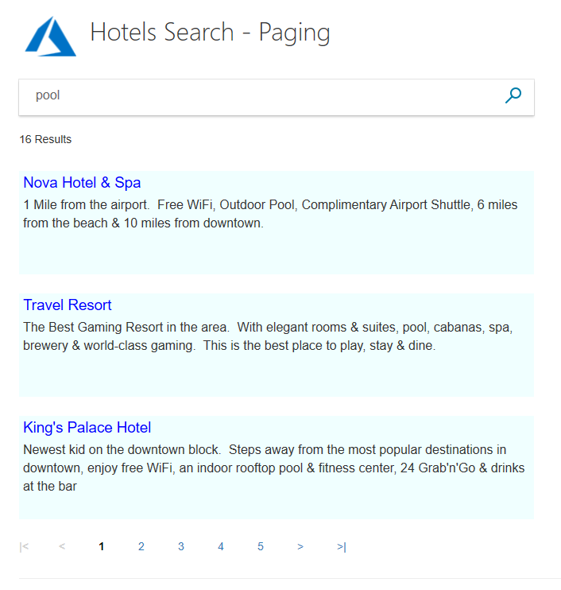
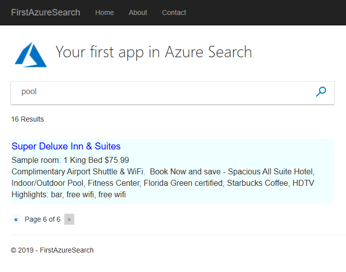
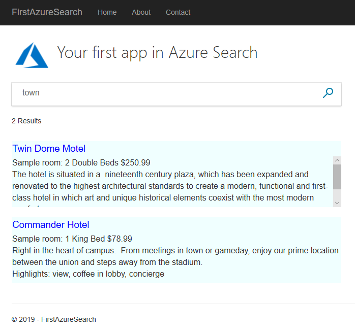
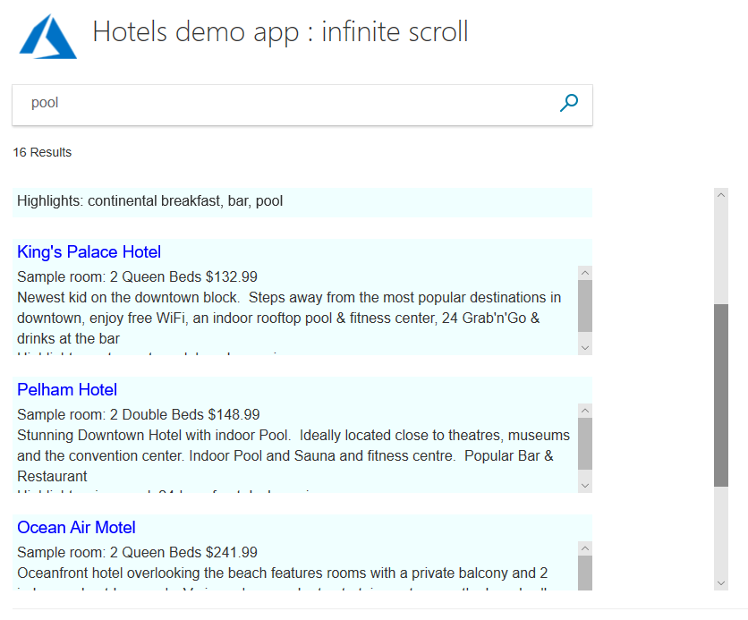

# Tutorial: Add paging to search results using the .NET SDK

Learn how to implement two different paging systems, the first based on page numbers and the second on infinite scrolling. Both systems of paging are widely used, and selecting the right one depends on the user experience you would like with the results. This tutorial builds the paging systems into the project created in the [C# Tutorial: Create your first app - Azure Cognitive Search](tutorial-csharp-create-first-app.md) tutorial.

In this tutorial, you learn how to:
> [!div class="checklist"]
> * Extend your app with numbered paging
> * Extend your app with infinite scrolling

## Prerequisites

To complete this tutorial, you need to:

Have the [C# Tutorial: Create your first app - Azure Cognitive Search](tutorial-csharp-create-first-app.md) project up and running. This project can either be your own version, or install it from GitHub: [Create first app](https://github.com/Azure-Samples/azure-search-dotnet-samples).

## Extend your app with numbered paging

Numbered paging is the paging system of choice of the main internet search engines and most other search websites. Numbered paging typically includes a "next" and "previous" option in addition to a range of actual page numbers. Also a "first page" and "last page" option might also be available. These options certainly give a user control over navigating through page-based results.

We will add a system that includes first, previous, next, and last options, along with page numbers that do not start from 1, but instead surround the current page the user is on (so, for example, if the user is looking at page 10, perhaps page numbers 8, 9, 10, 11, and 12 are displayed).

The system will be flexible enough to allow the number of visible page numbers to be set in a global variable.

The system will treat the left-most and right-most page number buttons as special, meaning they will trigger changing the range of page numbers displayed. For example, if page numbers 8, 9, 10, 11 and 12 are displayed, and the user clicks on 8, then the range of page numbers displayed changes to 6, 7, 8, 9, and 10. And there is a similar shift to the right if they selected 12.

### Add paging fields to the model

Have the basic search page solution open.

1. Open the SearchData.cs model file.

2. First add some global variables. In MVC, global variables are declared in their own static class. **ResultsPerPage** sets the number of results per page. **MaxPageRange** determines the number of visible page numbers on the view. **PageRangeDelta** determines how many pages left or right the page range should be shifted, when the left-most or right-most page number is selected. Typically this latter number is around half of **MaxPageRange**. Add the following code into the namespace.

    ```cs
    public static class GlobalVariables
    {
        public static int ResultsPerPage
        {
            get
            {
                return 3;
            }
        }
        public static int MaxPageRange
        {
            get
            {
                return 5;
            }
        }

        public static int PageRangeDelta
        {
            get
            {
                return 2;
            }
        }
    }
    ```

    >[!Tip]
    >If you are running this project on a device with a smaller screen, such as a laptop, then consider changing **ResultsPerPage** to 2.

3. Add paging properties to the **SearchData** class, say, after the **searchText** property.

    ```cs
        // The current page being displayed.
        public int currentPage { get; set; }

        // The total number of pages of results.
        public int pageCount { get; set; }

        // The left-most page number to display.
        public int leftMostPage { get; set; }

        // The number of page numbers to display - which can be less than MaxPageRange towards the end of the results.
        public int pageRange { get; set; }

        // Used when page numbers, or next or prev buttons, have been selected.
        public string paging { get; set; }
    ```

### Add a table of paging options to the view

1. Open the index.cshtml file, and add the following code right before the closing &lt;/body&gt; tag. This new code presents a table of paging options: first, previous, 1, 2, 3, 4, 5, next, last.

    ```cs
    @if (Model != null && Model.pageCount > 1)
    {
    // If there is more than one page of results, show the paging buttons.
    <table>
        <tr>
            <td>
                @if (Model.currentPage > 0)
                {
                    <p class="pageButton">
                        @Html.ActionLink("|<", "Page", "Home", new { paging = "0" }, null)
                    </p>
                }
                else
                {
                    <p class="pageButtonDisabled">|&lt;</p>
                }
            </td>

            <td>
                @if (Model.currentPage > 0)
                {
                    <p class="pageButton">
                        @Html.ActionLink("<", "Page", "Home", new { paging = "prev" }, null)
                    </p>
                }
                else
                {
                    <p class="pageButtonDisabled">&lt;</p>
                }
            </td>

            @for (var pn = Model.leftMostPage; pn < Model.leftMostPage + Model.pageRange; pn++)
            {
                <td>
                    @if (Model.currentPage == pn)
                    {
                        // Convert displayed page numbers to 1-based and not 0-based.
                        <p class="pageSelected">@(pn + 1)</p>
                    }
                    else
                    {
                        <p class="pageButton">
                            @Html.ActionLink((pn + 1).ToString(), "Page", "Home", new { paging = @pn }, null)
                        </p>
                    }
                </td>
            }

            <td>
                @if (Model.currentPage < Model.pageCount - 1)
                {
                    <p class="pageButton">
                        @Html.ActionLink(">", "Page", "Home", new { paging = "next" }, null)
                    </p>
                }
                else
                {
                    <p class="pageButtonDisabled">&gt;</p>
                }
            </td>

            <td>
                @if (Model.currentPage < Model.pageCount - 1)
                {
                    <p class="pageButton">
                        @Html.ActionLink(">|", "Page", "Home", new { paging = Model.pageCount - 1 }, null)
                    </p>
                }
                else
                {
                    <p class="pageButtonDisabled">&gt;|</p>
                }
            </td>
        </tr>
    </table>
    }
    ```

    We use an HTML table to align things neatly. However all the action comes from the @Html.ActionLink statements, each calling the controller with a **new** model created with different entries to the **paging** property we added earlier.

    The first and last page options do not send strings such as "first" and "last", but instead send the correct page numbers.

2. Add some paging classes to the list of HTML styles in the hotels.css file. The **pageSelected** class is there to identify the page the user is currently viewing (by turning the number bold) in the list of page numbers.

    ```html
        .pageButton {
            border: none;
            color: darkblue;
            font-weight: normal;
            width: 50px;
        }

        .pageSelected {
            border: none;
            color: black;
            font-weight: bold;
            width: 50px;
        }

        .pageButtonDisabled {
            border: none;
            color: lightgray;
            font-weight: bold;
            width: 50px;
        }
    ```

### Add a Page action to the controller

1. Open the HomeController.cs file, and add the **Page** action. This action responds to any of the page options selected.

    ```cs
        public async Task<ActionResult> Page(SearchData model)
        {
            try
            {
                int page;

                switch (model.paging)
                {
                    case "prev":
                        page = (int)TempData["page"] - 1;
                        break;

                    case "next":
                        page = (int)TempData["page"] + 1;
                        break;

                    default:
                        page = int.Parse(model.paging);
                        break;
                }

                // Recover the leftMostPage.
                int leftMostPage = (int)TempData["leftMostPage"];

                // Recover the search text and search for the data for the new page.
                model.searchText = TempData["searchfor"].ToString();

                await RunQueryAsync(model, page, leftMostPage);

                // Ensure Temp data is stored for next call, as TempData only stored for one call.
                TempData["page"] = (object)page;
                TempData["searchfor"] = model.searchText;
                TempData["leftMostPage"] = model.leftMostPage;
            }

            catch
            {
                return View("Error", new ErrorViewModel { RequestId = "2" });
            }
            return View("Index", model);
        }
    ```

    The **RunQueryAsync** method will now show a syntax error, because of the third parameter, which we will come to in a bit.

    > [!Note]
    > The **TempData** calls store a value (an **object**) in temporary storage, though this storage persists for _only_ one call. If we store something in temporary data, it will be available for the next call to a controller action, but will most definitely be gone by the call after that! Because of this short lifespan, we store the search text and paging properties back in temporary storage each and every call to **Page**.

2. The **Index(model)** action needs updated to store the temporary variables, and to add the left-most page parameter to the **RunQueryAsync** call.

    ```cs
        public async Task<ActionResult> Index(SearchData model)
        {
            try
            {
                // Ensure the search string is valid.
                if (model.searchText == null)
                {
                    model.searchText = "";
                }

                // Make the search call for the first page.
                await RunQueryAsync(model, 0, 0);

                // Ensure temporary data is stored for the next call.
                TempData["page"] = 0;
                TempData["leftMostPage"] = 0;
                TempData["searchfor"] = model.searchText;
            }

            catch
            {
                return View("Error", new ErrorViewModel { RequestId = "1" });
            }
            return View(model);
        }
    ```

3. The **RunQueryAsync** method needs updated significantly. We use the **Skip**, **Top**, and **IncludeTotalResultCount** fields of the **SearchParameters** class to request only one page worth of results, starting at the **Skip** setting. We also need to calculate the paging variables for our view. Replace the entire method with the following code.

    ```cs
        private async Task<ActionResult> RunQueryAsync(SearchData model, int page, int leftMostPage)
        {
            InitSearch();

            var parameters = new SearchParameters
            {
                   // Enter Hotel property names into this list so only these values will be returned.
                   // If Select is empty, all values will be returned, which can be inefficient.
                   Select = new[] { "HotelName", "Description" },
                   SearchMode = SearchMode.All,

                   // Skip past results that have already been returned.
                   Skip = page * GlobalVariables.ResultsPerPage,

                   // Take only the next page worth of results.
                   Top = GlobalVariables.ResultsPerPage,

                   // Include the total number of results.
                   IncludeTotalResultCount = true,
               };

            // For efficiency, the search call should be asynchronous, so use SearchAsync rather than Search.
            model.resultList = await _indexClient.Documents.SearchAsync<Hotel>(model.searchText, parameters);

            // This variable communicates the total number of pages to the view.
            model.pageCount = ( (int)model.resultList.Count + GlobalVariables.ResultsPerPage - 1) / GlobalVariables.ResultsPerPage;

            // This variable communicates the page number being displayed to the view.
            model.currentPage = page;

            // Calculate the range of page numbers to display.
            if (page == 0)
            {
                leftMostPage = 0;
            }
            else
               if (page <= leftMostPage)
            {
                // Trigger a switch to a lower page range.
                leftMostPage = Math.Max(page - GlobalVariables.PageRangeDelta, 0);
            }
            else
            if (page >= leftMostPage + GlobalVariables.MaxPageRange - 1)
            {
                // Trigger a switch to a higher page range.
                leftMostPage = Math.Min(page - GlobalVariables.PageRangeDelta, model.pageCount - GlobalVariables.MaxPageRange);
            }
            model.leftMostPage = leftMostPage;

            // Calculate the number of page numbers to display.
            model.pageRange = Math.Min(model.pageCount - leftMostPage, GlobalVariables.MaxPageRange);

            return View("Index", model);
        }
    ```

4. Finally, we need to make a small change to the view. The variable **resultsList.Results.Count** will now contain the number of results returned in one page (3 in our example), not the total number. Because we set the **IncludeTotalResultCount** to true, the variable **resultsList.Count** now contains the total number of results. So locate where the number of results is displayed in the view, and change it to the following code.

    ```cs
            // Show the result count.
            <p class="sampleText">
                @Html.DisplayFor(m => m.resultList.Count) Results
            </p>
    ```

    > [!Note]
    > There is a performance hit, though not usually much of one, by setting **IncludeTotalResultCount** to true, as this total needs to be calculated by Azure Cognitive Search. With complex data sets there is a warning that the value returned is an _approximation_. For our hotel data, it will be accurate.

### Compile and run the app

Now select **Start Without Debugging** (or press the F5 key).

1. Search on some text that will give plenty of results (such as "wifi"). Can you page neatly through the results?

    

2. Try clicking on the right-most, and later, left-most page numbers. Do the page numbers adjust appropriately to center the page you are on?

3. Are the "first" and "last" options useful? Some popular web searches use these options, and others do not.

4. Go to the last page of results. The last page is the only page that may contain less than **ResultsPerPage** results.

    

5. Type in "town", and click search. No paging options are displayed if there are less than one page worth of results.

    

Now save off this project and let's try an alternative to this form of paging.

## Extend your app with infinite scrolling

Infinite scrolling is triggered when a user scrolls a vertical scroll bar to the last of the results being displayed. In this event, a call to the server is made for the next page of results. If there are no more results, nothing is returned and the vertical scroll bar does not change. If there are more results, they are appended to the current page, and the scroll bar changes to show that more results are available.

The important point here is that the page being displayed is not replaced, but appended to with the new results. A user can always scroll back up to the first results of the search.

To implement infinite scrolling, let's start with the project before any of the page number scrolling elements were added. So, if you need to, make another copy of the basic search page from GitHub: [Create first app](https://github.com/Azure-Samples/azure-search-dotnet-samples).

### Add paging fields to the model

1. First, add a **paging** property to the **SearchData** class (in the SearchData.cs model file).

    ```cs
        // Record if the next page is requested.
        public string paging { get; set; }
    ```

    This variable is a string, which holds "next" if the next page of results should be sent, or be null for the first page of a search.

2. In the same file, and within the namespace, add a global variable class with one property. In MVC, global variables are declared in their own static class. **ResultsPerPage** sets the number of results per page. 

    ```cs
    public static class GlobalVariables
    {
        public static int ResultsPerPage
        {
            get
            {
                return 3;
            }
        }
    }
    ```

### Add a vertical scroll bar to the view

1. Locate the section of the index.cshtml file that displays the results (it starts with the **@if (Model != null)**).

2. Replace the section with the code below. The new **&lt;div&gt;** section is around the area that should be scrollable, and adds both an **overflow-y** attribute and a call to an **onscroll** function called "scrolled()", like so.

    ```cs
        @if (Model != null)
        {
            // Show the result count.
            <p class="sampleText">
                @Html.DisplayFor(m => m.resultList.Count) Results
            </p>

            <div id="myDiv" style="width: 800px; height: 450px; overflow-y: scroll;" onscroll="scrolled()">

                <!-- Show the hotel data. -->
                @for (var i = 0; i < Model.resultList.Results.Count; i++)
                {
                    // Display the hotel name and description.
                    @Html.TextAreaFor(m => Model.resultList.Results[i].Document.HotelName, new { @class = "box1" })
                    @Html.TextArea($"desc{i}", Model.resultList.Results[i].Document.Description, new { @class = "box2" })
                }
            </div>
        }
    ```

3. Directly underneath the loop, after the &lt;/div&gt; tag, add the **scrolled** function.

    ```javascript
        <script>
                function scrolled() {
                    if (myDiv.offsetHeight + myDiv.scrollTop >= myDiv.scrollHeight) {
                        $.getJSON("/Home/Next", function (data) {
                            var div = document.getElementById('myDiv');

                            // Append the returned data to the current list of hotels.
                            for (var i = 0; i < data.length; i += 2) {
                                div.innerHTML += '\n<textarea class="box1">' + data[i] + '</textarea>';
                                div.innerHTML += '\n<textarea class="box2">' + data[i + 1] + '</textarea>';
                            }
                        });
                    }
                }
        </script>
    ```

    The **if** statement in the script above tests to see if the user has scrolled to the bottom of the vertical scroll bar. If they have, a call to the **Home** controller is made to an action called **Next**. No other information is needed by the controller, it will return the next page of data. This data is then formatted using identical HTML styles as the original page. If no results are returned, nothing is appended and things stay as they are.

### Handle the Next action

There are only three actions that need to be sent to the controller: the first running of the app, which calls **Index()**, the first search by the user, which calls **Index(model)**, and then the subsequent calls for more results via **Next(model)**.

1. Open the home controller file and delete the **RunQueryAsync** method from the original tutorial.

2. Replace the **Index(model)** action with the following code. It now handles the **paging** field when it is null, or set to "next", and handles the call to Azure Cognitive Search.

    ```cs
        public async Task<ActionResult> Index(SearchData model)
        {
            try
            {
                InitSearch();

                int page;

                if (model.paging != null && model.paging == "next")
                {
                    // Increment the page.
                    page = (int)TempData["page"] + 1;

                    // Recover the search text.
                    model.searchText = TempData["searchfor"].ToString();
                }
                else
                {
                    // First call. Check for valid text input.
                    if (model.searchText == null)
                    {
                        model.searchText = "";
                    }
                    page = 0;
                }

                // Setup the search parameters.
                var parameters = new SearchParameters
                {
                    // Enter Hotel property names into this list so only these values will be returned.
                    // If Select is empty, all values will be returned, which can be inefficient.
                    Select = new[] { "HotelName", "Description" },
                    SearchMode = SearchMode.All,

                    // Skip past results that have already been returned.
                    Skip = page * GlobalVariables.ResultsPerPage,

                    // Take only the next page worth of results.
                    Top = GlobalVariables.ResultsPerPage,

                    // Include the total number of results.
                    IncludeTotalResultCount = true,
                };

                // For efficiency, the search call should be asynchronous, so use SearchAsync rather than Search.
                model.resultList = await _indexClient.Documents.SearchAsync<Hotel>(model.searchText, parameters);

                // Ensure TempData is stored for the next call.
                TempData["page"] = page;
                TempData["searchfor"] = model.searchText;
            }
            catch
            {
                return View("Error", new ErrorViewModel { RequestId = "1" });
            }
            return View("Index", model);
        }
    ```

    Similar to the numbered paging method, we use the **Skip** and **Top** search settings to request just the data we need is returned.

3. Add the **Next** action to the home controller. Note how it returns a list, each hotel adding two elements to the list: a hotel name and a hotel description. This format is set to match the **scrolled** function's use of the returned data in the view.

    ```cs
        public async Task<ActionResult> Next(SearchData model)
        {
            // Set the next page setting, and call the Index(model) action.
            model.paging = "next";
            await Index(model);

            // Create an empty list.
            var nextHotels = new List<string>();

            // Add a hotel name, then description, to the list.
            for (int n = 0; n < model.resultList.Results.Count; n++)
            {
                nextHotels.Add(model.resultList.Results[n].Document.HotelName);
                nextHotels.Add(model.resultList.Results[n].Document.Description);
            }

            // Rather than return a view, return the list of data.
            return new JsonResult(nextHotels);
        }
    ```

4. If you are getting a syntax error on **List&lt;string&gt;**, then add the following **using** directive to the head of the controller file.

    ```cs
    using System.Collections.Generic;
    ```

### Compile and run your project

Now select **Start Without Debugging** (or press the F5 key).

1. Enter a term that will give plenty of results (such as "pool") and then test the vertical scroll bar. Does it trigger a new page of results?

    

    > [!Tip]
    > To ensure that a scroll bar appears on the first page, the first page of results must slightly exceed the height of the area they are being displayed in. In our example **.box1** has a height of 30 pixels, **.box2** has a height of 100 pixels _and_ a bottom margin of 24 pixels. So each entry uses 154 pixels. Three entries will take up 3 x 154 = 462 pixels. To ensure that a vertical scroll bar appears, a height to the display area must be set that is smaller than 462 pixels, even 461 works. This issue only occurs on the first page, after that a scroll bar is sure to appear. The line to update is: **&lt;div id="myDiv" style="width: 800px; height: 450px; overflow-y: scroll;" onscroll="scrolled()"&gt;**.

2. Scroll down all the way to the bottom of the results. Notice how all information is now on the one view page. You can scroll all the way back to the top without triggering any server calls.

More sophisticated infinite scrolling systems might use the mouse wheel, or similar other mechanism, to trigger the loading of a new page of results. We will not be taking infinite scrolling any further in these tutorials, but it has a certain charm to it as it avoids extra mouse clicks, and you might want to investigate other options further!

## Takeaways

Consider the following takeaways from this project:

* Numbered paging is good for searches where the order of the results is somewhat arbitrary, meaning there may well be something of interest to your users on the later pages.
* Infinite scrolling is good when the order of results is particularly important. For example, if the results are ordered on the distance from the center of a destination city.
* Numbered paging allows for some better navigation. For example, a user can remember that an interesting result was on page 6, whereas no such easy reference exists in infinite scrolling.
* Infinite scrolling has an easy appeal, scrolling up and down with no fussy page numbers to click on.
* A key feature of infinite scrolling is that results are appended to an existing page, not replacing that page, which is efficient.
* Temporary storage persists for only one call, and needs to be reset to survive additional calls.


## Next steps

Paging is fundamental to internet searches. With paging well covered, the next step is to improve the user experience further, by adding type-ahead searches.

> [!div class="nextstepaction"]
> [C# Tutorial: Add autocompletion and suggestions - Azure Cognitive Search](tutorial-csharp-type-ahead-and-suggestions.md)
