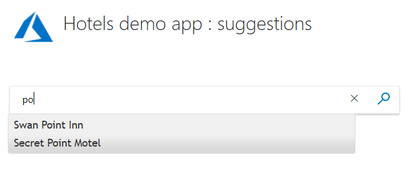
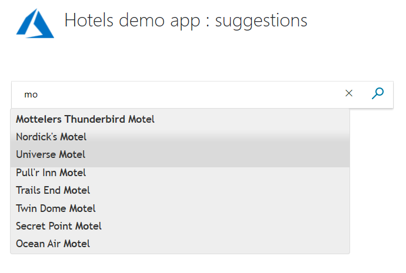
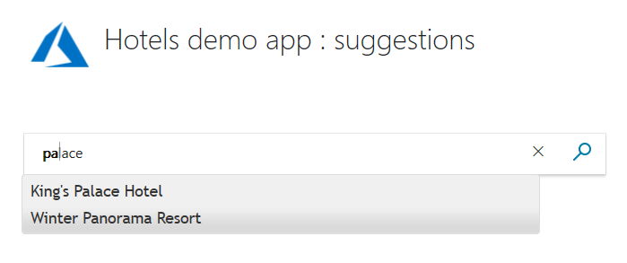

# Tutorial: Add autocomplete and suggestions using the .NET SDK

Learn how to implement autocomplete (typeahead queries and suggested documents) when a user starts typing into a search box. In this tutorial, we will show autocompleted queries and suggestion results separately, and then together. A user may only have to type two or three characters to locate all the results that are available.

In this tutorial, you learn how to:
> [!div class="checklist"]
> * Add suggestions
> * Add highlighting to the suggestions
> * Add autocomplete
> * Combine autocompletion and suggestions

## Prerequisites

This tutorial is part of a series and builds on the paging project created in the [C# Tutorial: Search results pagination - Azure Cognitive Search](tutorial-csharp-paging.md).

Alternatively, you can download and run the solution for this specific tutorial: [3-add-typeahead](https://github.com/Azure-Samples/azure-search-dotnet-samples/tree/master/create-first-app/3-add-typeahead).

## Add suggestions

Let's start with the simplest case of offering up alternatives to the user: a drop-down list of suggestions.

1. In the index.cshtml file, change `@id` of the **TextBoxFor** statement to **azureautosuggest**.

    ```cs
     @Html.TextBoxFor(m => m.searchText, new { @class = "searchBox", @id = "azureautosuggest" }) <input value="" class="searchBoxSubmit" type="submit">
    ```

2. Following this statement, after the closing **&lt;/div&gt;**, enter this script. This script leverages the [Autocomplete widget](https://api.jqueryui.com/autocomplete/) from the open-source jQuery UI library to present the dropdown list of suggested results. 

    ```javascript
    <script>
        $("#azureautosuggest").autocomplete({
            source: "/Home/Suggest?highlights=false&fuzzy=false",
            minLength: 2,
            position: {
                my: "left top",
                at: "left-23 bottom+10"
            }
        });
    </script>
    ```

    The ID "azureautosuggest" connects the above script to the search box. The source option of the widget is set to a Suggest method that calls the Suggest API with two query parameters: **highlights** and **fuzzy**, both set to false in this instance. Also, a minimum of two characters is needed to trigger the search.

### Add references to jQuery scripts to the view

1. To access the jQuery library, change the &lt;head&gt; section of the view file to the following code:

    ```cs
    <head>
        <meta charset="utf-8">
        <title>Typeahead</title>
        <link href="https://code.jquery.com/ui/1.12.1/themes/start/jquery-ui.css"
              rel="stylesheet">
        <script src="https://code.jquery.com/jquery-1.10.2.js"></script>
        <script src="https://code.jquery.com/ui/1.12.1/jquery-ui.js"></script>

        <link rel="stylesheet" href="~/css/hotels.css" />
    </head>
    ```

2. Because we are introducing a new jQuery reference, we also need to remove, or comment out, the default jQuery reference in the _Layout.cshtml file (in the **Views/Shared** folder). Locate the following lines, and comment out the first script line as shown. This change avoids clashing references to jQuery.

    ```html
    <environment include="Development">
        <!-- <script src="~/lib/jquery/dist/jquery.js"></script> -->
        <script src="~/lib/bootstrap/dist/js/bootstrap.js"></script>
        <script src="~/js/site.js" asp-append-version="true"></script>
    </environment>
    ```

    Now we can use the predefined Autocomplete jQuery functions.

### Add the Suggest action to the controller

1. In the home controller, add the **Suggest** action (say, after the **Page** action).

    ```cs
        public async Task<ActionResult> Suggest(bool highlights, bool fuzzy, string term)
        {
            InitSearch();

            // Setup the suggest parameters.
            var parameters = new SuggestParameters()
            {
                UseFuzzyMatching = fuzzy,
                Top = 8,
            };

            if (highlights)
            {
                parameters.HighlightPreTag = "<b>";
                parameters.HighlightPostTag = "</b>";
            }

            // Only one suggester can be specified per index. It is defined in the index schema.
            // The name of the suggester is set when the suggester is specified by other API calls.
            // The suggester for the hotel database is called "sg", and simply searches the hotel name.
            DocumentSuggestResult<Hotel> suggestResult = await _indexClient.Documents.SuggestAsync<Hotel>(term, "sg", parameters);

            // Convert the suggest query results to a list that can be displayed in the client.
            List<string> suggestions = suggestResult.Results.Select(x => x.Text).ToList();

            // Return the list of suggestions.
            return new JsonResult(suggestions);
        }
    ```

    The **Top** parameter specifies how many results to return (if unspecified, the default is 5). A _suggester_ is specified on the Azure index, which is done when the data is set up, and not by a client app such as this tutorial. In this case, the suggester is called "sg", and it searches the **HotelName** field - nothing else. 

    Fuzzy matching allows "near misses" to be included in the output, up to one edit distance. If the **highlights** parameter is set to true, then bold HTML tags are added to the output. We will set these two parameters to true in the next section.

2. You may get some syntax errors. If so, add the following two **using** statements to the top of the file.

    ```cs
    using System.Collections.Generic;
    using System.Linq;
    ```

3. Run the app. Do you get a range of options when you enter "po", for example? Now try "pa".

    

    Notice that the letters you enter _must_ start a word, and not simply be included within the word.

4. In the view script, set **&fuzzy** to true, and run the app again. Now enter "po". Notice that the search assumes you got one letter wrong!
 
    

    If you are interested, the [Lucene query syntax in Azure Cognitive Search](https://docs.microsoft.com/azure/search/query-lucene-syntax) describes the logic used in fuzzy searches in detail.

## Add highlighting to the suggestions

We can improve the appearance of the suggestions to the user by setting the **highlights** parameter to true. However, first we need to add some code to the view to display the bolded text.

1. In the view (index.cshtml), add the following script after the **azureautosuggest** script you entered above.

    ```javascript
    <script>
        var updateTextbox = function (event, ui) {
            var result = ui.item.value.replace(/<\/?[^>]+(>|$)/g, "");
            $("#azuresuggesthighlights").val(result);
            return false;
        };

        $("#azuresuggesthighlights").autocomplete({
            html: true,
            source: "/home/suggest?highlights=true&fuzzy=false&",
            minLength: 2,
            position: {
                my: "left top",
                at: "left-23 bottom+10"
            },
            select: updateTextbox,
            focus: updateTextbox
        }).data("ui-autocomplete")._renderItem = function (ul, item) {
            return $("<li></li>")
                .data("item.autocomplete", item)
                .append("<a>" + item.label + "</a>")
                .appendTo(ul);
        };
    </script>
    ```

2. Now change the ID of the text box so it reads as follows.

    ```cs
    @Html.TextBoxFor(m => m.searchText, new { @class = "searchBox", @id = "azuresuggesthighlights" }) <input value="" class="searchBoxSubmit" type="submit">
    ```

3. Run the app again, and you should see your entered text bolded in the suggestions. Say, try typing "pa".
 
    

4. The logic used in the highlighting script above is not foolproof. If you enter a term that appears twice in the same name, the bolded results are not quite what you would want. Try typing "mo".

    One of the questions a developer needs to answer is, when is a script working "well enough", and when should its quirks be addressed. We will not be taking highlighting any further in this tutorial, but finding a precise algorithm is something to consider if highlighting is not effective for your data. For more information, see [Hit highlighting](search-pagination-page-layout.md#hit-highlighting).

## Add autocomplete

Another variation, that is slightly different from suggestions, is autocompletion (sometimes called "type-ahead") that completes a query term. Again, we will start with the simplest implementation, before improving the user experience.

1. Enter the following script into the view, following your previous scripts.

    ```javascript
    <script>
        $("#azureautocompletebasic").autocomplete({
            source: "/Home/Autocomplete",
            minLength: 2,
            position: {
                my: "left top",
                at: "left-23 bottom+10"
            }
        });
    </script>
    ```

2. Now change the ID of the text box, so it reads as follows.

    ```cs
    @Html.TextBoxFor(m => m.searchText, new { @class = "searchBox", @id = "azureautocompletebasic" }) <input value="" class="searchBoxSubmit" type="submit">
    ```

3. In the home controller we need to enter the **Autocomplete** action, say, below the **Suggest** action.

    ```cs
        public async Task<ActionResult> AutoComplete(string term)
        {
            InitSearch();

            // Setup the autocomplete parameters.
            var ap = new AutocompleteParameters()
            {
                AutocompleteMode = AutocompleteMode.OneTermWithContext,
                Top = 6
            };
            AutocompleteResult autocompleteResult = await _indexClient.Documents.AutocompleteAsync(term, "sg", ap);

            // Convert the results to a list that can be displayed in the client.
            List<string> autocomplete = autocompleteResult.Results.Select(x => x.Text).ToList();

            // Return the list.
            return new JsonResult(autocomplete);
        }
    ```

    Notice that we are using the same *suggester* function, called "sg", in the autocomplete search as we did for suggestions (so we are only trying to autocomplete the hotel names).

    There are a range of **AutocompleteMode** settings, and we are using **OneTermWithContext**. Refer to [Autocomplete API](https://docs.microsoft.com/rest/api/searchservice/autocomplete) for a description of additional options.

4. Run the app. Notice how the range of options displayed in the drop-down list are single words. Try typing words starting with "re". Notice how the number of options reduces as more letters are typed.

    

    As it stands, the suggestions script you ran earlier is probably more helpful than this autocompletion script. To make autocompletion more user-friendly, it is best added to the suggestion search.

## Combine autocompletion and suggestions

Combining autocompletion and suggestions is the most complex of our options, and probably provides the best user experience. What we want is to display, inline with the text that is being typed, is the first choice of Azure Cognitive Search for autocompleting the text. Also, we want a range of suggestions as a drop-down list.

There are libraries that offer this functionality - often called "inline autocompletion" or a similar name. However, we are going to natively implement this feature, so you can see what is going on. We are going to start work on the controller first in this example.

1. We need to add an action to the controller that returns just one autocompletion result, along with a specified number of suggestions. We will call this action **AutocompleteAndSuggest**. In the home controller, add the following action, following your other new actions.

    ```cs
        public async Task<ActionResult> AutocompleteAndSuggest(string term)
        {
            InitSearch();

            // Setup the type-ahead search parameters.
            var ap = new AutocompleteParameters()
            {
                AutocompleteMode = AutocompleteMode.OneTermWithContext,
                Top = 1,
            };
            AutocompleteResult autocompleteResult = await _indexClient.Documents.AutocompleteAsync(term, "sg", ap);

            // Setup the suggest search parameters.
            var sp = new SuggestParameters()
            {
                Top = 8,
            };

            // Only one suggester can be specified per index. The name of the suggester is set when the suggester is specified by other API calls.
            // The suggester for the hotel database is called "sg", and it searches only the hotel name.
            DocumentSuggestResult<Hotel> suggestResult = await _indexClient.Documents.SuggestAsync<Hotel>(term, "sg", sp);

            // Create an empty list.
            var results = new List<string>();

            if (autocompleteResult.Results.Count > 0)
            {
                // Add the top result for type-ahead.
                results.Add(autocompleteResult.Results[0].Text);
            }
            else
            {
                // There were no type-ahead suggestions, so add an empty string.
                results.Add("");
            }
            for (int n = 0; n < suggestResult.Results.Count; n++)
            {
                // Now add the suggestions.
                results.Add(suggestResult.Results[n].Text);
            }

            // Return the list.
            return new JsonResult(results);
        }
    ```

    One autocompletion option is returned at the top of the **results** list, followed by all the suggestions.

2. In the view, first we implement a trick so that a light gray autocompletion word is rendered right under bolder text being entered by the user. HTML includes relative positioning for this purpose. Change the **TextBoxFor** statement (and its surrounding &lt;div&gt; statements) to the following, noting that a second search box identified as **underneath** is right under our normal search box, by pulling this search box 39 pixels off of its default location!

    ```cs
    <div id="underneath" class="searchBox" style="position: relative; left: 0; top: 0">
    </div>

    <div id="searchinput" class="searchBoxForm" style="position: relative; left: 0; top: -39px">
        @Html.TextBoxFor(m => m.searchText, new { @class = "searchBox", @id = "azureautocomplete" }) <input value="" class="searchBoxSubmit" type="submit">
    </div>
    ```

    Note we are changing the ID again, to **azureautocomplete** in this case.

3. Also in the view, enter the following script, after all the scripts you have entered so far. There is quite a lot to it.

    ```javascript
    <script>
        $('#azureautocomplete').autocomplete({
            delay: 500,
            minLength: 2,
            position: {
                my: "left top",
                at: "left-23 bottom+10"
            },

            // Use Ajax to set up a "success" function.
            source: function (request, response) {
                var controllerUrl = "/Home/AutoCompleteAndSuggest?term=" + $("#azureautocomplete").val();
                $.ajax({
                    url: controllerUrl,
                    dataType: "json",
                    success: function (data) {
                        if (data && data.length > 0) {

                            // Show the autocomplete suggestion.
                            document.getElementById("underneath").innerHTML = data[0];

                            // Remove the top suggestion as it is used for inline autocomplete.
                            var array = new Array();
                            for (var n = 1; n < data.length; n++) {
                                array[n - 1] = data[n];
                            }

                            // Show the drop-down list of suggestions.
                            response(array);
                        } else {

                            // Nothing is returned, so clear the autocomplete suggestion.
                            document.getElementById("underneath").innerHTML = "";
                        }
                    }
                });
            }
        });

        // Complete on TAB.
        // Clear on ESC.
        // Clear if backspace to less than 2 characters.
        // Clear if any arrow key hit as user is navigating the suggestions.
        $("#azureautocomplete").keydown(function (evt) {

            var suggestedText = document.getElementById("underneath").innerHTML;
            if (evt.keyCode === 9 /* TAB */ && suggestedText.length > 0) {
                $("#azureautocomplete").val(suggestedText);
                return false;
            } else if (evt.keyCode === 27 /* ESC */) {
                document.getElementById("underneath").innerHTML = "";
                $("#azureautocomplete").val("");
            } else if (evt.keyCode === 8 /* Backspace */) {
                if ($("#azureautocomplete").val().length < 2) {
                    document.getElementById("underneath").innerHTML = "";
                }
            } else if (evt.keyCode >= 37 && evt.keyCode <= 40 /* Any arrow key */) {
                document.getElementById("underneath").innerHTML = "";
            }
        });

        // Character replace function.
        function setCharAt(str, index, chr) {
            if (index > str.length - 1) return str;
            return str.substr(0, index) + chr + str.substr(index + 1);
        }

        // This function is needed to clear the "underneath" text when the user clicks on a suggestion, and to
        // correct the case of the autocomplete option when it does not match the case of the user input.
        // The interval function is activated with the input, blur, change, or focus events.
        $("#azureautocomplete").on("input blur change focus", function (e) {

            // Set a 2 second interval duration.
            var intervalDuration = 2000, 
                interval = setInterval(function () {

                    // Compare the autocorrect suggestion with the actual typed string.
                    var inputText = document.getElementById("azureautocomplete").value;
                    var autoText = document.getElementById("underneath").innerHTML;

                    // If the typed string is longer than the suggestion, then clear the suggestion.
                    if (inputText.length > autoText.length) {
                        document.getElementById("underneath").innerHTML = "";
                    } else {

                        // If the strings match, change the case of the suggestion to match the case of the typed input.
                        if (autoText.toLowerCase().startsWith(inputText.toLowerCase())) {
                            for (var n = 0; n < inputText.length; n++) {
                                autoText = setCharAt(autoText, n, inputText[n]);
                            }
                            document.getElementById("underneath").innerHTML = autoText;

                        } else {
                            // The strings do not match, so clear the suggestion.
                            document.getElementById("underneath").innerHTML = "";
                        }
                    }

                    // If the element loses focus, stop the interval checking.
                    if (!$input.is(':focus')) clearInterval(interval);

                }, intervalDuration);
        });
    </script>
    ```

    Notice the clever use of the **interval** function to both clear the underlying text when it no longer matches what the user is typing, and also to set the same case (upper or lower) as the user is typing (as "pa" matches "PA", "pA", "Pa" when searching), so that the overlaid text is neat.

    Read through the comments in the script to get a fuller understanding.

4. Finally, we need to make a minor adjustment to two HTML class to make them transparent. Add the following line to the **searchBoxForm** and **searchBox** classes, in the hotels.css file.

    ```html
        background: rgba(0,0,0,0);
    ```

5. Now run the app. Enter "pa" into the search box. Do you get "palace" as the autocomplete suggestion, along with two hotels that contain "pa"?

    

6. Try tabbing to accept the autocomplete suggestion, and try selecting suggestions using the arrow keys and tab key, and try again using the mouse and a single click. Verify that the script handles all these situations neatly.

    You may decide that it is simpler to load in a library that offers this feature for you, but now you know at least one way to get inline autocompletion to work!

## Takeaways

Consider the following takeaways from this project:

* Autocompletion (also known as "type-ahead") and suggestions can enable the user to type only a few keys to locate exactly what they want.
* Autocompletion and suggestions working together can provide a rich user experience.
* Always test autocompletion functions with all forms of input.
* Using the **setInterval** function can be useful in verifying and correcting UI elements.

## Next steps

In the next tutorial, we have a look at another way of improving the user experience, using facets to narrow searches with a single click.

> [!div class="nextstepaction"]
> [C# Tutorial: Use facets to aid navigation - Azure Cognitive Search](tutorial-csharp-facets.md)


