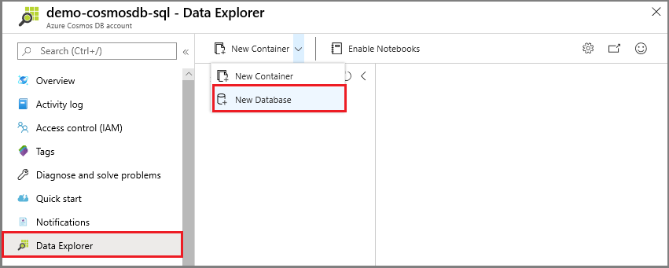
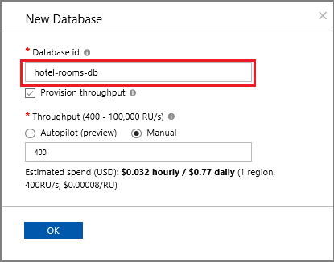
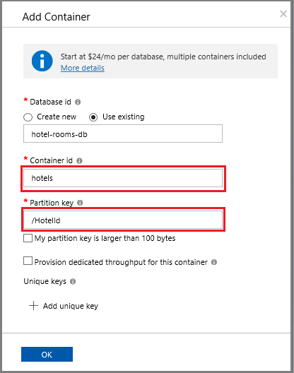
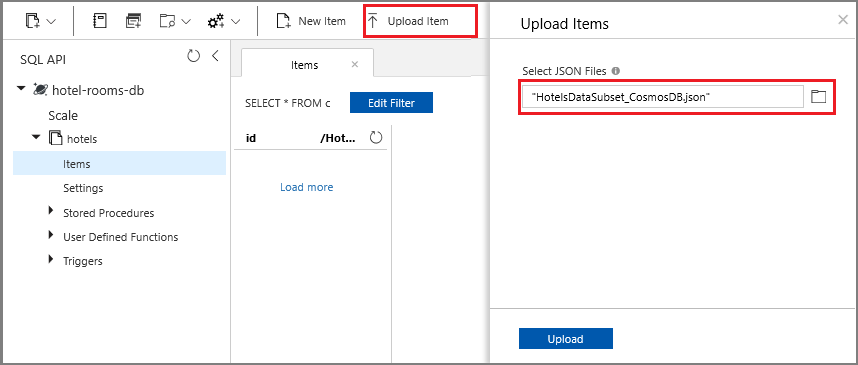
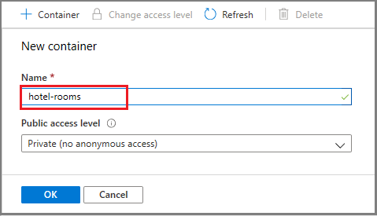
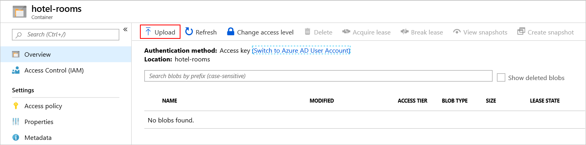
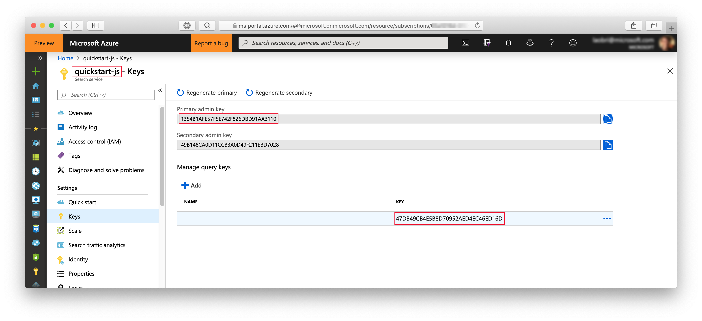
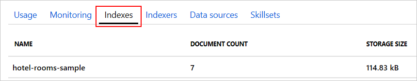

# Tutorial: Index from multiple data sources using the .NET SDK

Azure Cognitive Search can import, analyze, and index data from multiple data sources into a single consolidate search index. This supports situations where structured data is aggregated with less-structured or even plain text data from other sources, like text, HTML, or JSON documents.

This tutorial describes how to index hotel data from an Azure Cosmos DB data source and merge that with hotel room details drawn from Azure Blob Storage documents. The result will be a combined hotel search index containing complex data types.

This tutorial uses C# and the [.NET SDK](https://aka.ms/search-sdk). In this tutorial, you'll perform the following tasks:

> [!div class="checklist"]
> * Upload sample data and create data sources
> * Identify the document key
> * Define and create the index
> * Index hotel data from Azure Cosmos DB
> * Merge hotel room data from blob storage

If you don't have an Azure subscription, create a [free account](https://azure.microsoft.com/free/?WT.mc_id=A261C142F) before you begin.

## Prerequisites

+ [Azure Cosmos DB](https://docs.microsoft.com/azure/cosmos-db/create-cosmosdb-resources-portal)
+ [Azure Storage](https://docs.microsoft.com/azure/storage/common/storage-quickstart-create-account)
+ [Visual Studio 2019](https://visualstudio.microsoft.com/)
+ [Create](search-create-service-portal.md) or [find an existing search service](https://ms.portal.azure.com/#blade/HubsExtension/BrowseResourceBlade/resourceType/Microsoft.Search%2FsearchServices) 

> [!Note]
> You can use the free service for this tutorial. A free search service limits you to three indexes, three indexers, and three data sources. This tutorial creates one of each. Before starting, make sure you have room on your service to accept the new resources.

## Download files

Source code for this tutorial is in the [azure-search-dotnet-samples](https://github.com/Azure-Samples/azure-search-dotnet-samples) GitHub repository, in the [multiple-data-sources](https://github.com/Azure-Samples/azure-search-dotnet-samples/tree/master/multiple-data-sources) folder.

## 1 - Create services

This tutorial uses Azure Cognitive Search for indexing and queries, Azure Cosmos DB for one data set, and Azure Blob storage for the second data set. 

If possible, create all services in the same region and resource group for proximity and manageability. In practice, your services can be in any region.

This sample uses two small sets of data that describe seven fictional hotels. One set describes the hotels themselves, and will be loaded into an Azure Cosmos DB database. The other set contains hotel room details, and is provided as seven separate JSON files to be uploaded into Azure Blob Storage.

### Start with Cosmos DB

1. Sign in to the [Azure portal](https://portal.azure.com), and then navigate your Azure Cosmos DB account Overview page.

1. Select **Data Explorer** and then select **New Database**.

   

1. Enter the name **hotel-rooms-db**. Accept default values for the remaining settings.

   

1. Create a new container. Use the existing database you just created. Enter **hotels** for the container name, and use **/HotelId** for the Partition key.

   

1. Select **Items** under **hotels**, and then click **Upload Item** on the command bar. Navigate to and then select the file **cosmosdb/HotelsDataSubset_CosmosDb.json** in the project folder.

   

1. Use the Refresh button to refresh your view of the items in the hotels collection. You should see seven new database documents listed.

### Azure Blob storage

1. Sign in to the [Azure portal](https://portal.azure.com), navigate to your Azure storage account, click **Blobs**, and then click **+ Container**.

1. [Create a blob container](https://docs.microsoft.com/azure/storage/blobs/storage-quickstart-blobs-portal) named **hotel-rooms** to store the sample hotel room JSON files. You can set the Public Access Level to any of its valid values.

   

1. After the container is created, open it and select **Upload** on the command bar. Navigate to the folder containing the sample files. Select all of them and then click **Upload**.

   

After the upload completes, the files should appear in the list for the data container.

### Azure Cognitive Search

The third component is Azure Cognitive Search, which you can [create in the portal](search-create-service-portal.md). You can use the Free tier to complete this walkthrough. 

### Get an admin api-key and URL for Azure Cognitive Search

To interact with your Azure Cognitive Search service you will need the service URL and an access key. A search service is created with both, so if you added Azure Cognitive Search to your subscription, follow these steps to get the necessary information:

1. [Sign in to the Azure portal](https://portal.azure.com/), and in your search service **Overview** page, get the URL. An example endpoint might look like `https://mydemo.search.windows.net`.

1. In **Settings** > **Keys**, get an admin key for full rights on the service. There are two interchangeable admin keys, provided for business continuity in case you need to roll one over. You can use either the primary or secondary key on requests for adding, modifying, and deleting objects.

   Get the query key as well. It's a best practice to issue query requests with read-only access.

   

Having a valid key establishes trust, on a per request basis, between the application sending the request and the service that handles it.

## 2 - Set up your environment

1. Start Visual Studio 2019 and in the **Tools** menu, select **NuGet Package Manager** and then **Manage NuGet Packages for Solution...**. 

1. In the **Browse** tab, find and then install **Microsoft.Azure.Search** (version 9.0.1, or later). You will have to click through additional dialogs to complete the installation.

    

1. Search for the **Microsoft.Extensions.Configuration.Json** NuGet package and install it as well.

1. Open the solution file **AzureSearchMultipleDataSources.sln**.

1. In Solution Explorer, edit the **appsettings.json** file to add connection information.  

    ```json
    {
      "SearchServiceName": "Put your search service name here",
      "SearchServiceAdminApiKey": "Put your primary or secondary API key here",
      "BlobStorageAccountName": "Put your Azure Storage account name here",
      "BlobStorageConnectionString": "Put your Azure Blob Storage connection string here",
      "CosmosDBConnectionString": "Put your Cosmos DB connection string here",
      "CosmosDBDatabaseName": "hotel-rooms-db"
    }
    ```

The first two entries use the URL and admin keys for your Azure Cognitive Search service. Given an endpoint of `https://mydemo.search.windows.net`, for example, the service name to provide is `mydemo`.

The next entries specify account names and connection string information for the Azure Blob Storage and Azure Cosmos DB data sources.

## 3 - Map key fields

Merging content requires that both data streams are targeting the same documents in the search index. 

In Azure Cognitive Search, the key field uniquely identifies each document. Every search index must have exactly one key field of type `Edm.String`. That key field must be present for each document in a data source that is added to the index. (In fact, it's the only required field.)

When indexing data from multiple data sources, make sure each incoming row or document contains a common document key to merge data from two physically distinct source documents into a new search document in the combined index. 

It often requires some up-front planning to identify a meaningful document key for your index, and make sure it exists in both data sources. In this demo, the `HotelId` key for each hotel in Cosmos DB is also present in the rooms JSON blobs in Blob storage.

Azure Cognitive Search indexers can use field mappings to rename and even reformat data fields during the indexing process, so that source data can be directed to the correct index field. For example, in Cosmos DB, the hotel identifier is called **`HotelId`**. But in the JSON blob files for the hotel rooms, the hotel identifier is  named **`Id`**. The program handles this by mapping the **`Id`** field from the blobs to the **`HotelId`** key field in the index.

> [!NOTE]
> In most cases, auto-generated document keys, such as those created by default by some indexers, do not make good document keys for combined indexes. In general you will want to use a meaningful, unique key value that already exists in, or can be easily added to, your data sources.

## 4 - Explore the code

Once the data and configuration settings are in place, the sample program in **AzureSearchMultipleDataSources.sln** should be ready to build and run.

This simple C#/.NET console app performs the following tasks:

* Creates a new index based on the data structure of the C# Hotel class (which also references the Address and Room classes).
* Creates a new data source and an indexer that maps Azure Cosmos DB data to index fields. These are both objects in Azure Cognitive Search.
* Runs the indexer to load Hotel data from Cosmos DB.
* Creates a second data source and an indexer that maps JSON blob data to index fields.
* Runs the second indexer to load Rooms data from Blob storage.

 Before running the program, take a minute to study the code and the index and indexer definitions for this sample. The relevant code is in two files:

  + **Hotel.cs** contains the schema that defines the index
  + **Program.cs** contains functions that create the Azure Cognitive Search index, data sources, and indexers, and load the combined results into the index.

### Create an index

This sample program uses the .NET SDK to define and create an Azure Cognitive Search index. It takes advantage of the [FieldBuilder](https://docs.microsoft.com/dotnet/api/microsoft.azure.search.fieldbuilder) class to generate an index structure from a C# data model class.

The data model is defined by the Hotel class, which also contains references to the Address and Room classes. The FieldBuilder drills down through multiple class definitions to generate a complex data structure for the index. Metadata tags are used to define the attributes of each field, such as whether it is searchable or sortable.

The following snippets from the **Hotel.cs** file show how a single field, and a reference to another data model class, can be specified.

```csharp
. . . 
[IsSearchable, IsFilterable, IsSortable]
public string HotelName { get; set; }
. . .
public Room[] Rooms { get; set; }
. . .
```

In the **Program.cs** file, the index is defined with a name and a field collection generated by the `FieldBuilder.BuildForType<Hotel>()` method, and then created as follows:

```csharp
private static async Task CreateIndex(string indexName, SearchServiceClient searchService)
{
    // Create a new search index structure that matches the properties of the Hotel class.
    // The Address and Room classes are referenced from the Hotel class. The FieldBuilder
    // will enumerate these to create a complex data structure for the index.
    var definition = new Index()
    {
        Name = indexName,
        Fields = FieldBuilder.BuildForType<Hotel>()
    };
    await searchService.Indexes.CreateAsync(definition);
}
```

### Create Azure Cosmos DB data source and indexer

Next the main program includes logic to create the Azure Cosmos DB data source for the hotels data.

First it concatenates the Azure Cosmos DB database name to the connection string. Then it defines the data source object, including settings specific to Azure Cosmos DB sources, such as the [useChangeDetection] property.

  ```csharp
private static async Task CreateAndRunCosmosDbIndexer(string indexName, SearchServiceClient searchService)
{
    // Append the database name to the connection string
    string cosmosConnectString = 
        configuration["CosmosDBConnectionString"]
        + ";Database=" 
        + configuration["CosmosDBDatabaseName"];

    DataSource cosmosDbDataSource = DataSource.CosmosDb(
        name: configuration["CosmosDBDatabaseName"], 
        cosmosDbConnectionString: cosmosConnectString,
        collectionName: "hotels",
        useChangeDetection: true);

    // The Azure Cosmos DB data source does not need to be deleted if it already exists,
    // but the connection string might need to be updated if it has changed.
    await searchService.DataSources.CreateOrUpdateAsync(cosmosDbDataSource);
  ```

After the data source is created, the program sets up an Azure Cosmos DB indexer named **hotel-rooms-cosmos-indexer**.

```csharp
    Indexer cosmosDbIndexer = new Indexer(
        name: "hotel-rooms-cosmos-indexer",
        dataSourceName: cosmosDbDataSource.Name,
        targetIndexName: indexName,
        schedule: new IndexingSchedule(TimeSpan.FromDays(1)));
    
    // Indexers keep metadata about how much they have already indexed.
    // If we already ran this sample, the indexer will remember that it already
    // indexed the sample data and not run again.
    // To avoid this, reset the indexer if it exists.
    bool exists = await searchService.Indexers.ExistsAsync(cosmosDbIndexer.Name);
    if (exists)
    {
        await searchService.Indexers.ResetAsync(cosmosDbIndexer.Name);
    }
    await searchService.Indexers.CreateOrUpdateAsync(cosmosDbIndexer);
```
The program will delete any existing indexers with the same name before creating the new one, in case you want to run this example more than once.

This example defines a schedule for the indexer, so that it will run once per day. You can remove the schedule property from this call if you don't want the indexer to automatically run again in the future.

### Index Azure Cosmos DB data

Once the data source and the indexer have been created, the code that runs the indexer is brief:

```csharp
    try
    {
        await searchService.Indexers.RunAsync(cosmosDbIndexer.Name);
    }
    catch (CloudException e) when (e.Response.StatusCode == (HttpStatusCode)429)
    {
        Console.WriteLine("Failed to run indexer: {0}", e.Response.Content);
    }
```

This example includes a simple try-catch block to report any errors that might occur during execution.

After the Azure Cosmos DB indexer has run, the search index will contain a full set of sample hotel documents. However the rooms field for each hotel will be an empty array, since the Azure Cosmos DB data source contained no room details. Next, the program will pull from Blob storage to load and merge the room data.

### Create Blob storage data source and indexer

To get the room details the program first sets up a Blob storage data source to reference a set of individual JSON blob files.

```csharp
private static async Task CreateAndRunBlobIndexer(string indexName, SearchServiceClient searchService)
{
    DataSource blobDataSource = DataSource.AzureBlobStorage(
        name: configuration["BlobStorageAccountName"],
        storageConnectionString: configuration["BlobStorageConnectionString"],
        containerName: "hotel-rooms");

    // The blob data source does not need to be deleted if it already exists,
    // but the connection string might need to be updated if it has changed.
    await searchService.DataSources.CreateOrUpdateAsync(blobDataSource);
```

After the data source is created, the program sets up a blob indexer named **hotel-rooms-blob-indexer**.

```csharp
    // Add a field mapping to match the Id field in the documents to 
    // the HotelId key field in the index
    List<FieldMapping> map = new List<FieldMapping> {
        new FieldMapping("Id", "HotelId")
    };

    Indexer blobIndexer = new Indexer(
        name: "hotel-rooms-blob-indexer",
        dataSourceName: blobDataSource.Name,
        targetIndexName: indexName,
        fieldMappings: map,
        parameters: new IndexingParameters().ParseJson(),
        schedule: new IndexingSchedule(TimeSpan.FromDays(1)));

    // Reset the indexer if it already exists
    bool exists = await searchService.Indexers.ExistsAsync(blobIndexer.Name);
    if (exists)
    {
        await searchService.Indexers.ResetAsync(blobIndexer.Name);
    }
    await searchService.Indexers.CreateOrUpdateAsync(blobIndexer);
```

The JSON blobs contain a key field named **`Id`** instead of **`HotelId`**. The code uses the `FieldMapping` class to tell the indexer to direct the **`Id`** field value to the **`HotelId`** document key in the index.

Blob storage indexers can use parameters that identify the parsing mode to be used. The parsing mode differs for blobs that represent a single document, or multiple documents within the same blob. In this example, each blob represents a single index document, so the code uses the `IndexingParameters.ParseJson()` parameter.

For more information about indexer parsing parameters for JSON blobs, see [Index JSON blobs](search-howto-index-json-blobs.md). For more information about specifying these parameters using the .NET SDK, see the [IndexerParametersExtension](https://docs.microsoft.com/dotnet/api/microsoft.azure.search.models.indexingparametersextensions) class.

The program will delete any existing indexers with the same name before creating the new one, in case you want to run this example more than once.

This example defines a schedule for the indexer, so that it will run once per day. You can remove the schedule property from this call if you don't want the indexer to automatically run again in the future.

### Index blob data

Once the Blob storage data source and indexer have been created, the code that runs the indexer is simple:

```csharp
    try
    {
        await searchService.Indexers.RunAsync(cosmosDbIndexer.Name);
    }
    catch (CloudException e) when (e.Response.StatusCode == (HttpStatusCode)429)
    {
        Console.WriteLine("Failed to run indexer: {0}", e.Response.Content);
    }
```

Because the index has already been populated with hotel data from the Azure Cosmos DB database, 
the blob indexer updates the existing documents in the index and adds the room details.

> [!NOTE]
> If you have the same non-key fields in both of your data sources, and the data within those fields does not match, then the index will contain the values from whichever indexer ran most recently. In our example, both data sources contain a **HotelName** field. If for some reason the data in this field is different, for documents with the same key value, then the **HotelName** data from the data source that was indexed most recently will be the value stored in the index.

## 5 - Search

You can explore the populated search index after the program has run, using the [**Search explorer**](search-explorer.md) in the portal.

In Azure portal, open the search service **Overview** page, and find the **hotel-rooms-sample** index in the **Indexes** list.

  

Click on the hotel-rooms-sample index in the list. You will see a Search Explorer interface for the index. Enter a query for a term like "Luxury". You should see at least one document in the results, and this document should show a list of room objects in its rooms array.

## Reset and rerun

In the early experimental stages of development, the most practical approach for design iteration is to delete the objects from Azure Cognitive Search and allow your code to rebuild them. Resource names are unique. Deleting an object lets you recreate it using the same name.

The sample code for this tutorial checks for existing objects and deletes them so that you can rerun your code.

You can also use the portal to delete indexes, indexers, and data sources.

## Clean up resources

When you're working in your own subscription, at the end of a project, it's a good idea to remove the resources that you no longer need. Resources left running can cost you money. You can delete resources individually or delete the resource group to delete the entire set of resources.

You can find and manage resources in the portal, using the All resources or Resource groups link in the left-navigation pane.

## Next steps

Now that you're familiar with the concept of ingesting data from multiple sources, let's take a closer look at indexer configuration, starting with Cosmos DB.

> [!div class="nextstepaction"]
> [Configure an Azure Cosmos DB indexer](search-howto-index-cosmosdb.md)