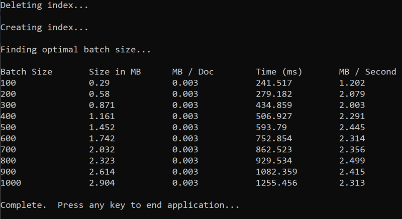
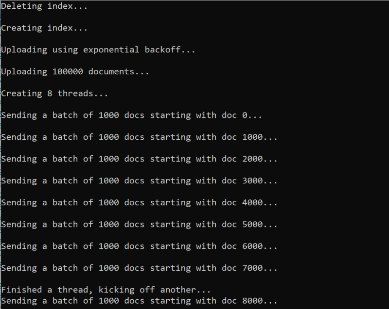
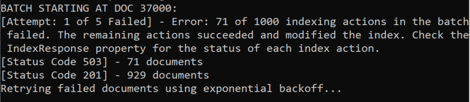
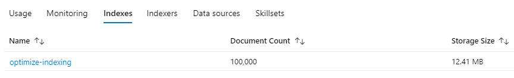

# Tutorial: Optimize indexing with the push API

Azure Cognitive Search supports [two basic approaches](search-what-is-data-import.md) for importing data into a search index: *pushing* your data into the index programmatically, or pointing an [Azure Cognitive Search indexer](search-indexer-overview.md) at a supported data source to *pull* in the data.

This tutorial describes how to efficiently index data using the [push model](search-what-is-data-import.md#pushing-data-to-an-index) by batching requests and using an exponential backoff retry strategy. You can [download and run the application](https://github.com/Azure-Samples/azure-search-dotnet-samples/tree/master/optimize-data-indexing). This article explains the key aspects of the application and factors to consider when indexing data.

This tutorial uses C# and the [.NET SDK](https://aka.ms/search-sdk) to perform the following tasks:

> [!div class="checklist"]
> * Create an index
> * Test various batch sizes to determine the most efficient size
> * Index data asynchronously
> * Use multiple threads to increase indexing speeds
> * Use an exponential backoff retry strategy to retry failed items

If you don't have an Azure subscription, create a [free account](https://azure.microsoft.com/free/?WT.mc_id=A261C142F) before you begin.

## Prerequisites

The following services and tools are required for this tutorial.

+ [Visual Studio](https://visualstudio.microsoft.com/downloads/), any edition. Sample code and instructions were tested on the free Community edition.

+ [Create an Azure Cognitive Search service](search-create-service-portal.md) or [find an existing service](https://ms.portal.azure.com/#blade/HubsExtension/BrowseResourceBlade/resourceType/Microsoft.Search%2FsearchServices) under your current subscription.

<a name="get-service-info"></a>

## Download files

Source code for this tutorial is in the [optimzize-data-indexing](https://github.com/Azure-Samples/azure-search-dotnet-samples/tree/master/optimize-data-indexing) folder in the [Azure-Samples/azure-search-dotnet-samples](https://github.com/Azure-Samples/azure-search-dotnet-samples) GitHub repository.

## Key considerations

When pushing data into an index, there's several key considerations that impact indexing speeds. You can learn more about these factors in the [index large data sets article](search-howto-large-index.md).

Six key factors to consider are:

+ **Service tier and number of partitions/replicas** - Adding partitions and increasing your tier will both increase indexing speeds.
+ **Index Schema** - Adding fields and adding additional properties to fields (such as *searchable*, *facetable*, or *filterable*) both reduce indexing speeds.
+ **Batch size** - The optimal batch size varies based on your index schema and dataset.
+ **Number of threads/workers** - a single thread won't take full advantage of indexing speeds
+ **Retry strategy** - An exponential backoff retry strategy should be used to optimize indexing.
+ **Network data transfer speeds** - Data transfer speeds can be a limiting factor. Index data from within your Azure environment to increase data transfer speeds.


## 1 - Create Azure Cognitive Search service

To complete this tutorial, you'll need an Azure Cognitive Search service, which you can [create in the portal](search-create-service-portal.md). We recommend using the same tier you plan to use in production so that you can accurately test and optimize indexing speeds.

### Get an admin api-key and URL for Azure Cognitive Search

API calls require the service URL and an access key. A search service is created with both, so if you added Azure Cognitive Search to your subscription, follow these steps to get the necessary information:

1. [Sign in to the Azure portal](https://portal.azure.com/), and in your search service **Overview** page, get the URL. An example endpoint might look like `https://mydemo.search.windows.net`.

1. In **Settings** > **Keys**, get an admin key for full rights on the service. There are two interchangeable admin keys, provided for business continuity in case you need to roll one over. You can use either the primary or secondary key on requests for adding, modifying, and deleting objects.

   

## 2 - Set up your environment

1. Start Visual Studio and open **OptimizeDataIndexing.sln**.
1. In Solution Explorer, open **appsettings.json** to provide connection information.
1. For `searchServiceName`, if the full URL is "https://my-demo-service.search.windows.net", the service name to provide is "my-demo-service".

```json
{
  "SearchServiceName": "<YOUR-SEARCH-SERVICE-NAME>",
  "SearchServiceAdminApiKey": "<YOUR-ADMIN-API-KEY>",
  "SearchIndexName": "optimize-indexing"
}
```

## 3 - Explore the code

Once you update *appsettings.json*, the sample program in **OptimizeDataIndexing.sln** should be ready to build and run.

This code is derived from the [C# Quickstart](search-get-started-dotnet.md). You can find more detailed information on the basics of working with the .NET SDK in that article.

This simple C#/.NET console app performs the following tasks:

+ Creates a new index based on the data structure of the C# Hotel class (which also references the Address class).
+ Tests various batch sizes to determine the most efficient size
+ Indexes data asynchronously
    + Using multiple threads to increase indexing speeds
    + Using an exponential backoff retry strategy to retry failed items

 Before running the program, take a minute to study the code and the index definitions for this sample. The relevant code is in several files:

  + **Hotel.cs** and **Address.cs** contains the schema that defines the index
  + **DataGenerator.cs** contains a simple class to make it easy to create large amounts of hotel data
  + **ExponentialBackoff.cs** contains code to optimize the indexing process as described below
  + **Program.cs** contains functions that create and delete the Azure Cognitive Search index, indexes batches of data, and tests different batch sizes

### Creating the index

This sample program uses the .NET SDK to define and create an Azure Cognitive Search index. It takes advantage of the [FieldBuilder](https://docs.microsoft.com/dotnet/api/microsoft.azure.search.fieldbuilder) class to generate an index structure from a C# data model class.

The data model is defined by the Hotel class, which also contains references to the Address class. The FieldBuilder drills down through multiple class definitions to generate a complex data structure for the index. Metadata tags are used to define the attributes of each field, such as whether it's searchable or sortable.

The following snippets from the **Hotel.cs** file show how a single field, and a reference to another data model class, can be specified.

```csharp
. . .
[IsSearchable, IsSortable]
public string HotelName { get; set; }
. . .
public Address Address { get; set; }
. . .
```

In the **Program.cs** file, the index is defined with a name and a field collection generated by the `FieldBuilder.BuildForType<Hotel>()` method, and then created as follows:

```csharp
private static async Task CreateIndex(string indexName, SearchServiceClient searchService)
{
    // Create a new search index structure that matches the properties of the Hotel class.
    // The Address class is referenced from the Hotel class. The FieldBuilder
    // will enumerate these to create a complex data structure for the index.
    var definition = new Index()
    {
        Name = indexName,
        Fields = FieldBuilder.BuildForType<Hotel>()
    };
    await searchService.Indexes.CreateAsync(definition);
}
```

### Generating data

A simple class is implemented in the **DataGenerator.cs** file to generate data for testing. The sole purpose of this class is to make it easy to generate a large number of documents with a unique ID for indexing.

To get a list of 100,000 hotels with unique IDs, you'd run the following two lines of code:

```csharp
DataGenerator dg = new DataGenerator();
List<Hotel> hotels = dg.GetHotels(100000, "large");
```

There are two sizes of hotels available for testing in this sample: **small** and  **large**.

The schema of your index can have a significant impact on indexing speeds. Because of this impact, it makes sense to convert this class to generate data matching your intended index schema after you run through this tutorial.

## 4 - Test batch sizes

Azure Cognitive Search supports the following APIs to load single or multiple documents into an index:

+ [Add, Update, or Delete Documents (REST API)](https://docs.microsoft.com/rest/api/searchservice/AddUpdate-or-Delete-Documents)
+ [indexAction class](https://docs.microsoft.com/dotnet/api/microsoft.azure.search.models.indexaction?view=azure-dotnet) or [indexBatch class](https://docs.microsoft.com/dotnet/api/microsoft.azure.search.models.indexbatch?view=azure-dotnet)

Indexing documents in batches will significantly improve indexing performance. These batches can be up to 1000 documents, or up to about 16 MB per batch.

Determining the optimal batch size for your data is a key component of optimizing indexing speeds. The two primary factors influencing the optimal batch size are:

+ The schema of your index
+ The size of your data

Because the optimal batch size is dependent on your index and your data, the best approach is to test different batch sizes to determine what results in the fastest indexing speeds for your scenario.

The following function demonstrates a simple approach to testing batch sizes.

```csharp
public static async Task TestBatchSizes(ISearchIndexClient indexClient, int min = 100, int max = 1000, int step = 100, int numTries = 3)
{
    DataGenerator dg = new DataGenerator();

    Console.WriteLine("Batch Size \t Size in MB \t MB / Doc \t Time (ms) \t MB / Second");
    for (int numDocs = min; numDocs <= max; numDocs += step)
    {
        List<TimeSpan> durations = new List<TimeSpan>();
        double sizeInMb = 0.0;
        for (int x = 0; x < numTries; x++)
        {
            List<Hotel> hotels = dg.GetHotels(numDocs, "large");

            DateTime startTime = DateTime.Now;
            await UploadDocuments(indexClient, hotels);
            DateTime endTime = DateTime.Now;
            durations.Add(endTime - startTime);

            sizeInMb = EstimateObjectSize(hotels);
        }

        var avgDuration = durations.Average(timeSpan => timeSpan.TotalMilliseconds);
        var avgDurationInSeconds = avgDuration / 1000;
        var mbPerSecond = sizeInMb / avgDurationInSeconds;

        Console.WriteLine("{0} \t\t {1} \t\t {2} \t\t {3} \t {4}", numDocs, Math.Round(sizeInMb, 3), Math.Round(sizeInMb / numDocs, 3), Math.Round(avgDuration, 3), Math.Round(mbPerSecond, 3));

        // Pausing 2 seconds to let the search service catch its breath
        Thread.Sleep(2000);
    }
}
```

Because not all documents are the same size (although they are in this sample), we estimate the size of the data we're sending to the search service. We do this using the function below that first converts the object to json and then determines its size in bytes. This technique allows us to determine which batch sizes are most efficient in terms of MB/s indexing speeds.

```csharp
public static double EstimateObjectSize(object data)
{
    // converting data to json for more accurate sizing
    var json = JsonConvert.SerializeObject(data);

    // converting object to byte[] to determine the size of the data
    BinaryFormatter bf = new BinaryFormatter();
    MemoryStream ms = new MemoryStream();
    byte[] Array;

    bf.Serialize(ms, json);
    Array = ms.ToArray();

    // converting from bytes to megabytes
    double sizeInMb = (double)Array.Length / 1000000;

    return sizeInMb;
}
```

The function requires an `ISearchIndexClient` as well as the number of tries you'd like to test for each batch size. As there may be some variability in indexing times for each batch, we try each batch three times by default to make the results more statistically significant.

```csharp
await TestBatchSizes(indexClient, numTries: 3);
```

When you run the function, you should see an output like below in your console:

   

Identify which batch size is most efficient and then use that batch size in the next step of the tutorial. You may see a plateau in MB/s across different batch sizes.

## 5 - Index data

Now that we've identified the batch size we intend to use, the next step is to begin to index the data. To index data efficiently, this sample:

* Uses multiple threads/workers.
* Implements an exponential backoff retry strategy.

### Use multiple threads/workers

To take full advantage of Azure Cognitive Search's indexing speeds, you'll likely need to use multiple threads to send batch indexing requests concurrently to the service.  

Several of the key considerations mentioned above impact the optimal number of threads. You can modify this sample and test with different thread counts to determine the optimal thread count for your scenario. However, as long as you have several threads running concurrently, you should be able to take advantage of most of the efficiency gains.

As you ramp up the requests hitting the search service, you may encounter [HTTP status codes](https://docs.microsoft.com/rest/api/searchservice/http-status-codes) indicating the request didn't fully succeed. During indexing, two common HTTP status codes are:

+ **503 Service Unavailable** - This error means that the system is under heavy load and your request can't be processed at this time.
+ **207 Multi-Status** - This error means that some documents succeeded, but at least one failed.

### Implement an exponential backoff retry strategy

If a failure happens, requests should be retried using an [exponential backoff retry strategy](https://docs.microsoft.com/dotnet/architecture/microservices/implement-resilient-applications/implement-retries-exponential-backoff).

Azure Cognitive Search's .NET SDK automatically retries 503s and other failed requests but you'll need to implement your own logic to retry 207s. Open-source tools such as [Polly](https://github.com/App-vNext/Polly) can also be used to implement a retry strategy. 

In this sample, we implement our own exponential backoff retry strategy. To implement this strategy, we start by defining some variables including the `maxRetryAttempts` and the initial `delay` for a failed request:

```csharp
// Create batch of documents for indexing
IndexBatch<Hotel> batch = IndexBatch.Upload(hotels);

// Define parameters for exponential backoff
int attempts = 0;
TimeSpan delay = delay = TimeSpan.FromSeconds(2);
int maxRetryAttempts = 5;
```

It's important to catch [IndexBatchException](https://docs.microsoft.com/dotnet/api/microsoft.azure.search.indexbatchexception?view=azure-dotnet) as these exceptions indicates that the indexing operation only partially succeeded (207s). Failed items should be retried using the `FindFailedActionsToRetry` method that makes it easy to create a new batch containing only the failed items.

Exceptions other than `IndexBatchException` should also be caught and indicate the request failed completely. These exceptions are less common, particularly with the .NET SDK as it retries 503s automatically.

```csharp
// Implement exponential backoff
do
{
    try
    {
        attempts++;
        var response = await indexClient.Documents.IndexAsync(batch);
        break;
    }
    catch (IndexBatchException ex)
    {
        Console.WriteLine("[Attempt: {0} of {1} Failed] - Error: {2}", attempts, maxRetryAttempts, ex.Message);

        if (attempts == maxRetryAttempts)
            break;

        // Find the failed items and create a new batch to retry
        batch = ex.FindFailedActionsToRetry(batch, x => x.HotelId);
        Console.WriteLine("Retrying failed documents using exponential backoff...\n");

        Task.Delay(delay).Wait();
        delay = delay * 2;
    }
    catch (Exception ex)
    {
        Console.WriteLine("[Attempt: {0} of {1} Failed] - Error: {2} \n", attempts, maxRetryAttempts, ex.Message);

        if (attempts == maxRetryAttempts)
            break;

        Task.Delay(delay).Wait();
        delay = delay * 2;
    }
} while (true);
```

From here, we wrap the exponential backoff code into a function so it can be easily called.

Another function is then created to manage the active threads. For simplicity, that function isn't included here but can be found in [ExponentialBackoff.cs](https://github.com/Azure-Samples/azure-search-dotnet-samples/blob/master/optimize-data-indexing/OptimizeDataIndexing/ExponentialBackoff.cs). The function can be called with the following command where `hotels` is the data we want to upload, `1000` is the batch size, and `8` is the number of concurrent threads:

```csharp
ExponentialBackoff.IndexData(indexClient, hotels, 1000, 8).Wait();
```

When you run the function, you should see an output like below:



When a batch of documents fails, an error is printed out indicating the failure and that the batch is being retried:



After the function is finished running, you can verify that all of the documents were added to the index.

## 6 - Explore index

You can explore the populated search index after the program has run programatically or using the [**Search explorer**](search-explorer.md) in the portal.

### Programatically

There are two main options for checking the number of documents in an index: the [Count Documents API](https://docs.microsoft.com/rest/api/searchservice/count-documents) and the [Get Index Statistics API](https://docs.microsoft.com/rest/api/searchservice/get-index-statistics). Both paths may require some additional time to update so don't be alarmed if the number of documents returned is lower than you expected initially.

#### Count Documents

The Count Documents operation retrieves a count of the number of documents in a search index:

```csharp
long indexDocCount = indexClient.Documents.Count();
```

#### Get Index Statistics

The Get Index Statistics operation returns a document count for the current index, plus storage usage. Index statistics will take longer than document count to update.

```csharp
IndexGetStatisticsResult indexStats = serviceClient.Indexes.GetStatistics(configuration["SearchIndexName"]);
```

### Azure portal

In Azure portal, open the search service **Overview** page, and find the **optimize-indexing** index in the **Indexes** list.

  

The *Document Count* and *Storage Size* are based on [Get Index Statistics API](https://docs.microsoft.com/rest/api/searchservice/get-index-statistics) and may take several minutes to update.

## Reset and rerun

In the early experimental stages of development, the most practical approach for design iteration is to delete the objects from Azure Cognitive Search and allow your code to rebuild them. Resource names are unique. Deleting an object lets you recreate it using the same name.

The sample code for this tutorial checks for existing indexes and deletes them so that you can rerun your code.

You can also use the portal to delete indexes.

## Clean up resources

When you're working in your own subscription, at the end of a project, it's a good idea to remove the resources that you no longer need. Resources left running can cost you money. You can delete resources individually or delete the resource group to delete the entire set of resources.

You can find and manage resources in the portal, using the **All resources** or **Resource groups** link in the left-navigation pane.

## Next steps

Now that you're familiar with the concept of ingesting data efficiently, let's take a closer look at Lucene query architecture and how full text search works in Azure Cognitive Search.

> [!div class="nextstepaction"]
> [How full text search works in Azure Cognitive Search](search-lucene-query-architecture.md)
