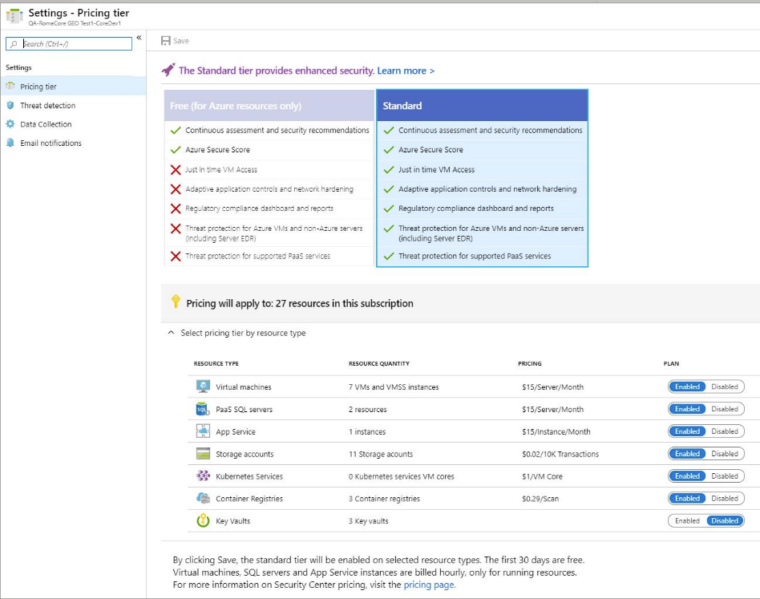

# Threat protection for Azure Key Vault (preview)

Advanced threat protection for Azure Key Vault provides an additional layer of security intelligence. This tool detects potentially harmful attempts to access or exploit Key Vault accounts. Using the native advanced threat protection in Azure Security Center, you can address threats without being a security expert, and without learning additional security monitoring systems.

When Security Center detects anomalous activity, it displays alerts. It also emails the subscription administrator with details of the suspicious activity and recommendations for how to investigate and remediate the identified threats.

## Configuring threat protection from Security Center

By default, advanced threat protection is enabled for all of your Key Vault accounts when you subscribe to Security Center's standard pricing tier. For more information, see [Pricing](security-center-pricing.md).

To enable or disable the protection for a specific subscription:

1. From the left pane in Security Center, select **Pricing & settings**.

1. Select the subscription with the storage accounts for which you want to enable or disable threat protection.

1. Select **Pricing tier**.

1. From the **Select pricing tier by resource type** group, find the **Key Vaults** row and select **Enabled** or **Disabled**.

    

1. Select **Save**.

## Next steps

In this article, you learned how to enable and disable advanced threat protection for Azure Key Vault. 

For related material, see the following articles:

- [Threat protection in Azure Security Center](threat-protection.md)--This article describes the sources of security alerts in Azure Security Center.
- [Key Vault security alerts](alerts-reference.md#alerts-azurekv)--The Key Vault section of the reference table for all Azure Security Center alerts