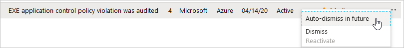

# Suppressing alerts from Azure Security Center's threat protection

The threat protection components of Azure Security Center detect threats in any area of your environment and generate security alerts.

When a single alert isn't interesting or relevant, you can dismiss it. Alternatively, use the suppression rules (preview) feature to automatically dismiss such alerts in the future. Typically, you'd use a suppression rule for:

- alerts that you know are false positives

- alerts that are being triggered too often to be useful

Your suppression rules define the criteria for which alerts should be automatically dismissed.

> [!TIP]
> Alerts that match your enabled suppression rules will still be generated, but their state will be set to **dismissed**. You can see the state in the Azure portal or however you access your Security Center security alerts.

## Creating a suppression rule

There are a few ways you can create rules to suppress unwanted security alerts:

- To suppress alerts at the management group level, use Azure Policy

- To suppress alerts at the subscription level, you can use the Azure portal or the REST API as explained below

Suppression rules can only dismiss alerts that have already been triggered on the selected subscriptions.

To create a rule directly in the Azure portal:

1. From Security Center's security alerts page:

    - Locate the specific alert you don't want to see any more, and from the ellipsis menu (...) for the alert, select **Auto-dismiss in the future**.
    

    - Or, select the **suppression rules** link at the top of the page, and from the suppression rules page select **Create new suppression rule**:
    

1. In the new suppression rule pane, enter the details of your new rule.

    > [!TIP]
    > If you opened the new rule page from a specific alert, the alert type and subscription will be automatically configured in your new rule. If you used the **Create new suppression rule** link, the selected subscriptions will match the current filter in the portal.

    

    - You can filter by multiple alert types.
    - Entities can be IP addresses, process names, user accounts, Azure resources, or locations

1. Optionally, test the rule using the **Simulate** button to see how many alerts that have already been triggered would have been dismissed if this rule had been active.

1. Save your alert. 

## Editing suppression rules 

## Deleting suppression rules

## Using the REST API to create and manage suppression rules

You can create, view, or delete alert suppression rules via Security Center's REST API. 

The relevant HTTP methods for suppression rules in the REST API are:

- **PUT**: To create or update a suppression rule in a specified subscription.

- **GET**:

    - To list all rules configured for a specified subscription. This method returns an array of the applicable rules.

    - To get the details of a specific rule on a specified subscription. This method returns one suppression rule.

    - To simulate the impact of a suppression rule still in the design phase. This call identifies which of your existing alerts would have been dismissed if the rule had been active.

- **DELETE**: Deletes an existing rule (but doesn't change the status of alerts already dismissed by it).

For full details and usage examples, see the [API documentation](https://docs.microsoft.com/api/securitycenter/). 

