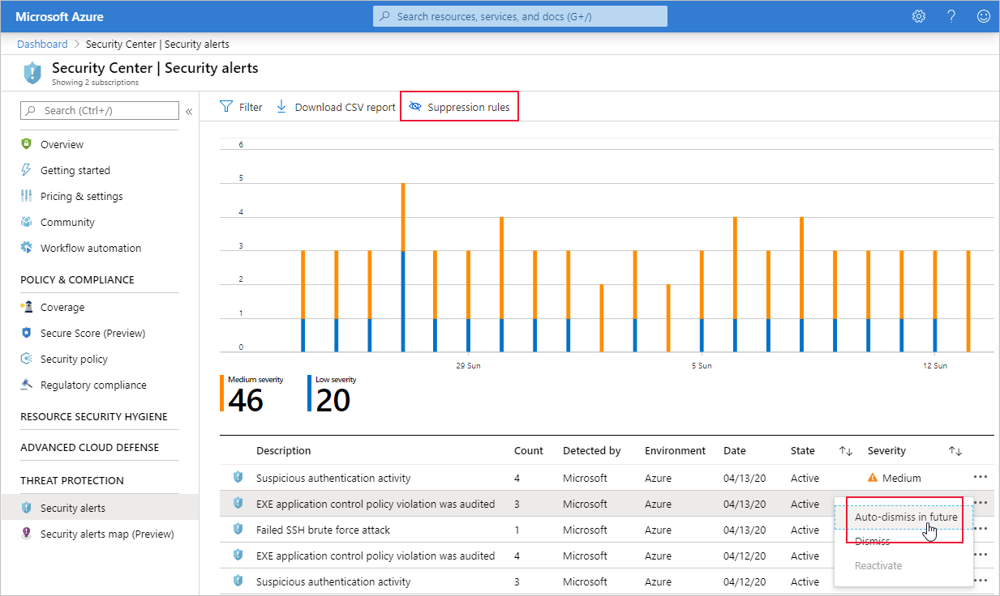
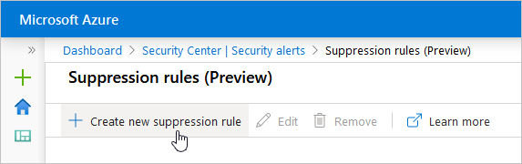
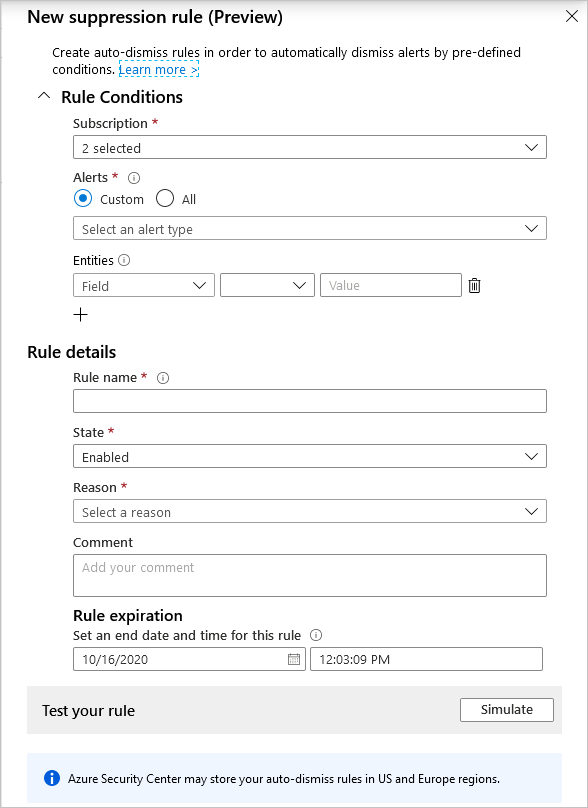
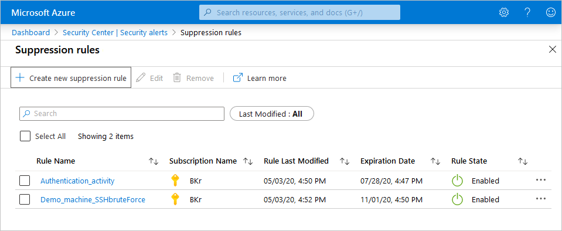
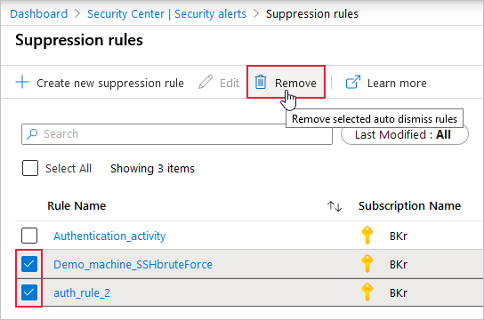
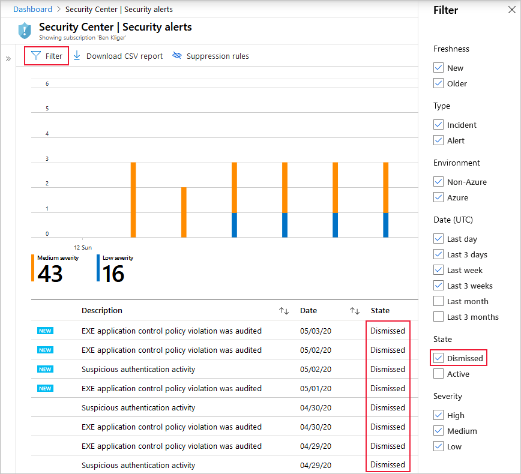

# Suppressing alerts from Azure Security Center's threat protection

This page explains how you can use alerts suppression rules to suppress false positives or other unwanted security alerts in Azure Security Center.

## Availability

- Release state: **Preview**
- Required roles: **Security admin** and **Owner** can create/delete rules. **Security reader** and **Reader** can view rules.
- Clouds: 
    - ✔ Commercial clouds
    - ✔ National/Sovereign (US Gov, China Gov, Other Gov)

## Introduction to suppression rules

The threat protection components of Azure Security Center detect threats in any area of your environment and generate security alerts.

When a single alert isn't interesting or relevant, you can manually dismiss it. Alternatively, use the suppression rules feature to automatically dismiss similar alerts in the future. Typically, you'd use a suppression rule to:

- suppress alerts that you've identified as false positives

- suppress alerts that are being triggered too often to be useful

Your suppression rules define the criteria for which alerts should be automatically dismissed.

> [!CAUTION]
> Suppressing security alerts reduces the threat protection of Security Center. You should carefully check the potential impact of any suppression rule, and monitor it over time.

## Creating a suppression rule

There are a few ways you can create rules to suppress unwanted security alerts:

- To suppress alerts at the management group level, use Azure Policy

- To suppress alerts at the subscription level, you can use the Azure portal or the REST API as explained below

Suppression rules can only dismiss alerts that have already been triggered on the selected subscriptions.

To create a rule directly in the Azure portal:

1. From Security Center's security alerts page:

    - Locate the specific alert you don't want to see anymore, and from the ellipsis menu (...) for the alert, select **Create suppression rule**:

        

    - Or, select the **suppression rules** link at the top of the page, and from the suppression rules page select **Create new suppression rule**:

        

1. In the new suppression rule pane, enter the details of your new rule.

    - Your rule can dismiss the alert on **all resources** so you don't get any alerts like this one in the future. 
    
    - Your rule can dismiss the alert **on specific criteria** - when it relates to a specific IP address, process name, user account, Azure resource, or location.

    > [!TIP]
    > If you opened the new rule page from a specific alert, the alert and subscription will be automatically configured in your new rule. If you used the **Create new suppression rule** link, the selected subscriptions will match the current filter in the portal.

    

1. Enter details of the rule:

    - **Name** - A name for the rule. Rule names must begin with a letter or a number, be between 2 and 50 characters, and contain no symbols other than dashes (-) or underscores (_). 
    - **State** - Enabled or disabled.
    - **Reason** - Select one of the built-in reasons or 'other' if they don't meet your needs.
    - **Expiration date** - An end date and time for the rule. Rules can run for up to six months.

1. Optionally, test the rule using the **Simulate** button to see how many alerts would have been dismissed if this rule had been active.

1. Save the rule. 

## Editing suppression rules

To edit the rules you've created, use the suppression rules page.

1. From Security Center's security alerts page, select the **suppression rules** link at the top of the page.

1. The suppression rules page opens listing all available rules according to the subscriptions currently selected. 

    

1. To edit a single rule, open the ellipsis menu (...) for the rule and select **Edit**.

1. Make the necessary changes and select **Apply**. 

## Deleting suppression rules

To delete one or more rules you've created, use the suppression rules page.

1. From Security Center's security alerts page, select the **suppression rules** link at the top of the page.

1. The suppression rules page opens listing all available rules according to the subscriptions currently selected. 

1. To delete a single rule, open the ellipsis menu (...) for the rule and select **Delete**.

1. To delete multiple rules, select the check boxes for the rules to be deleted and select **Delete**.

    

## Viewing alerts that have been suppressed

Alerts that match your enabled suppression rules will still be generated, but their state will be set to **dismissed**. You can see the state in the Azure portal or however you access your Security Center security alerts. 

> [!TIP]
> [Azure Sentinel](https://azure.microsoft.com/services/azure-sentinel/) won't create incidents for suppressed alerts. For other SIEMs, you can filter suppressed alerts by using the alerts' state ('dismissed').

Use Security Center's filter to view alerts that have been dismissed by your rules.

* From Security Center's security alerts page, open the filter options and select **Dismissed**.  

   

## Using the API to create and manage suppression rules

You can create, view, or delete alert suppression rules via Security Center's REST API. 

The relevant HTTP methods for suppression rules in the REST API are:

- **PUT**: To create or update a suppression rule in a specified subscription.

- **GET**:

    - To list all rules configured for a specified subscription. This method returns an array of the applicable rules.

    - To get the details of a specific rule on a specified subscription. This method returns one suppression rule.

    - To simulate the impact of a suppression rule still in the design phase. This call identifies which of your existing alerts would have been dismissed if the rule had been active.

- **DELETE**: Deletes an existing rule (but doesn't change the status of alerts already dismissed by it).

For full details and usage examples, see the [API documentation](https://docs.microsoft.com/rest/api/securitycenter/). 

## Next steps

This article described the suppression rules in Azure Security Center that automatically dismiss unwanted alerts.

For more information on security alerts in Azure Security Center, see the following pages:

- [Security alerts and the intent kill chain](alerts-reference.md) - A reference guide for the security alerts you might see in Azure Security Center's Threat Protection module.
- [Threat protection in Azure Security Center](threat-protection.md) - A description of the many aspects of your environment monitored by Azure Security Center's Threat Protection module.