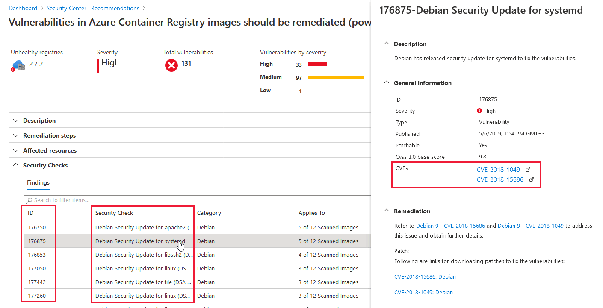

# Explore and manage your resources with asset inventory

The asset inventory page of Azure Security Center provides a single page for viewing the security posture of the resources you've connected to Security Center. 

Security Center periodically analyzes the security state of your Azure resources to identify potential security vulnerabilities. It then provides you with recommendations on how to remediate those vulnerabilities.

When any resource has outstanding recommendations, they'll appear in the inventory.

Use this view and its filters to address such questions as:

- Which of my subscriptions with Azure Defender enabled have outstanding recommendations?
- Which of my machines with the tag 'Production' are missing the Log Analytics agent?
- How many of my machines tagged with a specific tag have outstanding recommendations?
- How many resources in a specific resource group have security findings from a vulnerability assessment service?

The asset management possibilities for this tool are substantial and continue to grow. 

> [!TIP]
> The security recommendations on the asset inventory page are the same as those on the **Recommendations** page, but here they're shown according to the affected resource. For information about how to resolve recommendations, see [Implementing security recommendations in Azure Security Center](security-center-recommendations.md).

## Availability
|Aspect|Details|
|----|:----|
|Release state:|General Availability (GA)|
|Pricing:|Free|
|Required roles and permissions:|All users|
|Clouds:|:::image type="icon" source="./media/icons/yes-icon.png"::: Commercial clouds :::image type="icon" source="./media/icons/yes-icon.png"::: National/Sovereign (US Gov, Azure China 21Vianet)|
|||

## What are the key features of asset inventory?
The inventory page provides the following tools:

:::image type="content" source="media/asset-inventory/highlights-of-inventory.png" alt-text="Main features of the asset inventory page in Azure Security Center." lightbox="media/asset-inventory/highlights-of-inventory.png":::

### 1 - Summaries
Before you define any filters, a prominent strip of values at the top of the inventory view shows:

- **Total resources**: The total number of resources connected to Security Center.
- **Unhealthy resources**: Resources with active security recommendations. [Learn more about security recommendations](security-center-recommendations.md).
- **Unmonitored resources**: Resources with agent monitoring issues - they have the Log Analytics agent deployed, but the agent isn't sending data or has other health issues.
- **Unregistered subscriptions**: Any subscription in the selected scope that haven't yet been connected to Azure Security Center.

### 2 - Filters
The multiple filters at the top of the page provide a way to quickly refine the list of resources according to the question you're trying to answer. For example, if you wanted to answer the question *Which of my machines with the tag 'Production' are missing the Log Analytics agent?* you could combine the **Agent monitoring** filter with the **Tags** filter.

As soon as you've applied filters, the summary values are updated to relate to the query results. 

### 3 - Export and asset management tools

**Export options** - Inventory includes an option to export the results of your selected filter options to a CSV file. You can also export the query itself to Azure Resource Graph Explorer to further refine, save, or modify the Kusto Query Language (KQL) query.

> [!TIP]
> The KQL documentation provides a database with some sample data together with some simple queries to get the "feel" for the language. [Learn more in this KQL tutorial](/azure/data-explorer/kusto/query/tutorial?pivots=azuredataexplorer).

**Asset management options** - Inventory lets you perform complex discovery queries. When you've found the resources that match your queries, inventory provides shortcuts for operations such as:

- Assign tags to the filtered resources - select the checkboxes alongside the resources you want to tag.
- Onboard new servers to Security Center - use the **Add non-Azure servers** toolbar button.
- Automate workloads with Azure Logic Apps - use the **Trigger Logic App** button to run a logic app on one or more resources. Your logic apps have to be prepared in advance, and accept the relevant trigger type (HTTP request). [Learn more about logic apps](../logic-apps/logic-apps-overview.md).

## How does asset inventory work?

Asset inventory utilizes [Azure Resource Graph (ARG)](../governance/resource-graph/index.yml), an Azure service that provides the ability to query Security Center's security posture data across multiple subscriptions.

ARG is designed to provide efficient resource exploration with the ability to query at scale.

Using the [Kusto Query Language (KQL)](/azure/data-explorer/kusto/query/), asset inventory can quickly produce deep insights by cross-referencing ASC data with other resource properties.

## How to use asset inventory

1. From Security Center's sidebar, select **Inventory**.

1. Use the **Filter by name** box to display a specific resource, or use the filters as described below.

1. Select the relevant options in the filters to create the specific query you want to perform.

    By default, the resources are sorted by the number of active security recommendations.

    > [!IMPORTANT]
    > The options in each filter are specific to the resources in the currently selected subscriptions **and** your selections in the other filters.
    >
    > For example, if you've selected only one subscription, and the subscription has no resources with outstanding security recommendations to remediate (0 unhealthy resources), the **Recommendations** filter will have no options. 

    :::image type="content" source="./media/asset-inventory/filtering-to-prod-unmonitored.gif" alt-text="Using the filter options in Azure Security Center's asset inventory to filter resources to production resources that aren't monitored":::

1. To use the **Security findings contain** filter, enter free text from the ID, security check, or CVE name of a vulnerability finding to filter to the affected resources:

    

    > [!TIP]
    > The **Security findings contain** and **Tags** filters only accept a single value. To filter by more than one, use **Add filters**.

1. To use the **Azure Defender** filter, select one or more options (Off, On, or Partial):

    - **Off** - Resources that aren't protected by an Azure Defender plan. You can right-click on any of these and upgrade them:

        :::image type="content" source="./media/asset-inventory/upgrade-resource-inventory.png" alt-text="Upgrade a resource to Azure Defender from right click." lightbox="./media/asset-inventory/upgrade-resource-inventory.png":::

    - **On** - Resources that are protected by an Azure Defender plan
    - **Partial** - This applies to **subscriptions** that have some but not all of the Azure Defender plans disabled. For example, the following subscription has five Azure Defender plans disabled. 

        :::image type="content" source="./media/asset-inventory/pricing-tier-partial.png" alt-text="Subscription partially on Azure Defender.":::

1. To further examine the results of your query, select the resources that interest you.

1. To view the current selected filter options as a query in Resource Graph Explorer, select **Open query**.

    

1. If you've defined some filters and left the page open, Security Center won't update the results automatically. Any changes to resources won't impact the displayed results unless you manually reload the page or select **Refresh**.

## FAQ - Inventory

### Why aren't all of my subscriptions, machines, storage accounts, etc. shown?

The inventory view lists your Security Center connected resources from a Cloud Security Posture Management (CSPM) perspective. The filters don't return every resource in your environment; only the ones with outstanding (or 'active') recommendations. 

For example, the following screenshot shows a user with access to 38 subscriptions but only 10 currently have recommendations. So when they filter by **Resource type = Subscriptions**, only those 10 subscriptions with active recommendations appear in the inventory:

:::image type="content" source="./media/asset-inventory/filtered-subscriptions-some.png" alt-text="Not all subs returned when there are no active recommendations.":::

### Why do some of my resources show blank values in the Azure Defender or agent monitoring columns?

Not all Security Center monitored resources have agents. For example, Azure Storage accounts or PaaS resources such as disks, Logic Apps, Data Lake Analysis, and Event Hub.

When pricing or agent monitoring isn't relevant for a resource, nothing will be shown in those columns of inventory.

:::image type="content" source="./media/asset-inventory/agent-pricing-blanks.png" alt-text="Some resources show blank info in the agent monitoring or Azure Defender columns.":::

## Next steps

This article described the asset inventory page of Azure Security Center.

For more information on related tools, see the following pages:

- [Azure Resource Graph (ARG)](../governance/resource-graph/index.yml)
- [Kusto Query Language (KQL)](/azure/data-explorer/kusto/query/)