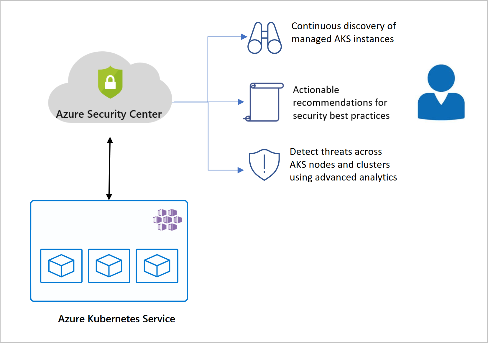
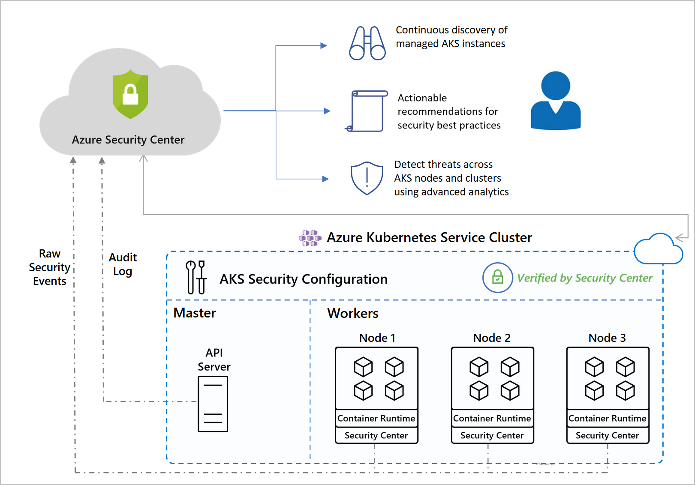

# Azure Kubernetes Services integration with Security Center

Azure Kubernetes Service (AKS) is Microsoft's managed service for developing, deploying, and managing containerized applications. 

If you're on Azure Security Center's standard tier, you can add the AKS bundle (see [pricing](security-center-pricing.md)) to gain deeper visibility to your AKS nodes, cloud traffic, and security controls.

Together, Security Center and AKS form the best cloud-native Kubernetes security offering.

## What are the components of Security Center's Kubernetes protection?

Security Center's protections for Kubernetes are provided by a combination of two elements:

- **Azure Security Center's threat protection for virtual machines** - Using the same Log Analytics agent that Security Center uses on other VMs, Security Center can show you security issues occurring on your AKS nodes. The agent also monitors for container-specific analytics.

- **Azure Security Center's optional Kubernetes bundle** - The Kubernetes bundle receives logs and information from the Kubernetes subsystem via the AKS service. These logs are already available in Azure through the AKS service. When you enable Security Center's Kubernetes bundle, you grant Security Center access to the logs. So Security Center brings security benefits to your AKS clusters using data already gathered by the AKS master node. Some of the data scanned by Azure Security Center from your Kubernetes environment may contain sensitive information.

    

## What protections are provided?

Using the two services together provides:

* **Security recommendations** - Security Center identifies your AKS resources and categorizes them: from clusters to individual virtual machines. You can then view security recommendations per resource. For more information, see the containers recommendations in the [reference list of recommendations](recommendations-reference.md#recs-containers). 

* **Environment hardening** - Security Center constantly monitors the configuration of your Kubernetes clusters and Docker configurations. It then generates security recommendations that reflect industry standards.

* **Run-time protection** - Through continuous analysis of the following AKS sources, Security Center alerts you to threats and malicious activity detected at the host *and* AKS cluster level. [Learn more about threat protection for containers](threat-protection.md#azure-containers).

     

## AKS with Security Center FAQ

### Can I still get AKS protections without the Log Analytics agent?

As mentioned above, the optional Kubernetes bundle provides protections at the cluster level, the Log Analytics agent of Azure Security Center standard tier protect your nodes. 

We recommend deploying both, for the most complete protection possible.

If you choose not to install the agent on your hosts, you will only receive a subset of the threat protection benefits and security alerts. You'll still receive alerts related to network analysis and communications with malicious servers.

## Next steps

To learn more about Security Center's container security features, see:

* [Azure Security Center and container security](container-security.md)

* [Integration with Azure Container Registry](azure-container-registry-integration.md)

* [Data management at Microsoft](https://www.microsoft.com/trust-center/privacy/data-management) - Describes the data policies of Microsoft services (including Azure, Intune, and Microsoft 365), details of Microsoft's data management, and the retention policies that affect your data
