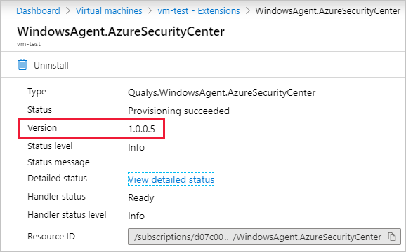

# Integrated vulnerability scanner for virtual machines (Standard tier only)

The vulnerability scanner included with Azure Security Center is powered by Qualys and widely recognized as the leading tool for identifying vulnerabilities in real time across your Azure Virtual Machines. It is only available to users on the Standard pricing tier. This feature is currently in preview.  

> [!NOTE]
> Security Center supports the integration of tools from other vendors, but you'll need to handle the licensing costs, deployment, and configuration. For more information, see [Deploying a partner vulnerability scanning solution](partner-vulnerability-assessment.md).

## Deploying the Qualys built-in vulnerability scanner (Standard tier only)

The simplest way to scan your Azure-based virtual machines for vulnerabilities is to use the built-in vulnerability scanner. 

To deploy the vulnerability scanner extension:

1. Open Azure Security Center and go to the **Recommendations** page. 

1. Select the recommendation named "Enable the built-in vulnerability assessment solution on virtual machines (powered by Qualys)".

    > [!IMPORTANT]
    > This preview recommendation is being rolled-out slowly across all regions. If you don't see it and want to use this feature, contact support.

    

    Your VMs will appear in one or more of the following groups:
    * **Healthy resources** – the vulnerability scanner extension has been deployed to these VMs.
    * **Unhealthy resources** – the vulnerability scanner extension can be deployed to these VMs. 
    * **Not applicable resources** – These can’t have the vulnerability scanner extension deployed. This could be because they are on the free pricing tier, or the OS isn’t supported.

1. From the Unhealthy resources tab, select the VMs on which you want to deploy the Qualys scanner and click **Remediate**. 

    

    The scanner extension will be installed on all of the selected VMs.
    
    Scanning begins automatically as soon as the extension is successfully deployed.

    > [!TIP]
    > For a list of your VMs that already have the Azure Security Center Vulnerability Assessment extension (powered by Qualys) deployed, select the "Healthy Resources" tab. 

## Viewing and remediating discovered vulnerabilities

When Security Center identifies vulnerabilities, it presents findings and related information (remediation steps, related CVEs, CVSS scores, and more) as recommendations. You can view the identified vulnerabilities for one or more subscriptions, or for a specific virtual machine.

To see the findings and remediate the identified vulnerability:

1. Open Azure Security Center and go to the **Recommendations** page. 

1. Select the recommendation named "Remediate vulnerabilities found on your virtual machines (powered by Qualys)".

    Security Center shows you all the findings for all VMs in the currently selected subscriptions. The findings are ordered by severity. 

    

1. To filter the findings by a specific VM, open the "Affected resources" section and click the VM that interests you. Alternatively, select a VM from the resource health view, and view all relevant recommendations for that resource.

    Security Center shows the findings for that VM, ordered by severity. 

    

    In this example, you can see that 94 vulnerabilities were discovered and that 5 of them are medium severity.

1. To learn more about a specific vulnerability, select it. 

    

    The details pane that appears contains extensive information about the vulnerability, including:
    
    * Links to all relevant CVEs (where available)
    * Remediation steps
    * Any additional reference pages

1. To remediate a finding, follow the remediation steps from this details pane.

## Built-in Qualys vulnerability scanner FAQ

### Are there any additional charges for the Qualys license?
No. The built-in scanner is free to all Standard tier users. No additional licenses are required and the scanner that the "Enable the built-in vulnerability assessment solution on virtual machines (powered by Qualys)" recommendation deploys includes all the necessary licensing and configuration information.  

### If I have an existing Qualys solution, can I add the Azure Security Center extension as well?
If you've already configured some of your virtual machines to use a pre-existing Qualys license, Security Center will identify that the solution is deployed. You won't see a recommendation to install the Security Center extension. You can choose to leave your existing solution in place while simultaneously deploying the new Security Center extension to other virtual machines. Or you can remove your existing Qualys scanner and add the Security Center extension as described above. 

If you're a Standard tier customer, and you've already deployed a vulnerability assessment tool (Qualys or Rapid7) you'll still see your existing solution. Your findings will still appear in Security Center. To deploy a scanner on a virtual machine without any existing vulnerability assessment tool deployed, you must deploy the new Security Center extension that's powered by Qualys. 

Findings will be split between the two recommendation screens.

### Why don't I see the "Enable the built-in vulnerability assessment solution (powered by Qualys)" recommendation?
If you are on the free tier of Security Center, you will not see the new Qualys recommendation; it's only available on the Standard tier. 

### What permissions are required to install the Qualys extension?
The Azure Security Center Vulnerability Assessment extension (powered by Qualys), like other extensions, runs on top of the Azure Virtual Machine agent. So it runs as Local Host on Windows, and Root on Linux.

### Can I remove the Security Center Qualys extension? 
If you want to remove the extensions from a VM, you can do it manually or with any of your programmatic tools. 

You'll need the following details:

* On Linux, the extension is called "LinuxAgent.AzureSecurityCenter" and provider name is "Qualys"
* On Windows, the extension is called "WindowsAgent.AzureSecurityCenter" and provider name is "Qualys"

### How does the extension get updated?
Like the Azure Security Center agent as well as all Azure extensions, minor versions of the Qualys scanner may be automatically updated in the background. All agents and extensions are tested extensively before being automatically deployed.

Some updates to the vulnerability scanner extension may require manual deployment. For example, **if you are running v1.0.0.4, you must take the following steps**:

1. Verify the version of the Qualys vulnerability scanner extension running on your VM:

    1. From the Azure Portal, open Virtual machines.
    1. Select the VM on which the agent is installed.
    1. From the sidebar navigation, open **Extensions** and select the following extension:

        Name: **WindowsAgent.AzureSecurityCenter** Type: **Qualys.WindowsAgent.AzureSecurityCenter**

    1. Review the version information of the extension.

        

    1. If the version is 1.0.0.4, click **Uninstall** and wait until the extension is no longer listed in the Extensions page of the VM.

    1. Restart the VM and, when its status is "Running", deploy the vulnerability scanner extension using the  recommendation "Enable the built-in vulnerability assessment solution on virtual machines (powered by Qualys) (Preview)" as described above in (Deploying the Qualys built-in vulnerability scanner)[#deploying-the-qualys-built-in-vulnerability-scanner-standard-tier-only].

### What is scanned by the built-in vulnerability scanner?
The scanner is running on your virtual machine and looking for vulnerabilities of the VM itself. From the virtual machine, it cannot scan your network.

### Does the scanner integrate with my existing Qualys console?
The Security Center extension is a separate tool from your existing Qualys scanner and, due to licensing restrictions, can only be used within Azure Security Center.

### Microsoft Defender Advanced Threat Protection also includes Threat & Vulnerability Management (TVM). How is the Security Center Vulnerability Assessment extension different?
Microsoft is actively developing world-class vulnerability management with Microsoft Defender ATP’s Threat & Vulnerability Management solution, built into Windows.

Today, Azure Security Center’s Vulnerability Assessment extension is powered by Qualys. This ensures support for both Windows and Linux virtual machines. The extension also benefits from Qualys's own knowledge of vulnerabilities that don't yet have CVEs.

## Next steps
This article described the Azure Security Center Vulnerability Assessment extension (powered by Qualys) for scanning your VMs. For related material, see the following articles:

- [Learn about the different elements of a recommendation](security-center-recommendations.md)
- [Learn how to remediate recommendations](security-center-remediate-recommendations.md)