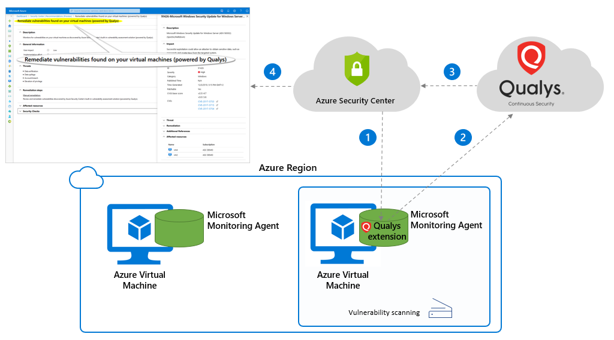
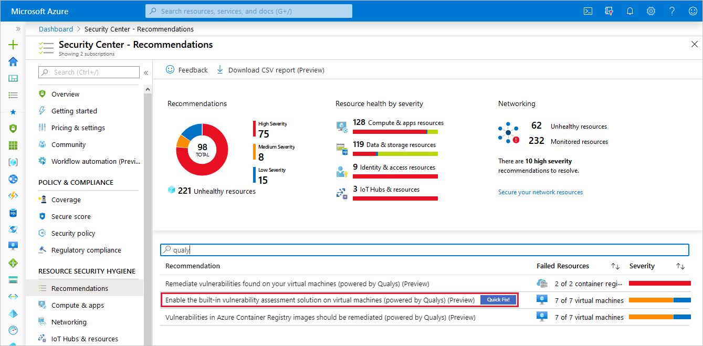
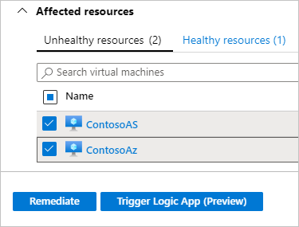
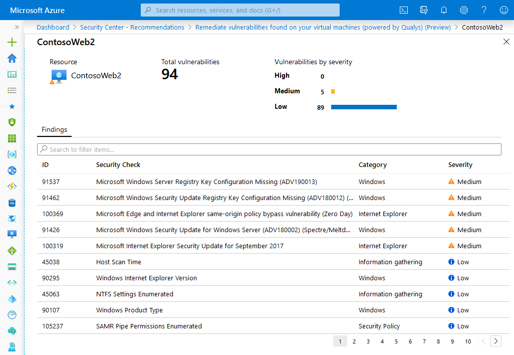
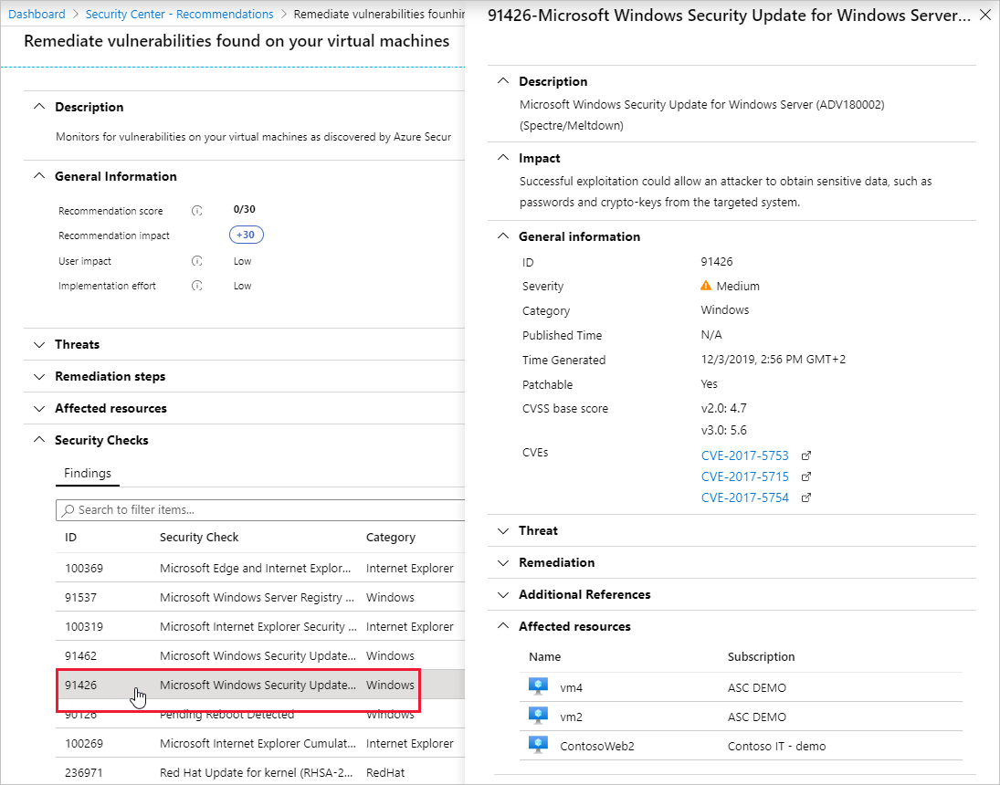

# Integrated vulnerability scanner for virtual machines (Standard tier only)

The vulnerability scanner included with Azure Security Center is powered by Qualys. Qualys's scanner is the leading tool for real-time identification of vulnerabilities in your Azure Virtual Machines. It's only available to users on the standard pricing tier. You don't need a Qualys license or even a Qualys account - everything's handled seamlessly inside Security Center.

> [!NOTE]
> Security Center supports the integration of tools from other vendors, but you'll need to handle the licensing costs, deployment, and configuration. For more information, see [Deploying a partner vulnerability scanning solution](partner-vulnerability-assessment.md). You can also use those instructions to integrate your organization's own Qualys license, if you choose not to use the built-in vulnerability scanner included with Azure Security Center.

## Availability

- Release state: **Generally Available**
- Required roles: **Resource owner** can deploy the scanner. **Security reader** can view findings.
- Clouds: 
    - ✔ Commercial clouds
    - ✘ National/Sovereign (US Gov, China Gov, Other Gov)

## Overview of the integrated vulnerability scanner

The vulnerability scanner extension works as follows:

1. **Deploy** - Azure Security Center deploys the Qualys extension to the selected virtual machine/s.

1. **Gather information** - The extension collects artifacts and sends them for analysis in the Qualys cloud service in the defined region.

1. **Analyze** - Qualys's cloud service conducts the vulnerability assessment and sends its findings to Security Center. 

    > [!IMPORTANT]
    > To ensure the privacy, confidentiality, and security of our customers, Microsoft doesn't share customer details with Qualys. [Learn more about the privacy standards built into Azure](https://www.microsoft.com/trust-center/privacy).

1. **Report** - The findings are available to you in Security Center.

## Deploying the Qualys built-in vulnerability scanner

The simplest way to scan your Azure-based virtual machines for vulnerabilities is to use the built-in vulnerability scanner. 

To deploy the vulnerability scanner extension:

1. Open Azure Security Center and go to the **Recommendations** page for a subscription on the standard pricing tier.

1. Select the recommendation named **"Enable the built-in vulnerability assessment solution on virtual machines (powered by Qualys)"**.

    

    Your VMs will appear in one or more of the following groups:

    * **Healthy resources** – the vulnerability scanner extension has been deployed to these VMs.
    * **Unhealthy resources** – the vulnerability scanner extension can be deployed to these VMs. 
    * **Not applicable resources** – these VMs can't have the vulnerability scanner extension deployed. Your VM might be in this tab because it's on the free pricing tier, it's missing the ImageReference class (relevant to custom images and VMs restored from backup, as explained in [this Azure for .NET page](https://docs.microsoft.com/dotnet/api/microsoft.azure.batch.imagereference?view=azure-dotnet)), or it's not running one of the supported OSes:

        | **Vendor** | **OS** | **Supported versions** |
        |----|----|----|
        |Microsoft|Windows|All|
        |Red Hat|Enterprise Linux|5.4+, 6, 7.0-7.7, 8|
        |Red Hat|CentOS|5.4+, 6, 7.0-7.7|
        |Red Hat|Fedora|22-25|
        |SUSE|Linux Enterprise Server (SLES)|11, 12, 15|
        |SUSE|OpenSUSE|12, 13|
        |SUSE|Leap|42.1|
        |Oracle|Enterprise Linux|5.11, 6, 7.0-7.5|
        |Debian|Debian|7.x-9.x|
        |Ubuntu|Ubuntu|12.04 LTS, 14.04 LTS, 15.x, 16.04 LTS, 18.04 LTS|

1. From the Unhealthy resources tab, select the VMs on which you want to deploy the Qualys scanner and click **Remediate**. 

    

    The scanner extension will be installed on all of the selected VMs.
    
    Scanning begins automatically as soon as the extension is successfully deployed. Scans will then run at four-hour intervals. This interval is hard-coded and not configurable. 

1. If the deployment fails on one or more VMs, ensure the target VMs can communicate with Qualys's cloud service on the following two IP addresses (via port 443 - the default for HTTPS):

    - 64.39.104.113
    - 154.59.121.74 

## Viewing and remediating discovered vulnerabilities

When Security Center identifies vulnerabilities, it presents findings and related information as recommendations. The related information includes remediation steps, related CVEs, CVSS scores, and more. You can view the identified vulnerabilities for one or more subscriptions, or for a specific VM.

To see the findings and remediate the identified vulnerability:

1. Open Azure Security Center and go to the **Recommendations** page. 

1. Select the recommendation named "Remediate vulnerabilities found on your virtual machines (powered by Qualys)".

    Security Center shows you all the findings for all VMs in the currently selected subscriptions. The findings are ordered by severity. 

    

1. To filter the findings by a specific VM, open the "Affected resources" section and click the VM that interests you. Or you can select a VM from the resource health view, and view all relevant recommendations for that resource.

    Security Center shows the findings for that VM, ordered by severity. 

    

    In this example, you can see that 94 vulnerabilities were discovered and that 5 of them are medium severity.

1. To learn more about a specific vulnerability, select it. 

    

    The details pane that appears contains extensive information about the vulnerability, including:
    
    * Links to all relevant CVEs (where available)
    * Remediation steps
    * Any additional reference pages

1. To remediate a finding, follow the remediation steps from this details pane.

## Exporting results

To export vulnerability assessment results, you'll need to use [Azure Resource Graph](https://azure.microsoft.com/features/resource-graph/) (ARG). This tool provides instant access to resource information across your cloud environments with robust filtering, grouping, and sorting capabilities. It's a quick and efficient way to query information across Azure subscriptions programmatically or from within the Azure portal.

For full instructions and a sample ARG query, see this Tech Community post: [Exporting Vulnerability Assessment Results in Azure Security Center](https://techcommunity.microsoft.com/t5/azure-security-center/exporting-vulnerability-assessment-results-in-azure-security/ba-p/1212091).

## Built-in Qualys vulnerability scanner FAQ

### Are there any additional charges for the Qualys license?
No. The built-in scanner is free to all standard tier users. The "Enable the built-in vulnerability assessment solution on virtual machines (powered by Qualys)" recommendation deploys the scanner with its licensing and configuration information. No additional licenses are required. 

### What prerequisites and permissions are required to install the Qualys extension?
You'll need write permissions for any VM on which you want to deploy the extension.

The Azure Security Center Vulnerability Assessment extension (powered by Qualys), like other extensions, runs on top of the Azure Virtual Machine agent. So it runs as Local Host on Windows, and Root on Linux.

During setup, Security Center checks to ensure that the VM can communicate with Qualys's cloud service on the following two IP addresses (via port 443 - the default for HTTPS):

- 64.39.104.113
- 154.59.121.74

### Can I remove the Security Center Qualys extension? 
If you want to remove the extensions from a VM, you can do it manually or with any of your programmatic tools. 

You'll need the following details:

* On Linux, the extension is called "LinuxAgent.AzureSecurityCenter" and provider name is "Qualys"
* On Windows, the extension is called "WindowsAgent.AzureSecurityCenter" and provider name is "Qualys"

### How does the extension get updated?
Like the Azure Security Center agent itself and all other Azure extensions, minor updates of the Qualys scanner may automatically happen in the background. All agents and extensions are tested extensively before being automatically deployed.

### Why does my VM show as "not applicable" in the recommendation?
The recommendation details page for the **"Enable the built-in vulnerability assessment solution on virtual machines (powered by Qualys)"** recommendation groups your VMs in one or more of the following lists: **Healthy resources**, **Unhealthy resources**, and **Not applicable resources**.

If you have VMs in the **Not applicable resources** group it means Security Center can't deploy the vulnerability scanner extension on those VMs. 

Your VM might be in this tab because:

- It's on the free pricing tier - As explained above, the vulnerability scanner included with Azure Security Center is  only available to users on the standard pricing tier.

- It's missing the ImageReference class (relevant to custom images and VMs restored from backup, as explained in [this Azure for .NET page](https://docs.microsoft.com/dotnet/api/microsoft.azure.batch.imagereference?view=azure-dotnet)).

- It's not running one of the supported OSes:

    | **Vendor** | **OS** | **Supported versions** |
    |----|----|----|
    |Microsoft|Windows|All|
    |Red Hat|Enterprise Linux|5.4+, 6, 7.0-7.7, 8|
    |Red Hat|CentOS|5.4+, 6, 7.0-7.7|
    |Red Hat|Fedora|22-25|
    |SUSE|Linux Enterprise Server (SLES)|11, 12, 15|
    |SUSE|OpenSUSE|12, 13|
    |SUSE|Leap|42.1|
    |Oracle|Enterprise Linux|5.11, 6, 7.0-7.5|
    |Debian|Debian|7.x-9.x|
    |Ubuntu|Ubuntu|12.04 LTS, 14.04 LTS, 15.x, 16.04 LTS, 18.04 LTS|

### What is scanned by the built-in vulnerability scanner?
The scanner is running on your virtual machine and looking for vulnerabilities of the VM itself. From the virtual machine, it can't scan your network.

### Does the scanner integrate with my existing Qualys console?
The Security Center extension is a separate tool from your existing Qualys scanner. Licensing restrictions mean that it can only be used within Azure Security Center.

### Microsoft Defender Advanced Threat Protection also includes Threat & Vulnerability Management (TVM). How is the Security Center Vulnerability Assessment extension different?
Microsoft is actively developing world-class vulnerability management with Microsoft Defender ATP's Threat & Vulnerability Management solution, built into Windows.

Today, Azure Security Center's Vulnerability Assessment extension is powered by Qualys. The Qualys extension ensures support for both Windows and Linux VMs. The extension also benefits from Qualys's own knowledge of vulnerabilities that don't yet have CVEs.

## Next steps
This article described the Azure Security Center Vulnerability Assessment extension (powered by Qualys) for scanning your VMs. For related material, see the following articles:

- [Learn about the different elements of a recommendation](security-center-recommendations.md)
- [Learn how to remediate recommendations](security-center-remediate-recommendations.md)