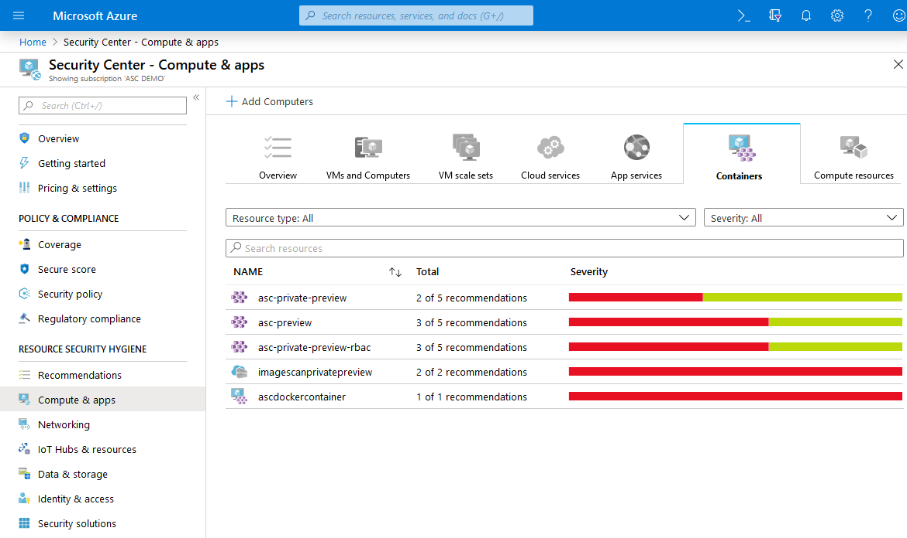

# Container security in Security Center

Azure Security Center is the Azure-native solution for securing your containers. Security Center can protect the following container resource types:

|Resource |Name  |Details  |
|:---------:|---------|---------|
||Container hosts (virtual machines that are running Docker)|Security Center scans your Docker configurations and gives you visibility into misconfigurations by providing a list of all failed rules that were assessed. Security Center provides guidelines to help you resolve these issues quickly and save time. Security Center continuously assesses the Docker configurations and provides you with their latest state.|
||Azure Kubernetes Service (AKS) clusters|Gain deeper visibility to your AKS nodes, cloud traffic, and security controls with [Security Center's optional AKS bundle](azure-kubernetes-service-integration.md) for standard tier users.|
||Azure Container Registry (ACR) registries|Gain deeper visibility into the vulnerabilities of the images in your ARM-based ACR registries with [Security Center's optional ACR bundle](azure-kubernetes-service-integration.md) for standard tier users.|
||||

This article describes how you can use these bundles to improve, monitor, and maintain the security of your containers and their apps. You'll learn how Security Center helps with these core aspects of container security:

- [Vulnerability management - scanning container images](#vulnerability-management---scanning-container-images)
- [Environment hardening - continuous monitoring of your Docker configuration and Kubernetes clusters](#environment-hardening)
- [Run-time protection - Real-time threat detection](#run-time-protection---real-time-threat-detection)

For instructions on how to use these features, see [Monitoring the security of your containers](monitor-container-security.md).

## Vulnerability management - scanning container images
To monitor your ARM-based Azure Container Registry, ensure you're on Security Center's standard tier (see [pricing](/azure/security-center/security-center-pricing)). Then, enable the optional Container Registries bundle. When a new image is pushed, Security Center scans the image using a scanner from the industry-leading vulnerability scanning vendor, Qualys.

When issues are found – by Qualys or Security Center – you'll get notified in the Security Center dashboard. For every vulnerability, Security Center provides actionable recommendations, along with a severity classification, and guidance for how to remediate the issue. For details of Security Center's recommendations for containers, see the [reference list of recommendations](recommendations-reference.md#recs-containers).

Security Center filters and classifies findings from the scanner. When an image is healthy, Security Center marks it as such. Security Center generates security recommendations only for images that have issues to be resolved. By only notifying when there are problems, Security Center reduces the potential for unwanted informational alerts.

## Environment hardening

### Continuous monitoring of your Docker configuration
Azure Security Center identifies unmanaged containers hosted on IaaS Linux VMs, or other Linux machines running Docker containers. Security Center continuously assesses the configurations of these containers. It then compares them with the [Center for Internet Security (CIS) Docker Benchmark](https://www.cisecurity.org/benchmark/docker/).

Security Center includes the entire ruleset of the CIS Docker Benchmark and alerts you if your containers don't satisfy any of the controls. When it finds misconfigurations, Security Center generates security recommendations. Use the **recommendations page** to view recommendations and remediate issues. You'll also see the recommendations on the **Containers** tab that displays all virtual machines deployed with Docker. 

For details of the relevant Security Center recommendations that might appear for this feature, see the [container section](recommendations-reference.md#recs-containers) of the recommendations reference table.

When you're exploring the security issues of a VM, Security Center provides additional information about the containers on the machine. Such information includes the Docker version and the number of images running on the host. 

>[!NOTE]
> These CIS benchmark checks will not run on AKS-managed instances or Databricks-managed VMs.

### Continuous monitoring of your Kubernetes clusters
Security Center works together with Azure Kubernetes Service (AKS), Microsoft's managed container orchestration service for developing, deploying, and managing containerized applications.

AKS provides security controls and visibility into the security posture of your clusters. Security Center uses these features to:
* Constantly monitor the configuration of your AKS clusters
* Generate security recommendations aligned with industry standards

For details of the relevant Security Center recommendations that might appear for this feature, see the [container section](recommendations-reference.md#recs-containers) of the recommendations reference table.

## Run-time protection - Real-time threat detection

[!INCLUDE [AKS in ASC threat protection](../../includes/security-center-azure-kubernetes-threat-protection.md)]

## Next steps

In this overview, you learned about the core elements of container security in Azure Security Center. Continue to [how to monitor the security of your containers](monitor-container-security.md).
> [!div class="nextstepaction"]
> [Monitoring the security of your containers](monitor-container-security.md)