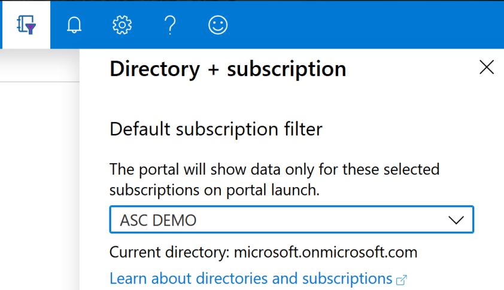

# Export security alerts and recommendations (Preview)

Azure Security Center generates detailed security alerts and recommendations. You can view these in the portal or through programmatic tools. You may also need to export this information or send it to other monitoring tools in your environment. 

This article describes the set of (preview) tools that allow you to export alerts and recommendations either manually or in an ongoing, continuous fashion.

Using these tools you can:

* Generate detailed reports as CSV
* Export to Log Analytics workspaces
* Export to Azure Event Hubs (for integrations with third-party SIEMs)

## Setting up a continuous export

1. From Security Center's sidebar, click **Pricing & settings**.

1. Select the specific subscription for which you want to configure the data export.
    
1. From the sidebar of the settings page for that subscription, select **Continuous Export (Preview)**.

    
    Here you see the export options. There's a tab for each available export target. 

1. Select the data type you’d like to export and choose from the filters on each type (for example, export only high severity alerts).

1. From the “Export target” area, choose where you’d like the data saved. Data can be saved in a target on a different subscription (for example on a Central Event Hub instance or a central Log Analytics workspace).

1. Click **Save**.

## Continuous export through Azure Event Hubs  

> [!NOTE]
> The most effective method to stream monitoring data to external tools in most cases is using Azure Event Hubs. [This article](https://docs.microsoft.com/azure/azure-monitor/platform/stream-monitoring-data-event-hubs) provides a brief description for how you can stream monitoring data from different sources to an Event Hub and links to detailed guidance.

> [!NOTE]
> If you previously exported Security Center alerts to a SIEM using Azure Activity log, the procedure below replaces that methodology.

### To integrate with a SIEM 

After you have configured continuous export of your chosen Security Center data to Azure Event Hubs, you can set up the appropriate connector on your SIEM by following the instructions below.

Follow the instructions relevant to your SIEM from [this page](https://azure.microsoft.com/blog/use-azure-monitor-to-integrate-with-siem-tools/?cdn=disable) and use the relevant connector:

* **Splunk** - Use the [Azure Monitor Add-On for Splunk](https://splunkbase.splunk.com/app/3534/)
* **IBM QRadar** - Use [a manually configured log source](https://www.ibm.com/support/knowledgecenter/SS42VS_DSM/com.ibm.dsm.doc/t_logsource_microsoft_azure_event_hubs.html)
* **ArcSight** – Use [SmartConnector](https://community.microfocus.com/t5/ArcSight-Connectors/SmartConnector-for-Microsoft-Azure-Monitor-Event-Hub/ta-p/1671292)

If you're using **Azure Sentinel**, use the native Azure Security Center alerts [data connector](https://docs.microsoft.com/azure/sentinel/connect-azure-security-center) offered there.

Also, if you'd like to move the continuously exported data automatically from your configured Event Hub to Azure Data Explorer, use the instructions in [Ingest data from Event Hub into Azure Data Explorer](https://docs.microsoft.com/azure/data-explorer/ingest-data-event-hub).

## Continuous export to Log Analytics workspace

To export to Log Analytics workspace, you must have Security Center's free or standard tier Log Analytics solutions enabled on your workspace. If you're using the Azure portal, the Security Center free tier solution is automatically enabled when you enable continuous export. However, if you're configuring your continuous export settings programmatically, you must manually select the free or standard pricing tier for the required workspace from within **Pricing & settings**.  

Security alerts and recommendations are stored in the *SecurityAlert* and *SecurityRecommendations* tables respectively. The name of the Log Analytics solution containing these tables depends on whether you are on the free or standard tier (see [pricing](security-center-pricing.md)): Security or SecurityCenterFree.

## Manual one-time export of security alerts

To download a CSV report for alerts or recommendations, open the **Security alerts** or **Recommendations** page and click **Download CSV report (Preview)** button.

> [!NOTE]
> These reports contain alerts and recommendations for resources from the currently selected subscriptions in the Directory + subscription filter in the Azure Portal:
> 

## Next steps

In this article, you learned how to configure continuous exports of your recommendations and alerts. You also learned how to download your alerts data as a CSV file. 

For related material, see the following documentation: 

- [Azure Event Hubs documentation](https://docs.microsoft.com/azure/event-hubs/)
- [Azure Sentinel documentation](https://docs.microsoft.com/azure/sentinel/)
- [Azure Monitor documentation](https://docs.microsoft.com/azure/azure-monitor/)