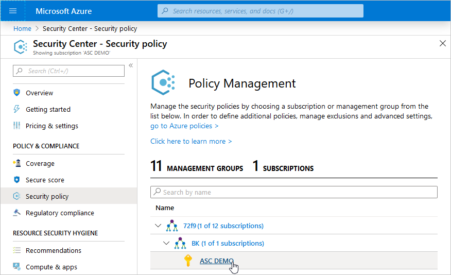
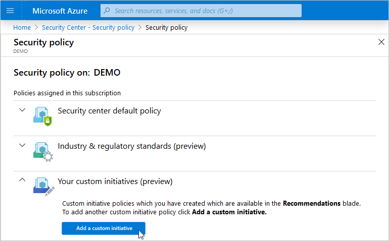
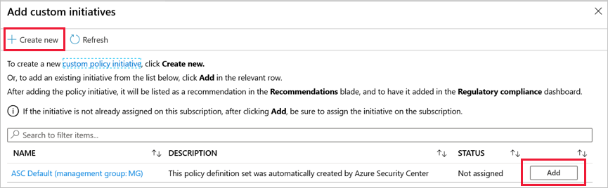
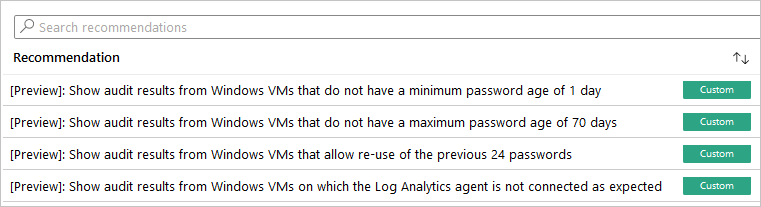

# Create custom security initiatives and policies

To help secure your systems and environment, Azure Security Center generates security recommendations. These recommendations are based on industry best practices, which are incorporated into the generic, default security policy supplied to all customers. They can also come from Security Center's knowledge of industry and regulatory standards.

With this feature, you can add your own *custom* initiatives. You'll then receive recommendations if your environment doesn't follow the policies you create. Any custom initiatives you create will appear alongside the built-in initiatives in the regulatory compliance dashboard, as described in the tutorial [Improve your regulatory compliance](security-center-compliance-dashboard.md).

As discussed in [the Azure Policy documentation](../governance/policy/concepts/definition-structure.md#definition-location), when you specify a location for your custom initiative, it must be a management group or a subscription. 

> [!TIP]
> For an overview of the key concepts on this page, see [What are security policies, initiatives, and recommendations?](security-policy-concept.md).

::: zone pivot="azure-portal"

## To add a custom initiative to your subscription 

1. From Security Center's sidebar, open the **Security policy** page.

1. Select a subscription or Management Group to which you would like to add a custom initiative.

    [](media/custom-security-policies/custom-policy-selecting-a-subscription.png#lightbox)

    > [!NOTE]
    > You must add custom standards at the subscription level (or higher) for them to be evaluated and displayed in Security Center. 
    >
    > When you add a custom standard, it assigns an *initiative* to that scope. We therefore recommend that you select the widest scope required for that assignment.

1. In the Security policy page, under Your custom initiatives, click **Add a custom initiative**.

    [](media/custom-security-policies/custom-policy-add-initiative.png#lightbox)

    The following page appears:

    

1. In the Add custom initiatives page, review the list of custom policies already created in your organization. If you see one you want to assign to your subscription, click **Add**. If there isn't an initiative in the list that meets your needs, skip this step.

1. To create a new custom initiative:

    1. Click **Create new**.
    1. Enter the definition's location and name.
    1. Select the policies to include and click **Add**.
    1. Enter any desired parameters.
    1. Click **Save**.
    1. In the Add custom initiatives page, click refresh. Your new initiative will be shown as available.
    1. Click **Add** and assign it to your subscription.

    > [!NOTE]
    > Creating new initiatives requires subscription owner credentials. For more information about Azure roles, see [Permissions in Azure Security Center](security-center-permissions.md).

    Your new initiative takes effect and you can see the impact in the following two ways:

    * From the Security Center sidebar, under Policy & Compliance, select **Regulatory compliance**. The compliance dashboard opens to show your new custom initiative alongside the built-in initiatives.
    
    * You'll begin to receive recommendations if your environment doesn't follow the policies you've defined.

1. To see the resulting recommendations for your policy, click **Recommendations** from the sidebar to open the recommendations page. The recommendations will appear with a "Custom" label and be available within approximately one hour.

    [](media/custom-security-policies/custom-policy-recommendations-in-context.png#lightbox)

::: zone-end

::: zone pivot="rest-api"

## Configure a security policy in Azure Policy using the REST API

As part of the native integration with Azure Policy, Azure Security Center enables you to take advantage Azure Policy’s REST API to create policy assignments. The following instructions walk you through creation of policy assignments, as well as customization of existing assignments. 

Important concepts in Azure Policy: 

- A **policy definition** is a rule 

- An **initiative** is a collection of policy definitions (rules) 

- An **assignment** is an application of an initiative or a policy to a specific scope (management group, subscription, etc.) 

Security Center has a built-in initiative, [Azure Security Benchmark](https://docs.microsoft.com/security/benchmark/azure/introduction), that includes all of its security policies. To assess Security Center’s policies on your Azure resources, you should create an assignment on the management group, or subscription you want to assess.

The built-in initiative has all of Security Center’s policies enabled by default. You can choose to disable certain policies from the built-in initiative. For example, to apply all of Security Center’s policies except **web application firewall**, change the value of the policy’s effect parameter to **Disabled**.

## API examples

In the following examples, replace these variables:

- **{scope}** enter the name of the management group or subscription to which you're applying the policy
- **{policyAssignmentName}** enter the name of the relevant policy assignment
- **{name}** enter your name, or the name of the administrator who approved the policy change

This example shows you how to assign the built-in Security Center initiative on a subscription or management group
 
 ```
    PUT  
    https://management.azure.com/{scope}/providers/Microsoft.Authorization/policyAssignments/{policyAssignmentName}?api-version=2018-05-01 

    Request Body (JSON) 

    { 

      "properties":{ 

    "displayName":"Enable Monitoring in Azure Security Center", 

    "metadata":{ 

    "assignedBy":"{Name}" 

    }, 

    "policyDefinitionId":"/providers/Microsoft.Authorization/policySetDefinitions/1f3afdf9-d0c9-4c3d-847f-89da613e70a8", 

    "parameters":{}, 

    } 

    } 
 ```

This example shows you how to assign the built-in Security Center initiative on a subscription, with the following policies disabled: 

- System updates (“systemUpdatesMonitoringEffect”) 

- Security configurations ("systemConfigurationsMonitoringEffect") 

- Endpoint protection ("endpointProtectionMonitoringEffect") 

 ```
    PUT https://management.azure.com/{scope}/providers/Microsoft.Authorization/policyAssignments/{policyAssignmentName}?api-version=2018-05-01 
    
    Request Body (JSON) 
    
    { 
    
      "properties":{ 
    
    "displayName":"Enable Monitoring in Azure Security Center", 
    
    "metadata":{ 
    
    "assignedBy":"{Name}" 
    
    }, 
    
    "policyDefinitionId":"/providers/Microsoft.Authorization/policySetDefinitions/1f3afdf9-d0c9-4c3d-847f-89da613e70a8", 
    
    "parameters":{ 
    
    "systemUpdatesMonitoringEffect":{"value":"Disabled"}, 
    
    "systemConfigurationsMonitoringEffect":{"value":"Disabled"}, 
    
    "endpointProtectionMonitoringEffect":{"value":"Disabled"}, 
    
    }, 
    
     } 
    
    } 
 ```
This example shows you how to remove an assignment:
 ```
    DELETE   
    https://management.azure.com/{scope}/providers/Microsoft.Authorization/policyAssignments/{policyAssignmentName}?api-version=2018-05-01 
 ```

::: zone-end


## Enhance your custom recommendations with detailed information

The built-in recommendations supplied with Azure Security Center include details such as severity levels and remediation instructions. If you want to add this type of information to your custom recommendations so that it appears in the Azure portal or wherever you access your recommendations, you'll need to use the REST API. 

The two types of information you can add are:

- **RemediationDescription** – String
- **Severity** – Enum [Low, Medium, High]

The metadata should be added to the policy definition for a policy that is part of the custom initiative. It should be in the ‘securityCenter’ property, as shown:

```json
 "metadata": {
	"securityCenter": {
		"RemediationDescription": "Custom description goes here",
		"Severity": "High"
    },
```

Below is an example of a custom policy including the metadata/securityCenter property:

  ```json
  {
"properties": {
	"displayName": "Security - ERvNet - AuditRGLock",
	"policyType": "Custom",
	"mode": "All",
	"description": "Audit required resource groups lock",
	"metadata": {
		"securityCenter": {
			"RemediationDescription": "Resource Group locks can be set via Azure Portal -> Resource Group -> Locks",
			"Severity": "High"
		}
	},
	"parameters": {
		"expressRouteLockLevel": {
			"type": "String",
			"metadata": {
				"displayName": "Lock level",
				"description": "Required lock level for ExpressRoute resource groups."
			},
			"allowedValues": [
				"CanNotDelete",
				"ReadOnly"
			]
		}
	},
	"policyRule": {
		"if": {
			"field": "type",
			"equals": "Microsoft.Resources/subscriptions/resourceGroups"
		},
		"then": {
			"effect": "auditIfNotExists",
			"details": {
				"type": "Microsoft.Authorization/locks",
				"existenceCondition": {
					"field": "Microsoft.Authorization/locks/level",
					"equals": "[parameters('expressRouteLockLevel')]"
				}
			}
		}
	}
}
}
  ```

For another example of using the securityCenter property, see [this section of the REST API documentation](/rest/api/securitycenter/assessmentsmetadata/createinsubscription#examples).


## Next steps

In this article, you learned how to create custom security policies. 

For other related material, see the following articles: 

- [The overview of security policies](tutorial-security-policy.md)
- [A list of the built-in security policies](./policy-reference.md)