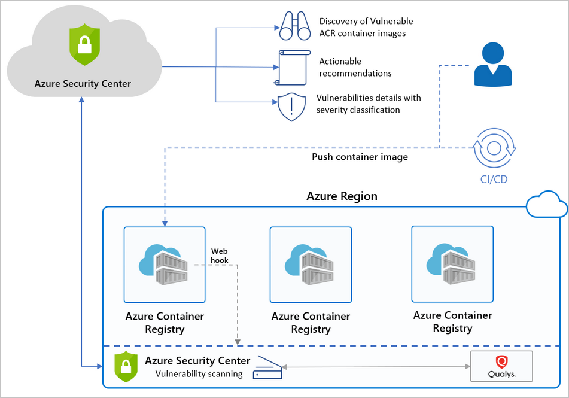

# Introduction to Azure Defender for container registries

Azure Container Registry (ACR) is a managed, private Docker registry service that stores and manages your container images for Azure deployments in a central registry. It's based on the open-source Docker Registry 2.0.

To protect the Azure Resource Manager based registries in your subscription, enable **Azure Defender for container registries** at the subscription level. Azure Defender will then scan all images when they’re pushed to the registry, imported into the registry, or pulled within the last 30 days. You’ll be charged for every image that gets scanned – once per image.

[!INCLUDE [Defender for container registries availability info](../../includes/security-center-availability-defender-for-container-registries.md)]

## What are the benefits of Azure Defender for container registries?

Security Center identifies Azure Resource Manager based ACR registries in your subscription and seamlessly provides Azure-native vulnerability assessment and management for your registry's images.

**Azure Defender for container registries** includes a vulnerability scanner to scan the images in your Azure Resource Manager-based Azure Container Registry registries and provide deeper visibility into your images'  vulnerabilities. The integrated scanner is powered by Qualys, the industry-leading vulnerability scanning vendor.

When issues are found – by Qualys or Security Center – you'll get notified in the Security Center dashboard. For every vulnerability, Security Center provides actionable recommendations, along with a severity classification, and guidance for how to remediate the issue. For details of Security Center's recommendations for containers, see the [reference list of recommendations](recommendations-reference.md#recs-container).

Security Center filters and classifies findings from the scanner. When an image is healthy, Security Center marks it as such. Security Center generates security recommendations only for images that have issues to be resolved. Security Center provides details of each reported vulnerability and a severity classification. Additionally, it gives guidance for how to remediate the specific vulnerabilities found on each image.

By only notifying when there are problems, Security Center reduces the potential for unwanted informational alerts.

> [!TIP]
> To learn more about Security Center's container security features, see:
>
> - [Azure Security Center and container security](container-security.md)
> - [Introduction to Azure Defender for Kubernetes](defender-for-kubernetes-introduction.md)

## When are images scanned?

There are three triggers for an image scan:

- **On push** - Whenever an image is pushed to your registry, Security Center automatically scans that image. To trigger the scan of an image, push it to your repository.

- **Recently pulled** - Since new vulnerabilities are discovered every day, **Azure Defender for container registries** also scans, on a weekly basis, any image that has been pulled within the last 30 days. There's no additional charge for these rescans; as mentioned above, you're billed once per image.

- **On import** - Azure Container Registry has import tools to bring images to your registry from Docker Hub, Microsoft Container Registry, or another Azure container registry. **Azure Defender for container registries** scans any supported images you import. Learn more in [Import container images to a container registry](../container-registry/container-registry-import-images.md).
 
The scan completes typically within 2 minutes, but it might take up to 15 minutes. Findings are made available as Security Center recommendations such as this one:

## How does Security Center work with Azure Container Registry

Below is a high-level diagram of the components and benefits of protecting your registries with Security Center.

## FAQ - Azure Container Registry image scanning

### How does Security Center scan an image?
Security Center pulls the image from the registry and runs it in an isolated sandbox with the Qualys scanner. The scanner extracts a list of known vulnerabilities.

Security Center filters and classifies findings from the scanner. When an image is healthy, Security Center marks it as such. Security Center generates security recommendations only for images that have issues to be resolved. By only notifying you when there are problems, Security Center reduces the potential for unwanted informational alerts.

### Can I get the scan results via REST API?
Yes. The results are under [Sub-Assessments Rest API](/rest/api/securitycenter/subassessments/list/). Also, you can use Azure Resource Graph (ARG), the Kusto-like API for all of your resources: a query can fetch a specific scan.

### What registry types are scanned? What types are billed?
For a list of the types of container registries supported by Azure Defender for container registries, see [Availability](#availability).

If you connect unsupported registries to your Azure subscription, Azure Defender won't scan them and won't bill you for them.

### Can I customize the findings from the vulnerability scanner?
Yes. If you have an organizational need to ignore a finding, rather than remediate it, you can optionally disable it. Disabled findings don't impact your secure score or generate unwanted noise.

[Learn about creating rules to disable findings from the integrated vulnerability assessment tool](defender-for-container-registries-usage.md#disable-specific-findings-preview).

### Why is Security Center alerting me to vulnerabilities about an image that isn’t in my registry?
Security Center provides vulnerability assessments for every image pushed or pulled in a registry. Some images may reuse tags from an image that was already scanned. For example, you may reassign the tag “Latest” every time you add an image to a digest. In such cases, the ‘old’ image does still exist in the registry and may still be pulled by its digest. If the image has security findings and is pulled, it'll expose security vulnerabilities.

## Next steps

> [!div class="nextstepaction"]
> [Scan your images for vulnerabilities](defender-for-container-registries-usage.md)
