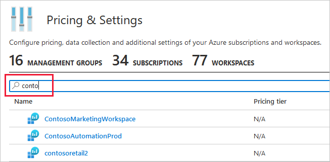

# Enable Azure Defender for SQL servers on machines 

This Azure Defender plan detects anomalous activities indicating unusual and potentially harmful attempts to access or exploit databases.

You'll see alerts when there are suspicious database activities, potential vulnerabilities, or SQL injection attacks, and anomalous database access and query patterns.

## Availability

|Aspect|Details|
|----|:----|
|Release state:|General Availability (GA)|
|Pricing:|**Azure Defender for SQL servers on machines** is billed as shown on [Security Center pricing](https://azure.microsoft.com/pricing/details/security-center/)|
|Protected SQL versions:|Azure SQL Server (all versions covered by Microsoft support)|
|Clouds:| Commercial clouds  US Gov  China Gov, Other Gov|
|||

## Set up Azure Defender for SQL servers on machines

To enable this plan:

[Step 1. Provision the Log Analytics agent on your SQL server's host:](#step-1-provision-the-log-analytics-agent-on-your-sql-servers-host)

[Step 2. Enable the optional plan in Security Center's pricing and settings page:](#step-2-enable-the-optional-plan-in-security-centers-pricing-and-settings-page)

### Step 1. Provision the Log Analytics agent on your SQL server's host:

- **SQL Server on Azure VM** - If your SQL machine is hosted on an Azure VM, you can [enable auto provisioning of the Log Analytics agent ](security-center-enable-data-collection.md#auto-provision-mma). Alternatively, you can follow the manual procedure for [Onboard your Azure Stack Hub VMs](quickstart-onboard-machines.md?pivots=azure-portal#onboard-your-azure-stack-hub-vms).
- **SQL Server on Azure Arc** - If your SQL Server is managed by [Azure Arc](../azure-arc/index.yml) enabled servers, you can deploy the Log Analytics agent using the Security Center recommendation “Log Analytics agent should be installed on your Windows-based Azure Arc machines (Preview)”. Alternatively, you can follow the installation methods described in the [Azure Arc documentation](../azure-arc/servers/manage-vm-extensions.md).

- **SQL Server on-prem** - If your SQL Server is hosted on an on-premises Windows machine without Azure Arc, you have two options for connecting it to Azure:
    
    - **Deploy Azure Arc** - You can connect any Windows machine to Security Center. However, Azure Arc provides deeper integration across *all* of your Azure environment. If you set up Azure Arc, you'll see the **SQL Server – Azure Arc** page in the portal and your security alerts will appear on a dedicated **Security** tab on that page. So the first and recommended option is to [set up Azure Arc on the host](../azure-arc/servers/onboard-portal.md#install-and-validate-the-agent-on-windows) and follow the instructions for **SQL Server on Azure Arc**, above.
        
    - **Connect the Windows machine without Azure Arc** - If you choose to connect a SQL Server running on a Windows machine without using Azure Arc, follow the instructions in [Connect Windows machines to Azure Monitor](../azure-monitor/agents/agent-windows.md).

### Step 2. Enable the optional plan in Security Center's pricing and settings page:

1. From Security Center's menu, open the **Pricing & settings** page.

    - If you're using **Azure Security Center's default workspace** (named “defaultworkspace-[your subscription ID]-[region]”), select the relevant **subscription**.

    - If you're using **a non-default workspace**, select the relevant **workspace** (enter the workspace's name in the filter if necessary):

        

1. Set the option for **Azure Defender for SQL servers on machines** plan to **on**. 

    :::image type="content" source="./media/security-center-advanced-iaas-data/sql-servers-on-vms-in-pricing-small.png" alt-text="Security Center pricing page with optional plans":::

    The plan will be enabled on all SQL servers connected to the selected workspace. The protection will be fully active after the first restart of the SQL Server instance.

    >[!TIP] 
    > To create a new workspace, follow the instructions in [Create a Log Analytics workspace](../azure-monitor/logs/quick-create-workspace.md).

1. Optionally, configure email notification for security alerts. 
    You can set a list of recipients to receive an email notification when Security Center alerts are generated. The email contains a direct link to the alert in Azure Security Center with all the relevant details. For more information, see [Set up email notifications for security alerts](security-center-provide-security-contact-details.md).

## Azure Defender for SQL alerts
Alerts are generated by unusual and potentially harmful attempts to access or exploit SQL machines. These events can trigger alerts shown in the [alerts reference page](alerts-reference.md#alerts-sql-db-and-warehouse).

## Explore and investigate security alerts

Azure Defender for SQL alerts are available in Security Center's alerts page, the resource's security tab, the [Azure Defender dashboard](azure-defender-dashboard.md), or through the direct link in the alert emails.

1. To view alerts, select **Security alerts** from Security Center's menu and select an alert.

1. Alerts are designed to be self-contained, with detailed remediation steps and investigation information in each one. You can investigate further by using other Azure Security Center and Azure Sentinel capabilities for a broader view:

    * Enable SQL Server's auditing feature for further investigations. If you're an Azure Sentinel user, you can upload the SQL auditing logs from the Windows Security Log events to Sentinel and enjoy a rich investigation experience. [Learn more about SQL Server Auditing](/sql/relational-databases/security/auditing/create-a-server-audit-and-server-audit-specification?preserve-view=true&view=sql-server-ver15).
    * To improve your security posture, use Security Center's recommendations for the host machine indicated in each alert. This will reduce the risks of future attacks. 

    [Learn more about managing and responding to alerts](security-center-managing-and-responding-alerts.md).

## FAQ - Azure Defender for SQL servers on machines

### If I enable this Azure Defender plan on my subscription, are all SQL servers on the subscription protected? 

No. To defend a SQL Server deployment on an Azure Virtual Machine, or a SQL Server running on an Azure Arc enabled machine, Azure Defender requires both of the following:

- a Log Analytics agent on the machine 
- the relevant Log Analytics workspace to have the Azure Defender for SQL solution enabled 

The subscription *status*, shown in the SQL server page in the Azure portal, reflects the default workspace status and applies to all connected machines. Only the SQL servers on hosts with a Log Analytics agent reporting to that workspace are protected by Azure Defender. 

## Next steps

For related material, see the following article:

- [Security alerts for SQL Database and Azure Synapse Analytics](alerts-reference.md#alerts-sql-db-and-warehouse)
- [Set up email notifications for security alerts](security-center-provide-security-contact-details.md)
- [Learn more about Azure Sentinel](../sentinel/index.yml)