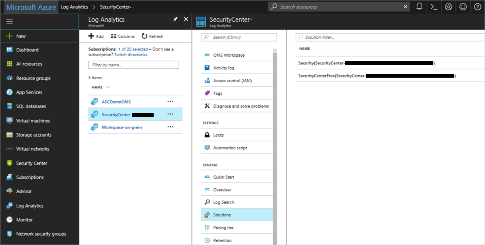

# FAQ for customers already using Azure Monitor logs

## Does Security Center override any existing connections between VMs and workspaces?

If a VM already has the Log Analytics agent installed as an Azure extension, Security Center does not override the existing workspace connection. Instead, Security Center uses the existing workspace. The VM will be protected provided that the "Security" or "SecurityCenterFree" solution has been installed on the workspace to which it is reporting. 

A Security Center solution is installed on the workspace selected in the Data Collection screen if not present already, and the solution is applied only to the relevant VMs. When you add a solution, it's automatically deployed by default to all Windows and Linux agents connected to your Log Analytics workspace. [Solution Targeting](../operations-management-suite/operations-management-suite-solution-targeting.md) allows you to apply a scope to your solutions.

> [!TIP]
> If the Log Analytics agent is installed directly on the VM (not as an Azure extension), Security Center does not install the Log Analytics agent, and security monitoring is limited.

## Does Security Center install solutions on my existing Log Analytics workspaces? What are the billing implications?
When Security Center identifies that a VM is already connected to a workspace you created, Security Center enables solutions on this workspace according to your pricing tier. The solutions are applied only to the relevant Azure VMs, via [solution targeting](../operations-management-suite/operations-management-suite-solution-targeting.md), so the billing remains the same.

- **Free tier** – Security Center installs the 'SecurityCenterFree' solution on the workspace. You won't be billed for the Free tier.
- **Standard tier** – Security Center installs the 'Security' solution on the workspace.

   

## I already have workspaces in my environment, can I use them to collect security data?
If a VM already has the Log Analytics agent installed as an Azure extension, Security Center uses the existing connected workspace. A Security Center solution is installed on the workspace if not present already, and the solution is applied only to the relevant VMs via [solution targeting](../operations-management-suite/operations-management-suite-solution-targeting.md).

When Security Center installs the Log Analytics agent on VMs, it uses the default workspace(s) created by Security Center if Security Center isn't pointed to an existing workspace.

## I already have security solution on my workspaces. What are the billing implications?
The Security & Audit solution is used to enable Security Center standard tier features for Azure VMs. If the Security & Audit solution is already installed on a workspace, Security Center uses the existing solution. There is no change in billing.
