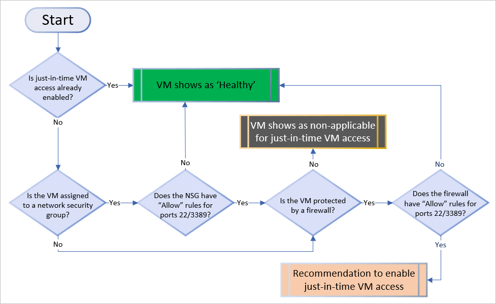

# The threat of open management ports on a virtual machine

All of your internet-facing virtual machines are potential targets for an attack. Threat actors actively hunt accessible machines. The ultimate prize they're seeking is an open management port, like RDP or SSH, to gain access to a VM. When a VM is successfully compromised, it's used as the entry point to attack further resources within your environment.

## Why just-in-time (JIT) virtual machine (VM) access is the solution 

As with all cybersecurity prevention techniques, your goal should be to reduce the attack surface. In this case, that means having fewer open ports, especially management ports.

Your legitimate users also use these ports, so it's not practical to keep them closed.

To solve this dilemma, Azure Security Center offers JIT. With JIT, you can lock down the inbound traffic to your Azure VMs, reducing exposure to attacks while providing easy access to connect to VMs when needed.

When just-in-time is enabled, Security Center uses [network security group](https://docs.microsoft.com/azure/virtual-network/security-overview#security-rules) (NSG) and Azure Firewall rules, which restrict access to management ports so they cannot be targeted by attackers.

## How does Security Center identify VMs that should have JIT applied?

The diagram below shows the logic that Security Center applies when deciding how to categorize your ARM deployed VMs that are on the standard pricing tier: 

When Security Center finds a machine that can benefit from JIT, it adds that machine to the recommendation's **Unhealthy resources** tab. 

## How does JIT access work?

When just-in-time is enabled, Security Center locks down inbound traffic to your Azure VMs by creating an NSG rule. You select the ports on the VM to which inbound traffic will be locked down. These ports are controlled by the just-in-time solution.

When a user requests access to a VM, Security Center checks that the user has [Role-Based Access Control (RBAC)](https://docs.microsoft.com/en-us/azure/role-based-access-control/role-assignments-portal) permissions for that VM. If the request is approved, Security Center automatically configures the Network Security Groups (NSGs) and Azure Firewall to allow inbound traffic to the selected ports and requested source IP addresses or ranges, for the amount of time that was specified. After the time has expired, Security Center restores the NSGs to their previous states. Those connections that are already established are not being interrupted, however.

 > [!NOTE]
 > If a JIT access request is approved for a VM behind an Azure Firewall, Security Center automatically changes both the NSG and firewall policy rules. For the amount of time that was specified, the rules allow inbound traffic to the selected ports and requested source IP addresses or ranges. After the time is over, Security Center restores the firewall and NSG rules to their previous states.

## Next steps

This page explained _why_ just-in-time (JIT) virtual machine (VM) access should be used. Advance to the how-to article to learn how to apply JIT to your machines:

> [!div class="nextstepaction"]
> [How to secure your management ports with JIT](security-center-just-in-time.md)
