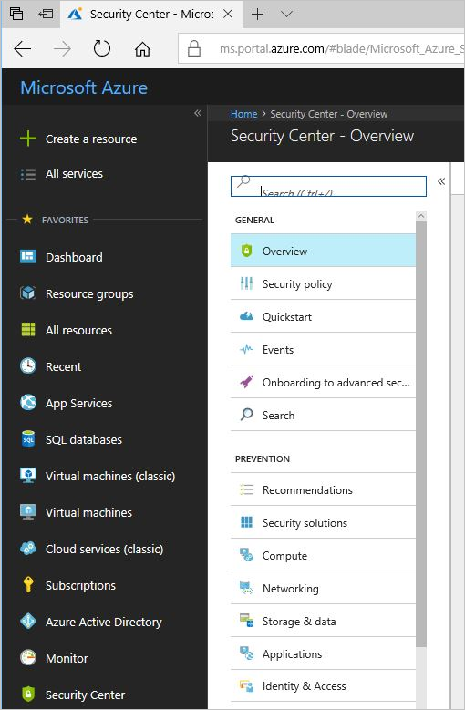
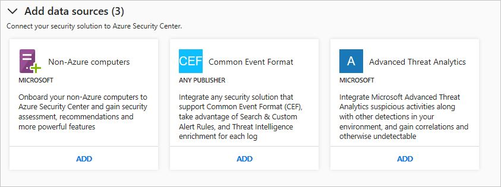
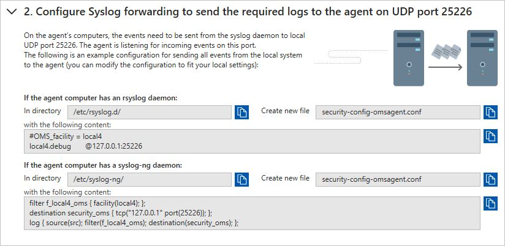
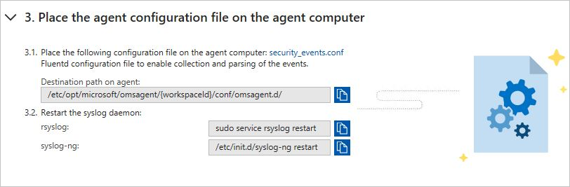
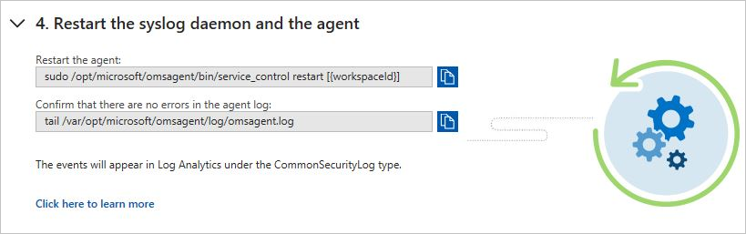
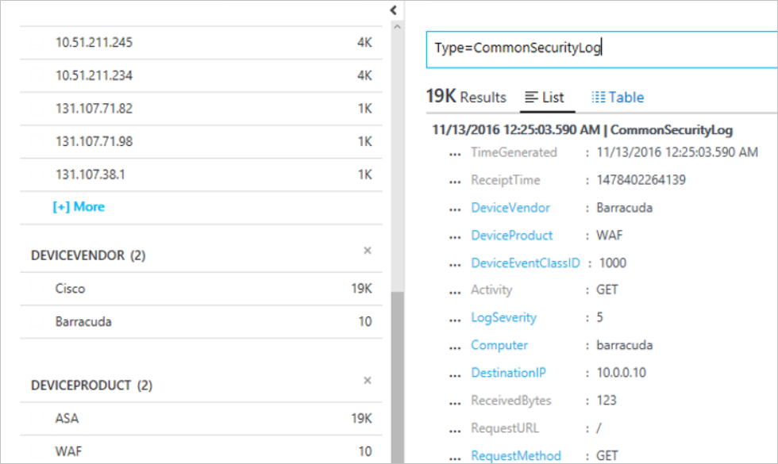

# Quickstart: Connect security solutions to Security Center

In addition to collecting security data from your computers, you can integrate security data from a variety of other security solutions, including any that support Common Event Format (CEF). CEF is an industry standard format on top of Syslog messages, used by many security vendors to allow event integration among different platforms.

This quickstart shows you how to:
- Connect a security solution to Security Center using CEF Logs
- Validate the connection with the security solution

## Prerequisites
To get started with Security Center, you must have a subscription to Microsoft Azure. If you do not have a subscription, you can sign up for a [free account](https://azure.microsoft.com/free/).

To step through this quickstart, you must be on Security Center’s Standard pricing tier. You can try Security Center Standard at no cost for the first 60 days. The quickstart [Onboard your Azure subscription to Security Center Standard](security-center-get-started.md) walks you through how to upgrade to Standard.

You also need a [Linux machine](https://docs.microsoft.com/azure/log-analytics/log-analytics-agent-linux), with Syslog service that is already connected to your Security Center.

## Connect solution using CEF

1. Sign into the [Azure portal](https://azure.microsoft.com/features/azure-portal/).
2. On the **Microsoft Azure** menu, select **Security Center**. **Security Center - Overview** opens.

	  

3. Under the Security Center main menu, select **Security Solutions**.
4. In the Security Solutions page, under **Add data sources (3)**, click **Add** under **Common Event Format**.

	

5. In the Common Event Format Logs page, expand the second step, **Configure Syslog forwarding to send the required logs to the agent on UDP port 25226**, and follow the instructions below in your Linux computer:

	

6. Expand the third step, **Place the agent configuration file on the agent computer**, and follow the instructions below in your Linux computer:

	

7. Expand the fourth step, **Restart the syslog daemon and the agent**, and follow the instructions below in your Linux computer:

	

## Validate the connection

Before you proceed to the steps below, you will need to wait until the syslog starts reporting to Security Center. This can take some time, and it will vary according to the size of the environment.

1.	In the left pane, of the Security Center dashboard, click **Search**.
2.	Select the workspace that the Syslog (Linux Machine) is connected to.
3.	Type *CommonSecurityLog* and click the **Search** button.

The following example shows the result of these steps:

## Clean up resources
Other quickstarts and tutorials in this collection build upon this quickstart. If you plan to continue on to work with subsequent quickstarts and tutorials, continue running the Standard tier and keep automatic provisioning enabled. If you do not plan to continue or wish to return to the Free tier:

1. Return to the Security Center main menu and select **Security Policy**.
2. Select the subscription or policy that you want to return to Free. **Security policy** opens.
3. Under **POLICY COMPONENTS**, select **Pricing tier**.
4. Select **Free** to change subscription from Standard tier to Free tier.
5. Select **Save**.

If you wish to disable automatic provisioning:

1. Return to the Security Center main menu and select **Security policy**.
2. Select the subscription that you wish to disable automatic provisioning.
3. Under **Security policy – Data Collection**, select **Off** under **Onboarding** to disable automatic provisioning.
4. Select **Save**.

>[!NOTE]
> Disabling automatic provisioning does not remove the Microsoft Monitoring Agent from Azure VMs where the agent has been provisioned. Disabling automatic provisioning limits security monitoring for your resources.
>

## Next steps
In this quickstart, you learned how to connect a Linux Syslog solution to Security Center using CEF. By connecting your CEF logs to Security Center, you can take advantage of search & custom alert rules, and threat intelligence enrichment for each log. To learn more about how to use Security Center, continue to the tutorial for configuring a security policy and assessing the security of your resources.

> [!div class="nextstepaction"]
> [Tutorial: Define and assess security policies](./tutorial-security-policy.md)
