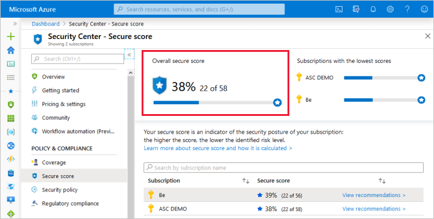
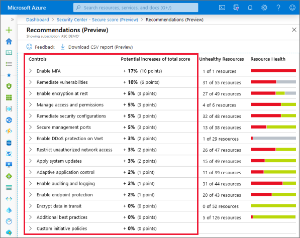
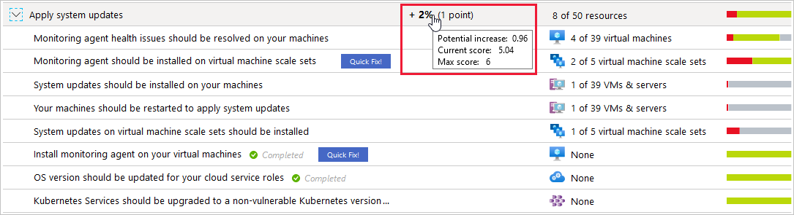
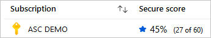
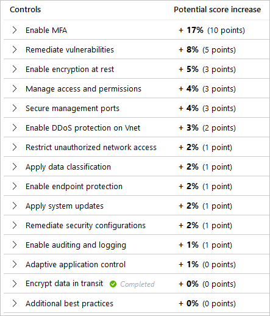
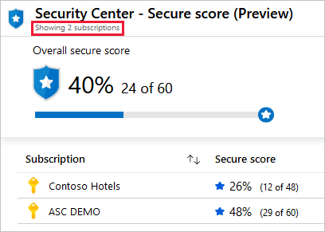

# Enhanced secure score in Azure Security Center

## Introduction to secure score

Azure Security Center has two main goals: to help you understand your current security situation, and to help you efficiently and effectively improve your security. The central aspect of Security Center that enables you to achieve those goals is secure score.

Security Center continually assesses your resources, subscriptions, and organization for security issues. It then aggregates all the findings into a single score so that you can tell, at a glance, your current security situation: the higher the score, the lower the identified risk level.

The secure score page of Security Center includes:

- **The score** - The secure score is shown as a percentage value, but the underlying values are also clear:

    

- **Security controls** - Each control is a logical group of related security recommendations, and reflects your vulnerable attack surfaces. A control is a set of security recommendations, with instructions that help you implement those recommendations. Your score only improves when you remediate *all* of the recommendations for a single resource within a control.

    To immediately see how well your organization is securing each individual attack surface, review the scores for each security control.

    For more information, see [How your secure score is calculated](secure-score-security-controls.md#how-your-secure-score-is-calculated) below. 

>[!TIP]
> Earlier versions of Security Center awarded points at the recommendation level: when you remediated a recommendation for a single resource, your secure score improved. 
> Today, your score only improves if you remediate *all* of the recommendations for a single resource within a control. So your score only improves when you've improved the security of a resource.

## Accessing your secure score

You can find your overall secure score, as well as your score per subscription, through the Azure portal or programatically with the Azure Security Center REST API.

### Getting your secure score from the portal

Security Center displays your score prominently in the portal: it's the first thing shown in the Overview page. If you click through to the dedicated secure score page, you'll see the score broken down by subscription. Click a single subscription to see the detailed list of prioritized recommendations and the potential impact that remediating them will have on the subscription's score.

### Getting your secure score from the REST API

You can access your score via the [secure score API](https://docs.microsoft.com/rest/api/securitycenter/securescores/) (currently in preview). The API methods provide the flexibility to query the data and build your own reporting mechanism of your secure scores over time. For example, you can use the **Secure Scores** API to get the score for a specific subscription. In addition, you can use the **Secure Score Controls** API to list the security controls and the current score of your subscriptions.

For examples of tools built on top of the secure score API, see [the secure score area of our GitHub community](https://github.com/Azure/Azure-Security-Center/tree/master/Secure%20Score). 

## How your secure score is calculated 

The contribution of each security control towards the overall secure score is shown clearly on the recommendations page.

To get all the possible points for a security control, all your resources must comply with all of the security recommendations within the security control. For example, Security Center has multiple recommendations regarding how to secure your management ports. In the past, you could remediate some of those related and interdependent recommendations while leaving others unsolved, and your secure score would improve. When looked at objectively, it's easy to argue that your security hadn't improved until you had resolved them all. Now, you must remediate them all to make a difference to your secure score.

For example, the security control called "Apply system updates" has a maximum score of six points, which you can see in the tooltip on the potential increase value of the control:

The maximum score for this control, Apply system updates, is always 6. In this example, there are 50 resources. So we divide the max score by 50, and the result is that every resource contributes 0.12 points. 

* **Potential increase** (0.12 x 8 unhealthy resources = 0.96) - The remaining points available to you within the control. If you remediate all the recommendations in this control, your score will increase by 2% (in this case, 0.96 points rounded up to 1 point). 
* **Current score** (0.12 x 42 healthy resources = 5.04) - The current score for this control. Each control contributes towards the total score. In this example, the control is contributing 5.04 points to current secure total.
* **Max score** - The maximum number of points you can gain by completing all recommendations within a control. The maximum score for a control indicates the relative significance of that control. Use the max score values to triage the issues to work on first. 

### Calculations - understanding your score

|Metric|Formula and example|
|-|-|
|**Security control's current score**|   Each individual security control contributes towards the Security Score. Each resource affected by a recommendation within the control, contributes towards the control's current score. The current score for each control is a measure of the status of the resources *within* the control.  In this example, the max score of 6 would be divided by 78 because that's the sum of the healthy and unhealthy resources. 6 / 78 = 0.0769 Multiplying that by the number of healthy resources (4) results in the current score: 0.0769 * 4 = **0.31**  |
|**Secure score** Single subscription|    In this example, there is a single subscription with all security controls available (a potential maximum score of 60 points). The score shows 28 points out of a possible 60 and the remaining 32 points are reflected in the "Potential score increase" figures of the security controls. |
|**Secure score** Multiple subscriptions| The current scores for all resources across all subscriptions are added and the calculation is then the same as for a single subscription  When viewing multiple subscriptions, secure score evaluates all resources within all enabled policies and groups their combined impact on each security control's maximum score.  The combined score is **not** an average; rather it's the evaluated posture of the status of all resources across all subscriptions. Here too, if you go to the recommendations page and add up the potential points available, you will find that it's the difference between the current score (24) and the maximum score available (60).|
||||

## Improving your secure score

To improve your secure score, remediate security recommendations from your recommendations list. You can remediate each recommendation manually for each resource, or by using the **Quick Fix!** option (when available) to apply a remediation for a recommendation to a group of resources quickly. For more information, see [Remediate recommendations](security-center-remediate-recommendations.md).

>[!IMPORTANT]
> Only built-in recommendations have an impact on the secure score.

## Security controls and their recommendations

The table below lists the security controls in Azure Security Center. For each control, you can see the maximum number of points you can add to your secure score if you remediate *all* of the recommendations listed in the control, for *all* of your resources. 

<table class="tg">
<thead>
  <tr>
    <th class="tg-cly1"><b>Security control, score, and description</b> </th>
    <th class="tg-cly1"><b>Recommendations</b></th>
  </tr>
</thead>
<tbody>
  <tr>
    <td class="tg-lboi"><strong>
Enable MFA (max score 10)
</strong>If you only use a password to authenticate a user, it leaves an attack vector open. If the password is weak or has been exposed elsewhere, is it really the user signing in with the username and password? With <a href="https://www.microsoft.com/security/business/identity/mfa">MFA</a> enabled, your accounts are more secure, and users can still authenticate to almost any application with single sign-on (SSO).</td>
    <td class="tg-lboi"; width=55%>- MFA should be enabled on accounts with owner permissions on your subscription - MFA should be enabled accounts with write permissions on your subscription</td>
  </tr>
  <tr>
    <td class="tg-lboi"><strong>
Secure management ports (max score 8)
</strong>Brute force attacks target management ports to gain access to a VM. Since the ports don’t always need to be open, one mitigation strategy is to reduce exposure to the ports using just-in-time network access controls, network security groups, and virtual machine port management. Since many IT organizations don't block SSH communications outbound from their network, attackers can create encrypted tunnels that allow RDP ports on infected systems to communicate back to the attacker command to control servers. Attackers can use the Windows Remote Management subsystem to move laterally across your environment and use stolen credentials to access other resources on a network.</td>
    <td class="tg-lboi"; width=55%>- Management ports of virtual machines should be protected with just-in-time network access control - Virtual machines should be associated with a Network Security Group - Management ports should be closed on your virtual machines</td>
  </tr>
  <tr>
    <td class="tg-lboi"><strong>
Apply system updates (max score 6)
</strong>System updates provide organizations with the ability to maintain operational efficiency, reduce security vulnerabilities, and provide a more stable environment for end users. Not applying updates leaves unpatched vulnerabilities and results in environments that are susceptible to attacks. These vulnerabilities can be exploited and lead to data loss, data exfiltration, ransomware, and resource abuse. To deploy system updates, you can use the <a href="https://docs.microsoft.com/azure/automation/automation-update-management">Update Management solution to manage patches and updates</a> for your virtual machines. Update management is the process of controlling the deployment and maintenance of software releases.</td>
    <td class="tg-lboi"; width=55%>- Monitoring agent health issues should be resolved on your machines - Monitoring agent should be installed on virtual machine scale sets - Monitoring agent should be installed on your machines - OS version should be updated for your cloud service roles - System updates on virtual machine scale sets should be installed - System updates should be installed on your machines - Your machines should be restarted to apply system updates - Kubernetes Services should be upgraded to a non-vulnerable Kubernetes version - Monitoring agent should be installed on your virtual machines</td>
  </tr>
  <tr>
    <td class="tg-lboi"><strong>
Remediate vulnerabilities (max score 6)
</strong>A vulnerability is a weakness that a threat actor could leverage, to compromise the confidentiality, availability, or integrity of a resource. <a href="https://docs.microsoft.com/windows/security/threat-protection/microsoft-defender-atp/next-gen-threat-and-vuln-mgt">Managing vulnerabilities</a> reduces organizational exposure, hardens endpoint surface area, increases organizational resilience, and reduces the attack surface of your resources. Threat and Vulnerability Management provides visibility into software and security misconfigurations and provide recommendations for mitigations.</td>
    <td class="tg-lboi"; width=55%>- Advanced data security should be enabled on SQL Database - Vulnerabilities in Azure Container Registry images should be remediated - Vulnerabilities on your SQL databases should be remediated - Vulnerabilities should be remediated by a Vulnerability Assessment solution - Vulnerability assessment should be enabled on SQL Managed Instance - Vulnerability assessment should be enabled on your SQL servers - Vulnerability assessment solution should be installed on your virtual machines</td>
  </tr>
  <tr>
    <td class="tg-lboi"><strong>
Enable encryption at rest (max score 4)
</strong><a href="https://docs.microsoft.com/azure/security/fundamentals/encryption-atrest">Encryption at rest</a> provides data protection for stored data. Attacks against data at rest include attempts to gain physical access to the hardware on which the data is stored. Azures use symmetric encryption to encrypt and decrypt large amounts of data at rest. A symmetric encryption key is used to encrypt data as it is written to storage. That encryption key is also used to decrypt that data as it is readied for use in memory. Keys must be stored in a secure location with identity-based access control and audit policies. One such secure location is Azure Key Vault. If an attacker obtains the encrypted data but not the encryption keys, the attacker can't access the data without breaking the encryption.</td>
    <td class="tg-lboi"; width=55%>- Disk encryption should be applied on virtual machines - Transparent Data Encryption on SQL databases should be enabled - Automation account variables should be encrypted - Service Fabric clusters should have the ClusterProtectionLevel property set to EncryptAndSign - SQL server TDE protector should be encrypted with your own key</td>
  </tr>
  <tr>
    <td class="tg-lboi"><strong>
Encrypt data in transit (max score 4)
</strong>Data is “in transit” when it's transmitted between components, locations, or programs. Organizations that fail to protect data in transit are susceptible to man-in-the-middle attacks, eavesdropping, and session hijacking. SSL/TLS protocols should be used to exchange data and a VPN is recommended. When sending encrypted data between an Azure virtual machine and an on-premise location, over the internet, you can use a virtual network gateway such as <a href="https://docs.microsoft.com/azure/vpn-gateway/vpn-gateway-about-vpngateways">Azure VPN Gateway</a> to send encrypted traffic.</td>
    <td class="tg-lboi"; width=55%>- API App should only be accessible over HTTPS - Function App should only be accessible over HTTPS - Only secure connections to your Redis Cache should be enabled - Secure transfer to storage accounts should be enabled - Web Application should only be accessible over HTTPS</td>
  </tr>
  <tr>
    <td class="tg-lboi"><strong>
Manage access and permissions (max score 4)
</strong>A core part of a security program is ensuring your users have the necessary access to do their jobs but no more than that: the <a href="https://docs.microsoft.com/windows-server/identity/ad-ds/plan/security-best-practices/implementing-least-privilege-administrative-models">least privilege access model</a>. Control access to your resources by creating role assignments with <a href="https://docs.microsoft.com/azure/role-based-access-control/overview">role-based access control (RBAC)</a>. A role assignment consists of three elements: - <strong>Security principal</strong>: the object the user is requesting access to - <strong>Role definition</strong>: their permissions - <strong>Scope</strong>: the set of resources to which the permissions apply</td>
    <td class="tg-lboi"; width=55%>- Deprecated accounts should be removed from your subscription (Preview) - Deprecated accounts with owner permissions should be removed from your subscription (Preview) - External accounts with owner permissions should be removed from your subscription (Preview) - External accounts with write permissions should be removed from your subscription (Preview) - There should be more than one owner assigned to your subscription - Role-Based Access Control (RBAC) should be used on Kubernetes Services (Preview) - Service Fabric clusters should only use Azure Active Directory for client authentication</td>
  </tr>
  <tr>
    <td class="tg-lboi"><strong>
Remediate security configurations (max score 4)
</strong>Misconfigured IT assets have a higher risk of being attacked. Basic hardening actions are often forgotten when assets are being deployed and deadlines must be met. Security misconfigurations can be at any level in the infrastructure: from the operating systems and network appliances, to cloud resources. Azure Security Center continually compares the configuration of your resources with requirements in industry standards, regulations, and benchmarks. When you've configured the relevant "compliance packages" (standards and baselines) that matter to your organization, any gaps will result in security recommendations that include the CCEID and an explanation of the potential security impact. Commonly used packages are <a href="https://docs.microsoft.com/azure/security/benchmarks/introduction">Azure Security Benchmark</a> and <a href="https://www.cisecurity.org/benchmark/azure/">CIS Microsoft Azure Foundations Benchmark version 1.1.0</a></td>
    <td class="tg-lboi"; width=55%>- Pod Security Policies should be defined on Kubernetes Services - Vulnerabilities in container security configurations should be remediated - Vulnerabilities in security configuration on your machines should be remediated - Vulnerabilities in security configuration on your virtual machine scale sets should be remediated - Monitoring agent should be installed on your virtual machines - Monitoring agent should be installed on your machines - Monitoring agent should be installed on virtual machine scale sets - Monitoring agent health issues should be resolved on your machines</td>
  </tr>
  <tr>
    <td class="tg-lboi"><strong>
Restrict unauthorized network access (max score 4)
</strong>Endpoints within an organization provide a direct connection from your virtual network to supported Azure services. Virtual machines in a subnet can communicate with all resources. To limit communication to and from resources within a subnet, create a network security group and associate it to the subnet. Organizations can limit and protect against unauthorized traffic by creating inbound and outbound rules.</td>
    <td class="tg-lboi"; width=55%>- IP forwarding on your virtual machine should be disabled - Authorized IP ranges should be defined on Kubernetes Services (Preview) - (DEPRECATED) Access to App Services should be restricted (Preview) - (DEPRECATED) The rules for web applications on IaaS NSGs should be hardened - Virtual machines should be associated with a Network Security Group - CORS should not allow every resource to access your API App - CORS should not allow every resource to access your Function App - CORS should not allow every resource to access your Web Application - Remote debugging should be turned off for API App - Remote debugging should be turned off for Function App - Remote debugging should be turned off for Web Application - Access should be restricted for permissive Network Security Groups with Internet-facing VMs - Network Security Group Rules for Internet facing virtual machines should be hardened</td>
  </tr>
  <tr>
    <td class="tg-lboi"><strong>
Apply adaptive application control (max score 3)
</strong>Adaptive application control (AAC) is an intelligent, automated, end-to-end solution, which allows you to control which applications can run on your Azure and non-Azure machines. It also helps to harden your machines against malware. Security Center uses machine learning to create a whitelist of known-safe applications for a group of machines. This innovative approach to application whitelisting provides the security benefits without the management complexity. AAC is particularly relevant for purpose-built servers that need to run a specific set of applications.</td>
    <td class="tg-lboi"; width=55%>- Adaptive Application Controls should be enabled on virtual machines - Monitoring agent should be installed on your virtual machines - Monitoring agent should be installed on your machines - Monitoring agent health issues should be resolved on your machines</td>
  </tr>
  <tr>
    <td class="tg-lboi"><strong>
Apply data classification (max score 2)
</strong>Classifying your organization's data by sensitivity and business impact allows you to determine and assign value to the data, and provides the strategy and basis for governance. <a href="https://docs.microsoft.com/azure/information-protection/what-is-information-protection">Azure Information Protection</a> can assist with data classification. It uses encryption, identity, and authorization policies to protect data and restrict data access. Some classifications that Microsoft uses are Non-business, Public, General, Confidential, and Highly Confidential.</td>
    <td class="tg-lboi"; width=55%>- Sensitive data in your SQL databases should be classified (Preview)</td>
  </tr>
  <tr>
    <td class="tg-lboi"><strong>
Protect applications against DDoS attacks (max score 2)
</strong>Distributed denial-of-service (DDoS) attacks overwhelm resources and render applications unusable. Use <a href="https://docs.microsoft.com/azure/virtual-network/ddos-protection-overview">Azure DDoS Protection Standard</a> to defend your organization from the three main types of DDoS attacks: - <strong>Volumetric attacks</strong> flood the network with legitimate traffic. DDoS Protection Standard mitigates these attacks by absorbing or scrubbing them automatically. - <strong>Protocol attacks</strong> render a target inaccessible, by exploiting weaknesses in the layer 3 and layer 4 protocol stack. DDoS Protection Standard mitigates these attacks by blocking malicious traffic. - <strong>Resource (application) layer attacks</strong> target web application packets. Defend against this type with a web application firewall and DDoS Protection Standard.</td>
    <td class="tg-lboi"; width=55%>- DDoS Protection Standard should be enabled</td>
  </tr>
  <tr>
    <td class="tg-lboi"><strong>
Enable endpoint protection (max score 2)
</strong>To ensure your endpoints are protected from malware, behavioral sensors collect and process data from your endpoints' operating systems and send this data to the private cloud for analysis. Security analytics leverage big-data, machine-learning, and other sources to recommend responses to threats. For example, <a href="https://docs.microsoft.com/windows/security/threat-protection/microsoft-defender-atp/microsoft-defender-advanced-threat-protection">Microsoft Defender ATP</a> uses threat intelligence to identify attack methods and generate security alerts. Security Center supports the following endpoint protection solutions: Windows Defender, System Center Endpoint Protection, Trend Micro, Symantec v12.1.1.1100, McAfee v10 for Windows, McAfee v10 for Linux and Sophos v9 for Linux. If Security Center detects any of these solutions, the recommendation to install endpoint protection will no longer appear.</td>
    <td class="tg-lboi"; width=55%>- Endpoint protection health failures should be remediated on virtual machine scale sets - Endpoint protection health issues should be resolved on your machines - Endpoint protection solution should be installed on virtual machine scale sets - Install endpoint protection solution on virtual machines - Monitoring agent health issues should be resolved on your machines - Monitoring agent should be installed on virtual machine scale sets - Monitoring agent should be installed on your machines - Monitoring agent should be installed on your virtual machines - Install endpoint protection solution on your machines</td>
  </tr>
  <tr>
    <td class="tg-lboi"><strong>
Enable auditing and logging (max score 1)
</strong>Logging data provides insights into past problems, prevents potential ones, can improve application performance, and provides the ability to automate actions that would otherwise be manual. - <strong>Control and management logs</strong> provide information about <a href="https://docs.microsoft.com/azure/azure-resource-manager/management/overview">Azure Resource Manager</a> operations. - <strong>Data plane logs</strong> provide information about events raised as part of Azure resource usage. - <strong>Processed events</strong> provide information about analyzed events/alerts that have been processed.</td>
    <td class="tg-lboi"; width=55%>- Auditing on SQL server should be enabled - Diagnostic logs in App Services should be enabled - Diagnostic logs in Azure Data Lake Store should be enabled - Diagnostic logs in Azure Stream Analytics should be enabled - Diagnostic logs in Batch accounts should be enabled - Diagnostic logs in Data Lake Analytics should be enabled - Diagnostic logs in Event Hub should be enabled - Diagnostic logs in IoT Hub should be enabled - Diagnostic logs in Key Vault should be enabled - Diagnostic logs in Logic Apps should be enabled - Diagnostic logs in Search service should be enabled - Diagnostic logs in Service Bus should be enabled - Diagnostic logs in Virtual Machine Scale Sets should be enabled - Metric alert rules should be configured on Batch accounts - SQL Auditing settings should have Action-Groups configured to capture critical activities - SQL servers should be configured with auditing retention days greater than 90 days.</td>
  </tr>
  <tr>
    <td class="tg-lboi"><strong>
Implement security best practices (max score 0)
</strong>Modern security practices “assume breach” of the network perimeter. For that reason, many of the best practices in this control focus on managing identities. Losing keys and credentials is a common problem. <a href="https://docs.microsoft.com/azure/key-vault/key-vault-overview">Azure Key Vault</a> protects keys and secrets by encrypting keys, .pfx files, and passwords. Virtual private networks (VPNs) are a secure way to access your virtual machines. If VPNs aren't available, use complex passphrases and two-factor authentication such as <a href="https://docs.microsoft.com/azure/active-directory/authentication/concept-mfa-howitworks">Azure Multi-Factor Authentication</a>. Two-factor authentication avoids the weaknesses inherent in relying only on usernames and passwords. Using strong authentication and authorization platforms is another best practice. Using federated identities allows organizations to delegate management of authorized identities. This is also important when employees are terminated, and their access needs to be revoked.</td>
    <td class="tg-lboi"; width=55%>- A maximum of 3 owners should be designated for your subscription - External accounts with read permissions should be removed from your subscription - MFA should be enabled on accounts with read permissions on your subscription - Access to storage accounts with firewall and virtual network configurations should be restricted - All authorization rules except RootManageSharedAccessKey should be removed from Event Hub namespace - An Azure Active Directory administrator should be provisioned for SQL servers - Authorization rules on the Event Hub instance should be defined - Storage accounts should be migrated to new Azure Resource Manager resources - Virtual machines should be migrated to new Azure Resource Manager resources - Advanced data security settings for SQL Database should contain an email address to receive security alerts - Advanced data security should be enabled on your managed instances - All advanced threat protection types should be enabled in SQL Managed Instance advanced data security settings - Email notifications to admins and subscription owners should be enabled in SQL server advanced data security settings - Advanced Threat Protection types should be set to 'All' in SQL server Advanced Data Security settings - Subnets should be associated with a Network Security Group - All advanced threat protection types should be enabled in SQL Database advanced data security settings for your server - [Preview] Windows exploit guard should be enabled  - [Preview] Guest configuration agent should be installed</td>
  </tr>
</tbody>
</table>

## Secure score FAQ

### Why has my secure score gone down?
Security Center has switched to an enhanced secure score which includes changes in the way the score is calculated. Now, you must solve all recommendation for a resource to receive points. The scores also changed to a scale of 0-10.

### If I address only three out of four recommendations in a security control, will my secure score change?
No. It won't change until you remediate all of the recommendations for a single resource. To get the maximum score for a control, you must remediate all recommendations, for all resources.

### Is the previous experience of the secure score still available? 
No. For a while they ran side by side to ease the transition. The previous model has now been deprecated. 

### If a recommendation isn't applicable to me, and I disable it in the policy, will my security control be fulfilled and my secure score updated?
Yes. We recommend disabling recommendations when they're inapplicable in your environment. For instructions on how to disable a specific recommendation, see [Disable security policies](https://docs.microsoft.com/azure/security-center/tutorial-security-policy#disable-security-policies).

### If a security control offers me zero points towards my secure score, should I ignore it?
In some cases, you'll see a control max score greater than zero, but the impact is zero. When the incremental score for fixing resources is negligible, it's rounded to zero. Don't ignore these recommendations as they still bring security improvements. The only exception is the "Additional Best Practice" control. Remediating these recommendations won't increase your score, but it will enhance your overall security.

## Next steps

This article described the secure score and the security controls it introduces. For related material, see the following articles:

- [Learn about the different elements of a recommendation](security-center-recommendations.md)
- [Learn how to remediate recommendations](security-center-remediate-recommendations.md)
