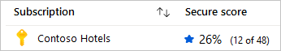
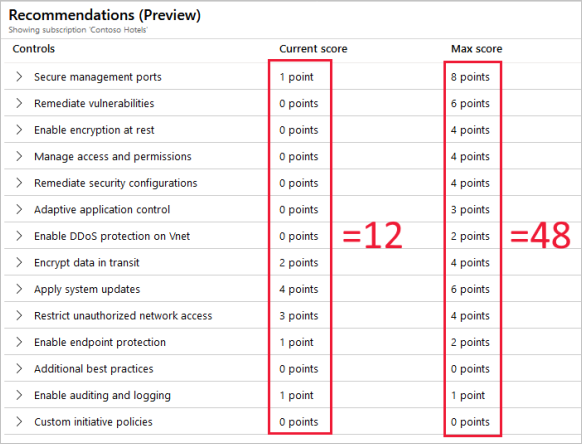

# The enhanced Secure Score (Preview) 

This article introduces the enhanced Secure Score (currently in preview), the accompanying Security Controls, and the advantages they bring.

## Introduction to Secure Score

Azure Security Center has two main goals:

* To help you understand your current security situation
* To help you efficiently and effectively improve your security

The central aspect of Security Center that enables you to achieve those goals is **Secure Score**.

Security Center continually assesses your resources, subscriptions, and organization for security issues. It then aggregates all the findings into a single score so that you can tell, at a glance, your current security situation: the higher the score, the lower the identified risk level.

You can also use this score to track your security posture over time, and track security efforts and projects in your organization. The enhanced Secure Score (currently in preview) adds a percentage to the display to make it even simpler to track over time:

## Locating your Secure Score

Security Center displays your score prominently: it's the first thing shown in the Overview page. If you click through to the dedicated Secure Score page, you'll see the score broken down by subscription. Click a single subscription to see the detailed list of prioritized recommendations and the potential impact that remediating them will have on the subscription’s score.

## How the Secure Score is calculated 

Before this preview, Security Center considered each recommendation individually and assigned a value to it based on its severity. Security teams working to improve their security posture had to prioritize responses to Security Center recommendations based on the full list of findings. Every time you remediated a recommendation for a single resource, your Secure Score improved.

As part of the enhancements to the Secure Score, recommendations are now grouped into **Security Controls**. These controls are logical groupings of related recommendations. Points are no longer awarded at the recommendation level. Instead, your score will only improve when you remediate *all* of the recommendations for a single resource within a control.

The contribution of each Security Control towards the overall Secure Score is shown clearly on the recommendations page.

To get all the possible points for a Security Control, all your resources must comply with all of the security recommendations within the Security Control. For example, Security Center has multiple recommendations regarding how to secure your management ports. In the past, you could remediate some of those related and interdependent recommendations while leaving others unsolved, and your Secure Score would improve. When looked at objectively, it's easy to argue that your security hadn't improved until you had resolved them all. Now, you must remediate them all to make a difference to your Secure Score.

For example, the Security Control called "Apply system updates" has a maximum score of six points:

If you have three virtual machines, each one can potentially contribute a score of 0 or 2 (since it must meet all recommendations). 

### Calculations

|Metric|Calculation|Example|
|-|-|-|
|**Secure Score** **- Single subscription**, all supported resource types|(Sum of your current points /  sum of the maximum score available)  * 100| In this example, there is a single subscription with all 16 Security Controls available. The subscription covers all supported resource types in Security Center, and the policy is configured to include all those resources; so the potential maximum score is 60 points.   The score shows 27 points out of a possible 60 and that is reflected in the figures on the recommendations page. |
|**Secure Score** **- Single subscription**, some supported resource types|(Sum of your current points /  sum of the maximum score available)  * 100| In this example, there is a single subscription that only covers a subset of the resources which Security Center can protect. Therefore, there are only 14 Security Controls and the potential maximum score is 48 points.   The score shows 12 points out of a possible 48 and that is reflected in the figures on the recommendations page. |
|**Secure Score** **- Multiple subscriptions**|(Sum of your current points in all subscriptions mapped to the same set of Security Controls/  sum of the maximum score available)  * 100| In this example, the two subscriptions from the previous examples are being assessed together.  Security Center considers the resources from each and maps them all to the available Security Controls. Some of the Security Controls now contain resources from both subscriptions, while others haven't changed.  The maximum score in this example is 60 points because one of the subscriptions has all controls and policies enabled. However, if there were two subscriptions with different subsets of the Security Controls enabled, it's possible to have subscriptions with maximum scores of 30 each, and a combined maximum score of 60 points.|

## Improving your Secure Score

To improve your Secure Score, remediate security recommendations from your recommendations list. You can remediate each recommendation manually for each resource, or by using the **Quick Fix!** option (when available) to apply a remediation for a recommendation to a group of resources quickly. For more information, see [Remediate recommendations](security-center-remediate-recommendations.md).

Only built-in recommendations have an impact on the Secure Score.

## Security Controls and their recommendations

The table below lists the Security Controls in Azure Security Center. For each control, you can see the maximum number of points you can add to your Secure Score if you remediate *all* of the recommendations listed in the control, for *all* of your resources. 

> [!TIP]
> If you'd like to filter or sort this list differently, copy and paste it into Excel.

|Security Control|Maximum Secure Score points|Recommendations|
|----------------|-------------------|---------------|
|**Enable MFA**|10|MFA should be enabled on accounts with owner permissions on your subscription MFA should be enabled on accounts with read permissions on your subscription MFA should be enabled accounts with write permissions on your subscription|
|**Secure management ports**|8|Just-In-Time network access control should be applied on virtual machines Virtual machines should be associated with a Network Security Group Management ports should be closed on your virtual machines|
|**Apply system updates**|6|Monitoring agent health issues should be resolved on your machines Monitoring agent should be installed on virtual machine scale sets Monitoring agent should be installed on your machines OS version should be updated for your cloud service roles System updates on virtual machine scale sets should be installed System updates should be installed on your machines Your machines should be restarted to apply system updates Kubernetes Services should be upgraded to a non-vulnerable Kubernetes version Monitoring agent should be installed on your virtual machines|
|**Remediate vulnerabilities**|6|Vulnerabilities in Azure Container Registry images should be remediated (Preview) Vulnerabilities on your SQL databases should be remediated Vulnerabilities should be remediated by a Vulnerability Assessment solution Vulnerability assessment should be enabled on your SQL managed instances Vulnerability assessment should be enabled on your SQL servers Vulnerability assessment solution should be installed on your virtual machines|
|**Enable encryption at rest**|4|Disk encryption should be applied on virtual machines Transparent Data Encryption on SQL databases should be enabled Automation account variables should be encrypted Service Fabric clusters should have the ClusterProtectionLevel property set to EncryptAndSign SQL server TDE protector should be encrypted with your own key|
|**Encrypt data in transit**|4|API App should only be accessible over HTTPS Function App should only be accessible over HTTPS Only secure connections to your Redis Cache should be enabled Secure transfer to storage accounts should be enabled Web Application should only be accessible over HTTPS|
|**Manage access and permissions**|4|A maximum of 3 owners should be designated for your subscription Deprecated accounts should be removed from your subscription (Preview) Deprecated accounts with owner permissions should be removed from your subscription (Preview) External accounts with owner permissions should be removed from your subscription (Preview) External accounts with read permissions should be removed from your subscription External accounts with write permissions should be removed from your subscription (Preview) There should be more than one owner assigned to your subscription Role-Based Access Control (RBAC) should be used on Kubernetes Services (Preview) Service Fabric clusters should only use Azure Active Directory for client authentication|
|**Remediate security configurations**|4|Pod Security Policies should be defined on Kubernetes Services (Preview) Vulnerabilities in container security configurations should be remediated Vulnerabilities in security configuration on your machines should be remediated Vulnerabilities in security configuration on your virtual machine scale sets should be remediated Monitoring agent should be installed on your virtual machines Monitoring agent should be installed on your machines Monitoring agent should be installed on virtual machine scale sets Monitoring agent health issues should be resolved on your machines|
|**Restrict unauthorized network access**|4|IP forwarding on your virtual machine should be disabled Authorized IP ranges should be defined on Kubernetes Services (Preview) Access to App Services should be restricted (Preview) The rules for web applications on IaaS NSGs should be hardened Virtual machines should be associated with a Network Security Group CORS should not allow every resource to access your API App CORS should not allow every resource to access your Function App CORS should not allow every resource to access your Web Application Remote debugging should be turned off for API App Remote debugging should be turned off for Function App Remote debugging should be turned off for Web Application Access should be restricted for permissive Network Security Groups with Internet-facing VMs Network Security Group Rules for Internet facing virtual machines should be hardened|
|**Adaptive application control**|3|Adaptive Application Controls should be enabled on virtual machines Monitoring agent should be installed on your virtual machines Monitoring agent should be installed on your machines Monitoring agent health issues should be resolved on your machines|
|**Apply data classification**|2|Sensitive data in your SQL databases should be classified (Preview)|
|**Enable DDoS protection on Vnet**|2|DDoS Protection Standard should be enabled|
|**Enable endpoint protection**|2|Endpoint protection health failures should be remediated on virtual machine scale sets Endpoint protection health issues should be resolved on your machines Endpoint protection solution should be installed on virtual machine scale sets Install endpoint protection solution on virtual machines Monitoring agent health issues should be resolved on your machines Monitoring agent should be installed on virtual machine scale sets Monitoring agent should be installed on your machines Monitoring agent should be installed on your virtual machines Install endpoint protection solution on your machines|
|**Enable auditing and logging**|1|Auditing on SQL server should be enabled Diagnostic logs in App Services should be enabled Diagnostic logs in Azure Data Lake Store should be enabled Diagnostic logs in Azure Stream Analytics should be enabled Diagnostic logs in Batch accounts should be enabled Diagnostic logs in Data Lake Analytics should be enabled Diagnostic logs in Event Hub should be enabled Diagnostic logs in IoT Hub should be enabled Diagnostic logs in Key Vault should be enabled Diagnostic logs in Logic Apps should be enabled Diagnostic logs in Search service should be enabled Diagnostic logs in Service Bus should be enabled Diagnostic logs in Virtual Machine Scale Sets should be enabled Metric alert rules should be configured on Batch accounts SQL Auditing settings should have Action-Groups configured to capture critical activities SQL servers should be configured with auditing retention days greater than 90 days.|
|**Additional best practices**|0|Access to storage accounts with firewall and virtual network configurations should be restricted All authorization rules except RootManageSharedAccessKey should be removed from Event Hub namespace An Azure Active Directory administrator should be provisioned for SQL servers Authorization rules on the Event Hub instance should be defined Storage accounts should be migrated to new Azure Resource Manager resources Virtual machines should be migrated to new Azure Resource Manager resources Advanced data security settings for SQL server should contain an email address to receive security alerts Advanced data security should be enabled on your managed instances Advanced data security should be enabled on your SQL servers All advanced threat protection types should be enabled in SQL managed instance advanced data security settings Email notifications to admins and subscription owners should be enabled in SQL server advanced data security settings Advanced Threat Protection types should be set to 'All' in SQL server Advanced Data Security settings Subnets should be associated with a Network Security Group All advanced threat protection types should be enabled in SQL server advanced data security settings|
||||

## Secure Score FAQ

### Why has my Secure Score gone down?
With the changes introduced in this enhanced Secure Score, you must solve all recommendation for a resource to receive points. The scores also changed to a scale of 0-10.

### If I address only three out of four recommendations in a Security Control, will my Secure Score change?
No; it won't change until you remediate all of the recommendation for a single resource. To get the maximum score for a control, you must remediate all recommendations, for all resources.

### Will this enhanced Secure Score replace the existing Secure Score? 
Yes, but for a while they will be running side by side to ease the transition.

### If a recommendation is not applicable to me, and I disable it in the policy, will my Security Control be fulfilled and my Secure Score updated?
Yes. We recommend disabling recommendations when they're inapplicable in your environment. For instructions on how to disable a specific recommendation, see [Disable security policies](https://docs.microsoft.com/azure/security-center/tutorial-security-policy#disable-security-policies).

### If a Security Control offers me zero points towards my Secure Score, should I ignore it?
In some cases you will see a control max score greater than zero, but the impact is zero. When the incremental score for fixing resources is negligible, it is rounded to zero. Don't ignore these recommendations as they still bring security improvements. The only exception is the “Additional Best Practice” control. Remediating these recommendations won't increase your score, but it will enhance your overall security.

## Next steps

Since this feature is in preview, we'd appreciate your feedback on your experiences with it. You can send us your comments, thoughts, and feedback [here](https://aka.ms/securescorefeedback).

This article described the enhanced Secure Score and the new Security Controls it introduces. For related material, see the following articles:

- [Learn about the different elements of a recommendation](security-center-recommendations.md)
- [Learn how to remediate recommendations](security-center-remediate-recommendations.md)