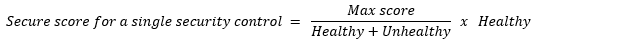
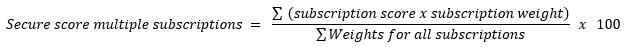

# Secure score in Azure Security Center

## Introduction to secure score

Azure Security Center has two main goals: 

- to help you understand your current security situation
- to help you efficiently and effectively improve your security

The central feature in Security Center that enables you to achieve those goals is **secure score**.

Security Center continually assesses your resources, subscriptions, and organization for security issues. It then aggregates all the findings into a single score so that you can tell, at a glance, your current security situation: the higher the score, the lower the identified risk level.

The secure score is shown in the Azure portal pages as a percentage value, but the underlying values are also clearly presented:

:::image type="content" source="./media/secure-score-security-controls/single-secure-score-via-ui.png" alt-text="Overall secure score as shown in the portal":::

To increase your security, review Security Center's recommendations page for the outstanding actions necessary to raise your score. Each recommendation includes instructions to help you remediate the specific issue.

Recommendations are grouped into **security controls**. Each control is a logical group of related security recommendations, and reflects your vulnerable attack surfaces. Your score only improves when you remediate *all* of the recommendations for a single resource within a control. To see how well your organization is securing each individual attack surface, review the scores for each security control.

For more information, see [How your secure score is calculated](secure-score-security-controls.md#how-your-secure-score-is-calculated) below. 


## Access your secure score

You can find your overall secure score, as well as your score per subscription, through the Azure portal or programatically as described in the following sections:

- [Get your secure score from the portal](#get-your-secure-score-from-the-portal)
- [Get your secure score from the REST API](#get-your-secure-score-from-the-rest-api)
- [Get your secure score from Azure Resource Graph (ARG)](#get-your-secure-score-from-azure-resource-graph-arg)

### Get your secure score from the portal

Security Center displays your score prominently in the portal: it's the first main tile the Security Center overview page. Selecting this tile, takes you to the dedicated secure score page, where you'll see the score broken down by subscription. Select a single subscription to see the detailed list of prioritized recommendations and the potential impact that remediating them will have on the subscription's score. 

To recap, your secure score is shown in the following locations in Security Center's portal pages.

- In a tile on Security Center's **Overview** (main dashboard):

    :::image type="content" source="./media/secure-score-security-controls/score-on-main-dashboard.png" alt-text="The secure score on Security Center's dashboard":::

- In the dedicated **Secure score** page you can see the secure score for your subscription and your management groups:

    :::image type="content" source="./media/secure-score-security-controls/score-on-dedicated-dashboard.png" alt-text="The secure score for subscriptions on Security Center's secure score page":::

    :::image type="content" source="./media/secure-score-security-controls/secure-score-management-groups.png" alt-text="The secure score for management groups on Security Center's secure score page":::

    > [!NOTE]
    > Any management groups for which you don't have sufficient permissions, will show their score as “Restricted.” 

- At the top of the **Recommendations** page:

    :::image type="content" source="./media/secure-score-security-controls/score-on-recommendations-page.png" alt-text="The secure score on Security Center's recommendations page":::

### Get your secure score from the REST API

You can access your score via the secure score API. The API methods provide the flexibility to query the data and build your own reporting mechanism of your secure scores over time. For example, you can use the [Secure Scores API](/rest/api/securitycenter/securescores) to get the score for a specific subscription. In addition, you can use the [Secure Score Controls API](/rest/api/securitycenter/securescorecontrols) to list the security controls and the current score of your subscriptions.


For examples of tools built on top of the secure score API, see [the secure score area of our GitHub community](https://github.com/Azure/Azure-Security-Center/tree/master/Secure%20Score). 

### Get your secure score from Azure Resource Graph (ARG)

Azure Resource Graph provides instant access to resource information across your cloud environments with robust filtering, grouping, and sorting capabilities. It's a quick and efficient way to query information across Azure subscriptions programmatically or from within the Azure portal. [Learn more about Azure Resource Graph](../governance/resource-graph/index.yml).

To access the secure score for multiple subscriptions with ARG:

1. From the Azure portal, open **Azure Resource Graph Explorer**.

    :::image type="content" source="./media/security-center-identity-access/opening-resource-graph-explorer.png" alt-text="Launching Azure Resource Graph Explorer** recommendation page" :::

1. Enter your Kusto query (using the examples below for guidance).

    - This query returns the subscription ID, the current score in points and as a percentage, and the maximum score for the subscription. 

        ```kusto
        SecurityResources 
        | where type == 'microsoft.security/securescores' 
        | extend current = properties.score.current, max = todouble(properties.score.max)
        | project subscriptionId, current, max, percentage = ((current / max)*100)
        ```

    - This query returns the status of all the security controls. For each control, you'll get the number of unhealthy resources, the current score, and the maximum score. 

        ```kusto
        SecurityResources 
        | where type == 'microsoft.security/securescores/securescorecontrols'
        | extend SecureControl = properties.displayName, unhealthy = properties.unhealthyResourceCount, currentscore = properties.score.current, maxscore = properties.score.max
        | project SecureControl , unhealthy, currentscore, maxscore
        ```

1. Select **Run query**.


## Tracking your secure score over time

If you're a Power BI user with a Pro account, you can use the **Secure Score Over Time** Power BI dashboard to track your secure score over time and investigate any changes.

> [!TIP]
> You can find this dashboard, as well as other tools for working programatically with secure score, in the dedicated area of the Azure Security Center community on GitHub: https://github.com/Azure/Azure-Security-Center/tree/master/Secure%20Score

The dashboard contains the following two reports to help you analyze your security status:

- **Resources Summary** - provides summarized data regarding your resources’ health.
- **Secure Score Summary** - provides summarized data regarding your score progress. Use the “Secure score over time per subscription” chart to view changes in the score. If you notice a dramatic change in your score, check the “detected changes that may affect your secure score” table for possible changes that could have caused the change. This table presents deleted resources, newly deployed resources, or resources that their security status changed for one of the recommendations.

:::image type="content" source="./media/secure-score-security-controls/power-bi-secure-score-dashboard.png" alt-text="The optional Secure Score Over Time Power BI dashboard for tracking your secure score over time and investigating changes":::


## How your secure score is calculated 

The contribution of each security control towards the overall secure score is shown clearly on the recommendations page.

[](media/secure-score-security-controls/security-controls.png#lightbox)

To get all the possible points for a security control, all your resources must comply with all of the security recommendations within the security control. For example, Security Center has multiple recommendations regarding how to secure your management ports. You'll need to remediate them all to make a difference to your secure score.

For example, the security control called "Apply system updates" has a maximum score of six points, which you can see in the tooltip on the potential increase value of the control:

[](media/secure-score-security-controls/apply-system-updates-control.png#lightbox)

The maximum score for this control, Apply system updates, is always 6. In this example, there are 50 resources. So we divide the max score by 50, and the result is that every resource contributes 0.12 points. 

* **Potential increase** (0.12 x 8 unhealthy resources = 0.96) - The remaining points available to you within the control. If you remediate all the recommendations in this control, your score will increase by 2% (in this case, 0.96 points rounded up to 1 point). 
* **Current score** (0.12 x 42 healthy resources = 5.04) - The current score for this control. Each control contributes towards the total score. In this example, the control is contributing 5.04 points to current secure total.
* **Max score** - The maximum number of points you can gain by completing all recommendations within a control. The maximum score for a control indicates the relative significance of that control. Use the max score values to triage the issues to work on first. 


### Calculations - understanding your score

|Metric|Formula and example|
|-|-|
|**Security control's current score**|<br><br><br>Each individual security control contributes towards the Security Score. Each resource affected by a recommendation within the control, contributes towards the control's current score. The current score for each control is a measure of the status of the resources *within* the control.<br><br>In this example, the max score of 6 would be divided by 78 because that's the sum of the healthy and unhealthy resources.<br>6 / 78 = 0.0769<br>Multiplying that by the number of healthy resources (4) results in the current score:<br>0.0769 * 4 = **0.31**<br><br>|
|**Secure score**<br>Single subscription|<br><br><br><br>In this example, there is a single subscription with all security controls available (a potential maximum score of 60 points). The score shows 28 points out of a possible 60 and the remaining 32 points are reflected in the "Potential score increase" figures of the security controls.<br>|
|**Secure score**<br>Multiple subscriptions|<br><br><br>When calculating the combined score for multiple subscriptions, Security Center includes a *weight* for each subscription. The relative weights for your subscriptions are determined by Security Center based on factors such as the number of resources.<br>The current score for each subscription is calculated in the same way as for a single subscription, but then the weight is applied as shown in the equation.<br>When viewing multiple subscriptions, secure score evaluates all resources within all enabled policies and groups their combined impact on each security control's maximum score.<br><br>The combined score is **not** an average; rather it's the evaluated posture of the status of all resources across all subscriptions.<br>Here too, if you go to the recommendations page and add up the potential points available, you will find that it's the difference between the current score (24) and the maximum score available (60).|
||||

### Which recommendations are included in the secure score calculations?

Only built-in recommendations have an impact on the secure score.

Recommendations flagged as **Preview** aren't included in the calculations of your secure score. They should still be remediated wherever possible, so that when the preview period ends they'll contribute towards your score.

An example of a preview recommendation:

:::image type="content" source="./media/secure-score-security-controls/example-of-preview-recommendation.png" alt-text="Recommendation with the preview flag":::

## Improve your secure score

To improve your secure score, remediate security recommendations from your recommendations list. You can remediate each recommendation manually for each resource, or by using the **Quick Fix!** option (when available) to apply a remediation for a recommendation to a group of resources quickly. For more information, see [Remediate recommendations](security-center-remediate-recommendations.md).

Another way to improve your score and ensure your users don't create resources that negatively impact your score is to configure the Enforce and Deny options on the relevant recommendations. Learn more in [Prevent misconfigurations with Enforce/Deny recommendations](prevent-misconfigurations.md).

## Security controls and their recommendations

The table below lists the security controls in Azure Security Center. For each control, you can see the maximum number of points you can add to your secure score if you remediate *all* of the recommendations listed in the control, for *all* of your resources. 

The set of security recommendations provided with Security Center is tailored to the available resources in each organization’s environment. The recommendations can be further customized by [disabling policies](tutorial-security-policy.md#disable-security-policies-and-disable-recommendations) and [exempting specific resources from a recommendation](exempt-resource.md). 
 
We recommend every organization carefully review their assigned Azure Policy initiatives. 

> [!TIP]
> For details of reviewing and editing your initiatives, see [Working with security policies](tutorial-security-policy.md). 

Even though Security Center’s default security initiative is based on industry best practices and standards, there are scenarios in which the built-in recommendations listed below might not completely fit your organization. Consequently, it’ll sometimes be necessary to adjust the default initiative - without compromising security - to ensure it’s aligned with your organization’s own policies. industry standards, regulatory standards, and benchmarks you’re obligated to meet.<br><br>
<div class="foo">

<style type="text/css">
.tg  {border-collapse:collapse;border-spacing:0;}
.tg td{border-color:black;border-style:solid;border-width:1px;font-family:Arial, sans-serif;font-size:14px;
  overflow:hidden;padding:10px 5px;word-break:normal;}
.tg th{border-color:black;border-style:solid;border-width:1px;font-family:Arial, sans-serif;font-size:18px;
  font-weight:normal;overflow:hidden;padding:10px 5px;word-break:normal;}
.tg .tg-cly1{text-align:left;vertical-align:middle}
.tg .tg-lboi{border-color:inherit;text-align:left;vertical-align:middle}
</style>

[!INCLUDE [security-center-controls-and-recommendations](../../includes/asc/security-control-recommendations.md)]

</div>


## Secure score FAQ

### If I address only three out of four recommendations in a security control, will my secure score change?
No. It won't change until you remediate all of the recommendations for a single resource. To get the maximum score for a control, you must remediate all recommendations, for all resources.

### If a recommendation isn't applicable to me, and I disable it in the policy, will my security control be fulfilled and my secure score updated?
Yes. We recommend disabling recommendations when they're inapplicable in your environment. For instructions on how to disable a specific recommendation, see [Disable security policies](./tutorial-security-policy.md#disable-security-policies-and-disable-recommendations).

### If a security control offers me zero points towards my secure score, should I ignore it?
In some cases, you'll see a control max score greater than zero, but the impact is zero. When the incremental score for fixing resources is negligible, it's rounded to zero. Don't ignore these recommendations as they still bring security improvements. The only exception is the "Additional Best Practice" control. Remediating these recommendations won't increase your score, but it will enhance your overall security.

## Next steps

This article described the secure score and the security controls it introduces. For related material, see the following articles:

- [Learn about the different elements of a recommendation](security-center-recommendations.md)
- [Learn how to remediate recommendations](security-center-remediate-recommendations.md)
- [View the GitHub-based tools for working programmatically with secure score](https://github.com/Azure/Azure-Security-Center/tree/master/Secure%20Score)