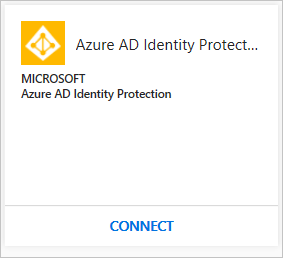
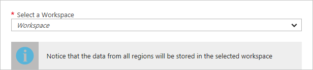

# Connecting Azure Active Directory Identity Protection to Azure Security Center
This document helps you to configure the integration between Azure Active Directory (AD) Identity Protection and Azure Security Center.

## Why connect Azure AD Identity Protection?
[Azure AD Identity Protection](https://docs.microsoft.com/azure/active-directory/active-directory-identityprotection) helps detect potential vulnerabilities affecting your organization’s identities. When connected, you are able to view Azure AD Identity Protection alerts in Security Center. This integration enables you to view, correlate, and investigate all security alerts related to your hybrid cloud workloads in Security Center. 

## How do I configure this integration?
If your organization is already using Azure AD Identity Protection, follow the steps below to configure the integration:

1. Open **Security Center** dashboard.
2. On the left pane, click **Security Solutions**. Security Center automatically discovers if Azure AD Identity Protection is enabled for your organization.

	

3. Click **CONNECT**.
4. In the **Integrate Azure AD Identity Protection** page, scroll down, and select the appropriate workspace:

	

5. Click **Connect**.

Once you finish this configuration, the Azure AD Identity Protection solution appears in the **Security Solutions** page, under **Connected solutions**. 

## Next steps
In this document, you learned how to connect Azure AD Identity Protection to Security Center. To learn more about Security Center, see the following articles:

* [Connecting Microsoft Advanced Threat Analytics to Azure Security Center](security-center-ata-integration.md)
* [Setting security policies in Azure Security Center](security-center-policies.md) — Learn how to configure security policies for your Azure subscriptions and resource groups.
* [Managing security recommendations in Azure Security Center](security-center-recommendations.md) — Learn how recommendations help you protect your Azure resources.
* [Security health monitoring in Azure Security Center](security-center-monitoring.md) — Learn how to monitor the health of your Azure resources.
* [Managing and responding to security alerts in Azure Security Center](security-center-managing-and-responding-alerts.md) — Learn how to manage and respond to security alerts.
* [Monitoring partner solutions with Azure Security Center](security-center-partner-solutions.md) — Learn how to monitor the health status of your partner solutions.
- [Azure Security Center data security](security-center-data-security.md) - Learn how data is managed and safeguarded in Security Center.
* [Azure Security Center FAQ](security-center-faq.md) — Find frequently asked questions about using the service.
* [Azure Security blog](http://blogs.msdn.com/b/azuresecurity/) — Get the latest Azure security news and information.

