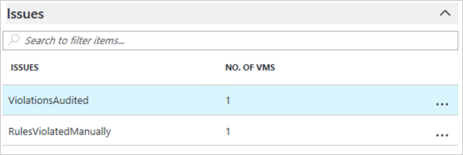
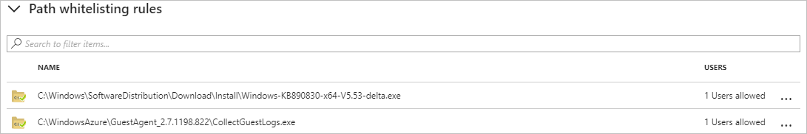

# Adaptive Application Controls in Azure Security Center (Preview)
Learn how to configure application control in Azure Security Center using this walkthrough.

## What are adaptive application controls in Security Center?
Adaptive application controls help control which applications can run on your VMs located in Azure, which among other benefits helps harden your VMs against malware. Security Center uses machine learning to analyze the processes running in the VM and helps you apply whitelisting rules using this intelligence. This capability greatly simplifies the process of configuring and maintaining application whitelists, enabling you to:

- Block or alert on attempts to run malicious applications, including those that might otherwise be missed by antimalware solutions
- Comply with your organization's security policy that dictates the use of only licensed software.
- Avoid unwanted software to be used in your environment.
- Avoid old and unsupported apps to run.
- Prevent specific software tools that are not allowed in your organization.
- Enable IT to control the access to sensitive data through app usage.

## How to enable adaptive application controls?
Adaptive application controls help you define a set of applications that are allowed to run on configured resource groups. This feature is only available for Windows machines (all versions, classic or Azure Resource Manager). Follow the steps below to configure application whitelisting in Security Center:

1.	Open **Security Center** dashboard, and click **Overview**.
2.	Under **Advanced cloud defense**, the **Adaptive application controls** tile shows how many VMs currently have the control in place compared to all the VMs. It also shows the number of issues that were found in last week: 

	

3. Click on the **Adaptive application controls** tile to see more options.

	

4. The Resource Groups section contains three tabs:
	* **Recommended**:  list of resource groups for which application control is recommended. Security Center uses machine learning to identify VMs that are good candidates for application control based on whether the VMs consistently run the same applications.
	* **Configured**: list of resource groups containing the VMs that were configured with application control. 
	* **No recommendation**: list of resource groups containing VMs without any application control recommendations. For example, VMs on which applications are always changing, and haven’t reached a steady state.

The sections that follow will go in more details on each option, and how to use it.

### Configure a new application control policy
Click on the **Recommended** tab for a list of resource groups with application control recommendations:

The list includes:
- **NAME**: the name of the subscription and resource group
- **VMs**: the number of virtual machines in the resource group
- **STATE**: the state of the recommendations, which in most cases will be open
- **SEVERITY**: the severity level of the recommendations

Select a resource group to open the **Create application control rules** option:

In the **Select VMs**, review the list of recommended VMs and uncheck any you do not want to apply application control to. In the **Select processes for whitelisting rules**, review the list of recommended applications and uncheck any you do not want to apply. The list includes:

- **NAME**: the full application path
- **PROCESSES**: how many applications reside within every path
- **COMMON**: true indicates that these processes have been executed on most VMs in this resource group.
- **EXPLOITABLE**: a warning icon will indicate if the applications could be used by an attacker to bypass application whitelisting. It is strongly recommended that these applications will be reviewed prior to their approval. 

Once you finish your selections, click **Create** button. By default, Security Center always enables application control in *Audit* mode. After validating that the whitelist has not had any adverse effects on your workload, you can change to *Enforce* mode.

> [!NOTE]
> As a security best practice, Security Center will always try to create a publisher rule for the applications that should be whitelisted, and only if an application doesn’t have a publisher information (aka not signed), a path rule will be created for the full path of the specific EXE.
>   

### Editing and monitoring a group configured with application control

To edit, and monitoring a group configured with application control click **CONFIGURED** under **Resource Groups**:

The list includes:

- **NAME**: the name of the subscription and resource group
- **VMs**: the number of virtual machines in the resource group
- **MODE**: Audit mode will log attempts to run non-whitelisted applications; Block will not allow non-whitelisted applications to run
- **SEVERITY**: the severity level of the recommendations

Select a resource group to make changes in the **Edit application control policy** page.

Under **Protection Mode**, you have the option to select between the following options:
- **Audit**: in this mode, the application control solution will not enforce the rules, and only audit the activity on the protected VMs. This is recommended for scenarios where you want to first observe the overall behavior before blocking an app to run in the target VM.
- **Enforce**: in this mode, the application control solution will enforce the rules, and make sure that applications that are not allowed to run are blocked. 

As previously mentioned, by default a new application control policy will always be configured in *Audit* mode. Under **Policy extension**, you can add your own application paths that you want to whitelist. Once you add these paths, Security Center will create the proper rules for these applications, in addition to the rules that are already in place. In the **Issues** section, any current violations are listed.

This list includes:

- **ISSUES**: any violations that were logged, which can include the following:
	- **ViolationsBlocked**: when the solution is turned on Enforce mode, and an application that is not whitelisted tries to execute.
	- **ViolationsAudited**: when the solution is turned on Audit mode, and an application that is not whitelisted executes.
	- **RulesViolatedManually**: when a user tried to manually configure rules on the VMs and not via the ASC management portal.
- **NO. OF VMS**: the number of virtual machines with this issue type.

If you click on each one of those lines, you will be redirected to [Azure Activity Log](https://docs.microsoft.com/azure/monitoring-and-diagnostics/monitoring-overview-activity-logs) page where you can see information about all VMs with this type of violation. If you click on the three dots at the end of each line you will be able to delete that particular entry. The **Configured virtual machines** section lists the VMs to which these rules apply. 

**Publisher whitelisting rules** list the applications for which a publisher rule was created based on the certificate information that was found for each application. See [Understanding Publisher Rules in Applocker](https://docs.microsoft.com/windows/device-security/applocker/understanding-the-publisher-rule-condition-in-applocker) for more information.

If you click on the three dots at the end of each line you will be able to delete that specific rule. The **Path whitelisting rules** lists the entire application path (including the executable) for the applications that are not signed with a digital certificate, but are still current in the whitelisting rules. 

> [!NOTE]
> By default, as a security best practice, Security Center will always try to create a publisher rule for the EXEs that should be whitelisted, and only if an EXE doesn’t have a publisher information (aka not signed), a path rule will be created for the full path of the specific EXE.

The list contains:
- **NAME**: the full patch of the executable
- **EXPLOITABLE**: true indicates that applications could be used by an attacker to bypass application whitelisting.  

If you click on the three dots at the end of each line you will be able to delete that specific rule. After making the changes you can click the **Save** button, or if you decide to not apply the changes click in **Discard**.

### Not recommended list

Security Center will only recommend application whitelisting for virtual machines running a stable set of applications. Recommendations will not be created if applications on the associated VMs keep changing. 

The list contains:
- **NAME**: the name of the subscription and resource group.
- **VMs**: the number of virtual machines in the resource group.

## See also
In this document, you learned how to use adaptive application control in Azure Security Center to whitelist applications running in Azure VMs. To learn more about Azure Security Center, see the following:

* [Managing and responding to security alerts in Azure Security Center](https://docs.microsoft.com/azure/security-center/security-center-managing-and-responding-alerts). Learn how to manage alerts, and respond to security incidents in Security Center.
* [Security health monitoring in Azure Security Center](security-center-monitoring.md). Learn how to monitor the health of your Azure resources.
* [Understanding security alerts in Azure Security Center](https://docs.microsoft.com/azure/security-center/security-center-alerts-type). Learn about the different types of security alerts.
* [Azure Security Center Troubleshooting Guide](https://docs.microsoft.com/azure/security-center/security-center-troubleshooting-guide). Learn how to troubleshoot common issues in Security Center. 
* [Azure Security Center FAQ](security-center-faq.md). Find frequently asked questions about using the service.
* [Azure Security Blog](http://blogs.msdn.com/b/azuresecurity/). Find blog posts about Azure security and compliance.

