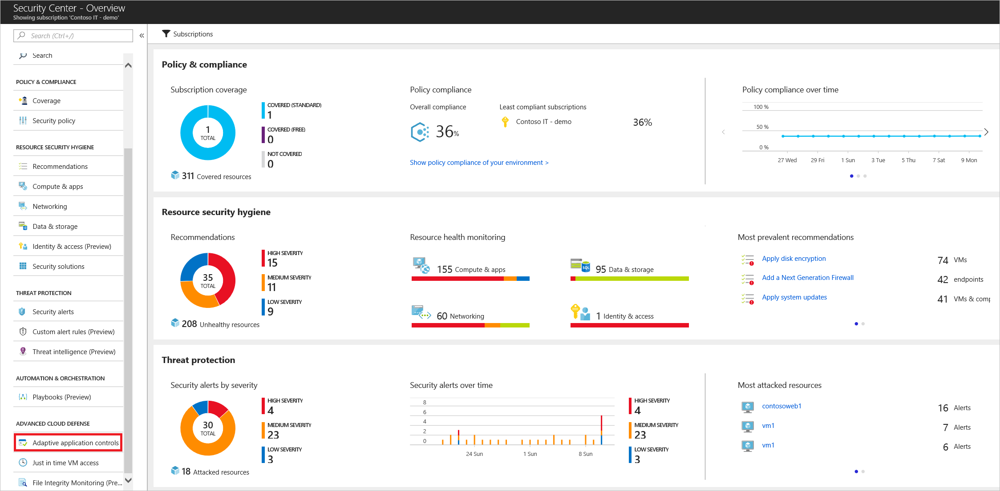
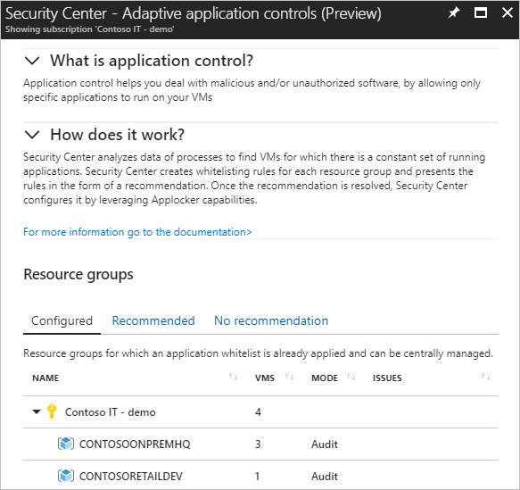
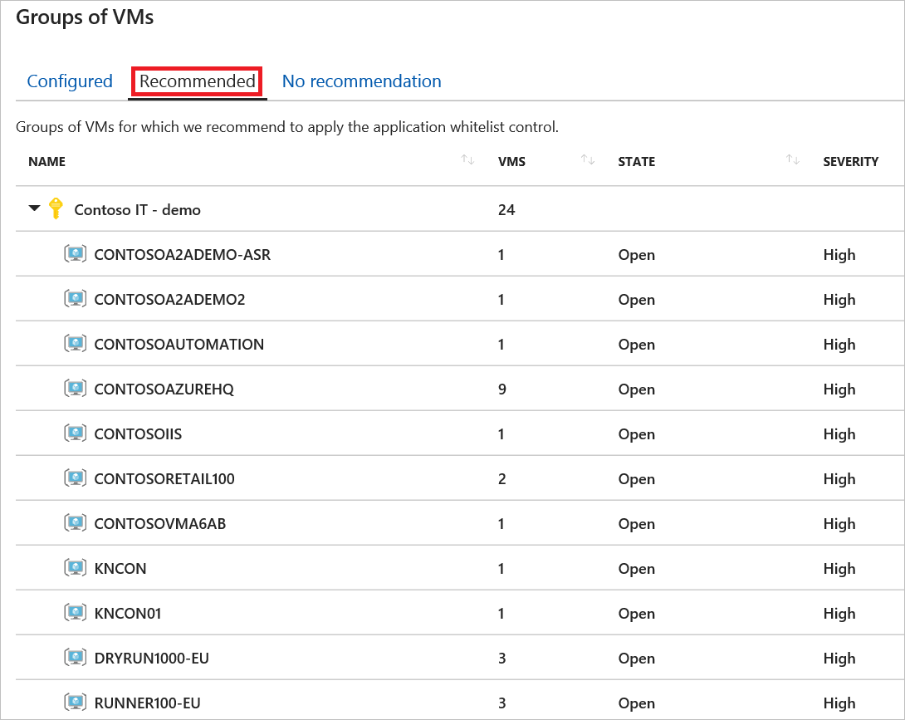
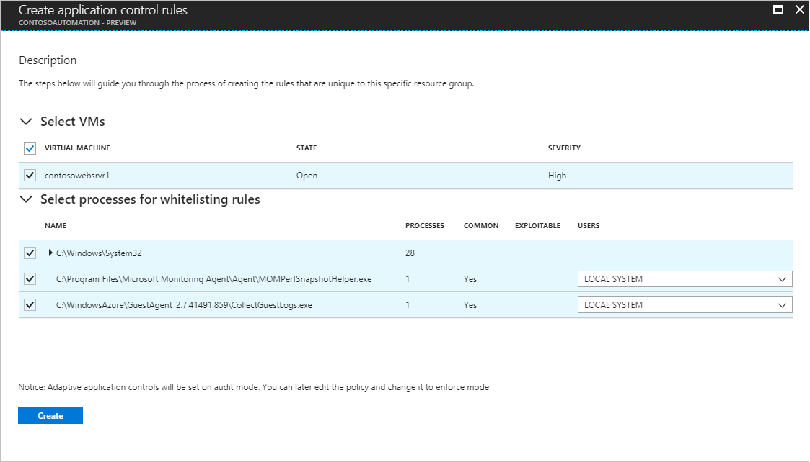
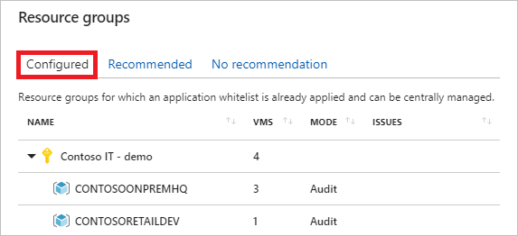
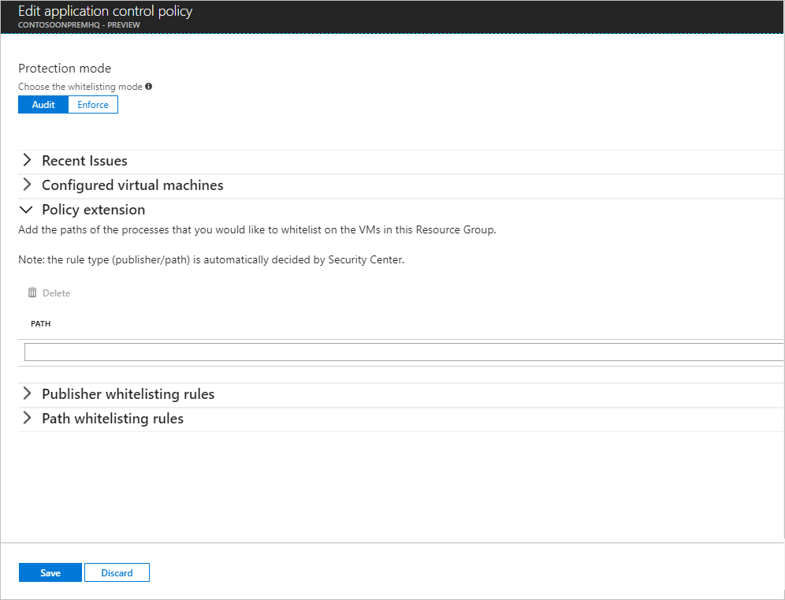
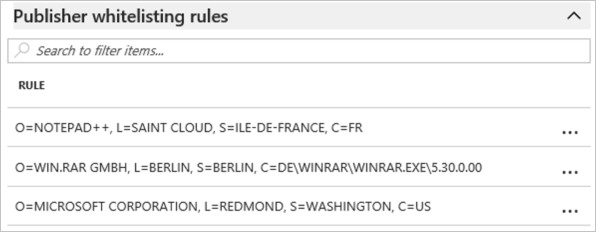
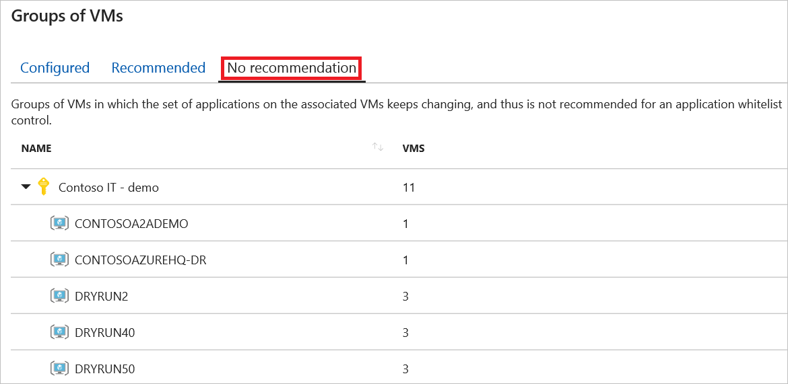
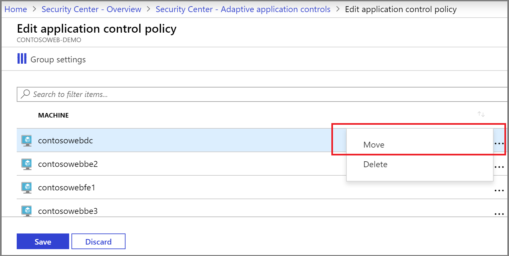
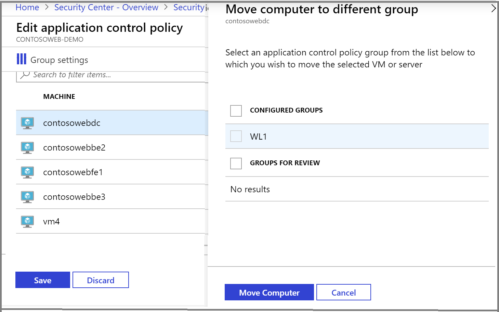

# Adaptive application controls in Azure Security Center
Learn how to configure application control in Azure Security Center using this walkthrough.

## What are adaptive application controls in Security Center?
Adaptive application control is an intelligent, automated end-to-end application whitelisting solution from Azure Security Center. It helps you control which applications can run on your Azure and non-Azure VMs (Windows and Linux), which, among other benefits, helps harden your VMs against malware. Security Center uses machine learning to analyze the applications running on your VMs and helps you apply the specific whitelisting rules using this intelligence. This capability greatly simplifies the process of configuring and maintaining application whitelisting policies, enabling you to:

- Block or alert on attempts to run malicious applications, including those that might otherwise be missed by antimalware solutions.
- Comply with your organization's security policy that dictates the use of only licensed software.
- Avoid unwanted software to be used in your environment.
- Avoid old and unsupported apps to run.
- Prevent specific software tools that are not allowed in your organization.
- Enable IT to control the access to sensitive data through app usage.

> [!NOTE]
> For Non-Azure and Linux VMs, adaptive application controls are supported in audit mode only.

## How to enable adaptive application controls?
Adaptive application controls help you define a set of applications that are allowed to run on configured groups of VMs. This feature is available for both Azure and non-Azure Windows (all versions, classic, or Azure Resource Manager) and Linux VMs and servers. The following steps can be used to configure application whitelisting in Security Center:

1. Open the **Security Center** dashboard.
2. In the left pane, select **Adaptive application controls** located under **Advanced cloud defense**.

	

The **Adaptive application controls** page appears.

The **Groups of VMs** section contains three tabs:

* **Configured**: list of groups containing the VMs that were configured with application control.
* **Recommended**:  list of groups for which application control is recommended. Security Center uses machine learning to identify VMs that are good candidates for application control based on whether the VMs consistently run the same applications.
* **No recommendation**: list of groups containing VMs without any application control recommendations. For example, VMs on which applications are always changing, and haven’t reached a steady state.

> [!NOTE]
> Security Center uses a proprietary clustering algorithm to create groups of VMs making sure that similar VMs get the optimal recommended application control policy.
>
>

### Configure a new application control policy
1. Click on the **Recommended** tab for a list of groups with application control recommendations:

   

   The list includes:

   - **Group Name**: The name of the subscription and group
   - **VMs and Computers**: The number of virtual machines in the group
   - **State**: the state of the recommendations
   - **Severity**: the severity level of the recommendations

2. Click on a group to open the **Create application control rules** option.

   

3. In the **Select VMs**, review the list of recommended VMs and uncheck any you do not want to apply an application whitelisting policy to. Next, you see two lists:

   - **Recommended applications**: a list of applications that are frequent on the VMs within this group, and are recommended to be allowed to run.
   - **More applications**: a list of applications that are either less frequent on the VMs within this group or that are known as Exploitables (see more below), and recommended for review.

4. Review the applications in each of the lists, and uncheck any you do not want to apply. Each list includes:

   - **NAME**: the certificate information or the full path of an application
   - **FILE TYPES**: the application file type. This can be EXE, Script, MSI, or any permutation of these types.
   - **EXPLOITABLE**: a warning icon indicates if a specific application could be used by an attacker to bypass an application whitelisting solution. It is recommended to review these applications prior to their approval.
   - **USERS**: users that are recommended to be allowed to run an application

5. Once you finish your selections, select **Create**.  
   After you select Create, Azure Security Center automatically creates the appropriate rules on top of the built-in application whitelisting solution available on Windows servers (AppLocker).

> [!NOTE]
> - Security Center relies on a minimum of two weeks of data in order to create a baseline and populate the unique recommendations per group of VMs. New customers of Security Center standard tier should expect a behavior in which at first their groups of VMs appear under the *no recommendation* tab.
> - Adaptive Application Controls from Security Center doesn’t support VMs for which an AppLocker policy is already enabled by either a GPO or a local security policy.
> -  As a security best practice, Security Center will always try to create a publisher rule for applications that are selected to be allowed, and only if an application doesn’t have a publisher information (aka not signed), a path rule will be created for the full path of the specific application.
>   

### Editing and monitoring a group configured with application control

1. To edit and monitor a group configured with an application whitelisting policy, return to the **Adaptive application controls** page and select **CONFIGURED** under **Groups of VMs**:

   

   The list includes:

   - **Group Name**: the name of the subscription and group
   - **VMs and Computers**: the number of virtual machines in the group
   - **Mode**: Audit mode will log attempts to run non-whitelisted applications; Enforce will not allow non-whitelisted applications to run
   - **Alerts**: any current violations

2. Click on a group to make changes in the **Edit application control policy** page.

   

3. Under **Protection mode**, you have the option to select between the following:

   - **Audit**: in this mode, the application control solution does not enforce the rules, and only audits the activity on the protected VMs. This is recommended for scenarios where you want to first observe the overall behavior before blocking an app to run in the target VM.
   - **Enforce**: in this mode, the application control solution does enforce the rules, and makes sure that applications that are not allowed to run are blocked.

   > [!NOTE]
   > - 	**Enforce** protection mode is disabled until further notice.
   > - As previously mentioned, by default a new application control policy is always configured in *Audit* mode. 
   >

4. Under **Policy extension**, add any application path that you want to allow. After you add these paths, Security Center updates the application whitelisting policy on the VMs within the selected group of VMS and creates the appropriate rules for these applications, in addition to the rules that are already in place.

5. Review the current violations listed in the **Recent alerts** section. Click on each line to be redirected to the **Alerts** page within Azure Security Center, and view all the alerts that were detected by Azure Security Center on the associated VMs.
   - **Alerts**: any violations that were logged.
   - **No. of VMs**: the number of virtual machines with this alert type.

6. Under **Publisher whitelisting rules**, **Path whitelisting rules**, and **Hash whitelisting rules**  you can see which application whitelisting rules are currently configured on the VMs within a group, according to the rule collection type. For each rule you can see:

   - **Rule**: The specific parameters according to which an application is examined by AppLocker to determine if an application is allowed to run.
   - **File type**: The file types that are covered by a specific rule. This can be any of the following: EXE, Script, MSI, or any permutation of those file types.
   - **Users**: Name or number of users who are allowed to run an application that is covered by an application whitelisting rule.

   

7. Click on the three dots at the end of each line if you want to delete the specific rule or edit the allowed users.

8. After making changes to an **Adaptive application controls** policy, click **Save**.

### Not recommended list

Security Center only recommends application whitelisting policies for virtual machines running a stable set of applications. Recommendations are not created if applications on the associated VMs keep changing.

The list contains:
- **Group Name**: the name of the subscription and group
- **VMs and Computers**: the number of virtual machines in the group

Azure Security Center enables you to define an application whitelisting policy on non-recommended groups of VMs as well. Follow the same principles as were previously described, to configure an application whitelisting policy on those groups as well.

## Move a VM from one group to another

 When you move a VM from one group to another, the application control policy applied to it changes to the settings of the group that you moved it to. You can also move a VM from a configured group to a non-configured group, which results in removing any application control policy that was previously applied to the VM.

 1. From the **Adaptive application controls** page, from the **CONFIGURED** tab, click the group which the VM to be moved currently belongs to.
1. Click **Configured VMs and Computers**.
1. Click the three dots in the line of the VM to move and click **Move**. The **Move computer to different group** window opens.

    

 1. Select the group to move the VM to, and click **Move Computer**, and click **Save**.

    

 > [!NOTE]
> Be sure to click **Save** after clicking **Move Computer**. If you do not click **Save**, then the computer will not be moved.

## Next steps
In this document, you learned how to use adaptive application control in Azure Security Center to whitelist applications running in Azure and non-Azure VMs. To learn more about Azure Security Center, see the following:

* [Managing and responding to security alerts in Azure Security Center](https://docs.microsoft.com/azure/security-center/security-center-managing-and-responding-alerts). Learn how to manage alerts, and respond to security incidents in Security Center.
* [Security health monitoring in Azure Security Center](security-center-monitoring.md). Learn how to monitor the health of your Azure resources.
* [Understanding security alerts in Azure Security Center](https://docs.microsoft.com/azure/security-center/security-center-alerts-type). Learn about the different types of security alerts.
* [Azure Security Center Troubleshooting Guide](https://docs.microsoft.com/azure/security-center/security-center-troubleshooting-guide). Learn how to troubleshoot common issues in Security Center.
* [Azure Security Center FAQ](security-center-faq.md). Find frequently asked questions about using the service.
* [Azure Security Blog](https://blogs.msdn.com/b/azuresecurity/). Find blog posts about Azure security and compliance.
