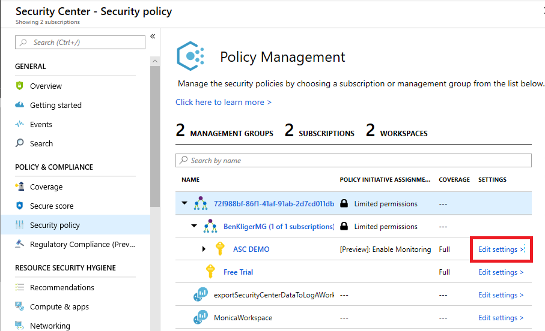
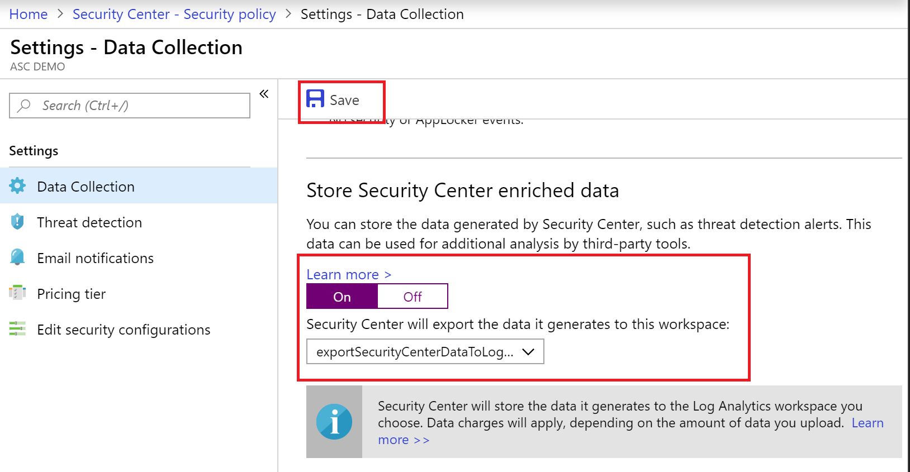

# Export Azure Security Center alerts
This article explains how to export the alerts generated by Azure Security Center to a location that can be used by other tools.

Some of Security Center’s customers have expressed a need to consume the data generated by Security Center from a central location which contains all of the aggregated and processed data (such as threat detection alerts, security policy recommendations, coverage, secure score, etc.). This enables the data to be further analyzed and processed. Or, it can also be another way to programmatically consume the data, instead of using Security Center’s portal.

Since the Azure Log Analytics workspaces are used to store and process raw data collected from VMs, the **Export to Log Analytics** feature provides the solution for this need, by streaming the data to a user defined workspace.

## Prerequisites
You need a Log Analytics workspace. We recommend that you use the same Log Analytics workspace that you defined in the data collection settings. when defining one for collecting data. [Log Analytics workspace for data collection](security-center-enable-data-collection.md)

## Export the alerts
1. Click **Security Policy**.
1. In the line of the subscription that you want to use, click **Edit Settings**.
  
1. Click **Data Collection**.
1. Scroll down to **Store Security Center enriched data** and click the toggle option to **On**.

   
1. Select the workspace that you want to export the alerts to.

    > [!NOTE]
    > You cannot export log alerts to the Security Center default workspace. As mentioned in the [Prerequisites](#Prerequisites), you need to use a Log Analytics workspace.

1. Click **Save** (at the top of the screen).