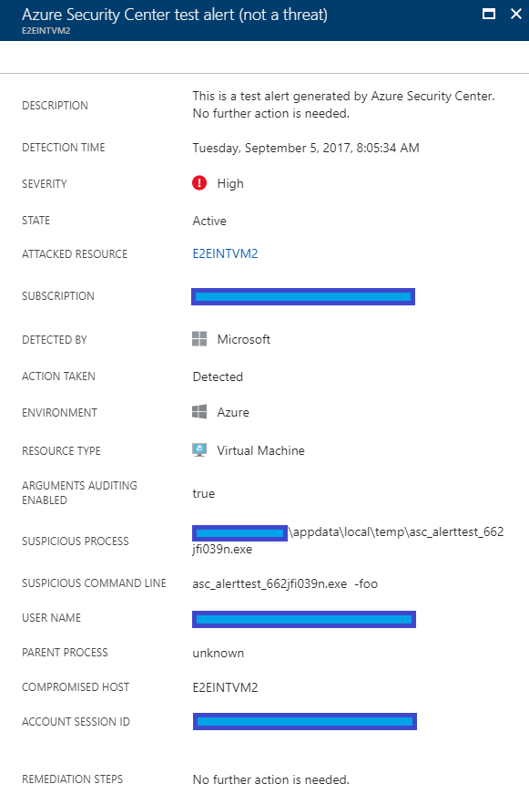

# Alerts Validation in Azure Security Center
This document helps you learn how to verify if your system is properly configured for Azure Security Center alerts.

## What are security alerts?
Security Center automatically collects, analyzes, and integrates log data from your Azure resources, the network, and connected partner solutions, like firewall and endpoint protection solutions, to detect and alert you to threats. Read [Managing and responding to security alerts in Azure Security Center](https://docs.microsoft.com/azure/security-center/security-center-managing-and-responding-alerts) for more information about security alerts, and read [Understanding security alerts in Azure Security Center](https://docs.microsoft.com/azure/security-center/security-center-alerts-type) to learn more about the different types of alerts.

## Alert validation
After Security Center agent is installed on your computer, follow the steps below from the computer where you want to be the attacked resource of the alert:

1. Copy an executable (for example calc.exe) to the computer’s desktop, or other directory of your convenience.
2. Rename this file to **ASC_AlertTest_662jfi039N.exe**.
3. Open the command prompt and execute this file with an argument (just a fake argument name), such as: *ASC_AlertTest_662jfi039N.exe -foo*
4. Wait 5 to 10 minutes and open Security Center Alerts. There you should find an alert similar to following one:

    

When reviewing this alert, make sure the field Arguments Auditing Enabled appears as true. If it shows false, you need to enable command-line arguments auditing. You can enable this option using the following command line:

*reg add "HKEY_LOCAL_MACHINE\SOFTWARE\Microsoft\Windows\CurrentVersion\policies\system\Audit" /f /v "ProcessCreationIncludeCmdLine_Enabled"*

> [!NOTE]
> Watch [Alert Validation in Azure Security Center](https://channel9.msdn.com/Blogs/Azure-Security-Videos/Alert-Validation-in-Azure-Security-Center) video, to see a demonstration of this feature. 

## See also
This article introduced you to the alerts validation process. Now that you're familiar with this validation, try the following articles:

* [Managing and responding to security alerts in Azure Security Center](https://docs.microsoft.com/azure/security-center/security-center-managing-and-responding-alerts). Learn how to manage alerts, and respond to security incidents in Security Center.
* [Security health monitoring in Azure Security Center](security-center-monitoring.md). Learn how to monitor the health of your Azure resources.
* [Understanding security alerts in Azure Security Center](https://docs.microsoft.com/azure/security-center/security-center-alerts-type). Learn about the different types of security alerts.
* [Azure Security Center Troubleshooting Guide](https://docs.microsoft.com/azure/security-center/security-center-troubleshooting-guide). Learn how to troubleshoot common issues in Security Center. 
* [Azure Security Center FAQ](security-center-faq.md). Find frequently asked questions about using the service.
* [Azure Security Blog](http://blogs.msdn.com/b/azuresecurity/). Find blog posts about Azure security and compliance.

