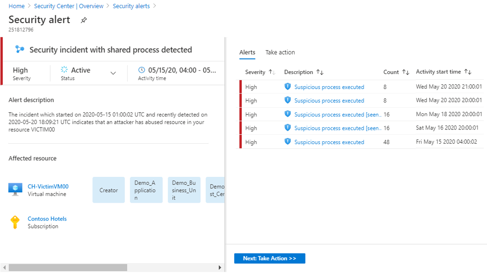

# Cloud smart alert correlation in Azure Security Center (incidents)

Azure Security Center continuously analyzes hybrid cloud workloads by using advanced analytics and threat intelligence to alert you about malicious activity.

The breadth of threat coverage is growing. The need to detect even the slightest compromise is important, and it can be challenging for security analysts to triage the different alerts and identify an actual attack. Security Center helps analysts cope with this alert fatigue. It helps diagnose attacks as they occur, by correlating different alerts and low fidelity signals into security incidents.

Fusion analytics is the technology and analytic back end that powers Security Center incidents, enabling it to correlate different alerts and contextual signals together. Fusion looks at the different signals reported on a subscription across the resources. Fusion finds patterns that reveal attack progression or signals with shared contextual information, indicating that you should use a unified response procedure for them.

Fusion analytics combines security domain knowledge with AI to analyze alerts, discovering new attack patterns as they occur. 

Security Center leverages MITRE Attack Matrix to associate alerts with their perceived intent, helping formalize security domain knowledge. In addition, by using the information gathered for each step of an attack, Security Center can rule out activity that appears to be steps of an attack, but actually isn't.

Because attacks often occur across different tenants, Security Center can combine AI algorithms to analyze attack sequences that are reported on each subscription. This technique identifies the attack sequences as prevalent alert patterns, instead of just being incidentally associated with each other.

During an investigation of an incident, analysts often need extra context to reach a verdict about the nature of the threat and how to mitigate it. For example, even when a network anomaly is detected, without understanding what else is happening on the network or with regard to the targeted resource, it's difficult to understand what actions to take next. To help, a security incident can include artifacts, related events, and information. The additional information available for security incidents varies, depending on the type of threat detected and the configuration of your environment. 

To better understand security incidents, see [How to handle security incidents in Azure Security Center](https://docs.microsoft.com/azure/security-center/security-center-incident).

