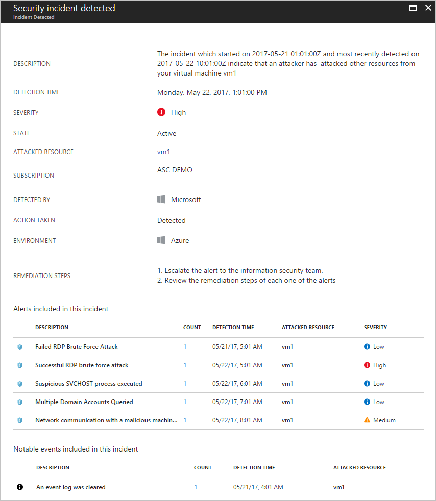

# Understanding security alerts in Azure Security Center
This article helps you to understand the different types of security alerts and related insights that are available in Azure Security Center. For more information on how to manage alerts and incidents, see [Managing and responding to security alerts in Azure Security Center](security-center-managing-and-responding-alerts.md).

To set up advanced detections, upgrade to Azure Security Center Standard. A free 60-day trial is available. To upgrade, select **Pricing Tier** in the [security policy](security-center-policies.md). To learn more, see the [pricing page](https://azure.microsoft.com/pricing/details/security-center/).

> [!NOTE]
> Security Center has released to limited preview a new set of detections that leverage auditd records, a common auditing framework, to detect malicious behaviors on Linux machines. Send an email with your subscription IDs to [us](mailto:ASC_linuxdetections@microsoft.com) to join the preview.

## What type of alerts are available?
Azure Security Center uses a variety of [detection capabilities](security-center-detection-capabilities.md) to alert customers to potential attacks targeting their environments. These alerts contain valuable information about what triggered the alert, the resources targeted, and the source of the attack. The information included in an alert varies based on the type of analytics used to detect the threat. Incidents may also contain additional contextual information that can be useful when investigating a threat.  This article provides information about the following alert types:

* Virtual Machine Behavioral Analysis (VMBA)
* Network Analysis
* SQL Database and SQL Data Warehouse Analysis
* Contextual Information

## Virtual machine behavioral analysis
Azure Security Center can use behavioral analytics to identify compromised resources based on analysis of virtual machine event logs. For example, Process Creation Events and Login Events. In addition, there is correlation with other signals to check for supporting evidence of a widespread campaign.

> [!NOTE]
> For more information on how Security Center detection capabilities work, see [Azure Security Center detection capabilities](security-center-detection-capabilities.md).

### Event analysis
Security Center uses advanced analytics to identify compromised resources based on analysis of virtual machine event logs. For example, Process Creation Events and Login Events. In addition, there is correlation with other signals to check for supporting evidence of a widespread campaign.

* **Suspicious process execution detected**: Attackers often try to execute malicious code without detection by masquerading as benign processes. These alerts indicate that a process execution matched one of the following patterns:
	* A process known to be used for malicious purposes was executed. While individual commands may appear benign the alert is scored based on an aggregation of these commands.
	* A process was executed from an uncommon location.
	* A process was executed from a location in common with known suspicious files.
	* A process was executed from a suspicious path.
	* A process was executed in an abnormal context.
	* A process was executed by an unusual account
	* A process with a suspicious extension was executed.
	* A process with a suspicious double extension was executed.
	* A process with a suspicious right-to-left (RLO) character in its filename was executed.
	* A process whose name is very similar to but different from a very commonly run process was executed
	* A process whose name corresponds to a known attacker tool was executed.
	* A process with a random name was executed.
	* A process with a suspicious extension was executed.
	* A hidden file was executed.
	* A process was executed as a child of another unrelated process.
	* An unusual process was created by a system process.
	* An anomalous process was launched by the Windows update service.
	* A process was executed with an unusual command line. This has been associated with legitimate processes being hijacked for execution of malicious content.
	* An attempt to start all executables (*.exe) in a directory was executed from the command line.
	* A process was executed by PsExec utility, which can be used to run processes remotely.
	* The Apache Tomcat® Parent executable (Tomcat#.exe) was used to launch suspicious child processes, which can host or launch malicious commands.
	* The Microsoft Windows "Program Compatibility Assistant" (pcalua.exe) was used to launch executable code, which could be malicious.
	* A suspicious process termination burst was detected.
	* The system process SVCHOST was executed in an abnormal context.
	* The system process SVCHOST was executed in a rare service group.
	* A suspicious command line was executed.
	* A PowerShell script has characteristics in common with known suspicious scripts.
	* A known malicious PowerShell Powersploit cmdlet was executed.
	* A built-in SQL user executed a process it normally wouldn't
	* A base-64 encoded executable was detected, which could indicate an attacker attempting to void detection by constructing an executable on-the-fly through a sequence of commands.

* **Suspicious RDP resource activity**: Attackers often target open management ports like RDP with brute force attacks. These alerts indicate suspicious Remote Desktop login activity indicating:
	* Remote Desktop logins were attempted.
	* Remote Desktop logins were attempted using invalid accounts.
	* Remote Desktop logins were attempted, some of which were able to successfully login to the machine.
* **Suspicious SSH resource activity**: Attackers often target open management ports like SSH with brute force attacks. These alerts indicate suspicious SSH login activity indicating:
	* Failed SSH logins were attempted.
	* SSH logins were attempted, some of which were successful.
* **Suspicious WindowPosition registry value**: This alert indicates that a WindowPosition registry configuration change was attempted, which could be indicative of hiding application windows in non-visible sections of the desktop.
* **Potential attempt to bypass AppLocker**: AppLocker can be used to limit the processes that can run on Windows, limiting exposure to malware. This alert indicates a possible attempt to bypass AppLocker restrictions by using trusted executables (allowed by AppLocker policy) to execute untrusted code.
* **Suspicious named pipe communications**: This alert indicates that data was written to a local named pipe from a Windows console command. Named pipes are known to be used by attackers to task and communicate with a malicious implant.
* **Decoding of an executable using built-in certutil.exe tool**: This alert indicates that a built-in administrator utility, certutil.exe, was used to decode an executable. Attackers are known to abuse functionality of legitimate administrator tools to perform malicious actions, for example using a tool such as certutil.exe to decode a malicious executable that will then be subsequently executed.
* **An event log was cleared**: This alert indicates a suspicious event log clearing operation, which is often used by attackers to try to cover their tracks.
* **Disabling and deleting IIS log files**: This alert indicates that IIS log file were disabled and/or deleted, which is often used by attackers to try to cover their tracks.
* **Suspicious file deletion**: This alert indicates suspicious deletion of files, which can be used by an attacker to remove evidence of malicious binaries.
* **All file shadow copies have been deleted**: This alert indicates that shadow copies have been deleted.
* **Suspicious file cleanup commands**: This alert indicates a combination of systeminfo commands used to perform post-compromise self-cleanup activity.  While *systeminfo.exe* is a legitimate Windows tool, executing it twice in succession, followed by a delete command in the way that has occurred here is rare.
* **Suspicious account creation**: This alert indicates that an account was created with a close resemblance of an existing built in administrative privilege account. This technique can be used by attackers to create a rogue account without being detected.
* **Suspicious volume shadow copy activity**: This alert indicates shadow copy deletion activity on the resource. Volume Shadow Copy (VSC) is an important artifact that stores data snapshots. This activity is usually associated with Ransowmare, but it could also be legitimate.
* **Windows registry persistence method**: This alert indicates an attempt to persist an executable in the Windows registry. Malware often uses such a technique to survive a boot.
* **Suspicious new firewall rule**: This alert indicates that a new Firewall rule has been added via *netsh.exe* to allow traffic from an executable in a suspicious location.
* **Suspicious XCOPY executions**: This alert indicates a series of XCOPY executions which could signal that one of your machines has been compromised and was used to propagate malware.
* **Suppression of legal notice displayed to users at logon**: This alert indicates a change to the registry key that controls whether a legal notice is displayed to users when they log on. This is a common activity undertaken by attackers after having compromised a host.
* **Detected anomalous mix of upper and lower case characters in command line**: This alert indicates the use of a mix of upper and lower case characters at the command line, which is a technique used by attackers to hide from case-sensitive or hash-based machine rule.
* **Obfuscated command line**: This alert indicates that suspicious indicators of obfuscation were detected at the command line.
* **Multiple domain accounts queried**: Attackers often query AD domain accounts while performing reconnaissance on users, domain admin accounts, domain controllers, and trust relationships between domains. This alert indicates that an unusual number of distinct domain accounts were queried within a short time period.
* **Possible local reconnaissance activity**: This alert indicates that a combination of systeminfo commands associated with reconnaissance activity have been executed.  While *systeminfo.exe* is a legitimate Windows tool, executing it twice in succession is rare.
* **Possible execution of keygen executable**: This alert indicates that a process whose name is indicative of a keygen tool has been executed. Such tools are typically used to defeat software licensing mechanisms, but their download is often bundled with other malicious software.
* **Suspicious execution via rundll32.exe**: This alert indicates that rundll32.exe was used to execute a process with an uncommon name, consistent with the process naming scheme used by attackers to install a first stage implant on a compromised host.
* **Suspicious combination of HTA and PowerShell**: This alert indicates that a Microsoft HTML Application Host (HTA) is launching PowerShell commands. This is a technique used by attackers to launch malicious PowerShell scripts.
* **Change to a registry key that can be abused to bypass UAC**: This alert indicates that a registry key that can be abused to bypass UAC (User Account Control) was changed, which is often used by attackers to move from unprivileged (standard user) to privileged (for example administrator) access on a compromised host.
* **Use of suspicious domain name within command line**: This alert indicates that a suspicious domain name was used, which can be evidence of an attacker is hosting malicious tools and as end-points for command-and-control and exfiltration of data.
* **An account was created on multiple hosts within a 24-hour time period**: This alert indicates that an attempt was made to create the same user account on multiple hosts, which can be evidence of an attacker moving laterally across the network after one or more network entities have been compromised.
* **Suspicious use of CACLS to lower the security state of the system**: This alert indicates that the change access control list (CACLS) was changed. This technique is often used by attackers to give full access system binaries like ftp.exe, net.exe, wscript.exe etc.
* **Suspected Kerberos Golden Ticket attack parameters**: This alert indicates that  command line parameters consistent with a Kerberos Golden Ticket attack were executed. A compromised krbtgt key can be used by an attacker to impersonate any user they wish.
* **Enabling of the WDigest UseLogonCredential registry key**: This alert indicates that the registry key was changed to allow logon credentials to be stored in clear text in LSA memory, which can then be harvested from memory.
* **Potentially suspicious use of Telegram tool**: This alert indicates the installation of Telegram, a free cloud-based instant messaging service used by attackers to transfer malicious binaries to any other computer, phone, or tablet.
* **New ASEP creation**: This alert indicates the creation of a new ASEP (Auto Start Extensibility Point), which causes the process name identified in the command line to be automatically started and can be used by an attacker to achieve persistence.
* **Suspicious Set-ExecutionPolicy and WinRM changes**: This alert indicates configuration changes, which are associated with the use of the malicious ChinaChopper webshell.
* **Disabling of critical services**: This alert indicates that "net.exe stop" command was used to stop critical services like SharedAccess or Windows Security Center.
* **Suspicious use of FTP -s switch**: This alert indicates use of FTP's "-s" switch, which can be used by malware to connect to a remote FTP server and download additional malicious binaries.
* **Suspicious execution of VBScript.Encode command**: This alert indicates the *VBScript.Encode* command was executed, which encodes scripts into unreadable text, making it more difficult for users to examine the code.
* **VBScript HTTP object allocation**: This alert indicates the creation of a VBScript file using Command Prompt; which can be used to download malicious files.
* **Sticky keys attack**: This alert indicates that an attacker may be subverting an accessibility binary (for example sticky keys, onscreen keyboard, narrator) in order to provide backdoor access.
* **Petya ransomware indicators**: This alert indicates the techniques associated with the Petya ransomware were observed.
* **Attempt to disable AMSI**: This alert indicates an attempt to disable the antimalware scan interface (AMSI), which would disable antimalware detection.
* **Ransomware indicators**: This alert indicates suspicious activity traditionally associated with lock-screen and encryption ransomware.
* **Suspicious trace collection output file**: This alert indicates that a trace (for example of network activity) was collected and output to an unusual file type.
* **High risk software**: This alert indicates use of software that has been associated with the installation of malware. Attackers often package malware with otherwise benign tools such as the one seen in this alert and silently install the malware in the background.
* **Suspicious file creation**: This alert indicates creation or execution of a process used by attackers to download additional malware to a compromised host after an attachment in a phishing doc has been opened.
* **Suspicious credentials in command line**: This alert indicates a suspicious password used to execute a file. This technique has been used by attackers to execute the Pirpi malware.
* **Possible execution of malware dropper**: This alert indicates a filename that has been used by attackers to install malware.
* **Suspicious execution via rundll32.exe**: This alert indicates rundll32.exe being used to execute a notepad.exe or reg.exe, consistent with the process injection technique used by attackers.
* **Suspicious command line arguments**: This alert indicates suspicious command line arguments that have been used in conjunction with a reverse shell used by activity group HYDROGEN.
* **Suspicious document credentials**: This alert indicates a suspicious, common precomputed password hash used by malware being used to execute a file.
* **Dynamic PS script construction**: This alert indicates a PowerShell script being constructed dynamically. Attackers use this technique to progressively build a script in order to evade IDS systems.
* **Metaploit indicators**: This alert indicates activity associated with the Metasploit framework, which provides a range of attacker capabilities and tools.
* **Suspicious account activity**: This alert indicates an attempt to connect to a machine using an account that was recently compromised.
* **Account creation**: This alert indicates a creation of a new account on the machine.

### Crash analysis

Crash dump memory analysis is a method used to detect sophisticated malware that is able to evade traditional security solutions. Various forms of malware try to reduce the chance of being detected by antivirus products by never writing to disk, or by encrypting software components written to disk. This technique makes the malware difficult to detect by using traditional antimalware approaches. However, this kind of malware can be detected by using memory analysis, because malware must leave traces in memory in order to function.

When software crashes, a crash dump captures a portion of memory at the time of the crash. The crash may be caused by malware, general application, or system issues. By analyzing the memory in the crash dump, Security Center can detect techniques used to exploit vulnerabilities in software, access confidential data, and surreptitiously persist within a compromised machine. This is accomplished with minimum performance impact to hosts as the analysis is performed by the Security Center back end.

* **Code injection discovered**: Code injection is the insertion of executable modules into running processes or threads. This technique is used by malware to access data, hide or prevent its removal (e.g. persistence). This alert indicates that an injected module is present in the crash dump. Legitimate software developers occasionally perform code injection for non-malicious reasons, such as modifying or extending an existing application or operating system component. To help differentiate between malicious and non-malicious injected modules, Security Center checks whether or not the injected module conforms to a profile of suspicious behavior. The result of this check is indicated by the “SIGNATURE” field of the alert and is reflected in the severity of the alert, alert description, and alert remediation steps.
* **Suspicious code segment**: The suspicious code segment alert indicates that a code segment has been allocated using non-standard methods, such as used by reflective injection and process hollowing. Additional characteristics of the code segment are processed to provide context as to the capabilities and behaviors of the reported code segment.
* **Shellcode discovered**: Shellcode is the payload that is run after malware exploits a software vulnerability. This alert indicates that crash dump analysis has detected executable code that exhibits behavior that is commonly performed by malicious payloads. Although non-malicious software may perform this behavior, it is not typical of normal software development practices.
* **Module hijacking discovered**: Windows uses dynamic-link libraries (DLLs) to allow software to utilize common Windows system functionality. DLL Hijacking occurs when malware changes the DLL load order to load malicious payloads into memory, where arbitrary code can be executed. This alert indicates that the crash dump analysis detected a similarly named module that is loaded from two different paths. One of the loaded paths comes from a common Windows system binary location. Legitimate software developers occasionally change the DLL load order for non-malicious reasons, such as instrumenting, extending the Windows OS, or extending a Windows application. To help differentiate between malicious and potentially benign changes to the DLL load order, Security Center checks whether a loaded module conforms to a suspicious profile.
* **Masquerading Windows module detected**: Malware may use common names of Windows system binaries (for example, SVCHOST.EXE) or modules (for example, NTDLL.DLL) to blend in and obscure the nature of the malicious software from system administrators. This alert indicates that the crash dump file contains modules that use Windows system module names, but do not satisfy other criteria that are typical of Windows modules. Analyzing the on disk copy of the masquerading module may provide more information about the legitimate or malicious nature of this module.
* **Modified system binary discovered**: Malware may modify core system binaries in order to covertly access data or surreptitiously persist on a compromised system. This alert indicates that the crash dump analysis has detected that core Windows OS binaries have been modified in memory or on disk. Legitimate software developers occasionally modify system modules in memory for non-malicious reasons, such as Detours or for application compatibility. To help differentiate between malicious and potentially legitimate modules, Security Center checks whether the modified module conforms to a suspicious profile.

## Network analysis
Security Center network threat detection works by automatically collecting security information from your Azure IPFIX (Internet Protocol Flow Information Export) traffic. It analyzes this information, often correlating information from multiple sources, to identify threats.

* **Possible incoming SQL brute force attempts**: Network traffic analysis detected suspicious incoming SQL communication. This activity is consistent with brute force attempts against SQL servers.
* **Suspicious incoming RDP network activity from multiple sources**: Network traffic analysis detected anomalous incoming Remote Desktop Protocol (RDP) communication from multiple sources. Specifically, sampled network data shows unique IPs connecting to your machine, which is considered abnormal for this environment. This activity may indicate an attempt to brute force your RDP end point from multiple hosts (Botnet).
* **Suspicious incoming RDP network activity**: Network traffic analysis detected anomalous incoming Remote Desktop Protocol (RDP) communication. Specifically, sampled network data shows a high number of incoming connections to your machine, which is considered abnormal for this environment. This activity may indicate an attempt to brute force your RDP end point.
* **Suspicious outgoing RDP network activity to multiple destinations**: Network traffic analysis detected anomalous outgoing Remote Desktop Protocol (RDP) communication to multiple destinations. This activity may indicate that your machine was compromised and is now used to brute force external RDP end points. Note that this type of activity could possibly cause your IP to be flagged as malicious by external entities.
* **Suspicious outgoing RDP network activity**: Network traffic analysis detected anomalous outgoing Remote Desktop Protocol (RDP) communication. Specifically, sampled network data shows a high number of outgoing connections from your machine, which is considered abnormal for this environment. This activity may indicate that your machine was compromised and is now used to brute force external RDP end points. Note that this type of activity could possibly cause your IP to be flagged as malicious by external entities.
* **Suspicious incoming SSH network activity**: Network traffic analysis detected anomalous incoming SSH communication. Specifically, sampled network data shows a high number of incoming connections to your machine, which is considered abnormal for this environment. This activity may indicate an attempt to brute force your SSH end point.
* **Suspicious incoming SSH network activity from multiple sources**: Network traffic analysis detected anomalous incoming SSH communication. Specifically, sampled network data shows unique IPs connecting to your machine, which is considered abnormal for this environment. This activity may indicate an attempt to brute force your SSH end point from multiple hosts (Botnet).
* **Suspicious outgoing SSH network activity**: Network traffic analysis detected anomalous outgoing SSH communication. Specifically, sampled network data shows a high number of outgoing connections from your machine, which is considered abnormal for this environment. This activity may indicate that your machine was compromised and is now used to brute force external SSH end points. Note that this type of activity could possibly cause your IP to be flagged as malicious by external entities.
* **Suspicious outgoing SSH network activity to multiple destinations**: Network traffic analysis detected anomalous outgoing SSH communication to multiple destinations. Specifically, sampled network data shows your machine connecting to unique IPs, which is considered abnormal for this environment. This activity may indicate that your machine was compromised and is now used to brute force external SSH end points. Note that this type of activity could possibly cause your IP to be flagged as malicious by external entities.
* **Network communication with a malicious machine detected**: Network traffic analysis indicates that your machine has communicated with what is possibly a Command and Control center.
* **Possible compromised machine detected**: Network traffic analysis detected outgoing activity, which may indicate it is acting as part of a botnet. The analysis is based on IPs accessed by your resource together with public DNS records.

## SQL Database and SQL Data Warehouse analysis

Security Center resource analysis focuses on platform as a service (PaaS) services, such as the integration with [Threat Detection for Azure SQL Database](../sql-database/sql-database-threat-detection.md) and Azure SQL Data Warehouse. SQL Threat Detection detects anomalous activities indicating unusual and potentially harmful attempts to access or exploit databases and triggers the following alerts:

* **Vulnerability to SQL Injection**: This alert is triggered when an application generates a faulty SQL statement in the database. This may indicate a possible vulnerability to SQL injection attacks. There are two possible reasons for the generation of a faulty statement:
	* A defect in application code that constructs the faulty SQL statement
	* Application code or stored procedures don't sanitize user input when constructing the faulty SQL statement, which may be exploited for SQL Injection
* **Potential SQL injection**: This alert is triggered when an active exploit happens against an identified application vulnerability to SQL injection. This means the attacker is trying to inject malicious SQL statements using the vulnerable application code or stored procedures.
* **Access from unusual location**: This alert is triggered when there is a change in the access pattern to SQL server, where someone has logged on to the SQL server from an unusual geographical location. In some cases, the alert detects a legitimate action (a new application or developer maintenance). In other cases, the alert detects a malicious action (former employee, external attacker).
* **Access from unusual Azure data center**: This alert is triggered when there is a change in the access pattern to SQL server, where someone has logged on to the SQL server from an unusual Azure data center that was seen on this server during the recent period. In some cases, the alert detects a legitimate action (your new application in Azure, Power BI, Azure SQL Query Editor). In other cases, the alert detects a malicious action from an Azure resource/service (former employee, external attacker).
* **Access from unfamiliar principal**: This alert is triggered when there is a change in the access pattern to SQL server, where someone has logged on to the SQL server using an unusual principal (SQL user). In some cases, the alert detects a legitimate action (new application, developer maintenance). In other cases, the alert detects a malicious action (former employee, external attacker).
* **Access from a potentially harmful application**: This alert is triggered when a potentially harmful application is used to access the database. In some cases, the alert detects penetration testing in action. In other cases, the alert detects an attack using common attack tools.
* **Brute force SQL credentials**: This alert is triggered when there is an abnormal high number of failed logins with different credentials. In some cases, the alert detects penetration testing in action. In other cases, the alert detects brute force attack.

## Contextual information
During an investigation, analysts need extra context to reach a verdict about the nature of the threat and how to mitigate it.  For example, a network anomaly was detected, but without understanding what else is happening on the network or with regard to the targeted resource it is every hard to understand what actions to take next. To aid with that, a Security Incident may include artifacts, related events and information that may help the investigator. The availability of additional information will vary based on the type of threat detected and the configuration of your environment, and will not be available for all Security Incidents.

If additional information is available, it will be shown in the Security Incident below the list of alerts. This could contain information like:

- Log clear events
- PNP device plugged from unknown device
- Alerts which are not actionable
- New account creation
- File decoded using certutil tool 

## Next steps
In this article, you learned about the different types of security alerts in Security Center. To learn more about Security Center, see the following:

* [Handling security incident in Azure Security Center](security-center-incident.md)
* [Azure Security Center detection capabilities](security-center-detection-capabilities.md)
* [Azure Security Center planning and operations guide](security-center-planning-and-operations-guide.md)
* [Azure Security Center FAQ](security-center-faq.md): Find frequently asked questions about using the service.
* [Azure security blog](http://blogs.msdn.com/b/azuresecurity/): Find blog posts about Azure security and compliance.
