# Understanding security alerts in Azure Security Center
This article helps you to understand the different types of security alerts and related insights that are available in Azure Security Center. For more information on how to manage alerts and incidents, see [Managing and responding to security alerts in Azure Security Center](security-center-managing-and-responding-alerts.md).

> [!NOTE]
> To set up advanced detections, upgrade to Azure Security Center Standard. A free 60-day trial is available. To upgrade, select **Pricing Tier** in the [security policy](security-center-policies.md). To learn more, see the [pricing page](https://azure.microsoft.com/pricing/details/security-center/).
>

## What type of alerts are available?
Azure Security Center uses a variety of [detection capabilities](security-center-detection-capabilities.md) to alert customers to potential attacks targeting their environments. These alerts contain valuable information about the what triggered the alert, the resources targeted, and the source of the attack. The information included in an alert varies based on the type of analytics used to detect the threat. Incidents may also contain additional contextual information that can be useful when investigating a threat.  This article provides information about the following alert types:

* Virtual Machine Behavioral Analysis (VMBA)
* Network Analysis
* Resource Analysis
* Contextual Information

## Virtual machine behavioral analysis
Azure Security Center can use behavioral analytics to identify compromised resources based on analysis of virtual machine event logs. For example, Process Creation Events and Login Events. In addition, there is correlation with other signals to check for supporting evidence of a widespread campaign.

> [!NOTE]
> For more information on how Security Center detection capabilities work, see [Azure Security Center detection capabilities](security-center-detection-capabilities.md).
>

### Crash analysis
Crash dump memory analysis is a method used to detect sophisticated malware that is able to evade traditional security solutions. Various forms of malware try to reduce the chance of being detected by antivirus products by never writing to disk, or by encrypting software components written to disk. This makes the malware difficult to detect by using traditional antimalware approaches. However, this kind of malware can be detected by using memory analysis, because malware must leave traces in memory in order to function.

When software crashes, a crash dump captures a portion of memory at the time of the crash. The crash may be caused by malware, general application or system issues. By analyzing the memory in the crash dump, Security Center can detect techniques used to exploit vulnerabilities in software, access confidential data, and surreptitiously persist within a compromised machine. This is accomplished with minimum performance impact to hosts as the analysis is performed by the Security Center back end.

The following fields are common to the crash dump alert examples that appear later in this article:

* DUMPFILE: Name of the crash dump file.
* PROCESSNAME: Name of the crashing process.
* PROCESSVERSION: Version of the crashing process.

### Shellcode discovered
Shellcode is the payload that is run after malware exploits a software vulnerability. This alert indicates that crash dump analysis has detected executable code that exhibits behavior that is commonly performed by malicious payloads. Although non-malicious software may perform this behavior, it is not typical of normal software development practices.

The Shellcode alert example provides the following additional field:

* ADDRESS: The location in memory of the shellcode.

This is an example of this type of alert:

### Module hijacking discovered
Windows uses dynamic-link libraries (DLLs) to allow software to utilize common Windows system functionality. DLL Hijacking occurs when malware changes the DLL load order to load malicious payloads into memory, where arbitrary code can be executed. This alert indicates that the crash dump analysis detected a similarly named module that is loaded from two different paths. One of the loaded paths comes from a common Windows system binary location.

Legitimate software developers occasionally change the DLL load order for non-malicious reasons, such as instrumenting, extending the Windows OS, or extending a Windows application. To help differentiate between malicious and potentially benign changes to the DLL load order, Azure Security Center checks whether a loaded module conforms to a suspicious profile. The result of this check is indicated by the “SIGNATURE” field of the alert and is reflected in the severity of the alert, alert description, and alert remediation steps. To research whether the module is legitimate or malicious, analyze the on disk copy of the hijacking module. For example, you can verify the file's digital signature, or run an antivirus scan.

In addition to the common fields described in the earlier “Shellcode discovered” section, this alert provides the following fields:

* SIGNATURE: Indicates if the hijacking module conforms to a suspicious behavior profile.
* HIJACKEDMODULE: The name of the hijacked Windows system module.
* HIJACKEDMODULEPATH: The path of the hijacked Windows system module.
* HIJACKINGMODULEPATH: The path of the hijacking module.

This is an example of this type of alert:

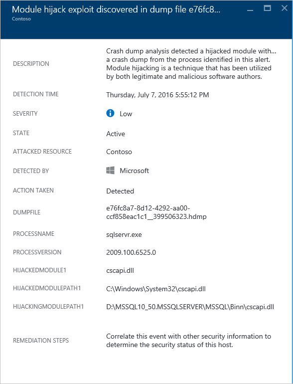

### Masquerading Windows module detected
Malware may use common names of Windows system binaries (for example, SVCHOST.EXE) or modules (for example, NTDLL.DLL) to *blend in* and obscure the nature of the malicious software from system administrators. This alert indicates that the crash dump analysis detects that the crash dump file contains modules that use Windows system module names, but do not satisfy other criteria that are typical of Windows modules. Analyzing the on disk copy of the masquerading module may provide more information about the legitimate or malicious nature of this module. Analysis may include:

* Confirm that the file in question is shipped as part of a legitimate software package.
* Verify the file’s digital signature.
* Run an antivirus scan on the file.

In addition to the common fields described earlier in the “Shellcode discovered” section, this alert provides the following additional fields:

* DETAILS: Describes whether the module's metadata is valid, and whether the module was loaded from a system path.
* NAME: The name of the masquerading Windows module.
* PATH: The path to the masquerading Windows module.

This alert also extracts and displays certain fields from the module’s PE header, such as “CHECKSUM” and “TIMESTAMP.” These fields are only displayed if the fields are present in the module. See the [Microsoft PE and COFF Specification](https://msdn.microsoft.com/windows/hardware/gg463119.aspx) for details on these fields.

This is an example of this type of alert:

### Modified system binary discovered
Malware may modify core system binaries in order to covertly access data or surreptitiously persist on a compromised system. This alert indicates that the crash dump analysis has detected that core Windows OS binaries have been modified in memory or on disk.

Legitimate software developers occasionally modify system modules in memory for non-malicious reasons, such as Detours or for application compatibility. To help differentiate between malicious and potentially legitimate modules, Azure Security Center checks whether the modified module conforms to a suspicious profile. The result of this check is indicated by the severity of the alert, alert description, and alert remediation steps.

In addition to the common fields described earlier in the “Shellcode discovered” section, this alert provides the following additional fields:

* MODULENAME: Name of the modified system binary.
* MODULEVERSION: Version of the modified system binary.

This is an example of this type of alert:

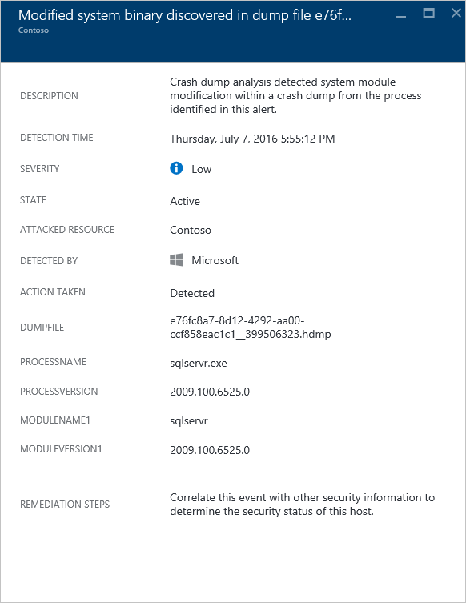

### Suspicious process executed
Security Center identifies a suspicious process that runs on the target virtual machine, and then triggers an alert. The detection doesn’t look for the specific name, but does look for the executable file's parameter. Therefore, even if the attacker renames the executable, Security Center can still detect the suspicious process.

This is an example of this type of alert:

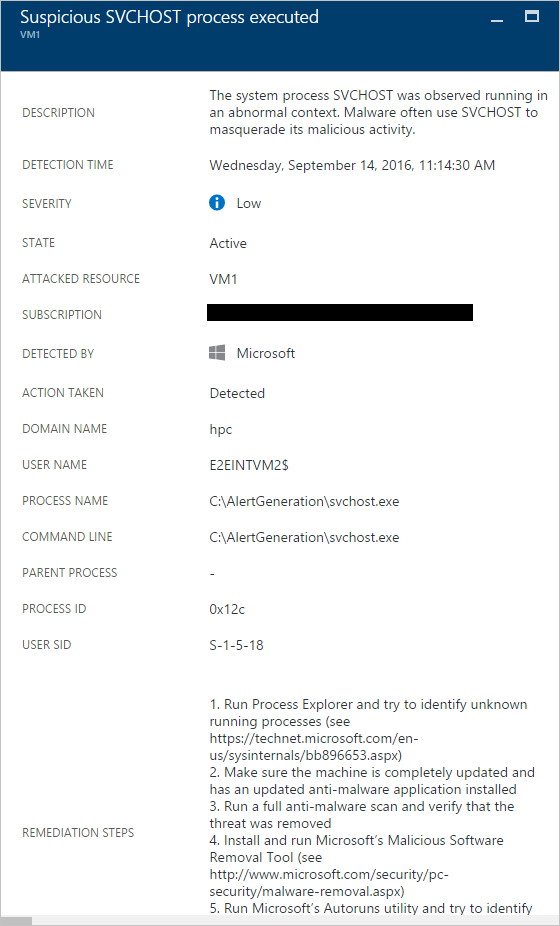

### Multiple domain accounts queried
Security Center can detect multiple attempts to query Active Directory domain accounts, which is something usually performed by attackers during network reconnaissance. Attackers can leverage this technique to query the domain to identify the users, identify the domain admin accounts, identify the computers that are domain controllers, and also identify the potential domain trust relationship with other domains.

This is an example of this type of alert:

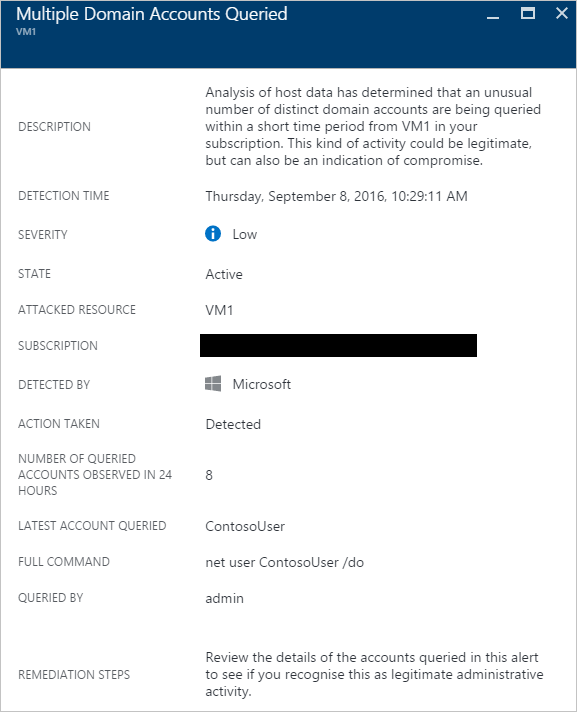

### Local Administrators group members were enumerated

Security Center is going to trigger an alert when the security event 4798, in Windows Server 2016 and Windows 10, is trigged. This happens when local administrator groups are enumerated, which is something usually performed by attackers during network reconnaissance. Attackers can leverage this technique to query the identity of users with administrative privileges.

This is an example of this type of alert:

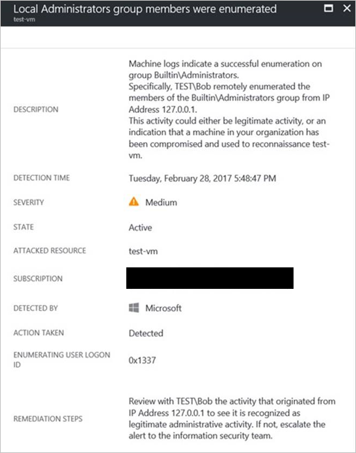

### Anomalous mix of upper and lower case characters

Security Center will trigger an alert when it detects the use of a mix of upper and lower case characters at the command line. Some attackers may use this technique to hide from case-sensitive or hash based machine rule.

This is an example of this type of alert:

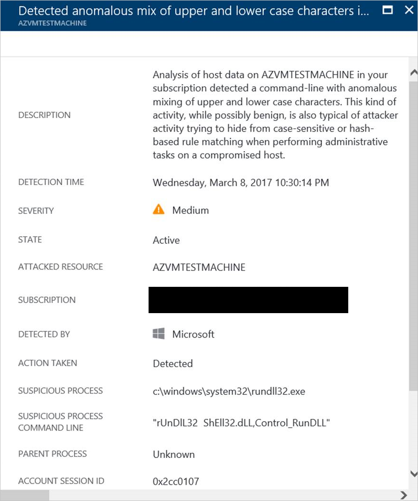

### Suspected Kerberos Golden Ticket attack

A compromised [krbtgt](https://technet.microsoft.com/library/dn745899.aspx) key can be used by an attacker to create Kerberos "Golden Tickets," allowing the attacker to impersonate any user they wish. Security Center is going to trigger an alert when it detects this type of activity.

> [!NOTE] 
> For more information about Kerberos Golden Ticket, read [Windows 10 credential theft mitigation guide](http://download.microsoft.com/download/C/1/4/C14579CA-E564-4743-8B51-61C0882662AC/Windows%2010%20credential%20theft%20mitigation%20guide.docx).

This is an example of this type of alert:

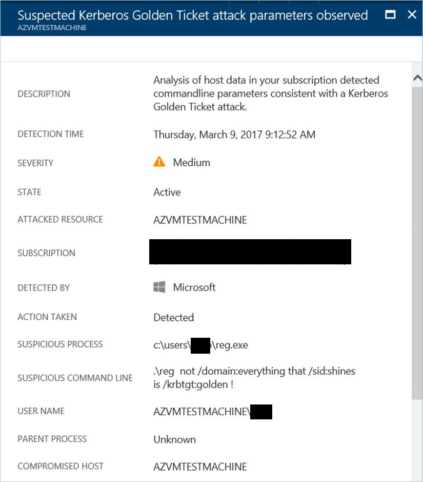

### Suspicious account created

Security Center will trigger an alert when an account is created with close resemblance of an existing built in administrative privilege account. This technique can be used by attackers to create a rogue account to avoid being noticed by human verification.
 
This is an example of this type of alert:

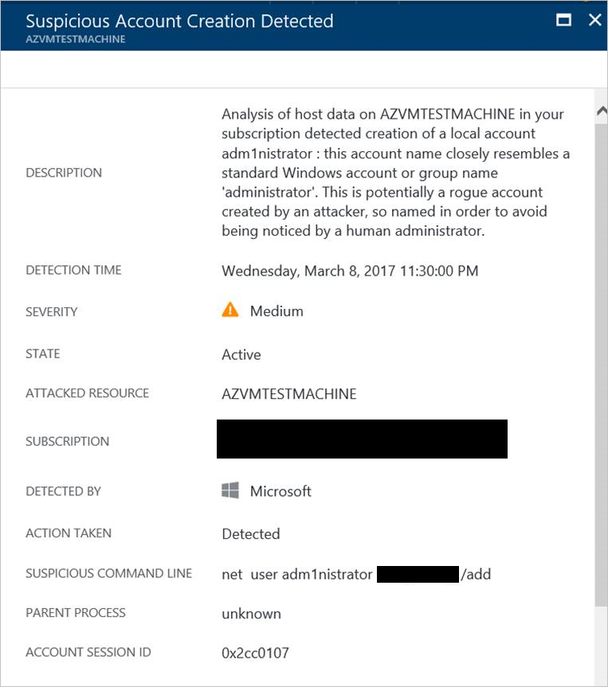

### Suspicious Firewall rule created

Attackers might try to circumvent host security by creating custom firewall rules to allow malicious applications to communicate with command and control, or to launch attacks through the network via the compromised host. Security Center will trigger an alert when it detects that a new firewall rule was created from an executable file in a suspicious location.
 
This is an example of this type of alert:

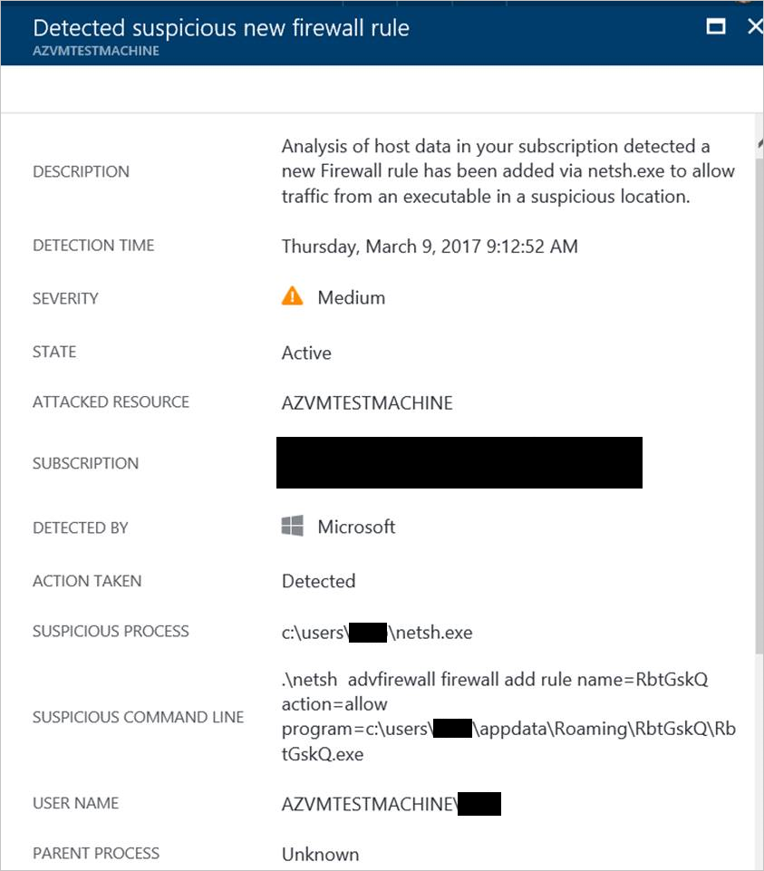

### Suspicious combination of HTA and PowerShell

Security Center will trigger an alert when it detects that a Microsoft HTML Application Host (HTA) is launching PowerShell commands. This is a technique used by attackers to launch malicious PowerShell scripts.
 
This is an example of this type of alert:

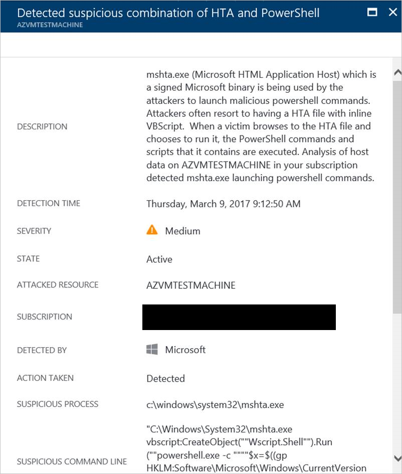

## Network analysis
Security Center network threat detection works by automatically collecting security information from your Azure IPFIX (Internet Protocol Flow Information Export) traffic. It analyzes this information, often correlating information from multiple sources, to identify threats.

### Suspicious outgoing traffic detected
Network devices can be discovered and profiled in much the same way as other types of systems. Attackers usually start with port scanning or port sweeping. In the next example, you have suspicious Secure Shell (SSH) traffic from a VM. In this scenario, SSH brute force or a port sweeping attack against an external resource is possible.

This alert gives information that you can use to identify the resource that was used to initiate this attack. This alert also provides information to identify the compromised machine, the detection time, plus the protocol and port that was used. This blade also gives you a list of remediation steps that can be used to mitigate this issue.

### Network communication with a malicious machine
By leveraging Microsoft threat intelligence feeds, Azure Security Center can detect compromised machines that communicate with malicious IP addresses. In many cases, the malicious address is a command and control center. In this case, Security Center detected that the communication was done by using Pony Loader malware (also known as [Fareit](https://www.microsoft.com/security/portal/threat/encyclopedia/entry.aspx?Name=PWS:Win32/Fareit.AF)).

This alert gives information that enables you to identify the resource that was used to initiate this attack, the attacked resource, the victim IP, the attacker IP, and the detection time.

> [!NOTE]
> Live IP addresses were removed from this screenshot for privacy purpose.
>
>

### Possible outgoing denial-of-service attack detected
Abnormal network traffic that originates from one virtual machine can cause Security Center to trigger a potential denial-of-service type of attack.

This is an example of this type of alert:

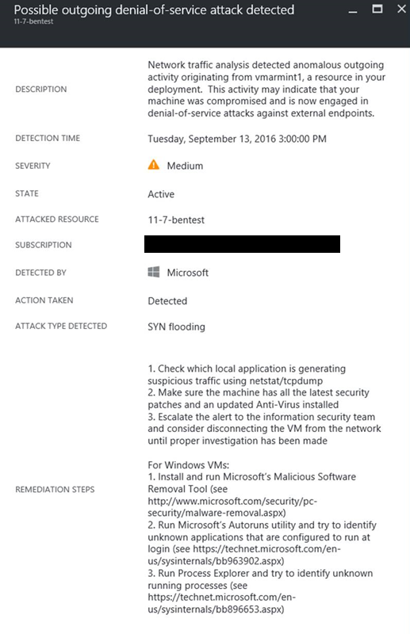

## Resource analysis
Security Center resource analysis focuses on platform as a service (PaaS) services, such as the integration with the [Azure SQL Database threat detection](../sql-database/sql-database-threat-detection.md) feature. Based on the analysis’s results from these areas, Security Center triggers a resource-related alert.

### Potential SQL injection
SQL injection is an attack where malicious code is inserted into strings that are later passed to an instance of SQL Server for parsing and execution. Because SQL Server executes all syntactically valid queries that it receives, any procedure that constructs SQL statements should be reviewed for injection vulnerabilities. SQL Threat Detection uses machine learning, behavioral analysis, and anomaly detection to determine suspicious events that might be taking place in your Azure SQL databases. For example:

* Attempted database access by a former employee
* SQL injection attacks
* Unusual access to a production database from a user at home

The information in this alert can be used to identify the attacked resource, the detection time, and the state of the attack. It also provides a link to further investigation steps.

### Vulnerability to SQL Injection
This alert is triggered when an application error is detected on a database. This alert may indicate a possible vulnerability to SQL injection attacks.

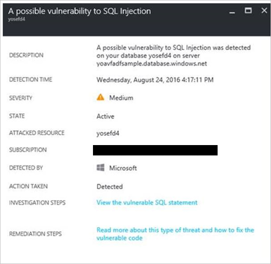

### Unusual access from unfamiliar location
This alert is triggered when an access event from an unfamiliar IP address was detected on the server, which was not seen in the last period.

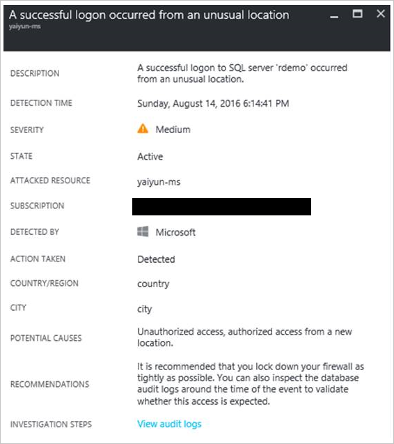

## Contextual information
During an investigation, analysts need extra context to reach a verdict about the nature of the threat and how to mitigate it.  For example, a network anomaly was detected, but without understanding what else is happening on the network or with regard to the targeted resource it is every hard to understand what actions to take next. To aid with that, a Security Incident may include artifacts, related events and information that may help the investigator. The availability of additional information will vary based on the type of threat detected and the configuration of your environment, and will not be available for all Security Incidents.

If additional information is available, it will be shown in the Security Incident below the list of alerts. This could contain information like:

- Log clear events
- PNP device plugged from unknown device
- Alerts which are not actionable 

 

## See also
In this article, you learned about the different types of security alerts in Security Center. To learn more about Security Center, see the following:

* [Handling security incident in Azure Security Center](security-center-incident.md)
* [Azure Security Center detection capabilities](security-center-detection-capabilities.md)
* [Azure Security Center planning and operations guide](security-center-planning-and-operations-guide.md)
* [Azure Security Center FAQ](security-center-faq.md): Find frequently asked questions about using the service.
* [Azure security blog](http://blogs.msdn.com/b/azuresecurity/): Find blog posts about Azure security and compliance.
