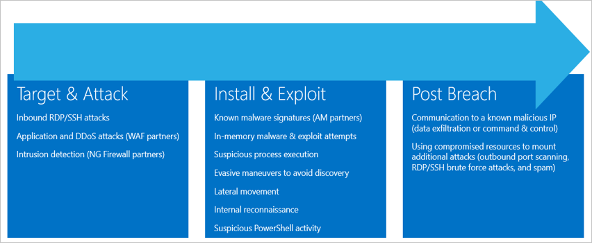

<properties
   pageTitle="Security alerts by Type in Azure Security Center | Microsoft Azure"
   description="This document helps to understand the type of security alerts available in Azure Security Center."
   services="security-center"
   documentationCenter="na"
   authors="YuriDio"
   manager="swadhwa"
   editor=""/>

<tags
   ms.service="security-center"
   ms.topic="hero-article"
   ms.devlang="na"
   ms.tgt_pltfrm="na"
   ms.workload="na"
   ms.date="09/20/2016"
   ms.author="yurid"/>

# Security Alerts by Type in Azure Security Center
This document helps you to understand the different types of security alerts available in Azure Security Center. Read [Managing and responding to security alerts in Azure Security Center](security-center-managing-and-responding-alerts.md) for more information on how to manage alerts.

> [AZURE.NOTE] To enable advanced detections, upgrade to Azure Security Center Standard. A free 90-day trial is available. To upgrade, select Pricing Tier in the [Security Policy](security-center-policies.md). See the [pricing page](https://azure.microsoft.com/pricing/details/security-center/) to learn more.

## What type of alerts are available?
Azure Security Center provides a variety of alerts that align with the stages of the cyber kill chain. The figure below provides some examples of various alerts as they relate to some of these stages.

**Target & Attack**

- Inbound RDP/SSH attacks
- Application and DDoS attacks (WAF partners)
- Intrusion detection (NG Firewall partners)

**Install & Exploit**

- Known malware signatures (AM partners)
- In-memory malware & exploit attempts
- Suspicious process execution
- Evasive maneuvers to avoid discovery
- Lateral movement
- Internal reconnaissance
- Suspicious PowerShell activity

**Post Breach**  

- Communication to a known malicious IP (data exfiltration or command & control)
- Using compromised resources to mount additional attacks (outbound port scanning RDP/SSH brute force attacks, and spam)

Different types of attacks are associated with each stage and they target different subsystems. To address attacks during these stages, Security Center has three categories of alerts:

- Virtual Machine Behavioral Analysis (VMBA)
- Network Analysis
- Resource Analysis

## Virtual machine behavioral analysis

Azure Security Center can use behavioral analytics to identify compromised resources based on analysis of virtual machine event logs, for example: Process Creation Events, Login Events, etc.). In addition, there is correlation with other signals to check for supporting evidence of a widespread campaign.

> [AZURE.NOTE] For more information about how Security Center detection capabilities work, read [Azure Security Center Detection Capabilities](security-center-detection-capabilities.md).

### Crash analysis

Crash dump memory analysis is a method used to detect sophisticated malware that is able to evade traditional security solutions. Various forms of malware try to reduce the chance of being detected by anti-virus products by never writing to disk or by encrypting software components written to disk. This makes the malware difficult to detect using traditional antimalware approaches. However, such malware can be detected using memory analysis, as malware must leave traces in memory in order to function.

When software crashes, a crash dump captures a portion of memory at the time of the crash. The crash may be caused by malware, general application or system issues. By analyzing the memory in the crash dump, Security Center can detect techniques used to exploit vulnerabilities in software, access confidential data, and surreptitiously persist with-in a compromised machine. This is accomplished with minimum performance impact to hosts as the analysis is performed by the Security Center back-end.

The following fields are common to crash dump analysis alerts listed below:

- DUMPFILE: Name of the crash dump file
- PROCESSNAME: Name of the crashing process
- PROCESSVERSION: Version of the crashing process

### Shellcode discovered

Shellcode is the payload that is run after malware has exploited a software vulnerability. This alert indicates that crash dump analysis has detected executable code exhibiting behavior commonly performed by malicious payloads. Although non-malicious software may perform this behavior, it is not typical of normal software development practices.

This alert provides the following additional field:

- ADDRESS: The location in memory of the shellcode

This is an example of this type of alert:

 

### Module hijacking discovered

Windows relies on Dynamic Link Libraries (DLLs) to allow software to utilize common Windows system functionality. DLL Hijacking occurs when malware changes the DLL load order to load malicious payloads into memory, where arbitrary code can be executed. This alert indicates the crash dump analysis has detected a similarly named module is loaded from two different paths, where one of the loaded paths comes from a common Windows system binary location.

Legitimate software developers occasionally change the DLL load order for non-malicious reasons, such as instrumenting, extending the Windows OS or Windows applications. To help differentiate between malicious and potentially benign changes to the DLL load order, Azure Security Center checks whether or not a loaded module conforms to a suspicious profile. The result of this check is indicated by the “SIGNATURE” field of the alert and is reflected in the severity of the alert, alert description, and alert remediation steps. Analyzing the on disk copy of the hijacking module, such as by verifying the files digital signature or running an anti-virus scan, may provide more information as to the legitimate or malicious nature of the hijacking module.

In addition to the common fields described in the “Shellcode Discovered” section above, this alert provides the following fields:

- SIGNATURE: Indicates if the hijacking module conforms to a profile of suspicious behavior
- HIJACKEDMODULE: The name of the hijacked Windows system module
- HIJACKEDMODULEPATH: The path of the hijacked Windows system module
- HIJACKINGMODULEPATH: The path of the hijacking module

This is an example of this type of alert:

 

### Masquerading Windows module detected

Malware may use common names of Windows system binaries (e.g., SVCHOST.EXE) or modules (e.g., NTDLL.DLL) in order to “blend-in” and obscure the nature of the malicious software from system administrators. This alert indicates the crash dump analysis has detected that the crash dump file contains modules that use Windows system module names, but do not satisfy other criteria that are typical of Windows modules. Analyzing the on disk copy of the masquerading module may provide more information as to the legitimate or malicious nature of this module. Analysis may include:

- Confirm that the file in question is shipped as part of a legitimate software package
- Verify the file’s digital signature
- Run an anti-virus scan on the file

In addition to the common fields described in the “Shellcode Discovered” section above, this alert provides the following additional fields:

- DETAILS: Describes whether the modules metadata is valid and whether the module was loaded from a system path.
- NAME: The name of the masquerading Windows module
- PATH: The path to the masquerading Windows module.

This alert also extracts and displays the certain fields, from the module’s PE header, such as “CHECKSUM” and “TIMESTAMP”. These fields are only displayed if the fields are present in the module. See the [Microsoft PE and COFF Specification](https://msdn.microsoft.com/windows/hardware/gg463119.aspx) for details on these fields.

This is an example of this type of alert:

 

### Modified system binary discovered

Malware may modify core system binaries in order to covertly access data or surreptitiously persist on a compromised system. This alert indicates the crash dump analysis has detected that core Windows OS binaries have been modified in memory or on disk.
Legitimate software developers occasionally modify system modules in memory for non-malicious reasons, such as Detours or for application compatibility. To help differentiate between malicious and potentially legitimate modules, Azure Security Center checks whether or not the modified module conforms to a suspicious profile. The result of this check is indicated by the severity of the alert, alert description, and alert remediation steps.

In addition to the common fields described in the “Shellcode Discovered” section above, this alert provides the following additional fields:

- MODULENAME: Name of the modified system binary
- MODULEVERSION: Version of the modified system binary

This is an example of this type of alert:

 

### Suspicious process executed

Security Center identifies suspicious process in execution in the target virtual machine and trigger an alert. The detection doesn’t look for the specific name, but by its parameter, therefore even if the attacker renames the executable, Security Center still be able to detect.
 
This is an example of this type of alert:

### Multiple domain accounts queried

Security Center can detect multiple attempts to query domain accounts, which is something usually performed by attackers during network reconnaissance. Attackers can leverage this technique to query the domain to identify who are the users, what are the domain admin accounts, which computers are Domain Controllers and also potential domain trust relationship with other domains.

This is an example of this type of alert:

## Network analysis

Security Center network threat detection works by automatically collecting security information from your Azure IPFIX (Internet Protocol Flow Information Export) traffic. It analyzes this information, often correlating information from multiple sources, to identify threats.

### Suspicious outgoing traffic detected

Network devices can be discovered and profiled in much the same way as other types of systems. Attackers usually start with port scanning / port sweeping. In the example below you have a suspicious SSH traffic from a VM that can be performing a SSH brute force or port sweeping attack against an external resource.

 

This alert gives information that enables you to identify the resource that was used to initiate this attack, the compromised machine, the detection time, the protocol and port that was used. This blade also gives you a list of remediation steps that can be used to mitigate this issue.

### Network communication with a malicious machine

By leveraging Microsoft threat intelligence feeds, Azure Security Center can detect compromised machines that are communicating with malicious IP addresses, in many cases a command and control center. In this case Azure Security Center detected that the communication was done using Pony Loader malware (also known as [Fareit](https://www.microsoft.com/security/portal/threat/encyclopedia/entry.aspx?Name=PWS:Win32/Fareit.AF)).

This alert gives information that enables you to identify the resource that was used to initiate this attack, the attacked resource, the victim IP, the attacker IP and the detection time.

[AZURE.NOTE] Live IP addresses were removed from this screenshot for privacy purpose.

### Possible outgoing denial-of-service attack detected

Anomalous network traffic originated from one virtual machine can lead Security Center to trigger a potential denial-of-service type of attack.
 
This is an example of this type of alert:

## Resource analysis

Security Center resource analysis focuses in PaaS services, such as the integration with [Azure SQL Db Threat Detection](../sql-database/sql-database-threat-detection-get-started.md) feature. Based on the analysis’s results from these areas, Security Center triggers a resource related alert.

### Potential SQL injection

SQL injection is an attack in which malicious code is inserted into strings that are later passed to an instance of SQL Server for parsing and execution. Any procedure that constructs SQL statements should be reviewed for injection vulnerabilities because SQL Server executes all syntactically valid queries that it receives. SQL Threat Detection uses machine learning, behavioral analysis and anomaly detection to determine suspicious events that might be taking place in your Azure SQL Databases. For example:

- Attempted database access by a former employee 
- SQL injection attacks 
- Unusual access to production database from a user at home

This alert gives information that enables you to identify the attacked resource, the detection time, the state of the attack and it also provides a link to further investigation steps.

### Vulnerability to SQL Injection

This alert is triggered when an application error has been detected on a database which may indicate a possible vulnerability to SQL injection attacks.

### Unusual access from unfamiliar location

This alert is triggered when an access from an unfamiliar IP address was detected on server, which was not seen in the last period.

## See also

In this document, you learned about the different types of security alerts in Security Center. To learn more about Security Center, see the following:

- [Handling Security Incident in Azure Security Center](security-center-incident.md)
- [Azure Security Center Detection Capabilities](security-center-detection-capabilities.md)
- [Azure Security Center Planning and Operations Guide](security-center-planning-and-operations-guide.md)
- [Azure Security Center FAQ](security-center-faq.md) — Find frequently asked questions about using the service.
- [Azure Security blog](http://blogs.msdn.com/b/azuresecurity/) — Find blog posts about Azure security and compliance.
