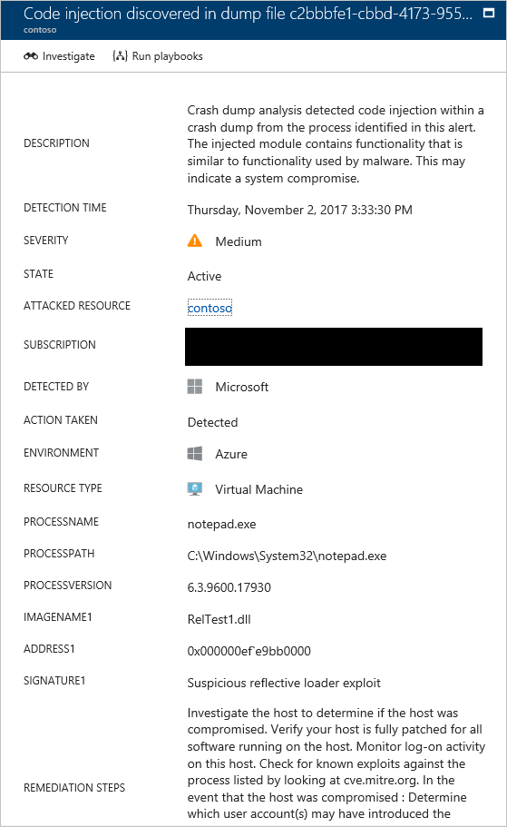
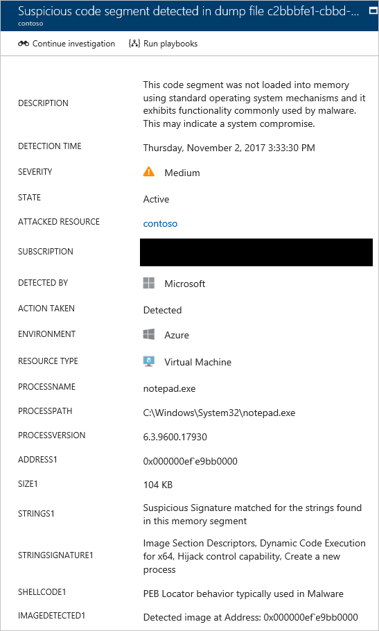

# Understanding security alerts in Azure Security Center
This article helps you to understand the different types of security alerts and related insights that are available in Azure Security Center. For more information on how to manage alerts and incidents, see [Managing and responding to security alerts in Azure Security Center](security-center-managing-and-responding-alerts.md).

To set up advanced detections, upgrade to Azure Security Center Standard. A free 60-day trial is available. To upgrade, select **Pricing Tier** in the [security policy](security-center-policies.md). To learn more, see the [pricing page](https://azure.microsoft.com/pricing/details/security-center/).

> [!NOTE]
> Security Center has released to limited preview a new set of detections that leverage auditd records, a common auditing framework, to detect malicious behaviors on Linux machines. Send an email with your subscription IDs to [us](mailto:ASC_linuxdetections@microsoft.com) to join the preview.

## What type of alerts are available?
Azure Security Center uses a variety of [detection capabilities](security-center-detection-capabilities.md) to alert customers to potential attacks targeting their environments. These alerts contain valuable information about what triggered the alert, the resources targeted, and the source of the attack. The information included in an alert varies based on the type of analytics used to detect the threat. Incidents may also contain additional contextual information that can be useful when investigating a threat.  This article provides information about the following alert types:

* Virtual Machine Behavioral Analysis (VMBA)
* Network Analysis
* Resource Analysis
* Contextual Information

## Virtual machine behavioral analysis
Azure Security Center can use behavioral analytics to identify compromised resources based on analysis of virtual machine event logs. For example, Process Creation Events and Login Events. In addition, there is correlation with other signals to check for supporting evidence of a widespread campaign.

> [!NOTE]
> For more information on how Security Center detection capabilities work, see [Azure Security Center detection capabilities](security-center-detection-capabilities.md).
>

### Crash analysis
Crash dump memory analysis is a method used to detect sophisticated malware that is able to evade traditional security solutions. Various forms of malware try to reduce the chance of being detected by antivirus products by never writing to disk, or by encrypting software components written to disk. This technique makes the malware difficult to detect by using traditional antimalware approaches. However, this kind of malware can be detected by using memory analysis, because malware must leave traces in memory in order to function.

When software crashes, a crash dump captures a portion of memory at the time of the crash. The crash may be caused by malware, general application, or system issues. By analyzing the memory in the crash dump, Security Center can detect techniques used to exploit vulnerabilities in software, access confidential data, and surreptitiously persist within a compromised machine. This is accomplished with minimum performance impact to hosts as the analysis is performed by the Security Center back end.

The following fields are common to the crash dump alert examples that appear later in this article:

* DUMPFILE: Name of the crash dump file.
* PROCESSNAME: Name of the crashing process.
* PROCESSVERSION: Version of the crashing process.

### Code Injection Discovered
Code injection is the insertion of executable modules into running processes or threads.  This technique is used by malware to access data, hide or prevent its removal (e.g. persistence). This alert indicates that an injected module is present in the crash dump. Legitimate software developers occasionally perform code injection for non-malicious reasons, such as modifying or extending an existing application or operating system component.  To help differentiate between malicious and non-malicious injected modules, Security Center checks whether or not the injected module conforms to a profile of suspicious behavior. The result of this check is indicated by the “SIGNATURE” field of the alert and is reflected in the severity of the alert, alert description, and alert remediation steps. 

This alert provides the following additional fields:

- ADDRESS: The location in memory of the injected module
- IMAGENAME: The name of the injected module. Note that this can be blank if the image name is not provided within the image.
- SIGNATURE: Indicates if the injected module conforms to a profile of suspicious behavior. 

The table below shows examples of results and their description:

| Signature value                      | Description                                                                                                       |
|--------------------------------------|-------------------------------------------------------------------------------------------------------------------|
| Suspicious reflective loader exploit | This suspicious behavior often correlates with loading injected code independently of the operating system loader |
| Suspicious injected exploit          | Signifies maliciousness that often correlates to injecting code into memory                                       |
| Suspicious injecting exploit         | Signifies maliciousness that often correlates to use of injected code in memory                                   |
| Suspicious injected debugger exploit | Signifies maliciousness that often correlates to detection or circumvention of a debugger                         |
| Suspicious injected remote exploit   | Signifies maliciousness that often correlates to command n control (C2) scenarios                                 |

Here an example of this type of alert:

### Suspicious Code Segment
The suspicious code segment indicates that a code segments has been allocated using non-standard methods, such as used by reflective injection and process hollowing.  Additionally this alert process additional characteristics of the code segment to provide context as to the capabilities and behaviors of the reported code segment.

This alert provides the following additional fields:

- ADDRESS: The location in memory of the injected module
- SIZE: The size of the suspicious code segment
- STRINGSIGNATURES: This field list capabilities of APIs whose function names are contained within the code segment. Examples capabilities might include:
	- Image Section Descriptors, Dynamic Code Execution for x64, Memory allocation and loader capability, Remote code injection capability, Hijack control capability, Read environment variables, Read arbitrary process memory, Query or modify token privileges, HTTP/HTTPS network communication, and Network socket communication.
- IMAGEDETECTED: This field indicates if a PE image was injected into the process where the suspicious code segment was detected and at what address the injected module starts.
- SHELLCODE: This field indicates the presence of behavior commonly used by malicious payloads to acquire access to additional security sensitive operating system functions. 

Here an example of this type of alert:

### Shellcode discovered
Shellcode is the payload that is run after malware exploits a software vulnerability. This alert indicates that crash dump analysis has detected executable code that exhibits behavior that is commonly performed by malicious payloads. Although non-malicious software may perform this behavior, it is not typical of normal software development practices.

The Shellcode alert example provides the following additional field:

* ADDRESS: The location in memory of the shellcode.

Here an example of this type of alert:

### Module hijacking discovered
Windows uses dynamic-link libraries (DLLs) to allow software to utilize common Windows system functionality. DLL Hijacking occurs when malware changes the DLL load order to load malicious payloads into memory, where arbitrary code can be executed. This alert indicates that the crash dump analysis detected a similarly named module that is loaded from two different paths. One of the loaded paths comes from a common Windows system binary location.

Legitimate software developers occasionally change the DLL load order for non-malicious reasons, such as instrumenting, extending the Windows OS, or extending a Windows application. To help differentiate between malicious and potentially benign changes to the DLL load order, Azure Security Center checks whether a loaded module conforms to a suspicious profile. The result of this check is indicated by the “SIGNATURE” field of the alert and is reflected in the severity of the alert, alert description, and alert remediation steps. To research whether the module is legitimate or malicious, analyze the on disk copy of the hijacking module. For example, you can verify the file's digital signature, or run an antivirus scan.

In addition to the common fields described in the earlier “Shellcode discovered” section, this alert provides the following fields:

* SIGNATURE: Indicates if the hijacking module conforms to a suspicious behavior profile.
* HIJACKEDMODULE: The name of the hijacked Windows system module.
* HIJACKEDMODULEPATH: The path of the hijacked Windows system module.
* HIJACKINGMODULEPATH: The path of the hijacking module.

Here an example of this type of alert:

### Masquerading Windows module detected
Malware may use common names of Windows system binaries (for example, SVCHOST.EXE) or modules (for example, NTDLL.DLL) to *blend in* and obscure the nature of the malicious software from system administrators. This alert indicates that the crash dump analysis detects that the crash dump file contains modules that use Windows system module names, but do not satisfy other criteria that are typical of Windows modules. Analyzing the on disk copy of the masquerading module may provide more information about the legitimate or malicious nature of this module. Analysis may include:

* Confirm that the file in question is shipped as part of a legitimate software package.
* Verify the file’s digital signature.
* Run an antivirus scan on the file.

In addition to the common fields described earlier in the “Shellcode discovered” section, this alert provides the following additional fields:

* DETAILS: Describes whether the module's metadata is valid, and whether the module was loaded from a system path.
* NAME: The name of the masquerading Windows module.
* PATH: The path to the masquerading Windows module.

This alert also extracts and displays certain fields from the module’s PE header, such as “CHECKSUM” and “TIMESTAMP.” These fields are only displayed if the fields are present in the module. See the [Microsoft PE and COFF Specification](https://msdn.microsoft.com/windows/hardware/gg463119.aspx) for details on these fields.

Here an example of this type of alert:

### Modified system binary discovered
Malware may modify core system binaries in order to covertly access data or surreptitiously persist on a compromised system. This alert indicates that the crash dump analysis has detected that core Windows OS binaries have been modified in memory or on disk.

Legitimate software developers occasionally modify system modules in memory for non-malicious reasons, such as Detours or for application compatibility. To help differentiate between malicious and potentially legitimate modules, Azure Security Center checks whether the modified module conforms to a suspicious profile. The result of this check is indicated by the severity of the alert, alert description, and alert remediation steps.

In addition to the common fields described earlier in the “Shellcode discovered” section, this alert provides the following additional fields:

* MODULENAME: Name of the modified system binary.
* MODULEVERSION: Version of the modified system binary.

Here an example of this type of alert:

### Suspicious process executed
Security Center identifies a suspicious process that runs on the target virtual machine, and then triggers an alert. The detection doesn’t look for the specific name, but does look for the executable file's parameter. Therefore, even if the attacker renames the executable, Security Center can still detect the suspicious process.

Here an example of this type of alert:

### Multiple domains accounts queried
Security Center can detect multiple attempts to query Active Directory domain accounts, which are something usually performed by attackers during network reconnaissance. Attackers can leverage this technique to query the domain to identify the users, identify the domain admin accounts, identify the computers that are domain controllers, and also identify the potential domain trust relationship with other domains.

Here an example of this type of alert:

### Local Administrators group members were enumerated

Security Center is going to trigger an alert when the security event 4798, in Windows Server 2016 and Windows 10, is trigged. This happens when local administrator groups are enumerated, which is something usually performed by attackers during network reconnaissance. Attackers can leverage this technique to query the identity of users with administrative privileges.

Here an example of this type of alert:

### Anomalous mix of upper and lower case characters

Security Center will trigger an alert when it detects the use of a mix of upper and lower case characters at the command line. Some attackers may use this technique to hide from case-sensitive or hash-based machine rule.

Here an example of this type of alert:

### Suspected Kerberos Golden Ticket attack

A compromised [krbtgt](https://technet.microsoft.com/library/dn745899.aspx) key can be used by an attacker to create Kerberos "Golden Tickets," allowing the attacker to impersonate any user they wish. Security Center is going to trigger an alert when it detects this type of activity.

> [!NOTE] 
> For more information about Kerberos Golden Ticket, read [Windows 10 credential theft mitigation guide](http://download.microsoft.com/download/C/1/4/C14579CA-E564-4743-8B51-61C0882662AC/Windows%2010%20credential%20theft%20mitigation%20guide.docx).

Here an example of this type of alert:

### Suspicious account created

Security Center will trigger an alert when an account is created with close resemblance of an existing built in administrative privilege account. This technique can be used by attackers to create a rogue account to avoid being noticed by human verification.
 
Here an example of this type of alert:

### Suspicious Firewall rule created

Attackers might try to circumvent host security by creating custom firewall rules to allow malicious applications to communicate with command and control, or to launch attacks through the network via the compromised host. Security Center will trigger an alert when it detects that a new firewall rule was created from an executable file in a suspicious location.
 
Here an example of this type of alert:

### Suspicious combination of HTA and PowerShell

Security Center will trigger an alert when it detects that a Microsoft HTML Application Host (HTA) is launching PowerShell commands. This is a technique used by attackers to launch malicious PowerShell scripts.
 
Here an example of this type of alert:

## Network analysis
Security Center network threat detection works by automatically collecting security information from your Azure IPFIX (Internet Protocol Flow Information Export) traffic. It analyzes this information, often correlating information from multiple sources, to identify threats.

### Suspicious outgoing traffic detected
Network devices can be discovered and profiled in much the same way as other types of systems. Attackers usually start with port scanning or port sweeping. In the next example, you have suspicious Secure Shell (SSH) traffic from a VM. In this scenario, SSH brute force or a port sweeping attack against an external resource is possible.

This alert gives information that you can use to identify the resource that was used to initiate this attack. This alert also provides information to identify the compromised machine, the detection time, plus the protocol and port that was used. This page also gives you a list of remediation steps that can be used to mitigate this issue.

### Network communication with a malicious machine
By leveraging Microsoft threat intelligence feeds, Azure Security Center can detect compromised machines that communicate with malicious IP addresses. In many cases, the malicious address is a command and control center. In this case, Security Center detected that the communication was done by using Pony Loader malware (also known as [Fareit](https://www.microsoft.com/security/portal/threat/encyclopedia/entry.aspx?Name=PWS:Win32/Fareit.AF)).

This alert gives information that enables you to identify the resource that was used to initiate this attack, the attacked resource, the victim IP, the attacker IP, and the detection time.

> [!NOTE]
> Live IP addresses were removed from this screenshot for privacy purpose.
>
>

### Possible outgoing denial-of-service attack detected
Abnormal network traffic that originates from one virtual machine can cause Security Center to trigger a potential denial-of-service type of attack.

Here an example of this type of alert:

## Resource analysis
Security Center resource analysis focuses on platform as a service (PaaS) services, such as the integration with the [Azure SQL Database threat detection](../sql-database/sql-database-threat-detection.md) feature. Based on the analysis’s results from these areas, Security Center triggers a resource-related alert.

### Potential SQL injection
SQL injection is an attack where malicious code is inserted into strings that are later passed to an instance of SQL Server for parsing and execution. Because SQL Server executes all syntactically valid queries that it receives, any procedure that constructs SQL statements should be reviewed for injection vulnerabilities. SQL Threat Detection uses machine learning, behavioral analysis, and anomaly detection to determine suspicious events that might be taking place in your Azure SQL databases. For example:

* Attempted database access by a former employee
* SQL injection attacks
* Unusual access to a production database from a user at home

The information in this alert can be used to identify the attacked resource, the detection time, and the state of the attack. It also provides a link to further investigation steps.

### Vulnerability to SQL Injection
This alert is triggered when an application error is detected on a database. This alert may indicate a possible vulnerability to SQL injection attacks.

### Unusual access from unfamiliar location
This alert is triggered when an access event from an unfamiliar IP address was detected on the server, which was not seen in the last period.

## Contextual information
During an investigation, analysts need extra context to reach a verdict about the nature of the threat and how to mitigate it.  For example, a network anomaly was detected, but without understanding what else is happening on the network or with regard to the targeted resource it is every hard to understand what actions to take next. To aid with that, a Security Incident may include artifacts, related events and information that may help the investigator. The availability of additional information will vary based on the type of threat detected and the configuration of your environment, and will not be available for all Security Incidents.

If additional information is available, it will be shown in the Security Incident below the list of alerts. This could contain information like:

- Log clear events
- PNP device plugged from unknown device
- Alerts which are not actionable 

 

## List of security alerts
The list below has the name and description of all Security Center alerts. This list will continually to expand as new alerts are created to reflect new threats. 

####An event log was cleared
Machine logs indicate a suspicious event log clearing operation by user: <username> in Machine: <machinename>. The <logchannel> log was cleared.

####Suspicious process executed
Machine logs indicate that the suspicious Process: '<processname> was running on the machine.

####Suspicious incoming SSH network activity**
Network traffic analysis detected anomalous incoming SSH communication to <VictimIP>, associated with your resource <CompromisedHost>, from <AttackerIP>. Specifically, sampled network data shows <NumberofConnections> incoming connections to your machine, which is considered abnormal for this environment. This activity may indicate an attempt to brute force your SSH end point.

####Suspicious incoming SSH network activity from multiple sources
Network traffic analysis detected anomalous incoming SSH communication to <VictimIP>, associated with your resource <CompromisedHost>, from multiple sources. Specifically, sampled network data shows <NumberofAttackingIPs> unique IPs connecting to your machine, which is considered abnormal for this environment. This activity may indicate an attempt to brute force your SSH end point from multiple hosts (Botnet).

####Suspicious outgoing SSH network activity
Network traffic analysis detected anomalous outgoing SSH communication to <VictimIP> originating from <CompromisedHost> <AttackerIP>, a machine in your deployment. Specifically, sampled network data shows <NumberofConnections> outgoing connections from your machine, which is considered abnormal for this environment. This activity may indicate that your machine was compromised and is now used to brute force external SSH end points. Note that this type of activity could possibly cause your IP to be flagged as malicious by external entities.

####Suspicious outgoing SSH network activity to multiple destinations
Network traffic analysis detected anomalous outgoing SSH communication to multiple destinations originating from <CompromisedHost> <Attacker IP>, a machine in your deployment. Specifically, sampled network data shows your machine connecting to <NumberofAttackedIPs> unique IPs, which is considered abnormal for this environment. This activity may indicate that your machine was compromised and is now used to brute force external SSH end points. Note that this type of activity could possibly cause your IP to be flagged as malicious by external entities.

####Suspicious RDP resource activity
Several Remote Desktop login attempts were detected from <source>. All the attempts in the last 24 hours were on invalid accounts.

####Successful RDP brute force attack
Several Remote Desktop login attempts were detected from <source>, some of which were able to successfully login to the machine.

####Suspicious RDP resource activity
Several Remote Desktop login attempts were detected from <source>.

####Suspicious process executed
The process <processname> was observed executing from an uncommon location.

####Suspicious Screensaver process executed
The process <processname> was observed executing from an uncommon location.

####Suspicious process executed
Suspicious SVCHOST.exe process is running but was either not running from Windows\System32\SVCHOST.exe, not running with a local system account, not created by 'services.exe' process or does not contain -k &lt;command&gt; as the command line argument. Malware often uses the actual svchost.exe to load their malicious service and they will not include -k command line parameters and will run under a username that is not SYSTEM, LOCAL SERVICE or NETWORK SERVICE.
The svchost process was running from <processname>, using the command <commandline> and by parent process <parentprocessname>.

####Suspicious SVCHOST process executed
The system process SVCHOST was observed running in an abnormal context. Malware often use SVCHOST to masquerade its malicious activity.

####Possible compromised machine detected
Threat intelligence indicates that your machine (IP <MachineIP>) may have been compromised by a malware.

####Network communication with a malicious machine detected
Network traffic analysis indicates that your machine (IP <VictimIP>) has communicated with what is possibly a Command and Control center.

####Network logon with plaintext credentials
This alert indicates a network logon was observed where the password was sent over the network in clear text format. This is common for logons from an ASP script using the ADVAPI or when a user logs on to IIS using IIS’s basic authentication mode. Basic authentication is not the recommended method unless it is wrapped in an encryption layer such as SSL (i.e. by using HTTPS connections only).

####Suspicious process execution
Machine logs indicate that the suspicious process <childprocess> was executed from the context of <parentprocess>.This activity might indicate the presence of malware on the system.

####Suspicious process execution
Machine logs indicate that the system process <processname> was executed from a suspicious path by user <username>. Full Path: <fullpath>

####Malicious SQL activity
Machine logs indicate that <suspiciousprocess> was executed by account: <subjectusername>. This activity is considered malicious.

####Malicious SQL activity
Machine logs indicate that <processname> was executed by account: <username>. This activity is considered malicious.

####Suspicious command execution
Machine logs indicate a suspicious command line execution by user <username>.

####Possible outgoing port scanning activity detected
Network traffic analysis detected suspicious outgoing traffic from <CompromisedHost>. This traffic may be a result of a port scanning activity. If this behavior is intentional, please note that performing port scanning is against Azure Terms of service. If this behavior is unintentional, it may mean your machine has been compromised.

####Suspicious Powershell Activity Detected
Analysis of host data detected a PowerShell script running on <CompromisedHost> that has features in common with known suspicious scripts. This script could either be legitimate activity, or an indication that one of your machines has been compromised.

####Suspicious WindowPosition registry value detected
Analysis of host data on <CompromisedHost> detected an attempted WindowPosition registry configuration change that could be indicative of hiding application windows in non-visible sections of the desktop.  This could be legitimate activity, or an indication that one of your machines has been compromised: this type of activity has been previously associated with known adware (or unwanted software) such as Win32/OneSystemCare and Win32/SystemHealer and malware such as Win32/Creprote. When the WindowPosition value is set to 201329664, (Hex: 0x0c00 0c00, corresponding to X-axis=0c00 and the Y-axis=0c00) this places the console app's window in a non-visible section of the user's screen in an area that is hidden from view below the visible start menu/taskbar. Known suspect Hex value includes, but not limited to c000c000.

####Potential attempt to bypass AppLocker detected
Analysis of host data on <CompromisedHost> detected a potential attempt to bypass AppLocker restrictions. AppLocker can be configured to implement a policy that limits what executables are allowed to run on a Windows system. The command line pattern similar to that identified in this alert has been previously associated with attacker attempts to circumvent AppLocker policy by using trusted executables (allowed by AppLocker policy) to execute untrusted code. This could be legitimate activity, or an indication that one of your machines has been compromised.

####Detected encoded executable in command line data
Analysis of host data on <CompromisedHost> detected a base-64 encoded executable. This has previously been associated with attackers attempting to construct executables on-the-fly through a sequence of commands, and attempting to evade intrusion detection systems by ensuring that no individual command would trigger an alert. This could be legitimate activity, or an indication that one of your machines has been compromised.

####Detected suspicious named pipe communications
Analysis of host data on <CompromisedHost> detected data being written to a local named pipe from a Windows console command. Named pipes are known to be a channel used by attackers to task and communicate with a malicious implant. This could be legitimate activity, or an indication that one of your machines has been compromised.

####Detected decoding of an executable using built-in certutil.exe tool
Analysis of host data on <CompromisedHost> detected that certutil.exe, a built-in administrator utility, was being used to decode an executable instead of its mainstream purpose that relates to manipulating certificates and certificate data. Attackers are known to abuse functionality of legitimate administrator tools to perform malicious actions, for example using a tool such as certutil.exe to decode a malicious executable that will then be subsequently executed.

####Suspicious Powershell Activity Detected
Analysis of host data detected a PowerShell script running on <CompromisedHost> that has features in common with known suspicious scripts. This script could either be legitimate activity, or an indication that one of your machines has been compromised.

####Multiple Domain Accounts Queried
Analysis of host data has determined that an unusual number of distinct domain accounts are being queried within a short time period from <CompromisedHost>. This kind of activity could be legitimate, but can also be an indication of compromise.

####Suspicious double extension file executed
Machine logs indicate an execution of a process with a suspicious double extension. This extension may trick users into thinking files are safe to be opened and might indicate the presence of malware on the system.

####Possible incoming SQL brute force attempts detected
Network traffic analysis detected incoming SQL communication to <VictimIP>, associated with your resource <CompromisedHost>, from <AttackerIP>. Specifically, sampled network data shows suspicious activity between <StartTime> and <EndTime> on port <PortNumber> (<SQLServiceType>). This activity is consistent with brute force attempts against SQL servers.

####Suspicious incoming RDP network activity from multiple sources
Network traffic analysis detected anomalous incoming Remote Desktop Protocol (RDP) communication to <VictimIP>, associated with your resource <CompromisedHost>, from multiple sources. Specifically, sampled network data shows <NumberofAttackingIPs> unique IPs connecting to your machine, which is considered abnormal for this environment. This activity may indicate an attempt to brute force your RDP end point from multiple hosts (Botnet).

####Suspicious incoming RDP network activity
Network traffic analysis detected anomalous incoming Remote Desktop Protocol (RDP) communication to <VictimIP>, associated with your resource <CompromisedHost>, from <AttackerIP>. Specifically, sampled network data shows <NumberofConnections> incoming connections to your machine, which is considered abnormal for this environment. This activity may indicate an attempt to brute force your RDP end point.

####Suspicious outgoing RDP network activity to multiple destinations
Network traffic analysis detected anomalous outgoing Remote Desktop Protocol (RDP) communication to multiple destinations originating from <CompromisedHost> (<AttackerIP>), a machine in your deployment. Specifically, sampled network data shows your machine connecting to <NumberofAttackedIPs> unique IPs, which is considered abnormal for this environment. This activity may indicate that your machine was compromised and is now used to brute force external RDP end points. Note that this type of activity could possibly cause your IP to be flagged as malicious by external entities.

####Suspicious outgoing RDP network activity
Network traffic analysis detected anomalous outgoing Remote Desktop Protocol (RDP) communication to <VictimIP> originating from <CompromisedHost> (<AttackerIP>), a machine in your deployment. Specifically, sampled network data shows <NumberofConnections> outgoing connections from your machine, which is considered abnormal for this environment. This activity may indicate that your machine was compromised and is now used to brute force external RDP end points. Note that this type of activity could possibly cause your IP to be flagged as malicious by external entities.

####Suspicious disguised file was executed
Machine logs indicate an execution of a process with a suspicious right-to-left (RLO) character in its filename. This technique is often used to disguise executable files and may trick users into executing them unintentionally. This might indicate a system infection by a malware.

####Possible outgoing spam activity detected
Network traffic analysis detected suspicious outgoing traffic from <CompromisedHost>. This traffic may be a result of a spam activity. If this behavior is intentional, please note that sending spam is against Azure Terms of service. If this behavior is unintentional, it may mean your machine has been compromised.

####Possible outgoing denial-of-service attack detected
Network traffic analysis detected anomalous outgoing activity originating from <CompromisedHost>, a resource in your deployment.  This activity may indicate that your machine was compromised and is now engaged in denial-of-service attacks against external endpoints. Based on the volume of connections, we believe that the following IPs are possibly the targets of the DOS attack: <PossibleVictims>.  Note that it is possible that the communication to some of these IPs is legitimate.

####Possible compromised machine detected
DNS traffic analysis detected anomalous outgoing activity originating from <CompromisedHost>, a resource in your deployment.  This activity may indicate that your machine was compromised and could be part of a botnet.

####Security incident detected
The incident which started on <StartTime> and recently detected on <DetectedTime> indicates that an attacker has <IncidentStage> your resource <CompromisedHost>.

####Security incident detected from same source
The incident which started on <StartTime> and recently detected on <DetectedTime> indicates that an attacker has <IncidentStage> your resource <CompromisedHost>.

####Web application firewall security incident
The incident which started on <StartTime> and recently detected on <DetectedTime> includes several alerts from the same source.

####Suspicious outgoing <AttackedProtocol> traffic detected
Network traffic analysis detected suspicious outgoing traffic from <CompromisedHost> to destination port <MostCommonPort>. This behavior may indicate that your machine is taking part in <AttackedProtocol> brute force attempts or port sweeping attacks.

####Suspicious Process Execution Activity Detected
Analysis of host data has detected a sequence of one or more processes running on <CompromisedHost> that have historically been associated with malicious activity. While individual commands may appear benign the alert is scored based on an aggregation of these commands. This could either be legitimate activity, or an indication that one of your machines has been compromised.

####Suspicious Account Creation Detected
Analysis of host data on <CompromisedHost> detected creation or use of a local account <SuspiciousAccountName>: this account name closely resembles a standard Windows account or group name <SimilarToAccountName>. This is potentially a rogue account created by an attacker, so named in order to avoid being noticed by a human administrator.

####Suspicious Process Execution Activity Detected
Analysis of host data has detected a sequence of one or more processes running on <CompromisedHost> that have historically been associated with malicious activity. While individual commands may appear benign the alert is scored based on an aggregation of these commands. This could either be legitimate activity, or an indication that one of your machines has been compromised.

####Failed RDP brute force attack
Several Remote Desktop login attempts were detected from <source>. Event logs analysis shows that in the last 24 hours there were <failedattempts> failed attempts. All of the failed attempts aimed at non-existent users.

####Successful RDP brute force attack
Several Remote Desktop login attempts were detected from <source>, some of which were able to successfully login to the machine. Event logs analysis shows that in the last hour there were <failedattempts> failed attempts. <non-existentusers> of the failed login attempts aimed at non-existent users. <existingusers> of the failed login attempts aimed at existing users.

####Failed RDP Brute Force Attack
Several Remote Desktop login attempts were detected from <source>, none of them succeeded. Event logs analysis shows that in the last hour there were <failedattempts> failed attempts. Some of the failed login attempts aimed at <existingusers> existing user(s).

####Suspicious Activity Detected
Analysis of host data has detected a sequence of one or more processes running on <machinename> that have historically been associated with malicious activity. While individual commands may appear benign the alert is scored based on an aggregation of these commands. This could either be legitimate activity, or an indication that one of your machines has been compromised.

####Suspicious Login Activity
Machine logs indicate a suspicious login activity from <sourcehostname> (<sourceip>). Specifically, in the last <activityduration> there were <failedattempts> failed login attempts and <successfullogins> successful login(s) to <vmname>. This activity might be a SMB brute force attack. If the affected resource acts as an IIS server, this alert might be due to specific IIS authentication configuration and considered as legitimate.

####Suspicious Volume Shadow Copy Activity
Machine logs indicate a shadow copy deletion activity on the resource. Volume Shadow Copy (VSC) is an important artifact that stores data snapshots.

####Windows registry persistence method detected
Machine logs indicate an attempt to persist an executable in the Windows registry. Malware often uses such a technique to survive a boot.

####Suspicious system process executed
The system process <processname> was observed running in an abnormal context. Malware often use this process name to masquerade its malicious activity.

####Suspicious process name detected
Analysis of host data on <CompromisedHost> detected a process whose name is suspicious, for example corresponding to a known attacker tool or named in a way that is suggestive of attacker tools that try to hide in plain sight. This process could be legitimate activity, or an indication that one of your machines has been compromised.

####Suspicious system file execution
Analysis of host data detected an executable file on <CompromisedHost> that is running from an unusual location. This executable could either be legitimate activity, or an indication that one of your machines has been compromised.

####Executable found running from a suspicious location
Analysis of host data detected an executable file on <CompromisedHost> that is running from a location in common with known suspicious files. This executable could either be legitimate activity, or an indication that one of your machines has been compromised.

####Security incident detected on multiple machines
The incident which started on <StartTime> and recently detected on <DetectedTime> indicates that an attacker has <IncidentStage> your resources <CompromisedHost>.

####Security incident detected on multiple resources
The incident which started on <StartTime> and recently detected on <DetectedTime> indicates that similar attack methods were performed on your cloud resources <Compromised Host>.

####Windows firewall was disabled
Machine logs indicate that the Windows firewall was disabled by <username>. This activity could either be legitimate activity, or an indication that one of your machines has been compromised.

####New user was added to administrators group
Machine logs indicate that a new user was added to the administrators group by <username>. This activity could either be legitimate activity, or an indication that one of your machines has been compromised.

####A new service was created
Machine logs indicate that a new service was created by <username>. This activity could either be legitimate activity, or an indication that one of your machines has been compromised.

####Suspicious XCOPY executions
Machine logs indicate a series of XCOPY executions by <username>.This activity could either be legitimate activity, or an indication that one of your machines has been compromised and is used to propagate Malware.

####Possible incoming <servicename> brute force attempts detected
Network traffic analysis detected incoming <servicename> communication to <victimIP>, associated with your resource <compromisedhost> from <attackerIP>. Specifically, sampled network data shows suspicious activity between <starttime> and <endtime> on port <victimport>. This activity is consistent with brute force attempts against <servicename> servers.

####Detected suppression of legal notice displayed to users at logon
Analysis of host data on <compromisedhost> detected changes to the registry key that controls whether a legal notice is displayed to users when they log on. Microsoft security analysis has determined that this is a common activity undertaken by attackers after having compromised a host.

####Detected anomalous mix of upper and lower case characters in command-line
Analysis of host data on <compromisedhost} detected a command-line with anomalous mixing of upper and lower case characters. This kind of activity, while possibly benign, is also typical of attacker activity trying to hide from case-sensitive or hash-based rule matching when performing administrative tasks on a compromised host.

####Detected possible local reconnaissance activity
Analysis of host data on <compromisedhost> detected a combination of systeminfo commands that has previously been associated with one of activity group GOLD's methods of performing reconnaissance activity.  While 'systeminfo.exe' is a legitimate Windows tool, executing it twice in succession in the way that has occurred here is rare.

####Detected possible execution of keygen executable
Analysis of host data on <compromisedhost> detected execution of a process whose name is indicative of a keygen tool; such tools are typically used to defeat software licensing mechanisms but their download is often bundled with other malicious software. Activity group GOLD has been known to make use of such keygens to covertly gain back door access to hosts that they compromise.

####Detected suspicious execution via rundll32.exe
Analysis of host data on <compromisedhost> detected rundll32.exe being used to execute a process with an uncommon name, consistent with the process naming scheme previously seen used by activity group GOLD when installing their first stage implant on a compromised host.

####Detected suspicious combination of HTA and PowerShell
mshta.exe (Microsoft HTML Application Host) which is a signed Microsoft binary is being used by the attackers to launch malicious PowerShell commands.  Attackers often resort to having a HTA file with inline VBScript.  When a victim browses to the HTA file and chooses to run it, the PowerShell commands and scripts that it contains are executed. Analysis of host data on <compromisedhost> detected mshta.exe launching powershell commands.

####Detected change to a registry key that can be abused to bypass UAC
Analysis of host data on <compromisedhost> detected that a registry key that can be abused to bypass UAC (User Account Control) was changed. This kind of configuration, while possibly benign, is also typical of attacker activity when trying to move from unprivileged (standard user) to privileged (for example administrator) access on a compromised host.

####Detected suspicious DNS resolution
Analysis of network traffic from <compromisedentity> detected suspicious DNS resolutions. Such traffic, while possibly benign, is typically used by an attacker to locate malicious servers for downloading of tools, command-and-control and exfiltration of data. Typical related attacker activity includes copying remote administration tools to a compromised host and exfiltrating user data from it.

####Detected use of suspicious domain name within command-line
Analysis of host data on <compromisedhost> detected usage of a suspicious domain name. Such domain names, while possibly benign, are typically used by an attacker to host malicious tools and as end-points for command-and-control and exfiltration of data. Typical related attacker activity includes copying remote administration tools to a compromised host and exfiltrating user data from it.

####Unusual process execution detected
Analysis of host data on <compromisedhost> detected the execution of a process by <username> that was unusual. Accounts such as <username> tend to perform a limited set of operations, this execution was determined to be out of character and may be suspicious.

####Detected an account that was created on multiple hosts within a 24 hour time period
Analysis of host data detected an attempt to create the same user account on multiple hosts. This kind of activity, while possibly benign, may also indicate lateral movement across the network after one or more network entities have been compromised.

####Detected suspicious use of Cacls to lower the security state of the system
Attackers use myriad ways like brute force, spear phishing etc. to achieve initial compromise and get a foothold on the network. Once initial compromise is achieved they often take steps to lower the security settings of a system. Cacls - short for change access control list is Microsoft Windows native command line utility often used for modifying the security permission on folders and files.  A lot of time the binary is used by the attackers to lower the security settings of a system. This is done by giving everyone full access to some of the system binaries like ftp.exe, net.exe, wscript.exe etc. Analysis of host data on <compromisedhost> detected suspicious use of Cacls to lower the security of a system.

####Suspected Kerberos Golden Ticket attack parameters observed
Analysis of host data detected command line parameters consistent with a Kerberos Golden Ticket attack.

####Detected suspicious new firewall rule
Analysis of host data detected a new Firewall rule has been added via netsh.exe to allow traffic from an executable in a suspicious location.

####Detected enabling of the WDigest UseLogonCredential registry key
Analysis of host data detected a change in the registry key HKLM\SYSTEM\CurrentControlSet\Control\SecurityProviders\WDigest\ "UseLogonCredential". Specifically this key has been updated to allow logon credentials to be stored in clear text in LSA memory. Once enabled an attacker can dump clear text passwords from LSA memory with credential harvesting tools such as Mimikatz.

####Potentially suspect behavior reported as extra context for other alerts raised on this host
Analysis of host data on <compromisedhost> suggests that the following extra context may be relevant to the investigation of other alerts present on this host. The information below should be reviewed in conjunction with these other alerts to determine whether the overall pattern of activity is legitimate or not.

####Random process name detected
Machine logs indicate an execution of a random process name <processname> by user <username>. This activity could either be legitimate activity, or an indication that one of your machines has been compromised.

####Detected obfuscated command line
Attackers use increasingly complex obfuscation techniques to evade detections that run against the underlying data. Analysis of host data on <compromisedhost> detected suspicious indicators of obfuscation on the command line.

####Detected suspicious command line used to start all executables in a directory
Analysis of host data has detected a suspicious process running on <compromisedhost>. The command line indicates an attempt to start all executables (*.exe) that may reside in a directory. This could be an indication that your machine has been compromised.

####Detected potentially suspicious use of Telegram tool
Analysis of host data shows installation of Telegram, a free cloud-based instant messaging service that exists both for mobile and desktop system. Attackers are known to abuse this service to transfer malicious binaries to any other computer, phone, or tablet.

####Detected new ASEP creation
Analysis of host data has detected creation of a new ASEP (Auto Start Extensibility Point) on <compromisedhost>. This is a registry configuration change that causes the process name identified in the command line to be automatically started. Attackers commonly use this technique to achieve persistence, i.e. to ensure that their tools are restarted and run when the machine reboots.

####Rare SVCHOST service group executed
The system process SVCHOST was observed running a rare service group. Malware often use SVCHOST to masquerade its malicious activity.

####Possible compromised machine detected
Network traffic analysis detected outgoing activity originating from <compromisedhost>, a resource in your deployment, that may indicate it is acting as part of a botnet.
The analysis is based on IPs accessed by your resource together with public DNS records. Below is a list of network artifacts that may attribute to this activity. Please review this list and see if it has anything out of the ordinary.

* Suspicious IP addresses: <suspiciousIPs>
* Suspicious domains: <suspiciousdomains>
* Suspicious name servers: <suspiciousnameservers>

####Detected actions indicative of disabling and deleting IIS log files
Analysis of host data detected actions that show IIS log files being disabled and/or deleted.

####Detected suspicious Set-ExecutionPolicy and WinRM changes
Analysis of host data detected changes being made through the Set-ExecutionPolicy cmdlet to enable RemoteSigned, as well as configuration changes to WinRM (Windows Remote Management). Changes of this nature are indicative of use of the ChinaChopper webshell on the affected host.

####Detected the disabling of critical services
The analysis of host data on <compromisedhost> detected execution of  "net.exe stop" command being used to stop critical services like SharedAccess or Windows Security Center. The stopping of either of these service can be indication of a malicious behavior.

####Detected suspicious use of FTP -s Switch
Analysis of process creation data from the <compromisedhost> detected the use of FTP's "-s:filename" switch. This switch is used to specify an FTP script file for the client to run. Malware or malicious processes are known to use this FTP switch (-s:filename) to point to a script file which is configured to connect to a remote FTP server and download additional malicious binaries.

####Detected preparation for document exfiltration via IIS backdoor
Analysis of host data detected actions that appear to show documents being gathered and prepared for exfiltration.

####Detected suspicious execution of VBScript.Encode command
Analysis of host data on <compromisedhost> detected the execution of VBScript.Encode command. This encodes the scripts into unreadable text, making it more difficult for users to examine the code. Microsoft threat research shows that attackers often use encoded VBscript files as part of their attack to evade detection systems. This could be legitimate activity, or an indication that your machines has been compromised.

####VBScript HTTP object allocation detected
Creation of a VBScript file using Command Prompt has been detected. The following script contains HTTP object allocation command. This action can be used to download malicious files.

####Suspicious double extension file executed
Machine logs indicate an execution of a process with a suspicious double extension. This extension may trick users into thinking files are safe to be opened and might indicate the presence of malware on the system.

####Sticky keys attack detected
Machine logs indicate that an attacker may be subverting an accessibility binary (for example sticky keys, onscreen keyboard, narrator) in order to provide backdoor access to the host <compromisedhost>.

####Suspicious PowerShell cmdlets executed
Machine logs indicate execution of known malicious PowerShell Powersploit cmdlets.

####Detected Petya ransomware indicators
Analysis of host data on <compromisedhost> detected indicators associated with Petya ransomware. See https://blogs.technet.microsoft.com/mmpc/2017/06/27/new-ransomware-old-techniques-petya-adds-worm-capabilities/ for more information. Review the command line associated in this alert and escalate this alert to your security team.

####Successful SSH brute force attack
Analysis of host data has detected a successful brute force attack against your machine <compromisedhost>.  The IP <attackingIP> was seen making multiple login attempts to your machine.  Successful logins were made from that IP with the following user(s): <attackedusers>.This means that the machine may be compromised and controlled by a malicious actor.

####Failed SSH brute force attack
Failed brute force attacks against your machine <compromisedhost> were detected from the following IP addresses: <attackingIP>.  Attackers were trying to access the machine with the following user names: <attackedusers>.

####A kernel module was loaded
A kernel module was loaded in the machine <compromisedhost> using the command <commandused> by the user <user>.

####A kernel module was removed
A kernel module was removed in the machine <compromisedhost> using the command <commandused> by the user <user>.

####Anomalous login to a machine
The IP <ipaddress> logged into the machine <compromisedhost> with the user <user>.  This behavior is anomalous since this IP usually does not not log in this machine.

####A file was downloaded and executed
A file has been downloaded to the machine, given execution privileges and then executed by the user <user> on the machine <compromisedhost>.  The following commands were used to perform this activity: <commands>.

####Emerging threat detected
Machine logs indicate an emerging threat indicator. Please review the additional details in this alert.

####Azure Security Center test alert (not a threat)
This is a test alert generated by Azure Security Center. No further action is needed.

####Suspicious process executed
Machine logs indicate that the suspicious Process: <suspiciousprocess> was running on the machine.

####Attempt to disable AMSI detected
Machine logs indicate that an attempt was made to disable the antimalware scan interface (AMSI) on host <compromisedhost> using the command <suspiciouscommandline>. If successful this could prevent any antimalware solutions from functioning correctly or disable them completely.

####Suspiciously named process detected
Analysis of host data on <compromisedhost> detected a process whose name is very similar to but different from a very commonly run process (<similartoprocessname>). While this process could be benign attackers are known to sometimes hide in plain sight by naming their malicious tools to resemble legitimate process names.

####Suspicious process termination burst
Machine logs indicate a suspicious process termination burst in <machinename>. Specifically, <numberofcommands> processes were killed between <begin> and <ending>.

####Suspicious execution detected
Machine logs indicate that a common process <suspiciousprocess> was executed with an unusual command line. Microsoft threat research has seen this associated with legitimate processes being hijacked for execution of malicious content.

####Ransomware indicators detected
Machine logs indicate suspicious activity traditionally associated with lock-screen and encryption ransomware. Lock screen ransomware displays a full-screen message preventing interactive use of the machine and access to its files. Encryption ransomware prevents access by encrypting data files. In both cases a ransom message is typically displayed, requesting payment in order to restore file access.

####Suspicious trace collection output file
Machine logs indicate that a trace (for example of network activity) was collected and output to an unusual file type. This could be indicative of trying to hide the fact that such a trace was collected. An attacker may try to conceal the nature of a trace file in this way prior to exfiltrating it.

####PsExec execution detected
Machine logs indicate that the process <processname> was executed by PsExec utility. PsExec can be used for running processes remotely. This technique might be used for malicious purposes.

####High risk software detected
Analysis of host data from <compromisedhost> detected the usage of software that has been associated with the installation of malware in the past. A common technique utilized in the distribution of malicious software is to package it within otherwise benign tools such as the one seen in this alert. Upon using these tools, the malware can be silently installed in the background.

####Detected suspicious file deletion
Analysis of host data has detected suspicious deletion of files on <compromisedhost>. Attackers commonly delete files in this location to remove evidence of malicious binaries that were dropped on compromised hosts.

####Detected suspicious file creation
Analysis of host data on <compromisedhost> detected creation or execution of a process which has previously indicated post-compromise action taken on a victim host by activity group BARIUM. This activity group has been known to use this technique to download additional malware to a compromised host after an attachment in a phishing doc has been opened.

####Detected suspicious credentials in command line
Analysis of host data on <compromisedhost> detected a suspicious password being used to execute a file by activity group BORON. This activity group has been known to use this password to execute Pirpi malware on a victim host.

####Detected possible execution of malware dropper
Analysis of host data on <compromisedhost> detected a filename that has previously been associated with one of activity group GOLD's methods of installing malware on a victim host.

####Detected suspicious execution via rundll32.exe
Analysis of host data on <compromisedhost> detected rundll32.exe being used to execute a notepad.exe or reg.exe, consistent with the process injection technique previously seen used by activity group GOLD when installing their first stage implant on a compromised host.

####Detected suspicious file cleanup commands
Analysis of host data on <compromisedhost> detected a combination of systeminfo commands that has previously been associated with one of activity group GOLD's methods of performing post-compromise self-cleanup activity.  While 'systeminfo.exe' is a legitimate Windows tool, executing it twice in succession, followed by a delete command in the way that has occurred here is rare.

####Detected suspicious command line arguments
Analysis of host data on <compromisedhost> detected suspicious command line arguments that have been used in conjunction with a reverse shell used by activity group HYDROGEN.

####Detected suspicious document credentials
Analysis of host data on <compromisedhost> detected a suspicious, common precomputed password hash used by malware being used to execute a file. Activity group HYDROGEN has been known to use this password to execute malware on a victim host.

####Dynamic PS script construction
Analysis of host data on <compromisedhost> detected a PowerShell script being constructed dynamically. Attackers sometimes use this approach of progressively building up a script in order to evade IDS systems. This could be legitimate activity, or an indication that one of your machines has been compromised.

####Anomalous process created by Windows update service
Analysis of host data on <compromisedhost> detected anomalous processes launched by the Windows update service.

####A system process created an anomalous child process
Analysis of host data on <compromisedhost> detected an unusual process being created by a system process. This behavior is frequently associated with attacker activity.

####All file shadow copies have been deleted
Analysis of host data on <compromisedhost> detected deletion of shadow copies. This behavior, while sometimes legitimate, is frequently associated with attacker activity.

####Metaploit indicators detected
Analysis of host data on <compromisedhost> detected indicators associated with the Metasploit framework, which provides a range of attacker capabilities and tools.

####SENSE tampering
Analysis of host data on <compromisedhost> detected an attempt to disable SENSE, Windows Defender ATP's security monitoring service. This could be an attacker's attempt to evade detection.

####Detected Apache Tomcat executing suspicious commands
Analysis of host data on <compromisedhost> detected the Apache Tomcat® Parent executable (Tomcat#.exe) launching suspicious Child Processes. The Apache Tomcat® software is an open source implementation of the Java Servlet, JavaServer Pages, Java Expression Language and Java WebSocket technologies. As a component of the Apache HTTP Server, Tomcat is used deploy Java Servlets and JSPs. Attackers who have successfully compromised Apache Tomcat can use the Tomcat process to host or launch malicious commands.

####Detected suspicious use of Pcalua.exe to launch executable code
Analysis of host data on <compromisedhost> detected the use of pcalua.exe to launch executable code. Pcalua.exe is component of the Microsoft Windows "Program Compatibility Assistant" which detects compatibility issues during the installation or execution of a program. Attackers are known to abuse functionality of legitimate Windows system tools to perform malicious actions, for example using pcalua.exe with the -a switch to launch malicious executables either locally or from remote shares.

####Suspicious account activity detected
Machine logs indicate an attempt to connect to a machine using an account that was recently compromised. Specifically, username <compromisedaccount> which was recently brute forced on <VM> was used to connect to <machinename> from <RDPSourceIP>.

####Possible suspicious scheduling tasks access detected
Machine logs indicate that a cron job was access by <username>. This activity could either be legitimate activity, or an indication that one of your machines has been compromised, and use task scheduling to execute malicious programs on a scheduled basis.

####Suspicious extension file executed
Machine logs indicate an execution of a process with a suspicious extension. This extension may trick users into thinking files are safe to be opened and might indicate the presence of malware on the system.

####Hidden file execution detected
Machine logs indicate that a hidden file was execute by <username>. This activity could either be legitimate activity, or an indication that one of your machines has been compromised.

####Possible suspicious command history file access detected
Machine logs indicate an abnormal access to commands history file by <username>. This activity could either be legitimate activity, or an indication that one of your machines has been compromised.

####Account creation detected
Machine logs indicate a creation of the new account <createdaccount> on the machine <machinename>.

####Change of bash setting has been detected
Machine logs indicate that a Bash Profile file was access by <username>. This activity could either be legitimate activity, or an indication that one of your machines has been compromised, and use task scheduling to execute malicious programs on a scheduled basis.

####An history file has been cleared
Machine logs indicates that the command history log file has been cleared, by doing so an attacker can try to cover its traces. The operation was performed by user: <username>.

####Suspicious sequence of failed sudo attempts detected
A sequence of several un-successful sudo commands was detected on <machinename>. This behavior is often observed in brute force attempts aimed to escalate privileges by un-authorized users. The following accounts were involved:  <attackedusers>.

####Suspicious successful sudo attempts detected
Analysis of host data has detected a sequence of numerous failed sudo attempts followed by a successful sudo attempt on <machinename>. Successful sudo attempts were made with the following account:  <attackedusers>.

####A new user was added to the sudoers group
Machine logs indicate that a user was added to the sudoers group, which enables its members to run commands with high privileges.

## See also
In this article, you learned about the different types of security alerts in Security Center. To learn more about Security Center, see the following:

* [Handling security incident in Azure Security Center](security-center-incident.md)
* [Azure Security Center detection capabilities](security-center-detection-capabilities.md)
* [Azure Security Center planning and operations guide](security-center-planning-and-operations-guide.md)
* [Azure Security Center FAQ](security-center-faq.md): Find frequently asked questions about using the service.
* [Azure security blog](http://blogs.msdn.com/b/azuresecurity/): Find blog posts about Azure security and compliance.
