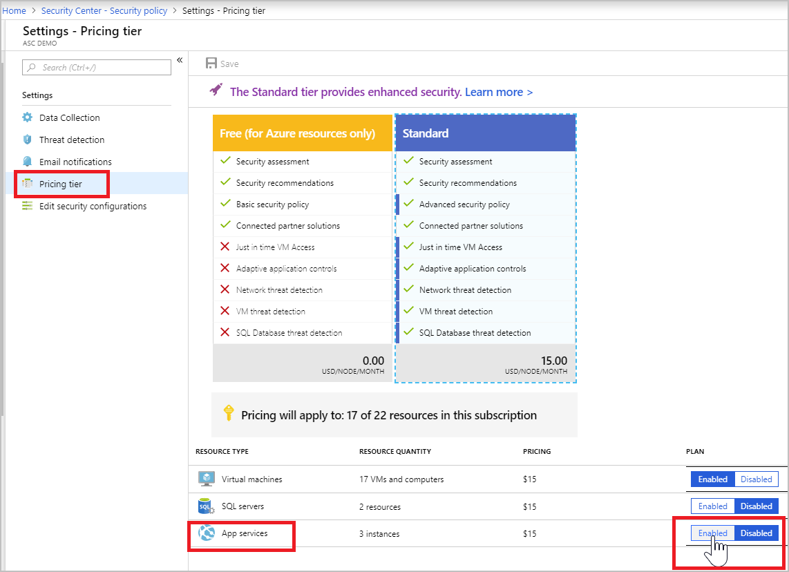

# Protect App Service with Azure Security Center
This article helps you use Azure Security Center to monitor and protect your applications running on top of App Service.

App Service enables you to build and host web applications in the programming language of your choice without managing infrastructure. App Service offers auto-scaling and high availability, support both Windows and Linux, as well as automated deployments from GitHub, Azure DevOps, or any Git repository. 

Vulnerabilities in web applications are frequently exploited by attackers, because they have a common and dynamic interface for almost every organization on the Internet. Requests to applications running on top of App Service goes through several gateways deployed in Azure data centers around the world, responsible for routing each request to its corresponding application. 

Azure Security Center can run assessments and recommendations on your applications running in App Service in the sandboxes in your VM or on-demand instances. By leveraging the visibility that Azure has as cloud provider, Security Center analyzes your App Service internal logs to monitor for common web app attacks that often run across multiple targets.

Security Center leverages the scale of the cloud to identify attacks on your App Service applications and focus on emerging attacks, while attackers are on the reconnaissance phase, scanning to identify vulnerabilities across multiple websites, hosted on Azure. Security Center uses analytics and machine learning models to cover all interfaces allowing customers to interact with their applications, whether over HTTP or through a management methods. Moreover, as a first-party service in Azure, Security Center is also in a unique position to offer host-based security analytics covering the underlying compute nodes for this PaaS, enabling Security Center to detect attacks against web applications that were already exploited.

## Prerequisites

To monitor and secure your App Service, you have to have an App Service plan that is associated with dedicated machines. These plans are: Basic, Standard, Premium, Isolated, or Linux. Azure Security Center does not support the Free, Shared, or Consumption plans. For more information, see [App Service Plans](https://azure.microsoft.com/pricing/details/app-service/plans/).

## Security Center protection

Azure Security Center protects the VM instance in which your App Service is running and the management interface. It also monitors requests and responses sent to and from your apps running in App Service.

Security Center is natively integrated with App Service, eliminating the need for deployment and onboarding - the integration is completely transparent.

## Enabling monitoring and protection of App Service

1. In Azure, choose Security Center.
2. Go to **Pricing & settings** and choose a subscription.
3. Under **Pricing tier**, in the **App service** row, toggle your plan to **Enabled**.

>[!NOTE]
> The number of instances listed for your Resource quantity represents the number of relevant instances of App service active at the moment when you opened the pricing tier blade. Because this number may change based on the scaling options you selected, the number of instances you are charged for will be modified accordingly.

To disable monitoring and recommendations for your App Service, repeat this process and toggle your **App Service** plan to **Disabled**.

## See also
In this article, you learned how to use monitoring capabilities in Azure Security Center. To learn more about Azure Security Center, see the following:

* [Setting security policies in Azure Security Center](tutorial-security-policy.md): Learn how to configure security settings in Azure Security Center.
* [Managing and responding to security alerts in Azure Security Center](security-center-managing-and-responding-alerts.md): Learn how to manage and respond to security alerts.
* [App services](security-center-virtual-machine-protection.md#app-services):  View a list of your App service environments with health summaries.
* [Monitoring partner solutions with Azure Security Center](security-center-partner-solutions.md): Learn how to monitor the health status of your partner solutions.
* [Azure Security Center FAQ](security-center-faq.md): Find frequently asked questions about using the service.
* [Azure Security Blog](https://blogs.msdn.com/b/azuresecurity/): Find blog posts about Azure security and compliance.
