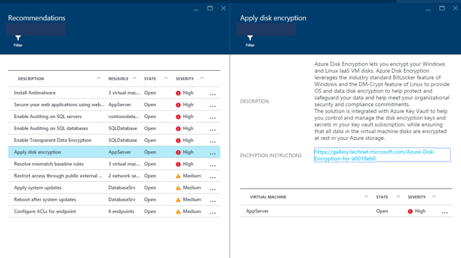

# Apply disk encryption in Azure Security Center

Azure Security Center recommends that you use Azure Disk Encryption on unencrypted disks on both Windows and Linux VM. Disk Encryption lets you encrypt your Windows and Linux IaaS VM disks.  Encryption is recommended for both the OS and data volumes on your VM.

Disk Encryption uses the industry standard [BitLocker](https://technet.microsoft.com/library/cc732774.aspx) feature of Windows and the [DM-Crypt](https://en.wikipedia.org/wiki/Dm-crypt) feature of Linux. These features provide OS and data encryption to help protect and safeguard your data and meet your organizational security and compliance commitments. Disk Encryption is integrated with [Azure Key Vault](https://azure.microsoft.com/documentation/services/key-vault/) to help you control and manage the disk encryption keys and secrets in your Key Vault subscription, while ensuring that all data in the VM disks are encrypted at rest in your [Azure Storage](https://azure.microsoft.com/documentation/services/storage/).

For the list of supported versions of Windows and Linux, see [Supported VMs and operating systems](../virtual-machines/windows/disk-encryption-overview.md#supported-vms-and-operating-systems) in the Azure Disk Encryption documentation.

## Implement the recommendation
1. In the **Recommendations** page, select **Disk encryption should be applied on virtual machines**.
2. From the **Unhealthy resources**, select a VM for which Disk Encryption is recommended.
3. Follow the instructions to apply encryption to these VMs.

To encrypt Azure Virtual Machines that have been identified by Security Center as needing encryption, we recommend the following steps:

* Install and configure Azure PowerShell. This enables you to run the PowerShell commands required to set up the prerequisites required to encrypt Azure Virtual Machines.
* Obtain and run the Azure Disk Encryption Prerequisites Azure PowerShell script.
* Encrypt your virtual machines.

[Encrypt a Windows IaaS VM with Azure PowerShell](../virtual-machines/windows/disk-encryption-powershell-quickstart.md) - Walks you through these steps and assumes you are using a Windows client machine from which you can configure disk encryption.

There are many approaches that can be used for Azure Virtual Machines. If you are already well versed in Azure PowerShell or Azure CLI, then you may prefer to use alternate approaches. To learn about these other approaches, see [Azure disk encryption](../security/fundamentals/encryption-overview.md).

## See also
This document showed you how to implement the Security Center recommendation "Apply disk encryption." To learn more about disk encryption, see:

* [Encryption and key management with Azure Key Vault](https://azure.microsoft.com/documentation/videos/azurecon-2015-encryption-and-key-management-with-azure-key-vault/) (video, 36 min 39 sec)--Learn how to use disk encryption management for IaaS VMs and Azure Key Vault to help protect and safeguard your data.
* [Azure disk encryption](../security/fundamentals/encryption-overview.md) (document)--Learn how to enable disk encryption for Windows and Linux VMs.