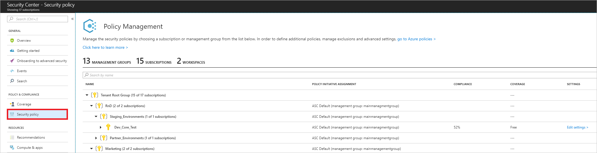
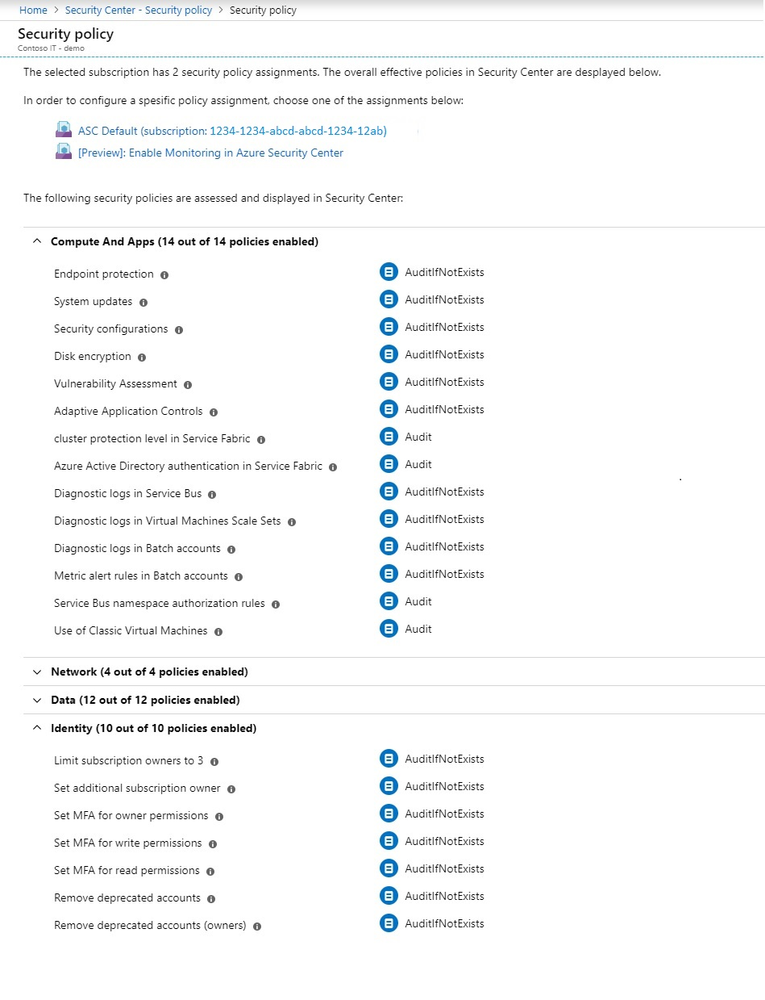

# Setting security policies in Security Center or in Azure Policy

This article helps you configure Azure Security Center security policies. Azure Scurity Center policies integrate with Azure Policies, so you can set them either in Security Center on a specific subscription, or in [Azure Policy](../azure-policy/azure-policy-introduction.md), which enables you to set policies across Management groups and across multiple subscriptions..

## What are security policies?
A security policy defines the desired configuration of your workloads and helps ensure compliance with company or regulatory security requirements. In Azure Security Center, you can define policies for your Azure subscriptions and tailor them to your type of workload or the sensitivity of your data. For example, applications that use regulated data, such as personally identifiable information, might require a higher level of security than other workloads. To set a policy across subscriptions or on Management groups, set them in [Azure Policy](../azure-policy/azure-policy-introduction.md).

> [!NOTE]
> If you previously configured security policies on a subscription that is part of a management group, or has multiple policy assigments, those policies appear greyed out in Security Center so that you can manage the policy at the management group level via the Azure Policy page. 

## How security policies work
Security Center automatically creates a default security policy for each of your Azure subscriptions. You can edit the policies in Security Center or use Azure Policy to do the following things:
- Create new policy definitions.
- Assign policies across management groups and subscriptions, which can represent an entire organization or a business unit within the organization.
- Monitor policy compliance.

For more information about Azure Policy, see [Create and manage policies to enforce compliance](../azure-policy/create-manage-policy.md).

An Azure policy consists of the following components:

- A **policy** is a rule
- An **initiative** is a collection of policies
- An **assignment** is an application of an initiative or a policy to a specific scope (management group, subscription, or resource group)

A resource is evaluated against the policies that are assigned to it and receives a compliance ratio according to the number of policies the resource is compliant to.

## Who can edit security policies?
Security Center uses Role-Based Access Control (RBAC), which provides built-in roles that can be assigned to users, groups, and services in Azure. When users open Security Center, they see only information that's related to resources they have access to. Which means that users are assigned the role of owner, contributor, or reader to the subscription or resource group that a resource belongs to. In addition to these roles, there are two specific Security Center roles:

- Security reader: Have view rights to Security Center, which includes recommendations, alerts, policy, and health, but they can't make changes.
- Security admin: Have the same view rights as security reader, and they can also update the security policy and dismiss recommendations and alerts.

## Edit security policies
You can edit the default security policy for each of your Azure subscriptions and management groups in Security Center. To modify a security policy, you must be an owner, contributor, or security administrator of the subscription or the containing management group. To view your security policies in Security Center:

> [!NOTE]
> Any policies set on a subscription that is part of a management group, or has multiple policy assigments, will appear greyed out in Security Center. You can edit these policies in [Azure Policy](../azure-policy/azure-policy-introduction.md). 

1. On the **Security Center** dashboard, under **POLICY & COMPLIANCE**, select **Security policy**. **Policy Management** opens.

	

  Policy Management displays the number of management groups, subscriptions, and workspaces as well as your management group structure.

  > [!NOTE]
  > The Security Center dashboard may show a higher number of subscriptions under **Subscription coverage** than the number of subscriptions shown under **Policy Management**. Subscription coverage shows the number of Standard, Free, and “not covered” subscriptions. The “not covered” subscriptions do not have Security Center enabled and are not displayed under **Policy Management**.
  >
  >

  The columns in the table display:

 - Policy Initiative Assignment –Security Center built-in policies and initiatives that are assigned to a subscription or management group.
 - Compliance – Overall compliance score for a management group, subscription, or workspace. The score is the weighted average of the assignments. The weighted average factors in the number of policies in a single assignment and the number of resources the assignment applies to.

 For example, if your subscription has two VMs and an initiative with five policies assigned to it, then you have 10 assessments in your subscription. If one of the VMs doesn't comply to two of the policies, then the overall compliance score of your subscription’s assignment is 80%.

 - Coverage – Identifies the pricing tier, Free or Standard, that the management group, subscription, or workspace is running on.  See [Pricing](security-center-pricing.md) to learn more about Security Center's pricing tiers.
 - Settings – Subscriptions have the link **Edit settings**. Selecting **Edit settings** lets you update your subscription settings such as data collection, pricing tier, and email notifications.

2. Select the subscription or management group that you want to enable a security policy for. **Security policy** opens.

3.	Under **Security policy**, select the controls that you want Security Center to monitor for and provide recommendations on by selecting **On**.  Select **Off** if you don't want Security Center to monitor that control.

	

4. Select **Save**.

## Available security policy definitions

To understand the policy definitions that are available in the default security policy, refer to the following table:

| Policy | What the enabled policy does |
| --- | --- |
| System updates |Retrieves a daily list of available security and critical updates from Windows Update or Windows Server Update Services. The retrieved list depends on the service that's configured for your virtual machines, and it recommends that missing updates be applied. For Linux systems, the policy uses the distro-provided package-management system to determine packages that have available updates. It also checks for security and critical updates from [Azure Cloud Services](../cloud-services/cloud-services-how-to-configure-portal.md) virtual machines. |
| Security configurations |Analyzes operating system configurations daily to determine issues that could make the virtual machine vulnerable to attack. The policy also recommends configuration changes to address these vulnerabilities. For more information about the specific configurations that are being monitored, see the [list of recommended baselines](https://gallery.technet.microsoft.com/Azure-Security-Center-a789e335). (At this time, Windows Server 2016 isn't fully supported.) |
| Endpoint protection |Recommends that endpoint protection be set up for all Windows virtual machines (VMs) to help identify and remove viruses, spyware, and other malicious software. |
| Disk encryption |Recommends enabling disk encryption in all virtual machines to enhance data protection at rest. |
| Network security groups |Recommends that [network security groups](../virtual-network/security-overview.md) be configured to control inbound and outbound traffic to VMs that have public endpoints. Network security groups that are configured for a subnet are inherited by all virtual machine network interfaces, unless otherwise specified. In addition to checking to see whether a network security group has been configured, this policy assesses inbound security rules to identify rules that allow incoming traffic. |
| Web application firewall |Recommends that a web application firewall be set up on virtual machines when either of the following items is true: <ul><li>An [instance-level public IP](../virtual-network/virtual-networks-instance-level-public-ip.md) is used, and the inbound security rules for the associated network security group are configured to allow access to port 80/443.</li><li>A load-balanced IP is used, and the associated load balancing and inbound network address translation (NAT) rules are configured to allow access to port 80/443. For more information, see [Azure Resource Manager support for Load Balancer](../load-balancer/load-balancer-arm.md).</li> |
| Next generation firewall |Extends network protections beyond network security groups, which are built into Azure. Security Center discovers deployments for which a next generation firewall is recommended, and then you can set up a virtual appliance. |
| SQL auditing and threat detection |Recommends that auditing of access to Azure Database be enabled for compliance and advanced threat detection, for investigation purposes. |
| SQL encryption |Recommends that encryption at rest be enabled for your Azure SQL database, associated backups, and transaction log files. Even if your data is breached, it isn't readable. |
| Vulnerability assessment |Recommends that you install a vulnerability assessment solution on your VM. |
| Storage encryption |Currently, this feature is available for Azure Blob storage and Azure Files. After you enable Storage Service Encryption, only new data is encrypted, and any existing files in this storage account remain unencrypted. |
| JIT network access |When just-in-time network access is enabled, Security Center locks down inbound traffic to your Azure VMs by creating a network security group rule. You select the ports on the VM to which inbound traffic should be locked down. For more information, see [Manage virtual machine access using just in time](https://docs.microsoft.com/azure/security-center/security-center-just-in-time). |

## Management groups
If your organization has many subscriptions, you may need a way to efficiently manage access, policies, and compliance for those subscriptions. Azure Management Groups provides a level of scope above subscriptions. You organize subscriptions into containers called "management groups" and apply your governance policies to the management groups. All subscriptions within a management group automatically inherit the policies applied to the management group. Each directory is given a single top-level management group called the "root" management group. This root management group is built into the hierarchy to have all management groups and subscriptions fold up to it. This root management group allows for global policies and RBAC assignments to be applied at the directory level. To set up management groups for use with Azure Security Center, follow the instructions in the [Gain tenant-wide visibility for Azure Security Center](security-center-management-groups.md) article. 

> [!NOTE]
> It’s important that you understand the hierarchy of management groups and subscriptions. See [Organize your resources with Azure Management Groups](../governance/management-groups/index.md#root-management-group-for-each-directory) to learn more about management groups, root management, and management group access.
>
>

## Next steps
In this article, you learned how to configure security policies in Security Center. To learn more about Security Center, see the following articles:

* [Azure Security Center planning and operations guide](security-center-planning-and-operations-guide.md): Learn how to plan and understand the design considerations about Azure Security Center.
* [Security health monitoring in Azure Security Center](security-center-monitoring.md): Learn how to monitor the health of your Azure resources.
* [Manage and respond to security alerts in Azure Security Center](security-center-managing-and-responding-alerts.md): Learn how to manage and respond to security alerts.
* [Monitor partner solutions with Azure Security Center](security-center-partner-solutions.md): Learn how to monitor the health status of your partner solutions.
* [Gain tenant-wide visibility for Azure Security Center](security-center-management-groups.md): Learn how to set up management groups for Azure Security Center. 
* [Azure Security Center FAQ](security-center-faq.md): Get answers to frequently asked questions about using the service.
* [Azure Security Blog](http://blogs.msdn.com/b/azuresecurity/): Find blog posts about Azure security and compliance.

To learn more about Azure Policy, see [What is Azure Policy?](../azure-policy/azure-policy-introduction.md)
