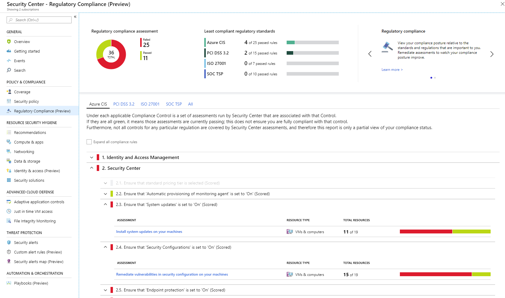
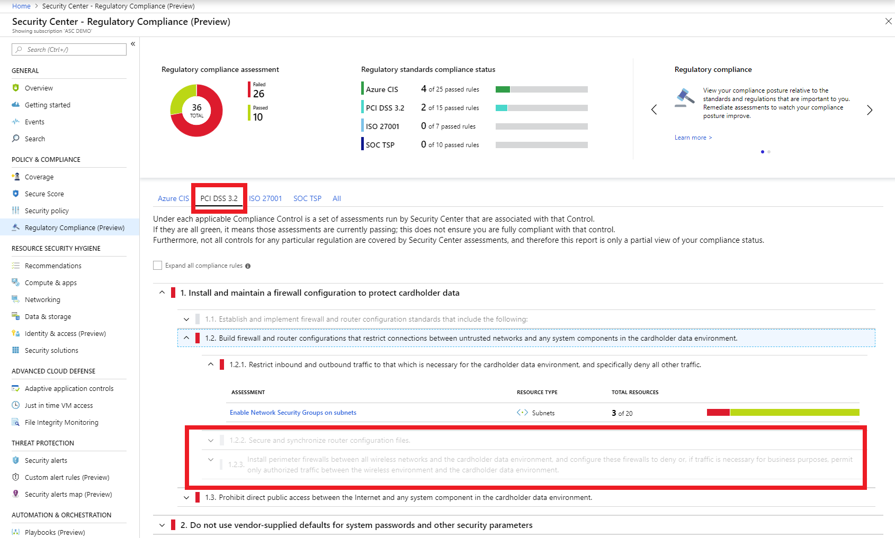
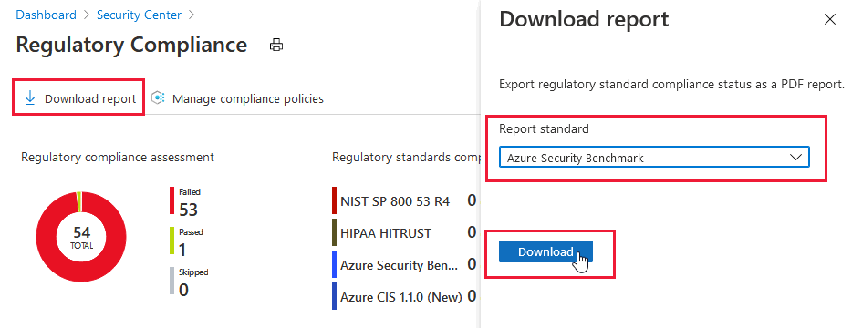
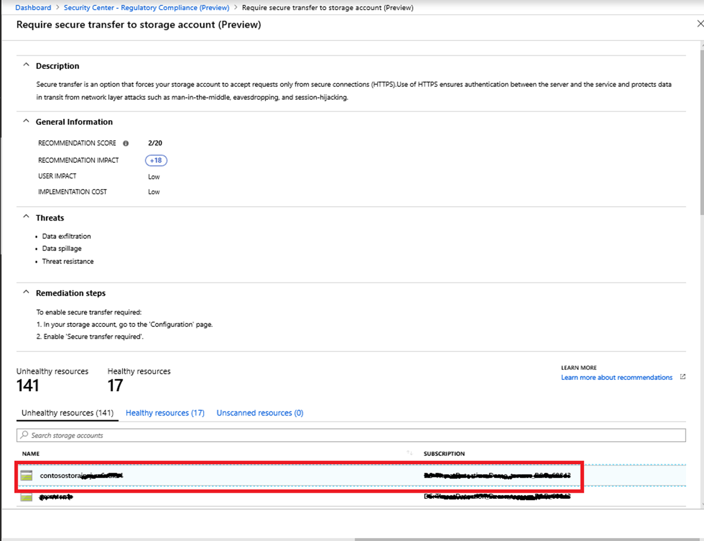
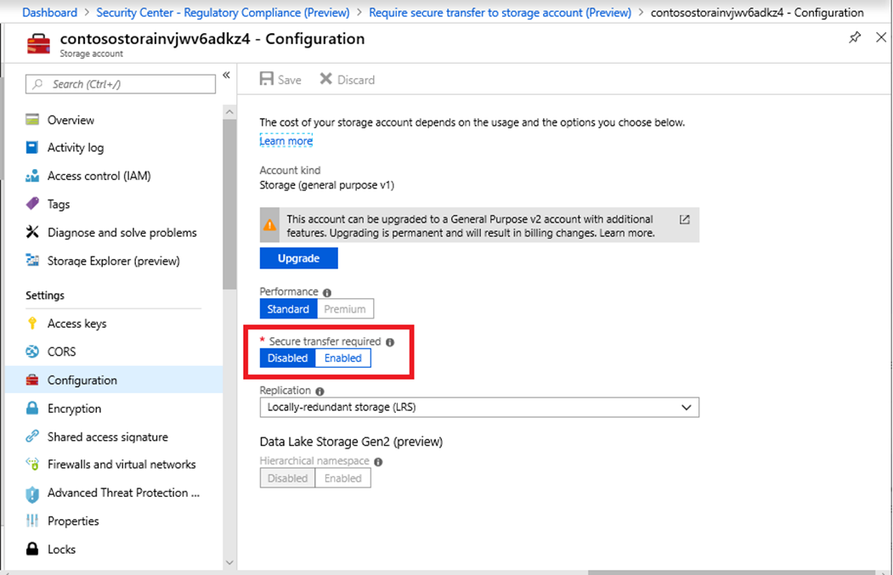

# Tutorial: Improve your regulatory compliance
---

Azure Security Center helps streamline the process for meeting regulatory compliance requirements, using the **regulatory compliance dashboard**. In the dashboard, Security Center provides insights into your compliance posture based on continuous assessments of your Azure environment. Security Center analyzes risk factors in your hybrid cloud environment according to security best practices. These assessments are mapped to compliance controls from a supported set of standards. In the Regulatory compliance dashboard, you can see the status of all the assessments within your environment in the context of a particular standard or regulation. As you act on the recommendations and reduce risk factors in your environment, your compliance posture improves.

In this tutorial, you will learn how to:

-   Evaluate your regulatory compliance using the Regulatory compliance dashboard

-   Improve your compliance posture by taking action on recommendations

If you don’t have an Azure subscription, create a [free account](https://azure.microsoft.com/free/) before you begin.

## Prerequisites

To step through the features covered in this tutorial, you must have Security Center’s Standard pricing tier. You can try Security Center Standard at no cost.
To learn more, see the [pricing page](https://azure.microsoft.com/pricing/details/security-center/). The quickstart [Onboard your Azure subscription to Security Center Standard](https://docs.microsoft.com/azure/security-center/security-center-get-started)
walks you through how to upgrade to Standard.

##  Assess your regulatory compliance

Security Center continuously assesses the configuration of your resources to identify security issues and vulnerabilities. These assessments are presented as recommendations, which focus on improving your security hygiene. In the Regulatory compliance dashboard, you can view a set of compliance standards with all their requirements, where supported requirements are mapped to applicable security assessments. This enables you to  view your compliance posture with respect to the standard, based on the status of these assessments.

The regulatory compliance dashboard view can help focus your attention on the gaps in compliance with a standard or regulation that is important to you. This focused view also enables you to continuously monitor your compliance score over time within dynamic cloud and hybrid environments.

>[!NOTE]
> By default, Security Center supports the following regulatory standards: Azure CIS, PCI DSS 3.2, ISO 27001, and SOC TSP. 
>
> The [dynamic compliance packages (preview)](update-regulatory-compliance-packages.md) feature allows you to upgrade the standards shown in your regulatory compliance dashboard to the new *dynamic* packages. You can also use the same preview feature to add new compliance packages and monitor your compliance with additional standards. 

1.  In the Security Center main menu, under **POLICY & COMPLIANCE** select **Regulatory compliance**.  
At the top of the screen, you see a dashboard with an overview of your compliance status with the set of supported compliance regulations. You can see your overall compliance score, and the number of passing vs. failing assessments associated with each standard.

    

2.  Select a tab for a compliance standard that is relevant to you. You will see the list of all controls for that standard. For the applicable controls, you can view the details of passing and failing assessments associated with that control. Some controls are grayed out. These controls don't have any Security Center assessments associated with them. Check the requirements for these and assess them in your environment on your own. Some of these may be process-related and not technical.

    

1. To generate and download a PDF report summarizing your current compliance status for a particular standard, click **Download report**.

    The report provides a high-level summary of your compliance status for the selected standard based on Security Center assessments data, and is organized according to the controls of that particular standard. The report can be shared with relevant stakeholders, and may serve to provide evidence to internal and external auditors.

    

## Improve your compliance posture

Given the information in the Regulatory compliance dashboard, you can improve your compliance posture by resolving recommendations directly within the dashboard.

1.  Click through any of the failing assessments that appear in the dashboard to view the details for that recommendation. Each recommendation includes a set of remediation steps that should be followed to resolve the issue.

1.  You can select a particular resource to view more details and resolve the recommendation for that resource.  For example, in the **Azure CIS standard** tab, you can click on the recommendation **Require secure transfer to storage account**.

    

1. As you click through to the recommendation information and select an unhealthy resource, it leads you directly to the experience of enabling **secure storage transfer** within the Azure portal.

    For more information about how to apply recommendations, see [Implementing security recommendations in Azure Security Center](security-center-recommendations.md).

    

1.  After you take action to resolve recommendations, you will see the impact in the compliance dashboard report because your compliance score improves.

    > [!NOTE]
    > Assessments are run approximately every 12 hours, so you will see the impact on your compliance data only after the assessments run.

## Next steps

In this tutorial, you learned about using Security Center’s Regulatory compliance dashboard to:

-   View and monitor your compliance posture, relative to the standards and regulations that are important to you.

-   Improve your compliance status by resolving relevant recommendations and watching the compliance score improve.

The Regulatory compliance dashboard can greatly simplify the compliance process, and significantly cut the time required for gathering compliance evidence for your Azure and hybrid environment.

To learn more see:

-   [Update to dynamic compliance packages in your Regulatory compliance dashboard (Preview)](update-regulatory-compliance-packages.md) - Learn about this preview feature which allows you to update the standards shown in your regulatory compliance dashboard to the new *dynamic* packages. You can also the same preview feature to add new compliance packages and monitor your compliance with additional standards. 

-   [Security health monitoring in Azure Security Center](security-center-monitoring.md) - Learn how to monitor the health of your Azure resources.

-   [Managing security recommendations in Azure Security Center](security-center-recommendations.md) - Learn how to use recommendations in Azure Security Center to help protect your Azure resources.

-   [Improve your Secure Score in Azure Security Center](secure-score-security-controls.md) - Learn how to prioritize vulnerabilities and security recommendations to most improve your security posture.