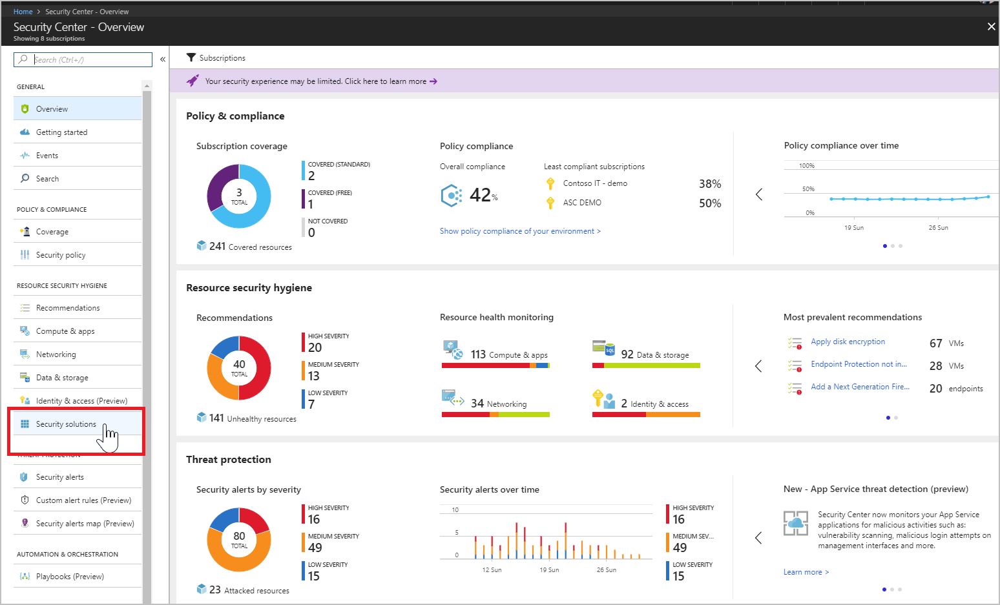
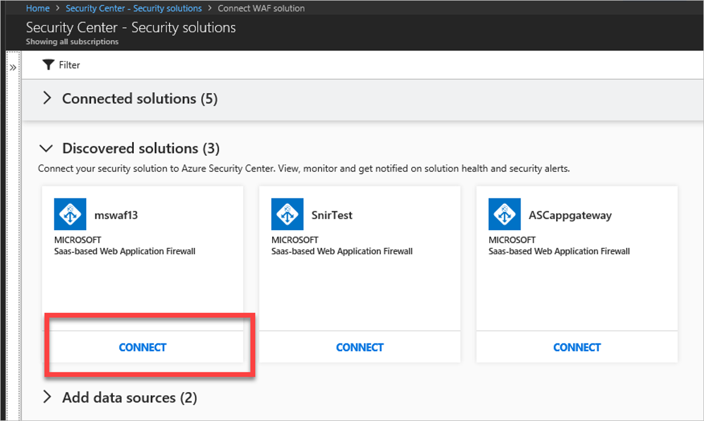
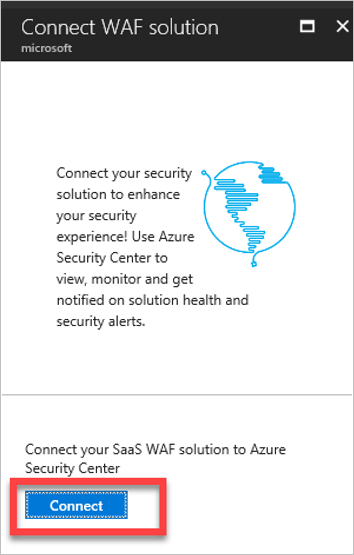

# Connecting Microsoft Azure Application Gateway to Azure Security Center
This document helps you to configure the integration with Application Gateway web application firewall (WAF) and Security Center.

## Why connect Application Gateway?
The WAF in Application Gateway protects web applications from common web-based attacks like SQL injection, cross-site scripting attacks, and session hijacks. Security Center integrates with Application Gateway to prevent and detect threats to unprotected web applications in your environment.

## How do I configure this integration?
Security Center discovers previously deployed WAF instances in the subscription. Connect these solutions to Security Center to allow integration of alerts.

> [!NOTE]
> The Application Gateway WAF can also be provisioned from Security Center's **Recommendations** as described in [Add a web application firewall](security-center-add-web-application-firewall.md).
>
>

1. Sign into the [Azure portal](https://azure.microsoft.com/features/azure-portal/).

2. On the **Microsoft Azure menu**, select **Security Center**.

3. Under **RESOURCE SECURITY HYGIENE**, select **Security solutions**.

  

4. Under **Discovered solutions** find Microsoft SaaS-based Web Application Firewall and select **CONNECT**.

  

5. **Connect WAF solution** opens.  Select **Connect** to integrate the WAF and Security Center.

  

## Next steps

In this article, you learned how to integrate the Application Gateway WAF in Security Center. To learn more about Security Center, see the following articles:

* [Integrate security solutions in Security Center](security-center-partner-integration.md)
* [Connecting Microsoft Advanced Threat Analytics to Security Center](security-center-ata-integration.md)
* [Connecting Azure Active Directory Identity Protection to Security Center](security-center-aadip-integration.md)
* [Security health monitoring in Security Center](security-center-monitoring.md).
* [Monitor partner solutions with Security Center](security-center-partner-solutions.md).
* [Azure Security Center FAQs](security-center-faq.md).
* [Azure Security blog](http://blogs.msdn.com/b/azuresecurity/).
