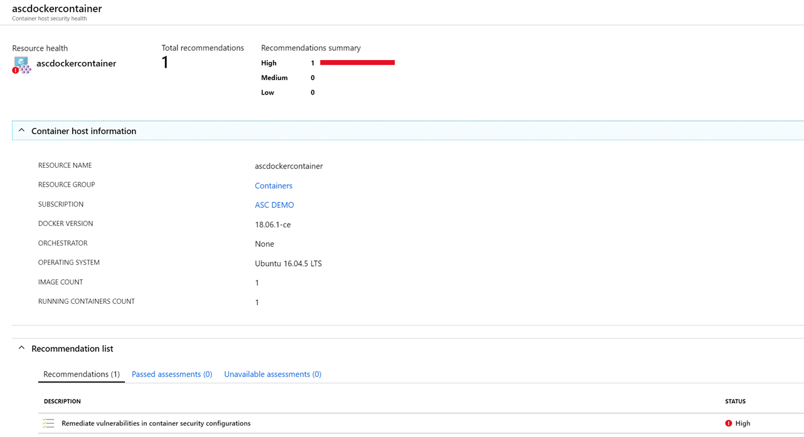
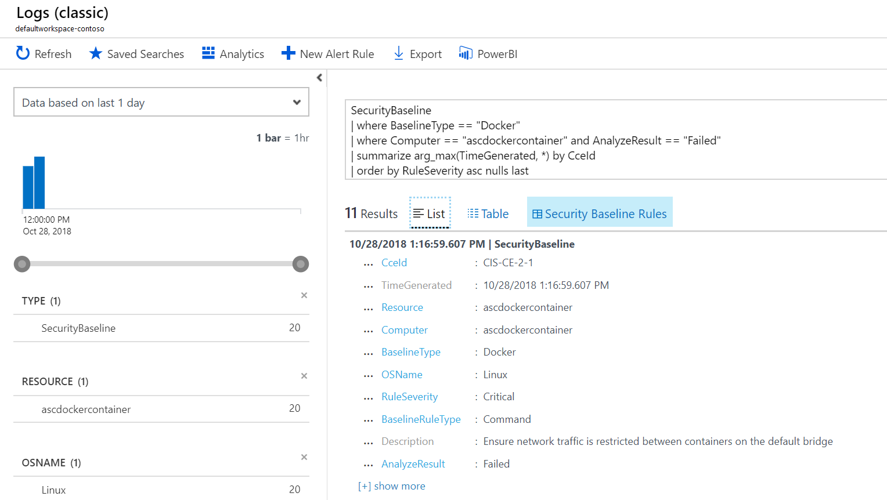
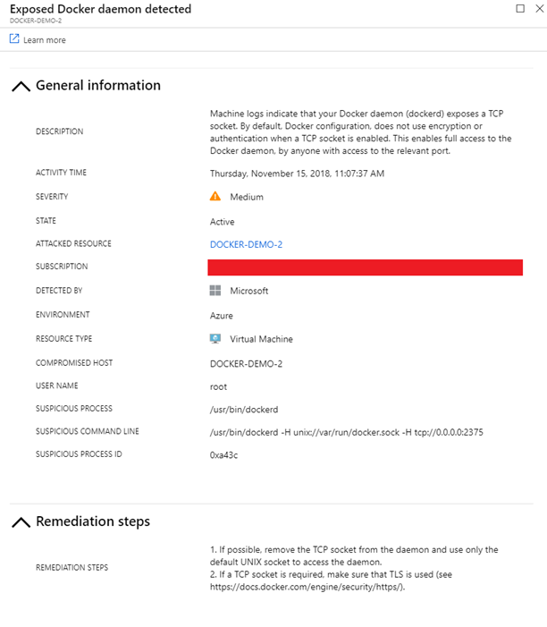

# Understand Azure Security Center container recommendations

As you migrate your monolith applications to run mission-critical, containerized cloud-native applications in production, you can take advantage of the features of containers, including easy and fast deployment and update. As the number of containers deployed continues to increase, security solutions need to be in place to provide you with visibility into the security state of your containers and help protect them from threats.

Azure Security Center provides the following capabilities to help you secure your containers:

- **Visibility into containers hosted on IaaS Linux machines** In Azure Security Center, the Containers tab displays all virtual machines deployed with Docker. When exploring the security issues on a virtual machine, Security Center provides additional information related to the containers on the machine, such as Docker version and the number of images running on the host.

    

- **Security recommendations based on CIS benchmark for Docker** Security Center scans your Docker configurations and gives you visibility into misconfigurations by providing a list of all failed rules that were assessed. Security Center provides guidelines to help you resolve these issues quickly and save time. Security Center continuously assesses the Docker configurations and provides you with their latest state.

    

- **Real time container threat detection**  Security Center provides real-time threat detection for your containers on Linux machines with AuditD component. The alerts identify several suspicious Docker activities, such as the creation of a privileged container on host, an indication of Secure Shell (SSH) server running inside a Docker container, or the use of crypto miners. You can use this information to quickly remediate security issues and improve the security of your containers.

    

## Recommendations
Use the tables below as a reference to help you understand the available containers hosted on IaaS Linux machines and security assessment of their Docker configurations.

| Recommendation | Description | Remediation |
| --- | --- | --- |
|Remediate vulnerabilities in container security configurations |Remediate vulnerabilities in container security configurations based on configuration best practices.| To remediate vulnerabilities in the container security configurations: 1. Review the list of failed rules. 2. Fix each rule according to the specified instructions.|

## Next steps
To learn more about recommendations that apply to other Azure resource types, see the following:

* [Monitor identity and access in Azure Security Center](security-center-identity-access.md)
* [Protecting your network in Azure Security Center](security-center-network-recommendations.md)
* [Protecting your Azure SQL service in Azure Security Center](security-center-sql-service-recommendations.md)

To learn more about Security Center, see the following:

* [Protecting your machines and applications in Azure Security Center](security-center-virtual-machine-protection.md)
* [Setting security policies in Azure Security Center](tutorial-security-policy.md) -- Learn how to configure security policies for your Azure subscriptions and resource groups.
* [Managing and responding to security alerts in Azure Security Center](security-center-managing-and-responding-alerts.md) -- Learn how to manage and respond to security alerts.
* [Azure Security Center FAQ](security-center-faq.md) -- Find frequently asked questions about using the service.

