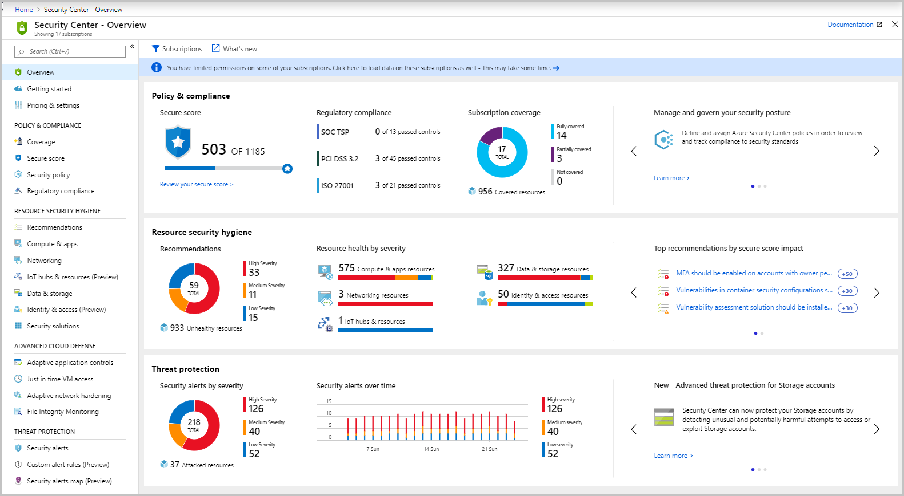
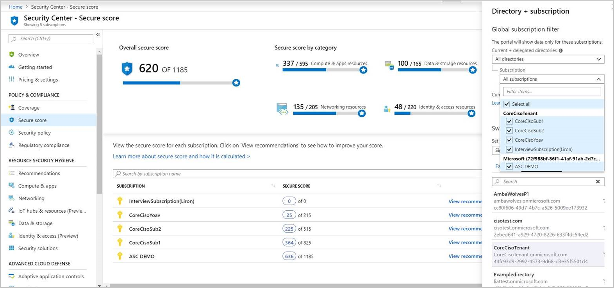
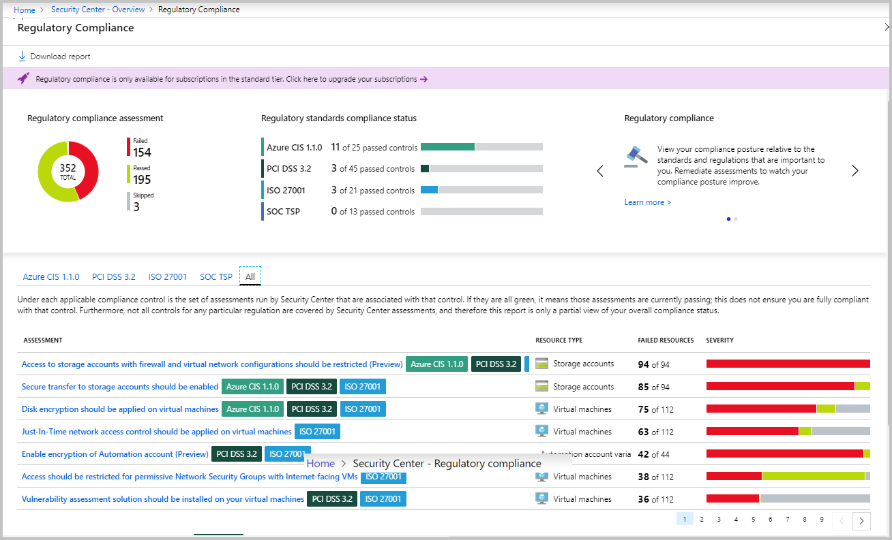
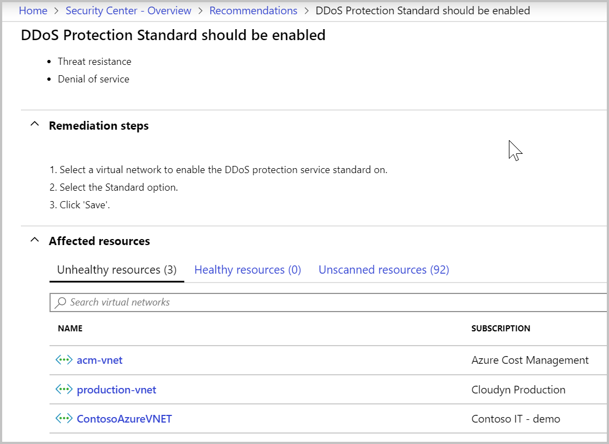
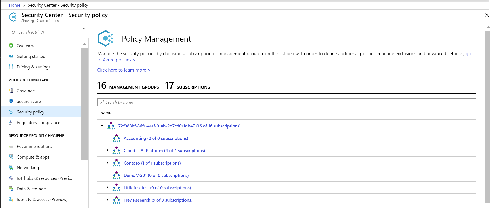
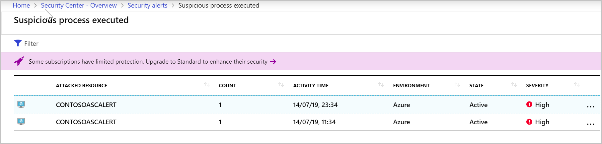
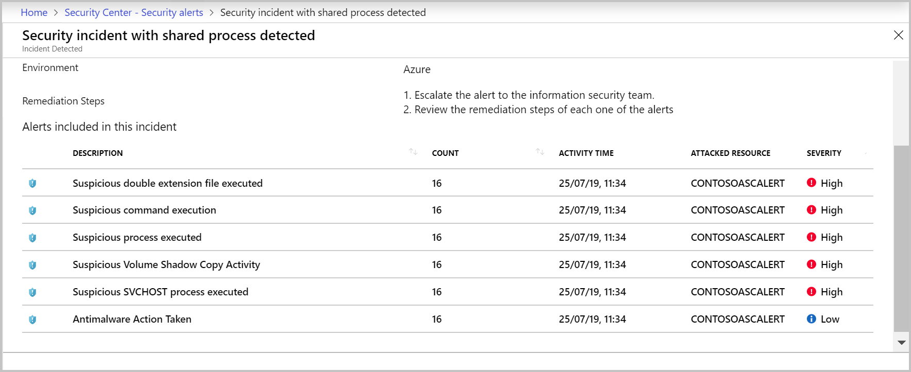
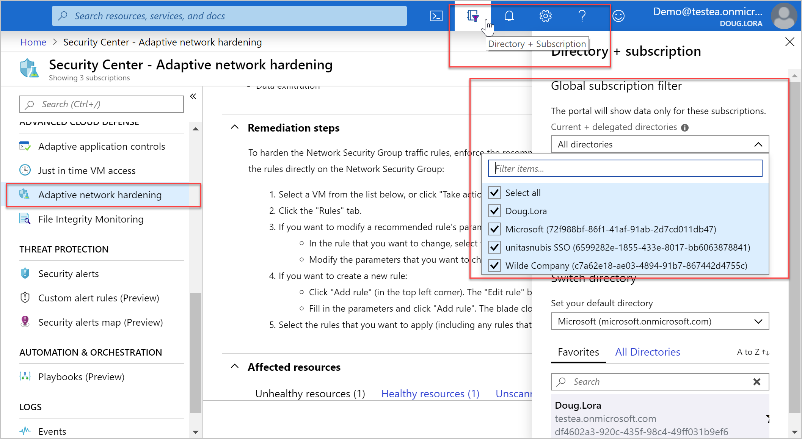

# Cross-tenant management in Security Center

You can view and manage the security posture of multiple tenants in Security Center by activating Azure delegated resource management. Service providers can administer resources from different tenants efficiently, from one place, instead of signing in to each resource and implementing the same action repeatedly.  This simplified management ability enables you to delegate resources efficiently and it prevents errors that can happen when repeating the same action many times.

  

## Activate Azure delegated resource management

In order set up cross-tenant management, you must onboard customers to Azure delegated resource management. To do so, you can [publish the new Managed Services](../lighthouse/how-to/publish-managed-services-offers.md) offer type to Azure Marketplace or alternatively, you can complete the onboarding process by [deploying Azure Resource Manager templates](../lighthouse/how-to/onboard-customer.md).

> [!NOTE]
> Azure delegated resource management is one of the key components of Azure Lighthouse. 

## How does cross-tenant management work in Security Center

The same management and security features, that you use for one tenant, you can also use when managing multiple tenants. The views and actions are basically the same. Here are some examples:

- Cross-tenant visibility enables you to view the overall health of all your tenants and where and how to best improve the [secure score](security-center-secure-score.md) and [compliance posture](security-center-compliance-dashboard.md) for each of them.

  

  

- Monitor and remediate a [recommendation](security-center-recommendations.md) for many resources from various tenants at one time.

  

- From one view, manage security posture of many resources with [policies](tutorial-security-policy.md), take actions with security recommendations, and collect and manage security related data.

  

- Detect [alerts](security-center-alerts-overview.md) throughout the different tenants.

  

- Take action on resources, at one time, that are out of compliance with actionable [remediation steps](security-center-managing-and-responding-alerts.md).

  

- Manage the various threat detection and protection services, such as  VM access [just-in-time (JIT)](security-center-just-in-time.md), [Adaptive Network Hardening](security-center-adaptive-network-hardening.md), and [File Integrity Monitoring (FIM)](security-center-file-integrity-monitoring.md).

  
