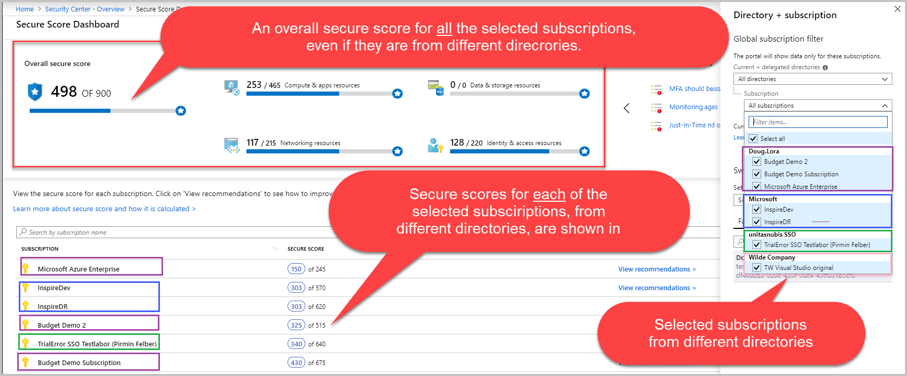

# Cross-tenant management in Security Center

You can view and manage the security posture of multiple tenants in Security Center by activating Azure delegated resource management. Service providers can administer resources from different tenants efficiently, from one place, without having to sign-in and implement the same action repeatedly.  This simplified management ability enables you to delegate resources efficiently and it prevents errors that can happen when repeating the same action many times.

> [!NOTE]
> Azure delegated resource management is one of the key components of Azure Lighthouse. 

  

## Activate Azure delegated resource management

## How does it work?

The same management and security features, that you use for one tenant, you can also use when managing multiple tenants. The views and actions are basically the same. Here are some examples:

- Cross-tenant visibility enables you to view the overall health of all your tenants and where and how to best improve the secure score and compliance posture for each of them.

  

  

- Monitor and remediate a recommendation for many resources from various tenants at one time.

  

- Manage security posture with policies, take actions with security recommendations, and collect and manage security related data.

  

- Detect alerts throughout the different tenants.

  

- Take action on resources that are out of compliance with actionable security recommendations.

  

- Manage the various threat detection and protection services, such as just-in-time (JIT) VM access, Adaptive Network Hardening, and File Integrity Monitoring (FIM).

  
