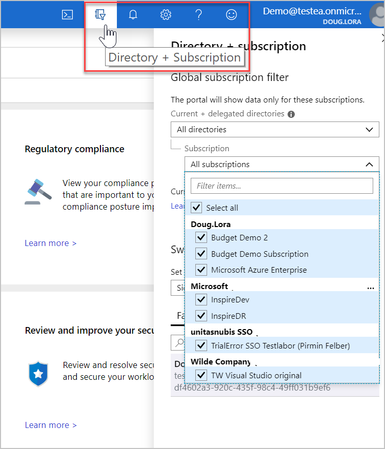

# Cross-tenant management in Security Center

Cross-tenant management enables you to view and manage the security posture of multiple tenants in Security Center by leveraging [Azure delegated resource management](../lighthouse/concepts/azure-delegated-resource-management.md)
. Manage multiple tenants efficiently, from a single view, without having to sign in to each tenant's directory.

- Service providers can manage the security posture of resources, for multiple customers, from within their own tenant.

- Security teams of organizations with multiple tenants can view and manage their security posture from a single location.

## Set up cross-tenant management

Set up cross-tenant management by delegating access to resources of managed tenants to your own tenant using [Azure delegated resource management](../lighthouse/concepts/azure-delegated-resource-management.md).

> [!NOTE]
> Azure delegated resource management is one of the key components of Azure Lighthouse.

## How does cross-tenant management work in Security Center

You are able to review and manage subscriptions across multiple tenants in the same way that you manage multiple subscriptions in a single tenant.

From the top menu bar, click the filter icon, and select the subscriptions, from each tenant's directory, you'd like to view.

  

The views and actions are basically the same. Here are some examples:

- **Manage security policies**: From one view, manage the security posture of many resources with [policies](tutorial-security-policy.md), take actions with security recommendations, and collect and manage security-related data.
- **Improve Secure Score and compliance posture**: Cross-tenant visibility enables you to view the overall security posture of all your tenants and where and how to best improve the [secure score](secure-score-security-controls.md) and [compliance posture](security-center-compliance-dashboard.md) for each of them.
- **Remediate recommendations**: Monitor and remediate a [recommendation](security-center-recommendations.md) for many resources from various tenants at one time. You can then immediately tackle the vulnerabilities that present the highest risk across all tenants.
- **Manage Alerts**: Detect [alerts](security-center-alerts-overview.md) throughout the different tenants. Take action on resources that are out of compliance with actionable [remediation steps](security-center-managing-and-responding-alerts.md).

- **Manage advanced cloud defense features and more**: Manage the various threat protection services, such as [just-in-time (JIT) VM access](security-center-just-in-time.md), [Adaptive Network Hardening](security-center-adaptive-network-hardening.md), [adaptive application controls](security-center-adaptive-application.md), and more.
 
## Next steps
This article explains how cross-tenant management works in Security Center. To learn more about Security Center, see the following:

* [Strengthen your security posture with Azure Security Center](security-center-monitoring.md) - Learn how to monitor the health of your Azure resources.
* [Azure Security Center FAQ](faq-general.md) - Find frequently asked questions about using the service.
* [Learn about Azure Lighthouse in enterprise scenarios](https://docs.microsoft.com/azure/lighthouse/concepts/enterprise) - Discover how Azure Lighthouse can simplify cross-tenant management within an enterprise which uses multiple Azure AD tenants.