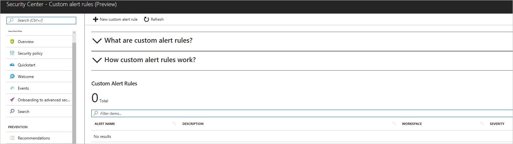
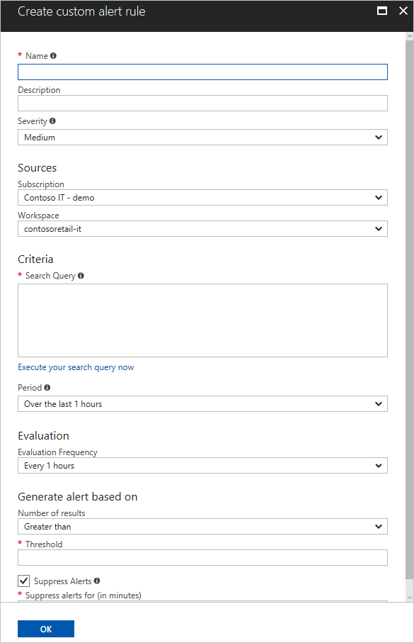
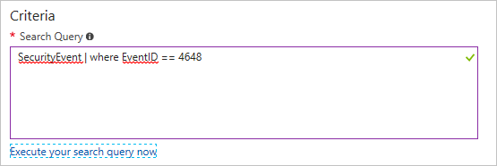
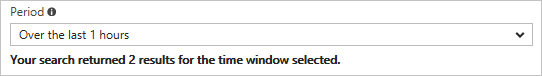
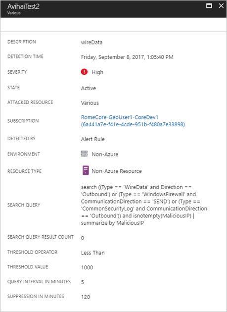

# Custom Alert Rules in Azure Security Center (Preview)
This document helps you to create custom alert rules in Azure Security Center.

> [!NOTE]
> Custom alerts has been retired from Security Center. 

## Retirement of Custom Alert rules in Azure Security Center

The custom alerts experience has been retired on June 30th, 2019, due to retirement of the underlying infrastructure it relied on. any custom alerts defined prior to retriement are not taking effect and security alerts based on those custom alerts rules are not being generated. You can still view your custom alert rules' queries in Security Center in order to re-create them in the alternatives mentioned below:

Users are advised to either:
- Enable [Azure Sentinel](https://azure.microsoft.com/services/azure-sentinel/) and use its built-in [analytics](https://docs.microsoft.com/azure/sentinel/tutorial-detect-threats) functionality to re-create their alert rules
- Re-create their alerts with Azure Monitor log alerts
                                     
To keep your existing alerts and re-create them in Azure Sentinel, please [launch Azure Sentinel](https://portal.azure.com/#create/Microsoft.ASI/preview). As first step, select the workspace where your custom alerts are stored, and then select the ‘Analytics’ menu item to set up your custom alerts rules. Please visit the [documentation](https://docs.microsoft.com/azure/sentinel/tutorial-detect-threats) for additional information.

> [!NOTE]
> Custom alerts using [Search](https://docs.microsoft.com/azure/azure-monitor/log-query/search-queries) or [Union](https://docs-analytics-eus.azurewebsites.net/queryLanguage/query_language_unionoperator.html) statements queries are not supported in Azure Sentinel. Please edit these alerts before performing the migration.

To re-create your alerts using Azure Monitor log alerts, please see: [Create, view, and manage log alerts using Azure Monitor](https://docs.microsoft.com/azure/azure-monitor/platform/alerts-log) for instructions on how to create log alerts. For general overview of log alerts in Azure Monitor, click [here](https://docs.microsoft.com/azure/azure-monitor/platform/alerts-unified-log).

## What are custom alert rules in Security Center?

Security Center has a set of predefined [security alerts](https://docs.microsoft.com/azure/security-center/security-center-managing-and-responding-alerts), which are triggered when a threat, or suspicious activity takes place. In some scenarios, you may want to create a custom alert to address specific needs of your environment.

Custom alert rules in Security Center allow you to define new security alerts based on data that is already collected from your environment. You can create queries, and the result of these queries can be used as criteria for the custom rule, and once this criteria is matched, the rule is executed. You can use computers security events, partner's security solution logs or data ingested using APIs to create your custom queries.

> [!NOTE]
> Custom alerts are not supported in Security Center's [investigation feature](security-center-investigation.md).
>
>

## How to create a custom alert rule in Security Center?

Open **Security Center** dashboard, and follow these steps to create a custom alert rule:

1.	In the left pane, under **Detection** click **Custom alert rules (Preview)**.
2.	In the **Security Center – Custom alert rules (Preview)** page click **New custom alert rule**.

	

3.	The Create custom alert rule page appears with the following options:

	

4.	Type the name for this custom rule in the **Name** field.
5.	Type a brief description that reflects the intent of this rule in the **Description** field.
6.	Select the severity level (High, Medium, Low) according to your needs in the **Severity** field.
7.	Select the subscription in which this rule is applicable in the **Subscription** field.
8.	Select the workspace that you want to monitor with this rule in the **Workspace** field, and in the **Search Query** field, the query that you want to use to obtain the results.

    > [!NOTE]
    > You need write permission in the workspace that you select to store your custom alert.
    >
    >

    The query’s result triggers the alert. Notice that when you type a valid query, the green check mark appears in the right corner of this field:

	

10.	Select the time span in which the query above will be executed in the **Period** field. Notice that the search result in the bottom of this field will change the according to the time span that you select.

	

11.	In the **Evaluation** field select the frequency that this rule should be evaluated and executed.
12.	In the **Number of results** field, select the operator (greater than, or lower than).
13.	In the **Threshold** field type a number that will be used as reference for the operator that was previous selected.
14.	**Enable Suppress Alerts** option if you want to set a time to wait before Security Center sends another alert for this rule.
15.	Click **OK** to finish.

After you finish creating the new alert rule, it will appear in the list of custom alert rules. Once the conditions of that rule are met, a new alert will be triggered, and you can see in the **Security Alerts** dashboard.

Notice that the parameters (search query, threshold, etc.) that were established during the rule creation are available in the alert for this custom rule.

## See also
In this document, you learned how to create a custom alert rule in Azure Security Center. To learn more about Azure Security Center, see the following:

* [Managing and responding to security alerts in Azure Security Center](https://docs.microsoft.com/azure/security-center/security-center-managing-and-responding-alerts). Learn how to manage alerts, and respond to security incidents in Security Center.
* [Security health monitoring in Azure Security Center](security-center-monitoring.md). Learn how to monitor the health of your Azure resources.
* [Understanding security alerts in Azure Security Center](https://docs.microsoft.com/azure/security-center/security-center-alerts-type). Learn about the different types of security alerts.
* [Azure Security Center Troubleshooting Guide](https://docs.microsoft.com/azure/security-center/security-center-troubleshooting-guide). Learn how to troubleshoot common issues in Security Center.
* [Azure Security Center FAQ](security-center-faq.md). Find frequently asked questions about using the service.
* [Azure Security Blog](https://blogs.msdn.com/b/azuresecurity/). Find blog posts about Azure security and compliance.
